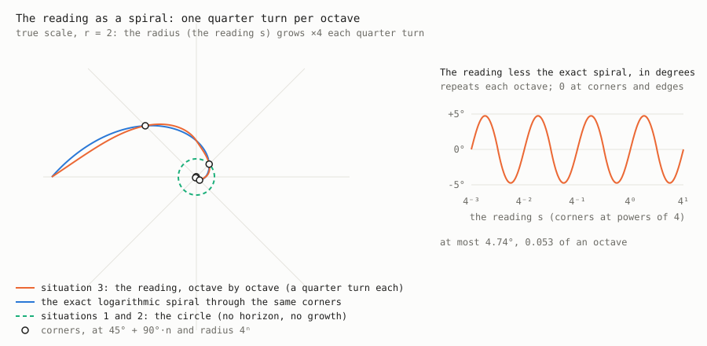

# Serial, Parallel and Nowhere

## A geometry of observation from somewhere, built on the corner

> **A situated observer does not possess a coordinate system for the world; it constructs an addressing scheme from
> relations available at its standpoint, and uses those addresses to encounter the world's magnitudes.**
> (Tom, 1 October 2026, 22:09; R159)
>
> Its scheme inverts at the corner, where v reaches one h: before it, v is read in terms of h; past it, h in terms of v.
> Near and far are one geometry, read from either side.

> **Geometry is compile time** (Tom, 8 October: "geometry is not runtime, it is compile time. geometry is not
> algorithmic, there is no if/then logic. geometry was known before the physices filled it up with stuff."). The
> addressing (the sweep, the corner, the flip, the levels) is laid before anything arrives (R155): identities, with no
> branches and no exit tests (§3.3, "Recursion is an identity"). The payload is runtime: values met at the addresses,
> and every "if" belongs there, including which side of the corner a reading falls on, since that depends on its value.
> "Known before" in the sense that the relational structure does not depend on the magnitudes that fill it: geometry
> supplies the places, physics the contents. Scope: this is reader geometry, the addressing; the geometry of spacetime in
> general relativity, which matter shapes, is not claimed.
>
> *Corrected, same day* (Tom, 8 October: "the exit condition is the depth, no need to recurse beyond the depth, so there is runtime logic."; "geometry can't know the depth without the payload."; "my earlier statement is false, there must be somekind of runtime logic. also LOD works this way no need to recurse further if your at the LOD of that observation."). The descent has one "if": its exit, stop where the depth stops or at the
> observation's level of detail. Geometry cannot know either before the payload, so the exit is runtime. What has no "if"
> is the structure: what a level is, its corner, the ratio to the next.
>
> *Then, the exit placed* (Tom, 8 October: "but there is always something there, something smaller, something larger, you can always zoom further in both directions."; "yes, that problem is nicely solved is the user requests a level of detail, that is the exit condition, and that has nothing to do with the payload."). There is always something smaller and something larger, so depth never runs out
> and cannot be the exit. The reader requests a level of detail, and that is the exit: the reader's, not the payload's.
> So there are three times, not two: compile time, the geometry (the levels); the request, the reader (how far to
> descend, its level of detail); runtime, the payload (the values met there). The "if" is the request's, and it asks
> nothing of the payload. And the request is a count of doublings, k, fixed before anything arrives, so the descent
> is a loop of fixed length: only the payload's values are runtime (Tom: "just pick how many doublings of detail you
> want. that can be pre-computed").
>
> *Then, recursion rejected for level of detail* (Tom, 8 October: "its not recursion at all, its level of detail"). The
> reader does not recurse: it picks a level of detail, k, and reads level k directly. The geometry is compile time;
> picking the level of detail is runtime; nothing recurses (§3.3, "Recursion considered and rejected"). The reader
> sweeps its level of detail, proportional in the near field and logarithmic in the far (Tom: "its a sweep over the LOD").
>
> *Corrected: not a request* (Tom, 8 October: "its not a request, it just the fact all things being equal, smaller things have less detail."). Nothing is requested or picked. All things being equal, a smaller thing has less
> detail: past the corner a thing is read as Δ/v units of h, and with h the reader's grain too, its level of detail is
> log₂(Δ/v), set by its size (§3.3, "Smaller drives less detailed"). The notes above that speak of a request, a count
> picked or a level chosen are kept as the record and read with this correction: there is no runtime choice of level; the
> geometry gives the levels, size gives the level a thing shows, and the payload is what is there.

*Tom Brinkman, with Claude. Working paper. Rewritten 1 October 2026 around the rulings of that evening (R153–R158); revised 2 October to foreground the inversion at the corner as the main contribution (§3.2, R161), and again that
morning after a review: the levels of what is proved, Proposition 3.2(b), the three Parts; R162 then made the inversion forced; R163 added the octaves (§3.3), placed against *The Radix*; R164 the corner stated as ordinary (§3); R165 the corner as the near horizon (§3.7); §3.8 no rung is preferred (Propositions 3.6–3.8); R167 one octave, two facings (§3.3); R168 g and the share told apart (§3.5); the shape emerging by octaves measured (§3.3); R169 the reader is the pivot (§3.7); R170 g is the sweep (§3.5); R171 the situations describe one another, payloads on demand and as readers (§2.2, §4.3). Revised 3 October with the *Wander* labs: known physics retraced from somewhere (§9.9), the weighing of §9.7 corrected, the conjecture widened with a test for convention (§11.4), and what the labs add to the standing of the claim (§12–§14). Revised again on 3 October after a second review: the three layers set apart (after the abstract), "forced" scoped to its premises, the Cauchy stated as what the lay induces (§2.2), and the reader's own travel named as a question of its own (§14). Revised 5 October, afternoon, with the shape and signal runs of that day: hidden sides and readers within readers (§6.4), the central hypothesis's standing after them, R186–R187, and the runs in Appendices B and C. Revised 6 October with an audit of Part I (`plans/part-one-audit.md`): the central hypothesis's two parts told apart, the coil corrected (§3.2), Propositions 3.2(b), 3.4 and 3.8 and Corollary 3.5(b) tightened; and with the run for the 2 (HRT) and number lines in people (NLE) recorded (§14, Appendix C); then the situations restated on the sweep alone (§2.1, Tom's list 0–4) and the octaves as a spiral (§3.3, Propositions 3.11–3.13), from Tom's remark that each octave is a quarter turn and that situation 3 or 4 has a horizon and recursion where situations 1 and 2 have neither. Revised 8 October with
Tom's remarks of 7–8 October, worked out first in `papers/number-line.md`: each breadth a ratio of its own whole, the
angle, and the situated reader's V = H making a unit circle that is not situation 1 (§1); the wedge as the primitive,
with the circle and the sphere as drawings of it (§1); the facings as wedges (§2.1); and WHY2, synthetic runs on what
fixes the 2 (the central open question, Appendix C). Then: the wedge is made at every observation, and the sphere is
the picture of all possible wedges from nowhere, not built from them (§1, §2.1). Then, with *The Cauchy* (22 August) and
*Reader Geometry as Addressing*: the hand as the picture of addresses, payload and the situations, and the Cauchy as addresses, not
payloads (§4.3); the reader's unit circle, a quarter in one facing (§1). Then: recursion as an identity, precomputed by
geometry, with the exit the reader's, and what that says for the 2 (§3.3; the central open question) Then: the number line as a unit agreed socially between readers (§7) Then: geometry is compile time (the opening). Then: the proof of the 2 in three steps, the levels known before any payload and laid only where there is depth (and §4.2), then the exit corrected as logic outside the geometry, and placed as the level of detail the reader requests, since
there is always something smaller and something larger (the opening, §3.3), and a level of detail as a doubling, the request a count (Appendix D); then recursion considered and rejected for level of detail (the terms; §3.3); then the reader sweeping its level of detail, and the derivation of 2 (the three steps: the levels known before any payload, no measure before payload, the named points forcing the nesting) demoted to Appendix D (the central open question); the eye recorded as engineering, not geometry (§3.3; `plans/neighbours.md`); f in (v, h, f) is v₂, a second v read against the same h, and h, v, v₂ swept to an address on the unit square (§1); depth, the slider m and the level of detail; smaller size driving less detail, not a request, the object the same near or far; the same signal, a smaller share, the cost of being situated (the opening, §3.3); trig used sparingly, the in-place sweep as the trig-free one (§3.5); the same signal, a smaller share, and the inverse-square law with no corner of its own (§3.3); the corner as where the resolved becomes the unresolved, with GRN run 8 (the central result).*

*This is the paper rewritten, not revised. The text of 29 September – 1 October, with the full quotations, the
definitions it superseded, and the order in which things were found, is kept unchanged as the session record,*
`serial-parallel-nowhere-record.md`. *Section and proposition numbers cited elsewhere in the corpus before this rewrite
are the record's. The main moves: the record's Proposition 2.4 (the corner separates the sides) is Proposition 3.1 here;
its §4 (laying the addresses) is §5; §5–§13 are §6–§14; Propositions 4.1–4.3, 7.1 and 8.1–8.8 are 5.1–5.3, 8.1 and
9.1–9.8 here (its 8.4 and 8.7 are not carried over: there is no 9.4 or 9.7); its Proposition 2.3 is 5.4, and its Proposition 2.2 and the procedures of its §2.5 stay in the record. Measured figures are cited by item in* v-and-h.md*; rulings are cited from* Reader Geometry as Addressing
*as R37 and R77–R187 and quoted in Appendix A. Propositions marked as such are proved; everything else is measured and
says so, or is marked as a proposal. The claim of the closing sections is held to the standard of §12: logical, and
likely within listed assumptions, not proven.*

---

## The terms, and how they depend on each other (6 October)

*Added at Tom's "all three", after a review of the 6 October text: "the sweep" was doing too many jobs, and the parts'
dependence had to be pieced together. Nothing here is new. Each term is used as defined in the section named; this
block only puts them in order.*

**The terms, in order.** Each is built from the one above it.

| term | what it is | where |
|---|---|---|
| relation | two breadths, v and h, and nothing else: no scale, no frame | §1 |
| reading | s = v/h on [0, ∞). The flip s ↔ 1/s reads the same relation from the other facing | §1, §3.2 |
| corner | s = 1, v = h: the flip's one fixed point; g = ½ (in 1 and 2, 45°) | §3 |
| sweep | the running share g of the relations, from 0 (v unexpressed) to 1 (v fully expressed). Each relation s takes the share ds/(1 + s²); their total is π/2, and g is the running share over that total (R170, "g is the sweep"). The flip sends g to 1 − g. In situations 1 and 2, with both breadths held, the same g is an angle, θ = (π/2)·g, and 90° is meaningful there; in 3 and 4 nothing turns, and g is a share | §2.1, §3.5 |
| level | a sweep entered again, with its own home, corner and far wall. In place, 2h: a front half of one h, proportional, and a back half of one h holding the rest, in which the next level nests (§3.3, "The level as 2h, in place"). Laid side by side round its own corner, 1/r to r, it is one quarter turn, whatever the ratio r (Proposition 3.12) | §3.3, Proposition 3.12 |
| recursion | levels within levels: each level the same sweep again. **Considered and rejected (8 October) for level of detail**: the levels exist whole, and the level a thing shows is set by its size (Tom: "its not a request"); nothing recurses. Kept as a word where earlier text uses it, read as the levels | §3.3, Proposition 3.11; "Recursion, after the corner"; §3.3, "Recursion considered and rejected" |
| level of detail | what the reader sweeps (Tom, 8 October): proportional in the near field, logarithmic in the far. A thing's level is set by its size: all things being equal, smaller things have less detail, k = log₂(Δ/v), one level per doubling of distance (Tom, 8 October: "its not a request"). The levels are geometry; nothing is picked | §3.3, "Recursion considered and rejected"; Appendix D, "Corollary" |
| unit line | the sweep itself, bounded and known (0 to π/2 in 1 and 2; g from 0 to 1 in 3 and 4); to a line what the unit circle is to a shape. The **number line**, continuous with unit 1 and size unknown, is the unknown system laid on it: 0 at home, 1 at the corner, its far end at the horizon (Tom, 6 October) | §2.1, "The unit line, and the number line laid on it" |
| depth | the difference between a shape and the unit circle (Tom, 6 October; again 8 October: "so depth is the difference between situation 2 and situation 1"). The slider m adds it (§3.3, "Depth, the slider and the level of detail"); since 8 October level of detail, not recursion, is how it is shown. Only situation 2 has it; recursion is how it is held | §2.1, "Proportion, depth and recursion" |
| continuous sweep, spiral | the levels drawn. Unwrapped, one turn running on, level into level with no break; wrapped round a centre, a logarithmic spiral of pitch k = ln q/(π/2) | §2.1, Proposition 3.13 |

**Situated and unsituated** (Tom, 6 October, agreeing to drop "view from nowhere" and "view from somewhere"). A
**situated reader** (3, 4) has a standpoint: one breadth known, a horizon. An **unsituated view** (1, 2) has none: both
breadths held whole, as an equation or an array, with no reader dividing. The earlier names, "the view from nowhere"
(a phrase of Nagel's, 1986, used here only for the state of knowing both breadths) and "the view from somewhere",
remain in quotations and in the titles of works. "Nowhere" in the paper's title means the unsituated view.

*By the corner* (Tom, 7 October: "that is a nice way to explain the difference between the situated and the unsituated
readers. there relationship to the corner."). The unsituated view contains the corner, one point of the relation it
holds, computed exactly. A situated reader approaches the corner and never locates it, and if it did it would no longer
be situated: to be at the corner is to know v = h, and so to know v ("Reaching the corner ends being situated", §3.1).

| | the corner is | follows from that |
|---|---|---|
| unsituated (1, 2) | contained, computed | no horizon; proportional on both sides; a mirror at 45° |
| situated (3, 4) | approached, never located | a horizon; proportional before it, levels past it; the reciprocal squeeze |

The same holds for all three of Proposition 1.1's landmarks (Tom, 7 October, agreeing). The unsituated view contains
each of them; the situated reader approaches each:

| landmark | unsituated (1, 2) | situated (3, 4) |
|---|---|---|
| home, v = 0 | contained: (h, v) = (1, 0) on the circle | approached |
| the corner, v = h | contained: 45°, computed | passed through, never located: knowing v = h would mean knowing v |
| the horizon, h negligible against v | contained: (0, 1) on the circle, 90° | approached, never reached |

The situated sweep does pass through the corner, 0 < s < 1, then s = 1, then s > 1 (Proposition 3.2(4)). What the
reader cannot do is identify the moment s = 1. So the corner's difference is a matter of knowledge, not of where it
lies. Home and the horizon are limits, reached only with v zero or unbounded. The corner is a finite landmark: nothing
about size keeps the reader from it, only what it knows. That is why it marks the line between situated and
unsituated most cleanly.

**Units: a doubling, a level, and dyadic** (Tom, 6 October: "the first is simpler, go with that"; "we don't need to
use octave, its just a place holder"; "level and dyadic, go ahead").

- **A doubling** is v/h × 2; a halving, v/h ÷ 2. A **dyadic** step is one of either.
- **A level** is the unit of the reading: home, corner, far wall, one sweep, g from 0 to 1. Laid in place it is 2h
  (§3.3, "The level as 2h, in place"): a front half of one h, proportional and seen, and a back half of one h holding
  the rest, in which the next level nests. The word says nothing about the ratio between levels.
- **The ratio between levels** is set by one rule of nesting: *the next level is exactly the parent's back half*.
  The corner bisecting the level is proved (the halves are equal); that the next level fills the whole back half is
  the layout's rule, not a theorem (since 8 October, step 3 of a proposed proof, conditional on there being no measure
  before payload: "A route to forcing 2", Appendix D; demoted). With that rule the corners fall one doubling apart, v/h = 1, 2, 4, 8, …, and the
  levels are **dyadic**. A next level filling another share of the back half would give another ratio.
- **The open question** is whether a reader's levels are dyadic: whether a reader uses that rule of its own, or
  whether what it reads sets the ratio ("Central result, and the open question", below). Laid side by side round their
  corners (Proposition 3.12), dyadic levels are pieces with r = √2, q = r² = 2.

"Octave" was the paper's placeholder for a level, and in older text for a doubling. The paper's own text now says
"level"; "octave" remains in quotations, in the musical octave, and in R172's **octave with two facings**, ½c to 2c
round a corner c (×4, corners at 4ⁿh), which this block replaces as the paper's unit. Where older passages give that
unit, its edges ½h and 2h, or corners at 4ⁿh, read them through this block: the stretch from ½h to 2h is the end of the
reader's proportional front and the first level past its corner, and the corners are at 2ⁿh.

Two measures of one sweep, for the situated readers (§2.1):

- **the fisheye**, the running total of the turn, r = θ (the serial reader);
- **the bell**, every relation's share at once, ½·sech(ln s) on the log axis (the parallel reader).

The running area under the bell is the fisheye's radius. That identity is standard mathematics, since the Gudermannian
is the running integral of sech. What is new is the reading: which reader holds which.

Where older text says "sweep" without qualification, it means the row above: the reading as a turn, one side, 0 to π/2.
"Each level is a sweep" (older text: "each octave") means each level is that same object again, over its own window.

**How the parts depend on each other.**

```
two breadths, v and h
        │  divide
        ▼
the reading, s = v/h  ── the flip, s ↔ 1/s: the two facings
        │
        ▼
the corner, s = 1: the flip's fixed point, 45°
        │
        ▼
the sweep: s as a turn, 0 to π/2; one side, out to the limb
        │
   ┌────┴──────────────────────────────┐
   ▼                                   ▼
both breadths known (situations 1, 2)  one breadth known (3, 4): situated
the unsituated view; classical       the corner approached from either
geometry, unchanged; the corner        side, never found; a horizon
computed exactly                       the fisheye (serial), the bell (parallel)
   │                                   │
   ▼                                   ▼
proportional on both sides of the      proportional before the corner,
corner. 1: no depth. 2: depth, the     levels past it: recursion forced by
shape's difference from the circle,    the horizon, without end, every level
held level by level, stopping where    alike; no depth, since the shape is
nothing is left                        not known
   │                                   │
   └─────────────────┬─────────────────┘
                     ▼
each level the same sweep, with its own home, corner and wall
                     │
                     ▼
the levels drawn: one continuous sweep; wrapped, a logarithmic spiral
                     │
                     ▼
open: what fixes the ratio between rungs (the 2), which is the spiral's pitch
```

**Observation, decomposed: one operation, three conditions** (Tom, 7 October: "observation is not one thing but it
simplifies nicely into principled categories"; he agreed to this form of it). Every reader does the same thing. What
differs between readers is three conditions, and the rest follows from those:

| | what | values |
|---|---|---|
| **the operation**, the same for every reader | hold h, divide v by it, lay the relation on the unit sweep, and point to a magnitude ("What situated observation consists of", §1) | — |
| **condition 1: what is known** | is v known; if so, are v and h equal | 0 (nothing); 1 (equal); 2 (unequal); or situated, 3 or 4 |
| **condition 2: access in time** | static or dynamic, measured against the reader's look ("Static and dynamic", §2.1) | parallel, 3 (outside); serial, 4 (inside) |
| **condition 3: signs carried** | independent signs per datum ("How a reader tells 1, 2, 4 and 8 facings apart", §2.1) | 1, 2, 4 or 8 facings |
| **results**, derived | the horizon; the corner found or computed; recursion forced (3, 4), following the shape (2) or absent (1); depth (2 only) | follow from conditions 1–3 |
| **limits** | parallel access confirms at most a hemisphere's 4 facings; 1 and 2 hold every sign at once | — |

Two things this form avoids:

- **Counting a cause and its effect as two axes.** Static or dynamic is why a reader is parallel or serial, so the two
  are one condition, not two.
- **Calling the conditions independent.** They interact, and the limits row lists how. Whether three conditions are
  enough is open.

So "observation" is not one primitive, and not many kinds of observer: it is one fixed operation, three conditions, and
what follows from them.

**The standing of each part.**

| level | what | standing |
|---|---|---|
| the relation | the reading, the flip, the corner; the corner bisects every level; each level one quarter turn, for every ratio; the spiral form | **proved** (§3; Propositions 3.2(b), 3.12, 3.13), on the premises named |
| the situated reader | one breadth known gives the horizon, the fisheye and the bell; the corner approached, never found | **proved** as mathematics (§2.1); that a reader *is* such a thing is the paper's proposal |
| recursion | the same sweep at every level; depth beats breadth; cost follows the shape | **ruled** where it rests on (R) (R172, R175, R180); **measured** on shapes (NST, the 3d bench, "Recursion, after the corner"); forced, far out, for a finite reader facing a horizon (`plans/resolution-recursion.md`, unruled) |
| fairness to the facings | the reading treats v/h and h/v alike, f(1/s) = 1 − f(s); the corner's place and the inversion are forced only given it | **ruled** (R162, Tom, 2 October), not derived from the bare relation. *7 October:* it is the circle's swap symmetry carried into the reading, so it holds for any reading on the circle ("The circle inverts v and h at 45°", §2.1). Open: why a physical reader would read on the circle. Answered for one physical reader, the lens: light is reversible ("h as the focus", §2.1); open for readers in general |
| the ratio between rungs | why 2 | **demoted** (8 October): the reader sweeps its level of detail, logarithmic past the corner, and the ratio is the unit of the count (Proposition 3.4(a), k free). A derivation from the flip is kept in Appendix D, unruled; the runs found the ratio set by the builder's rule or by the scene (below) |
| physics | the labs (§9.9, §11.4) | **a correspondence**, not a proof: a passing lab adds standing to the conjecture, a failing one bears on the correspondence, not on the geometry |

---

## Central result, and the open question (the central hypothesis, promoted 5 October 2026, R183; split 6 October)

*Split, 6 October* (Tom: "all three", taking a review's advice). The hypothesis as promoted holds two claims of
different standing, as the correction below found. They are now stated apart:

> **Central result.** The corner bisects the reader's level: it sits at g = ½ of the level's sweep, and at the middle
> of the level in place, for every ratio between levels. Proved, on R162 (Proposition 3.2(b) in the level's place); no
> run needs to test it. The front half is the part read in h's. Laid in place with that front half as one h, the level
> is 2h; that is the layout's choice of scale, not a further theorem.
>
> **Central open question.** What fixes the ratio between a reader's levels: are they dyadic? The hypothesis says 2,
> which is the rule that each level nests in the whole back half of the last ("Units", at the opening). Nothing has
> derived that rule. The runs so far (HRT; the 3d bench) found the ratio set by the builder's rule or by the
> scene. A test must find what fixes it without the builder choosing it and without the shape's own scales choosing it.
>
> *Demoted, 8 October* (Tom: "demote the derivation of 2"). The reader sweeps its level of detail, proportional in the
> near field and logarithmic in the far; the ratio is the unit the far field is counted in, which the geometry leaves
> free (Proposition 3.4(a)). The question is kept but no longer central ("Demoted: the derivation of 2", below; Appendix D).

**The corner is where the resolved becomes the unresolved** (Tom, 8 October: "this seems important, explains alot.", and "yes" to running it first and then raising it here; Claude's reading of standard physics, unruled; one
synthetic run). A signal thins as it travels (the inverse-square law), and the law has no scale: 1/v² looks the same at
every distance. The one scale is the reader's grain, h, and it puts one switch into the law: the distance at which a thing
is one grain across. Before it, distance costs grains (the thing is smaller, each grain as bright); past it, distance
costs light (the thing is under one grain, and that grain dims). That is the corner, s = 1, read physically, and it is why
the corner is the reader's and not the world's (§3.3, "The same signal, a smaller share"). GRN run 8 (`plans/grn-plan.md`)
joined the law to two readers: one with no reach below its grain loses a receding pair at one grain across at any light
(within 0.4%); one given the shape reads below its grain by its light and loses the pair at v* ∝ (a²F₀)^(1/4) (slopes
0.51 and 0.25 against ½ and ¼ predicted), distance costing twice past the corner. The law is put in, not tested; what the
run shows is that the switch is the reader's in both.

The hypothesis as promoted, with its history, is kept below as written.

> **h is the invariant that builds a reader's geometry, and it is specific to that reader: h is the front, proportional half of the reader's octave. The octave is 2h, and the corner divides it exactly in half.**
>
> Tom, 03:43: "h is the invariant that builds the readers geometry. it is specific to that reader … the corner splits the octive in half, precisly. so h could just be the front half, the proportional side of the octive. from that, you double it, to know the size of that readers octive." Promoted at 03:46: "Lets promote this as the central hypothesis. if h is not this, than the list of candidates is very thin."

**What follows if it holds:**

- Every reader builds its geometry from its own h. That includes every dweller in *Launch from Somewhere*, whose h is half of the level it lives in.
- A reader knows its whole octave by doubling its h, and needs nothing from the level above.
- Every nested level is the same object at a smaller h. Depth (R180) is then h's nested inside h's.
- A format holding depth (R182) needs each nested row to carry only its own h.

**Status: consistent with everything built, and not yet tested.**

- `wander/depth/nest.py` runs exactly this. On the front half of a level the reading is ρ = f/½, counting h's from home; on the back half it is ρ = ½/(1 − f), measured against the far wall.
- The nesting round-trips to machine precision, and the game lays its screen as 2h.
- But all of these were laid out this way, so agreement with them is not evidence. The hypothesis needs a test from something that was not built to assume it. No such test has been designed yet; finding one is the first job. (Refined below: the hypothesis follows from R180, so the test needed is a test of the recursion.)

**Why it holds, if the recursion holds** (derivation, 5 Oct 10:02; arithmetic only). Take a reader in a level from a to 2a, with place f running from 0 at home to 1 at the far wall.

1. The reader reads the front of its level as v/h, counting h's from home, and the back as h/v, counting back from the far wall.
2. Swapping v/h for h/v reads the same level from the other end. In place terms, f becomes 1 − f.
3. The corner, v = h, is the point the swap leaves where it is. The only place with f = 1 − f is f = ½.
4. So the front half is one h, and the level is 2h. That is the hypothesis.

With a fixed h (candidate (c)), unless h happens to equal half the level the reader stands in, the swap no longer maps the level onto itself: the corner sits off-centre and the halves are unequal. Then the level's own levels do not repeat the parent's layout, and the nesting of R180 breaks.

**So the central hypothesis follows from two things already held:** the corner as the fixed point of the swap (ordinary arithmetic), and R180, every level holding the same sweep again. Candidate (c) amounts to a reader with no recursion.

**Consequence for testing.** Building readers in simulation cannot decide between the hypothesis and (c), since the builder chooses. Testing the hypothesis means testing R180: finding an independent fact, not built to fit, that only a nesting reader explains.

- The music look (TUN, NOT, FTH, 5 Oct) found the 1–5–8 skeleton and the fourth's two faces. Music's cultural layer makes it an explainer rather than evidence.
- An unchecked candidate is how people place numbers on a line: proportional for familiar numbers, compressed beyond them, with the switch point moving as the familiar range grows.

**Standing after the shape and signal runs (5 October, afternoon; §6.4).** The recursion the hypothesis rests on now has support from shapes, in two forms:
- depth held in nested levels keeps a reader's error flat out to 128 h, where one sweep's grows 23-fold;
- standpoints nested inside standpoints reach hidden sides that the same number of readers at one level never reaches.

Neither tests the 2:
- the nested levels were laid as doublings from the start;
- the nested standpoints used exact distances and no levels;
- on signals every reader held the same h, and the hand-offs followed the signal's crest spacing.

Nesting itself cannot single out 2: an address scheme built on tripling round-trips as exactly and nests as well. **The 2 comes from the corner sitting at the middle of the level under the swap, so a test of it has to look at where the corner falls, not at whether nesting works.**

*Corrected* (6 October, the audit of Part I, `plans/part-one-audit.md`; Claude's reading, unruled). The derivation above
does not single out 2 either. Its steps 1–4 never use "an octave from a to 2a": they show that the corner is the fixed
point of the swap in the place f, so f = ½, and that holds for a level of any ratio r between rungs. For a level
with two facings from c/r to rc, the one projective map sending 1/r, 1 and r to 0, 1 and ∞ is ρ = (rs − 1)/(r − s); it is
fair to the facings (ρ(1/s) = 1/ρ(s)) and puts the corner at g = ½ for r = 2, 3, φ and 10 alike. So the hypothesis holds
two claims of different standing:

- **The corner divides the reader's level in half**: h is the level's front half, "2h" its two halves. Proved, on
  R162 (it is Proposition 3.2(b) in the level's place), for every ratio between rungs. No run needs to test it.
- **A reader's ratio between rungs is 2.** Not derived. §3.3 says the same: "The doubling is the reader's ratio between
  rungs, not the geometry's" (*The Radix* §5; R176). This is the part the runs above and below ask about, and the open
  question is sharper put as: *what fixes a reader's ratio between rungs?*

The sentence in bold above joins the two; read with this correction, a test of the 2 asks what fixes the ratio, not
where the corner falls (which is proved).

The run that could show it, or fail to: readers that take their own h from their parent's record, reading signals built on ratios of 2, 3 and the golden ratio. If the ratio between parent's and child's h settles at 2 whatever the signal is built on, the 2 belongs to the reader, as R183 says. If it follows the signal's own ratio, the 2 belongs to what is read. Exploratory, results reported as they fall (R187).

**After the 3d bench (6 October; *v and h* items 389–391).** Measured, not ruled, and not the run above. On two scenes not built on any ratio, depth held as nested sweeps beat breadth alone in 32 of 32 views. Holding at a fixed ratio between rungs did not single out 2: √2 held the harbour best (5× below 2 at the median, with the base held equal) and 2 the valley. The best ratio there followed the scene. The run above, where the reader takes its h from its parent's record, is still the one that asks where the 2 belongs.

**The run above, run (6 October, HRT; `plans/hrt-plan.md`; Claude's set-up, each run predicted first).** It did not reach
the question. Landscapes built on ratios 2, 3 and φ; a child's h taken from the stretch its parent could not see.
Run 1: the chains climbed (children larger than parents), so nothing nested. Run 2: run 1's apparent 2 (the longest
hidden stretch about 2h) was the landscape's, moving from 0.29 h to 15 h with the landscape's height against the eye's.
Run 3: two child rules that nest found 1–5 nesting hand-offs a signal, since on a landscape what a reader cannot see is
almost never shorter than its h. Stopped there: a fourth rule chosen after three misses would be tuning. With the
correction above, the reason is plain: whatever rule places the children fixes the ratio, and the builder chooses the
rule. The 3d bench's finding that the best ratio follows the scene points the same way.

**After WHY2 (7–8 October; `plans/why2-plan.md`; synthetic, Claude's set-up, each run predicted first; Tom: "synthetic
test are fine").** Unlike HRT, no rule places a child: the reader chooses its own step. A reader that cannot know where
its corner is looks at a system far below it, stepping its grain finer by a ratio ρ each look and paying for every grain
it reads; the question is which ρ costs least.
- **Content with a first sighting** (run 1): no preferred step; finer is better, both predictions killed. Below the corner a
  "two" comes by chance, and a slow creep finds it near the ideal price.
- **Needing a sure reading** (run 2, three looks at the grain where "two" first shows): the cheapest step is about 2, best
  on average (4.68 times the ideal) and within 0.2% of the best at worst.
- **Robust to the confirmation rule, but one-dimensional** (run 3, 8 October): with two to five looks the cheapest step
  on average stays at 2. If a look costs a whole image or volume while the "two" lies along one direction, it falls to
  about 1.25–1.35 or toward 1.1: luck below the corner is cheap there.

So, under this cost, levels one doubling apart are what it costs least to be sure, for a reader that pays for what lies
along the direction it resolves. That is a candidate answer to the open question, not a ruling: the valley is broad
(1.65 to 2.5 within 3%), the price is one model, and which price is a reader's is now the open part. The builder chose
the cost model, not the ratio.

**Demoted: the derivation of 2** (Tom, 8 October: "demote the derivation of 2. reader sweeps their level of detail. In the near field, it proportional, far field its logrithmic. there is no recursion at all, its a sweep over the LOD.") The reader sweeps its level of detail: in the near field, before the
corner, the sweep is proportional; in the far field, past it, it is logarithmic. Nothing recurses (§3.3, "Recursion
considered and rejected"). On a logarithmic sweep the ratio between levels is the unit the sweep is counted in, not
something the reading depends on: Proposition 3.4(a) gives the far field's register as k · log s + c with k free, so the
geometry of the far field fixes no base, and Proposition 3.12 gives each level one quarter turn whatever the ratio. So
"what fixes the 2" is no longer the question the paper turns on. The 2 is the unit the flip names (the corner, and the
halving it gives), the natural way to count levels of detail, and that is all the paper needs of it. The derivation worked
out on 8 October (precomputed levels, the proof in three steps, its corollary, the sketch, the count of kinds, FRC runs
1–3) is kept, demoted, in Appendix D.

**If h is not this, the candidates are few:**

| candidate | what it conflicts with |
|---|---|
| (a) h is the whole level, with the corner at an edge | Leaves no inverted side inside the level. That conflicts with near and far being one geometry, read from either side of the corner (§3.2). |
| (b) h is only the corner, a mark with no extent | Loses the count. "Corner one h, horizon beyond any count" (1 Oct) needs h to have a size. |
| (c) h is a fixed capacity of the reader, the same wherever it stands | Differs from the hypothesis testably. Under the hypothesis, a reader's h changes with the level it stands in; under (c) it does not. This is the candidate a test should aim at. |

What h is not: a special kind of quantity. It is the side whose breadth the reader knows (1 October), privileged by its role.

---

## Abstract

A reader that stands somewhere knows one side of what it reads and not the other. It knows the breadth of h, its own
side, the one it counts in; it does not know the breadth of v. The geometry of this paper (Part I) follows from that one
difference, with boundedness, which is part of what a relation is (§1), and one ruling on how such a reader reads (R162, below); the rest is measured against it; and most of it turns on one point: **the corner**, where v reaches one h.

**The main contribution: near and far are one geometry, inverted at the corner** (§3.2, R161). It has long been noticed
that the near field and the far field behave differently, and the difference runs against expectation: one expects the
far to be a continuation of the near, and finds what looks like a different mathematics. This paper's claim is that it
is not a different mathematics. The near field is the far field read through an inversion of perspective, h in terms of
v instead of v in terms of h, taken at the corner and nowhere else. What is proved, and under what, is stated in
three steps (§3.2). The corner is forced: it is the one reading the swap fixes (Proposition 3.1). Of the readings that
flip, only one that flips at the corner keeps both halves on [0, 1], as a bounded relation must (Proposition 3.2(a)).
And a situated reader's reading treats the two facings alike (R162), so every reading it can hold has its middle at the
corner and holds the back side as the front side's reading of the inverted pair, whether or not it is written as a
flip (Proposition 3.2(b)): on that ruling, the inversion is forced. *Forced* here means forced for every reader whose
relations are bounded and whose reading treats the facings alike; a reading that favoured one facing would have its
middle elsewhere (§3.2), and nothing is claimed of it. A reader with an unbounded reading could not lay
its range, since its readings would run without end; it would divide by the smaller of its two parts; any average it
took would be captured by its nearest neighbour; it would have to crop its view at the corner; and its series in s would
stop at the corner, held there by singularities one h from home (Proposition 3.3). Physics has the same structure, as a
correspondence and not a proof: the light reaching a reader from a glowing disc goes as s²/(1 + s²), inverse-square on
the front side, saturating past the corner, half its maximum at the corner, and the near law is the far law read
through the inversion. The expectation of continuity is the unsituated view's, carried into a situated view.

**Where a reader can stand** (§2). What a reader knows of the two breadths sets its situation. Both known and equal:
the circle (situation 1), read evenly, with no standpoint. Both known and unequal: every other shape (2), also with no
standpoint. Those
two are the unsituated view, a name for what is known (both breadths), not a place any observer stands. h's breadth known and v's not: the only situated view,
in two situations with a reader in them: 3, parallel, one hemisphere counted at once from outside; and 4, serial, one point
at a time from inside, whose view is the fisheye. Neither known: situation 0, impossible for a reader as defined here.
3 and 4 can each be known approximately, v within bounds. (Tom's numbering of 6 October; before then 3 and 4 were
one situation, R152.)

**The corner** (§3). A situated reader reads v over h, from home (no v) toward the mathematical horizon (v without end against h).
The corner, v = h, is the one point that separates the two sides of that reading symmetrically, and the reader finds
it with h alone (Proposition 3.1). Before the corner, v is a part of the known whole, and the reading is plain
proportion in h: the front side, the side we live on, where railroad tracks recede gently toward
home. Past the corner, a value is in terms of v's unknown breadth, so in plain proportion it is undefined, and so is
anything done with it. What is defined there is logarithmic in h, a count of doublings, and within each doubling the
reading is plain proportion again. (*Revised, 6 October:* the paper's octave is now the level of 2h, corners one
doubling apart, 1, 2, 4, …; see "Units" at the opening. The rest of this paragraph is R172's earlier unit.) A situated reader stands in one octave with two facings, ½h to 2h, the corner in its
middle; at its edges, ½h and 2h, its own reading starts at 0 and runs without end. Every level is such a sweep, with its corner in
its middle, the next corners at ¼h and 4h, and the levels run on in halvings toward home and doublings toward the
mathematical horizon: side by side they add, and each divides into octaves again, without end (§3.3, R163, R172). The back side, a run
of such levels, is the long tail. In an evenly spread world exactly half the readings fall on each side. The near half fills the front side
almost evenly; the far half is the long tail, which has no average in proportion (the Cauchy's missing mean) and is
orderly in doublings, halving with each one. Each register holds the half where the other fails. Since a reader cannot
read the unknown breadth, only relations between readings past the corner can be free of it, and those are of two kinds
(Proposition 3.4): differences, which make the register a logarithm, the count of levels; and ratios, which make it a
power, bounded only as the share h/v. The back side holds both, the count across levels and the share within one.
The share of each reading, v as a share of h before the corner, ends at the corner (Corollary 3.5); past it, read the
other way, it is h as a share of v, so that over the whole reading the share is the smaller part over the larger
(Corollary 3.5(b)). g, a placeholder until now, is the sweep itself: the quarter turn written on [0, 1], 0 at pure
horizontal with no breadth expressed, 1 at pure vertical with the breadth fully expressed, the corner at ½ (§3.5, R170).

**Readers at the corner** (§4). A situated reader's best move is to lay the range of its addresses over its whole
hemisphere first, before reading anything; payloads then take addresses from the range as they arrive. The parallel
reader keeps v as a magnitude only up to the corner; the serial reader counts on past it. Where their accounts are
joined, the seam is the corner, and exactly one number crosses it.

**What readers hold** (§5–§11). The rest of the paper is what follows for readers built this way and run in simulated
worlds: how the addresses are laid when nothing is known of v (the Cauchy family, which laying evenly by direction induces; one
reading per direction, its corner at the median); what
one reader holds (best what faces it; two kinds of depth); what passes between readers (relations among readings, not
addresses or nearness); a ladder of what fixes what, ending in a unit that only agreement supplies; time and the serial
reader, including a reader that only receives signals and recovers size, weight, prediction, the signals' own speed and
a body's shape in the round; known physics retraced by a situated reader in thirty-two labs, each with its prediction and
kill written first (§9.9); relays and records; and a balance in which every measured weakness of one reader is
covered by a strength of another. A conjecture closes it: serial and parallel readers, in company, recover everything of
the world's geometry that some standpoint reads at some moment, up to a scale and to the grain; and a wider one, tested
in the labs, that everything measurable is recoverable from what readers hold and what is not is convention, held to a
test that changing a convention moves no reading (§11.4).

**The question, and the first answer.** This raises a more specific question: *if the world is geometrically complete,
what must be true of the addressing process by which a bounded observer encounters it?* The answer developed here (§3)
is that the addressing inverts at the corner. Before the corner, where v is a share of the known whole h, addresses
are laid in plain proportion. Beyond it, where the observer has no baseline for v's breadth, the reading is taken the
other way round, h as a share of v, which in the observer's own unit is a count of doublings, and that is the long tail.
The two are one geometry read from either side of the corner, the corner where it inverts is forced, and the inversion there is forced on the ruling that a reading is fair to the
facings (§3.2, which states what is proved and under what). The resulting scheme is not a replacement for classical geometry. It
describes the partial, standpoint-dependent addressing by which a bounded observer encounters a world whose breadth is
not available to it as its own baseline.

*The framing question emerged in a ChatGPT-assisted discussion of the paper's distinction between the world's breadths
and magnitudes and the reader's relations and addresses, 1 October 2026. The rulings and the result are Tom's.*

**How the paper is laid out.** *Part I, the geometry* (§1–§4): [0, 1], the situations, the corner and the inversion,
and readers at the corner with their addresses and payloads. This is the core, and its propositions are proved. *Part
II, consequences* (§5–§10): laying the addresses, what one reader holds, what passes between readers, the ladder of what
fixes what, time and the serial reader, relays and records. These are proved where marked and otherwise measured in
simulated worlds. *Part III, balance and standing* (§11–§14): the balance of weaknesses, the probing tests and the
conjecture, what kind of claim this is, what is classical, and the limits. The conjecture is a conjecture, kept apart
from the proved core.

**Three layers, kept apart.** The Parts above are the order of reading. What rests on what is a different cut, in three
layers; Part I holds the first two.

| layer | what it holds | standing |
|---|---|---|
| **1. The geometry** | a relation: two magnitudes v and h, each a share of its own all, held to [0, 1] (§1). Boundedness is part of what a relation is ("Bounded means the relations being restricted to [0,1]", Tom, 26 Sep), not a property of a reader. The reading s = v/h, the change of facing s ↔ 1/s, and the corner the change fixes: Propositions 3.1, 3.2(a) and 3.3 | proved, with no premise beyond the definition |
| **2. The situated reader** | one difference: h's breadth known, v's not (§2); one ruling: the reading treats the two facings alike, f(1/s) = 1 − f(s) (R162). On these: Proposition 3.2(b), the inversion forced; the octaves (§3.3); the two registers free of the unknown (§3.4); the share and g (§3.5); no rung preferred (§3.6–§3.8); readers at the corner (§4); and the Cauchy as what a lay even in direction induces in a reader knowing nothing of v (§2.2; the even lay is itself a choice, the one that prefers no direction, §5.2) | the propositions proved on the ruling; the rulings used are quoted where they are used; the measurements inside Part I (§2.2's corner.py, §3.3's shapes by octave, §4.4's two learners) belong to layer 3 |
| **3. The world and what is recovered** | Part II's simulated worlds, the thirty-two labs retracing known physics (§9.9), the balance (§11) and the two conjectures (§11.4) | measured, not proved; consequences and tests of layers 1 and 2, never premises of them |

No proposition of layers 1 and 2 cites a simulation or a lab. A lab that failed would bear on the correspondence between
a reader's recovery and the physics it retraces, not on the geometry; one that passes adds to the standing of the
conjecture (§12), not to the proof.

---

# Part I. The geometry

## 1. [0, 1] and the reading

Everything below is built from one object: **a share of all of something, none of it, or anything in between**. Two such
shares, each of its own all, are unitless, and neither knows the other's all. The fraction of a tank filled and the
fraction of a day gone; the share of a push that is vertical and the share that is horizontal; the part of a road
behind and the part ahead. Drawn geometrically the two shares are **h** (horizontal) and **v** (vertical), magnitudes on
[0, 1]. For a situated reader they are never signed: direction comes from how the pair is read, its facing, not from
a negative v or h (R37, R173). In the unsituated views (situations 1 and 2, §2.1), which have no standpoint and so no
facing, the pair may be signed, and its signs are the quarters of the full turn (R173).

A situated reader reads the pair as v over h, the **reading** s = v/h, which runs over [0, ∞). It has three marks:

- **home**, s = 0: no v at all against h, pure horizontal, where every sweep starts;
- **the corner**, s = 1: v equal to h;
- **the mathematical horizon**, s → ∞: v without end against h, pure vertical, never reached (R174).

The three are places on the sweep, not the reader's place: the reader is the pivot the sweep turns about, and points to
them (§3.7, R169). "Home" names the start of the sweep, not where the reader is.

Reading the same pair the other way, h in terms of v (a change of **facing**), sends s to 1/s.

**Proposition 1.1 (three landmarks, of two kinds; R88).** The facing fixes the corner and exchanges home with the
mathematical horizon.
*Proof.* s = 1/s with s ≥ 0 has the single solution s = 1; the map s ↦ 1/s sends 0 to ∞ and ∞ to 0. ∎

Two infinities are kept apart (R77). The **mathematical horizon** is the reading's infinity (R174), which a forward-facing reader finds at
its sides. The **vanishing point** is where distance collapses, straight ahead; it sits at home. A thing infinitely far
ahead reads 0, not ∞.

The reading, its marks and the division that makes it belong to the situated reader only. The unsituated view does
not divide: there h and v are each read relative to the other, and there is no home or horizon of any kind (R131). It
does have a corner, v = h at 45°, computed from the known breadths and arrived at exactly, not found by a reader
(Tom, 6 October: 1 and 2 "have a corner, … you can arrive at the corner, it is algorithmic, they have no horizon however, h and v are known").

**The wholes and the angle** (Tom, 8 October: "h = [0,1] v = [0,1] -> [0,PI/2]. H = breadth of h, V = breadth of view.
h is a ratio of H. v is a ratio of V. in the situated view V = H."). Each share is a ratio of its own whole: v of V, h of
H. The pair maps to an angle θ = atan(v/h) in [0, π/2], and g is that angle as a share of the quarter turn,
θ/(π/2) (§3.5). Written with the raw breadths, θ = atan((v_raw/h_raw)·(H/V)), so the 45° corner falls where
v_raw/h_raw = V/H.
- **Unsituated (1, 2).** Both wholes are known, and may differ; the corner is computed at V/H, as above.
- **Situated (3, 4): V = H creates the reader's unit circle, not situation 1** (Tom, 8 October: "in the situated view, we are
  setting v = h or v = h = f. we are creating situation 1", then: "right, not actually situation 1, v is still unknown,
  but we are creating the unit circle by doing this"). A situated reader holds one unit and no whole of the system, so
  it takes that unit as the whole in every direction, V = H. That creates a unit circle, with its corner at s = 1 and
  its sweep: this is why g, the quarter turn, applies to a situated reader at all. It is not situation 1. v is still
  unknown, and the circle's radius is the reader's unit, not the system's breadth. Situation 1 has only the near field
  (Tom, 7 October: "situations 1 and 2, dont have both the near and far fields, only the near field"): past 45° its
  circle is the near field mirrored. The reader's unit circle holds the far field there, from the corner to the
  horizon squeezed into levels (§3.3). In one facing the reader holds a quarter of it, home to horizon and open at the
  horizon; the closed circle needs every facing (*The Cauchy* (22 August) §2; *Reader Geometry as Addressing* §5.3; the hand, §4.3, where V = H is
  "H and V share a denominator: your hand").

| | situation 1 | a situated reader's unit circle |
|---|---|---|
| the whole | the system's breadth, known | the reader's own unit, V = H |
| 0° to 45° | near field | near field |
| 45° to 90° | near field, mirrored | far field, squeezed into levels |
| the corner | computed | approached, never found (§3.1) |

- **The origin.** v = h = 0 has no angle: nothing of either, situation 0.

**f is v₂, a second v** (Tom, 8 October: "so what is f. in v,h,f?"; "is f needed to define a sphere"; "thats weird that f is so unclear, we know f is needed, but what is it exactly?"; "ok, so it is v2"). The third breadth came in by symmetry, as a coordinate, and a coordinate has no
role; v and h are clear because each has one: h is what the reader holds (its unit, V = H), v what it reads against it.
A sphere needs a third quantity (its surface takes two relations, and two relations take three breadths up to the
scale), and the third can take only one of the two roles. A second held unit is the unsituated view (situations 1 and 2,
everything held); a situated reader has one unit. So for a situated reader f is **v₂**: a second thing read against the
same h. The plane is one direction of reading, v/h; the sphere is two, v/h and v₂/h; the third relation, v/v₂, is their
quotient and adds nothing. The triple corner v = h = v₂ is both readings at the unit. An earlier answer to the same question took the third quantity as one of another kind, "relation, density
and magnitude" (R106, R107; R107 withdrawn by R125); this one takes it as a second of the same kind. Open: whether v and
v₂ are alike, or differ as the flat and upright hand do. The text below and `number-line.md` §8 keep the letter f; read it as
v₂ (and `sphere.html` keeps `?f=`).

**h, v, v₂, then the sweep** (Tom, 8 October: "so really we have h,v,v2. and then sweep over them", and "yes"; Claude's wording, unruled). The situated reader holds h and reads v and v₂ against it:
two relations, v/h and v₂/h, each swept on its own by the in-place sweep (§3.5: f = s/2 before the corner, 1 − 1/(2s)
past it). Its address is a pair (f₁, f₂) in the **unit square** [0, 1] × [0, 1], not the octant: home at (0, 0), the
corner of each direction at ½, the triple corner v = h = v₂ at the centre (½, ½), the far walls the edges f = 1. The third
relation, v/v₂, is their quotient and is not swept. (`sphere.html` shows this square as the unit cube's face seen from h.)
One h means one grain, so one level of detail serves both directions: each level halves a cell both ways, into four, a
quadtree, as mipmaps halve an image in both directions. The square is not symmetric under rotation, as the octant is;
that is right for a situated reader, whose h is special and whose two directions are its own axes (the flat hand and the
upright hand). The octant, all three held alike, stays the unsituated picture. Open: whether v and v₂ always share one level of detail.

**The wedge is the primitive** (Tom, 8 October: "v,h,f don't need to be visualized as a sphere, just like v,h don't
need to be visualized as a circle. the primative is a single sweep of the three with no facing. v,h,f is the set of all
the ways the three systems relate to one another. and in this case it is the wedge."). Every pair of shares is a ray
from the origin into the wedge between the axes: a quarter-plane for two breadths, a solid wedge between three axes for
three. The ray is the relation; the length along it is the scale the division takes out.
- **The wedge is made at every observation** (Tom, 8 October: "the question how do the 8 wedges compose into a unit sphere. the answer they dont, that is just visualization of the complete system. the wedge is created at every observation."). A reading of breadths builds its own wedge, there and
  then: the addressing scheme of R159, built from the relations at one standpoint. The order runs observation, wedge,
  relations, normalization, picture. The sphere is not built from wedges; it is the picture of all the wedges that could
  be built, seen from nowhere.
- **No facing.** The wedge favours no breadth. A facing is a choice of the breadth to divide by: s = v/h is the wedge
  read facing h, and it breaks the symmetry the wedge has.
- **Said first in *Reader Geometry as Addressing* §0.0.** "Many pairs are the same relation … and they lie on one ray from the
  origin"; "the path the sweep takes is a choice" (the arc, the line h + v = 1, the square's edges); "the corner is one
  ray; where it lands depends on the path." The cuts below restate that, with three breadths added.
- **The drawings are cuts.** The quarter circle, the sphere's octant, the unit square's arms, the cube's faces and the
  flat triangle are each the wedge cut one way, and each cut is a normalization (`plans/normalizations.md`). Their
  numbers belong to the cut, not to the wedge: the quarter arc and the octant both measure π/2, a property of the cut by
  length, not of relations.

| cut the wedge by | two breadths | three breadths | normalized by |
|---|---|---|---|
| length = 1 | the quarter circle, π/2 | the sphere's octant, area π/2 | the whole length |
| largest = 1 | the unit square's two arms, 2 ("2h in place") | the unit cube's three faces, area 3 | the largest breadth |
| sum = 1 | a segment, √2 | a flat triangle, √3/2 | the sum, as a probability |
| one breadth = 1 | the reading s = v/h on [0, ∞) | the odds plane, v/h and f/h | one breadth: a facing |

- **The corner is a ray.** v = h, or v = h = f, is the wedge's central ray. With three breadths each pairwise corner
  (v = h, h = f, v = f) is a plane through it, and the three cut the wedge into six chambers, one per ordering.
- **Three breadths, as angles.** v, h, f in [0, 1] map to the wedge; drawn on the sphere, to the first octant. As two
  angles, φ = atan(v/h) and θ = atan(f/√(v² + h²)), each in [0, π/2]. Any pair of angles favours one breadth and has a
  pole (here the f-axis has no φ), so the angles name the rays and are not the primitive. The central ray sits at
  φ = 45°, θ = atan(1/√2) ≈ 35.3°. A situated reader with three directions has V = H = F.
- The same is drawn in `sphere.html` and worked through in `papers/number-line.md` §8.

**What situated observation consists of** (R125). The unsituated view has x, y and z, three orthogonal
dimensions, any of which a rotation turns into another. Situated observation is not built that way and is not a
number of anything; it consists of:

- **relations**: v over h, the turn from horizontal to vertical;
- **addresses**: a relation laid from a home, in a facing;
- **g**: the sweep, as a share of the quarter turn: 0 at pure horizontal, no breadth expressed; 1 at pure vertical,
  the breadth fully expressed; the corner at ½ (§3.5, R170);
- **the share** of a reading: v as a share of h before the corner, h as a share of v past it (§3.5);
- **magnitudes**: the world's, one specific value at each address, defined by the system observed and met, not swept
  (R115–R116).

Each is reached through the one before, so nothing turns one into another as a rotation turns x into y. A reader
**divides** (v by h, removing their common scale and leaving the relation), **sweeps** (lays the relation from its home,
step by step) and **points** (each address reaches a magnitude, the scale the division took out). The division and the
sweep are addressing and can be laid before anything is there; the magnitude is the world.

---

## 2. Where a reader can stand

### 2.1 The situations

The situations are set by what the reader knows of the breadths, not by the world. **A breadth** is an extent in one
direction: how far a thing reaches that way ("breadth means extent, not quantity", Sep 24). The world is breadth, always
fully expressed whoever observes it (R124).

*The clearest single picture of the five is the number line itself, laid on the unit line and on the quarter circle
and compared ("The number line laid twice", below; Tom, 6 October: "This our best explanation of the situation yet,
the number line itself.").*

**The five, in brief** (6 October; Tom's list, gathered from the paragraphs below). The numbering is Tom's of 6
October, and the whole paper uses it, except in quotations and in the earlier table below, kept as written. Tom, of
1 and 2: "1 and 2 are mathmatical views, can be an equation or an array or similar." The 3d repository draws the five
as a slideshow, one frame each, each with one expression and nothing else (https://reportbase.github.io/3d/situations.html):
0 an even grey; 1 the equation x² + y² + z² = 1 alone; 2 an apple's radius as an array; 3 the apple, solid, its facing
side at once; 4 inside an endless apple, the others arriving one at a time, nearest first.

| | what is known | how it is read | standpoint | example (Tom's) |
|---|---|---|---|---|
| **0** | nothing: no equation, no information | — | — | — |
| **1** | a symmetric equation: the circle | all at once | none: unsituated | an equation |
| **2** | an asymmetric equation: every other shape | all at once | none: unsituated | an array |
| **3** | one hemisphere, counted together | parallel | outside | an apple held in the hand |
| **4** | one point at a time, projected | serial | inside | a molecule of an apple |

3 and 4 can each be known approximately, with one number known only within bounds (the earlier situation 5): a
variant of 3 and 4, not a sixth way. The first cut is whether v is known: with v and h known it is 1 or 2, as they are
equal or not; with v not known, 3 or 4, as the reader stands outside or inside; with neither, 0.

- **0. Nothing.** Nothing to count in and no home to lay from. There is no reader here in this paper's sense, which
  needs a known side to take its ratio from ("Situation 0, impossible", below).
- **1. The circle.** Both breadths known and equal, held whole as an equation, h² + v² = 1, from no standpoint. The
  corner is computed, 45°; the line is held; there is no horizon ("Known breadths, and the corner").
- **2. Every other shape.** Both breadths known but varying with direction, held whole as an array: the breadth in
  every direction, known together. The corner is still computed and there is no horizon. A known shape can still be
  read in nested levels: each holds what the levels above left, and depth follows the shape's detail and stops where
  nothing is left (the *Revised* note after the earlier table; §3.3, "Recursion, after the corner").
- **3. Parallel, outside.** A reader outside a thing, facing it, counting the facing side at once; the far side is
  turned away. A sweep is that one hemisphere, 0 at the facing point to π/2 at the limb ("A sweep is one hemisphere,
  not the whole"). It counts every relation at once: their shares make a bell, ½·sech(ln v/h), whose total is π/2 ("π/2
  is every relation, summed"; "The parallel reader's bell"). Its measure, θ/sin θ, approaches the line, 1, from
  above.
- **4. Serial, inside.** A reader inside, one part among others, taking the rest one point at a time. Its view is
  the fisheye, the running total of the same bell: the corner the ring halfway out, the levels crowding toward the
  rim ("The situated reader's fisheye"). Its measure, sin θ/θ, approaches 1 from below, toward 2/π at the limb.

What 3 and 4 share, and 1 and 2 do not: **a horizon** (the line approached from either side, never reached: "The
horizon of a situated reader"); **a corner approached, never found**; and **recursion forced** by the horizon, without
end, each level the same sweep, Archimedes' halving ("Why the recursion"; Propositions 3.11–3.13). In 2 recursion
follows the shape and stops; 1 has none.

**Static and dynamic: why a situated reader is parallel or serial** (Tom, 7 October: "another way observation could
be described as there are static and dynamic systems. static systems are stable, we observe their front hemisphere.
and dynamic systems are experienced over time, we observe their inner hemisphere."). Tom's own examples already part
this way: 3 is the apple held in the hand, there whole while it is faced; 4 is the molecule inside an endless apple,
the others arriving one at a time. Parallel and serial say how a reader reads; static and dynamic say why it reads
that way.

Three points keep this within the paper's terms:

- **Both are situated.** Static and dynamic part 3 from 4, not situated from unsituated. 1 and 2, the equation and the
  array, are held whole with no reader standing anywhere.
- **Static or dynamic is measured against the reader's look, not the system alone.** A system is static to a reader if
  it holds still for the whole look, and dynamic if it changes or arrives during it. Taken as a property of the system
  alone, the split fails both ways. A building that does not move is read serially by someone walking through it, and
  a moving flock is read in parallel by a photograph. Measured against the look, the split is about access, and it is
  situated: it depends on the reader's own timing.
- **Arrival makes a reading dynamic as change does.** In *Wander* the stars hardly move, yet their signals reach the
  reader one at a time at a finite speed: 4's "nearest first". A system can be static and still be read serially
  because news of it comes over time.

| | the system, to this reader | read |
|---|---|---|
| 0 | nothing given | — |
| 1, 2 | static, held whole (an equation, an array) | unsituated, all at once |
| 3 | static, faced from outside | parallel: the front hemisphere |
| 4 | dynamic: changing or arriving during the look | serial: from inside |

It is not a matter of dimension. Static is not "3D" and dynamic is not "3D plus time": both read the same sweep, 0 to
π/2, one laid across at once and one walked. A reading by dimension is what the situations replaced. A correspondence,
in the paper's sense: it explains the split and proves nothing new.

**A system can change kind, and the reader must adapt** (Tom, 7 October: "a dynamic system could stablise into a
static system, and observation of that system would then need to adapt." And: "the reverse is true, static system
becoming dynamic."). The paper already has one case of a system settling. *The Order of Limits*' growing list (§4.6) is
dynamic, a 4. Once its new entries fall below what the reader resolves, past n ≈ c/ε, "the growing list looks
finished": static to the reader. And a list whose length becomes known is a 2 (R143). So settling can go 4 → 3 → 2:

| stage | the system, to the reader | read |
|---|---|---|
| dynamic | changing or arriving | serial: walk the sweep, re-unit level by level |
| settled | holds still for a whole look | parallel: lay the sweep across it at once |
| known whole | its breadths in hand | unsituated: held as an array, the corner computed |

- **The reader infers the change; it does not see it.** Static means "holds still for my look", and a system changing
  more slowly than the look, or more finely than the reader resolves, looks the same. That is §4.6's warning: the list
  *looks* finished. Switching is a judgment with a risk. Switch too early and the reader loses n; too late and it is only
  slow.
- **Settling: the serial reader's levels become the parallel reader's addresses.** The parallel reader's best move is
  R155's, to lay down addresses over its hemisphere first. A serial reader that sees its system settle already holds the
  levels it walked, and they can be that layout. It need not start again.
- **Unsettling, the reverse: the parallel reader must re-read to notice.** A static system can start to change (the
  apple rots, a star flares). A parallel reader that only lays its sweep once keeps a stale picture. Only reading again,
  and comparing, shows the change, and that is reading over time, serial. So a reader that may face either kind keeps
  some serial check running even while it reads in parallel.

Neither direction is measured here. A *Wander* lab could test the first, under the lab rules. It would predict, before
running, that a serial reader switching to parallel when arrivals fall below ε keeps n within ε, and that one switching
earlier loses it.

**Proportion, depth and recursion, by situation** (Tom, 6 October: "depth is difference between the shape and the unit circle"; "situation 2 has depth. situation 1,3,4 do not.") And: "in situation 3 and 4, before the corner, it is
proportional. in situation 1 and 2, it is proportional on both sides of the corner."

| | before the corner | past the corner | depth | recursion |
|---|---|---|---|---|
| 1 | proportional | proportional, from the known far wall | none: the shape is the circle | none |
| 2 | proportional | proportional, from the known far wall | the shape's difference from the circle | holds the depth, level by level, and stops where none is left |
| 3, 4 | proportional | levels, counted by doublings toward the horizon | none: the shape is not known | past the corner only: forced by the horizon, without end, every level the same plain sweep. Before the corner, none: the reader sees the front side and reads it in one proportional piece |

One fact decides the two sides: whether v's far end is known. Before the corner v is counted in h's, so every
situation reads in proportion. Past it, in 1 and 2, v is known and the back side has a far wall, read in proportion from
that wall (R184: "situation 1 and 2 would be proportional, all the way through the octave", "not fractal"). In 3 and 4
it has no end, and the only count toward the horizon is by doublings: the levels, the logarithm and the spiral (R150,
the hybrid; R176). So depth and recursion come apart: depth is *what* is held, the difference from the circle, and
needs the shape known; recursion is *how* a reading is held, level by level. In 2 recursion holds depth; in 3 and 4 it
holds none, which may be why no rung is preferred there (Claude's reading, unruled). The world a situated reader
faces is itself a shape, so its arrivals carry depth; a reader that knows only h cannot tell it from scale (open).

**The circle needs no recursion** (Tom, 6 October: "the circle does not need recursion. its handled in the first
octave."). The circle is held whole in the first level; nothing is left for a second level to hold. So the 129 sweeps
reported for the library circle (§3.3, "Recursion, after the corner", point 4) cannot come from the circle's own shape.
*Checked* (Claude, 6 October, by running the drawing tool's lab, `draw.html?lab=dwn`, from the draw repository; the
format paper's "Entering only where needed"): the 129 reproduces (10, 36, 60 and 129 sweeps at τ = 10⁻³ … 10⁻⁶). The
library circle is a 160-point ring, fitted as a curve and read from a standpoint on it, and its measured departure is
not zero: p − 1 ≈ 0.0073/s, 54% at the first address (s = 1/64), 0.7% at the corner, about 0.01% far out, with small
wiggles. A true circle read this way gives p = 1 exactly ("the bare circle … holds no depth", in the same tool). So
the 129 sweeps hold an error of the reading set-up, not the circle; and since the tolerance is τ of the shape's own
departure, that error is held to a millionth of itself. Its cause in the tool is not yet found.

*The situations as numbered before 6 October* (kept as written; read through the mapping in "The situations restated,
on the sweep alone", below: the earlier 3 is 3 and 4 now, the earlier 4 is 0, the earlier 5 is 3 or 4 approximately):

| | the breadths | name | standpoint |
|---|---|---|---|
| 1 | known, the same in every direction | **the circle** (symmetric) | none: an unsituated view |
| 2 | known, varying with direction | **every other shape** (asymmetric) | none: an unsituated view |
| 3 | h's known, v's not | **the fisheye** (neither) | the only situated view |
| 4 | neither known | **impossible** (no reader in this sense) | nothing to count in, no home to lay from |
| 5 | h's known, v's known within bounds | **v approximately known** | as situation 3, with one number bounded |

(R126–R143, R146, R151.) "The unsituated view" (before 6 October, "the view from nowhere") names a state of what is known, both breadths, not a standpoint an
observer could occupy; that is why it has no standpoint in the table. From 1 to 2 the shared unit is lost; from 2 to 3, v's baseline. The list is not exhaustive
(R146).

**Situation 1, the circle.** Both breadths known and equal, so both can be normalised to 1 (R134). Nothing is divided:
h and v are read relative to each other (R131). The circle is read uniformly across its whole address space, with no
situated observer (R126–R127): no home, corner, sweep or horizon of any kind, and so no g (R140, R170), no front or back (R139). The unit circle is not the
reader (R127).

**Proposition 2.1 (the circle's points).** (a) Every direction has exactly one representative pair with h² + v² = 1.
(b) Signed by its facing, those representatives are the points of the classical unit circle. (c) Likewise, with a triple
(h, v₁, v₂) and h² + v₁² + v₂² = 1, the classical unit sphere.
*Proof.* (a) For relation s ∈ [0, ∞) the pair (1, s) scaled by 1/√(1 + s²) is the only multiple on h² + v² = 1 with
both entries non-negative; for s = ∞ it is (0, 1). (b) The facing's signs place it in its quadrant, and each point of
the circle arises from exactly one direction. (Situation 1 has no standpoint and so no facing of a reader's; the signs
here are the quarters of the full turn, which the unsituated view holds all at once, R173.) (c) As (a), with (1, s₁, s₂)/√(1 + s₁² + s₂²) and the octant's signs. ∎

"Unit" is not a length here. The 1 is the normalisation of two breadths known and equal, which is why the circle has no
size of its own and no N (Sep 11), and why it is an addressing scheme, not data: a system is laid onto it, never read out
of it (R97).

**Situation 2, every other shape.** The breadths are known but vary with direction, B(θ); each direction's breadth can
be made a share of itself, but no single 1 serves both h and v (R137). A shape is also an unsituated view, with no
front or back (R139). The mix between the circle and the shape (R140) is

    r(θ) = (1 − m) · 1 + m · B(θ),        0 the circle, 1 the shape, between them parts of both.

(R140 wrote the mix as g, while g was a placeholder; g has since been found to be the sweep, §3.5, R170.)

**Situations 3 and 4, the situated readers** (the earlier table's "fisheye"; since 6 October the fisheye is the serial reader's view, 4). h's breadth is known; v's exists but is not known (R137). **h is the known side by
definition** (R146). v arrives, but has no baseline of its own, so it is had only in terms of h (R132, R136): the
reader divides, and only here. It cannot be normalised, since one side is unknown (R135). It is the only situated view (R139), and the only situations with a reader in them: the parallel reader outside (3), the serial reader
inside (4) (Tom, 6 October; R152 had both in one situation).
Everything particular to it follows from that one difference (R146): the division, the three landmarks, the two sides,
the Cauchy (once the lay is even in direction), no normalising, and g, its sweep. §3 is about what that difference does at the corner.

*Situations 1 and 2 against 3 and 4, drawn* (6 October; §3.3, Proposition 3.13; Claude's, unruled). Drawn with the turn as
the angle and the reading as the radius, situation 3 or 4's reading is a logarithmic spiral, growing by the same factor each
quarter turn, and situations 1 and 2 are the circle, the spiral that does not grow (k = 0): no horizon, and nothing to
recurse on. Tom, 6 October: "situation 1 and 2, is uniform, no horizon, no recursion. situation 3 has a horizon and has
reccursion."

*Revised, 6 October* (Tom, later the same day: "this is situation 1 and 2. recursion is not limited to situations 3 and
4", of the project's findings on recursion over shapes). Situations 1 and 2 recurse too. The nested readers over a known
shape hold, level by level, the residual the levels above left: one sweep for the shape's departure from the reader's
unit circle, and then a level entered only where something is left (the nested fisheye lab, NST; v-and-h item 387;
the format paper's depth, §2.8; the strange tier, STR). That is recursion with the shape known. What situations 1 and 2
lack is the horizon, and so the recursion a horizon forces. A reading from Claude, unruled: two causes of the same
recursion. **On a known shape (1, 2), depth follows the shape's detail and stops where nothing is left. Facing a horizon
(3, 4), depth is forced, and never stops.** Either way each level is the same sweep, with its own home, corner and wall.
*Revised the same day* (Tom, 6 October: "depth is difference between the shape and the unit circle"; "situation 2 has depth. situation 1,3,4 do not."): the shapes that recurse are situation 2's (1 has none), and what a horizon forces in 3
and 4 is recursion without depth ("Proportion, depth and recursion, by situation", above).
"The circle, k = 0" above describes how the reading grows per turn, not whether it recurses.

*Angles, and where they belong* (Tom, 6 October: "probably better to not explain the sweep in terms of angles"; "however situation 1 and 2 can be explained in terms of angles though, and i think 90 degrees is meaningful in 1 and 2.") In the paragraphs that follow, written the same day, the sweep of the situated
readers (3 and 4) is often given in angles: the corner at 45°, a level as a quarter turn, rings in degrees. For 3 and
4, read each angle as a share of the sweep: g = angle/(π/2), so 45° is g = ½, the corner, and "a quarter turn" is one
whole sweep, 0 to 1. Nothing turns in a situated observation. In 1 and 2, with the whole held, the angle is meaningful
as it stands: v and h are held as two breadths at right angles, and 90° is the angle between them. The fisheye and the
hemisphere are drawings of a view and keep their degrees as drawings.

**The situations restated, on the sweep alone** (Tom, 6 October; recorded here as given, and read against the table
above, which is kept as written).

> "0 - no equation or information is known. 1 - syemtrical equation is known (circle). 2- asymetrical equation is
> known (shapes). 3. parallel sitution you can count one hemispher (outside). 4. serial situation. you can project one
> point a time (inside). both 3 and 4 can be known approximately"
>
> "lets keep it simple to the octave and the sweep and the 90 turn and the logrithmic spiral only. those all compose
> to larger shapes, but its not needed to understand the situation. the sweep is from 0 to PI/2 if you include the
> radial turn, or 1 if its just the pure distance. So any two points A and B can be regarded as a sweep."

| now | what is known | the table above |
|---|---|---|
| 0 | nothing: no equation, no information | situation 4 (impossible) |
| 1 | a symmetric equation: the circle | situation 1 |
| 2 | an asymmetric equation: shapes | situation 2 |
| 3 | parallel: one hemisphere counted at once (outside) | situation 3, its parallel reader |
| 4 | serial: one point projected at a time (inside) | situation 3, its serial reader |
| 3 or 4, approximately | either, known only within bounds | situation 5 |

This supersedes R152's "it would be situation 3, along with serial": parallel and serial readers now stand in
situations of their own, outside and inside. The paper's own text was converted to these numbers on 6 October
(the earlier "situation 3" now reads "situation 3 or 4", where a claim holds for either reader). Quotations and the
rulings of Appendix A keep their own numbers; read them through this table.

**The core, in four terms.** *The sweep*: any two points A and B, from 0 to π/2 as a turn (with the radial turn) or
from 0 to 1 as pure distance. *The 90° turn*: one sweep is one quarter turn. *The level*: a sweep; every level the
same sweep again (Proposition 3.12). *The logarithmic spiral*: sweeps composed one after another (Proposition 3.13).
Larger shapes compose from these and are not needed to understand the situations.

**Known breadths, and the corner** (Tom, 6 October):

> "when v and h are known, it is situation 1 or 2, depending on if they are equal or not. there is a corner here, but
> its 45 degrees and known algrothimcally, if v is not know, it is either situation 3 or 4."

So the first cut is whether v is known. Known (with h): situation 1 if the breadths are equal, 2 if not. Not known:
3 or 4. **Situations 1 and 2 do have a corner**, at 45°, but it is computed from the known breadths, not found by a
reader; in 3 and 4 the reader finds it with h alone (Proposition 3.1). This revises the earlier "no home, corner, sweep
or horizon of any kind" for situations 1 and 2 (R131; the paragraph on situation 1 above) as to the corner; they still
have no horizon. Tom again, the same evening: "1 and 2 have a corner, that you can arrive at the corner, it is algorithmic, they have
no horizon however, h and v are known." The other places in the paper that said 1 and 2 have no corner now say they have one.

**In 3 and 4 the corner is simply h** (Tom, 6 October: "yes, so 3 and 4's corners is simply h"). Both statements hold,
for two corners. The reader's own corner is where v has reached one h: it knows h, so it finds that corner exactly,
with h alone (Proposition 3.1). The true corner, where v's breadth equals h's, needs v's breadth, which 3 and 4 do not
have; they approach it, from outside or inside, and never reach it ("The horizon of a situated reader"). In 1 and 2,
with both breadths known, the two corners are one, computed exactly.

**h as the focus** (Tom, 6 October, on a reading of h as the reader's focus: "Add it, even if its wrong, it gives good
intuition for what it might be." An intuition, unruled; since 7 October a structural correspondence, below.) h is not one of the things a reading sweeps; it is what the
sweep is relative to, the reader's focus. s = v/h asks where v lies against the focus, which is why scale drops out.
The corner, v = h, is the thing read sitting at the focus. Before it, v is a fraction of the focus; past it, the focus
is a fraction of v, and the flip, v/h ↔ h/v, is the read thing crossing the focus while the focus stays put. Changing
the focus rescales every reading and slides the ladder, and nothing in the world changes (§3.8). "Focus" here means the
reader's reference, the magnitude it measures against; it does not mean a place in the world that rays come from.

*A correspondence: the focal length of a lens.* For a thin lens of focal length f, object and image distances u and v
satisfy 1/u + 1/v = 1/f. Measured from each focal point, x = u − f and x′ = v − f, it is Newton's form,
x · x′ = f², so x′/f = f/x: the object's reading and the image's, in units of f, are each other's flip. The corner is
x = x′ = f, object at 2f and image at 2f, magnification exactly 1, the one place the two sides are the same size. The
horizon is the object at the focus, x = 0, whose image goes to infinity. The two sides of the lens read each other in
reciprocal. This is standard optics, and here a correspondence, not a proof: a lens behaves as a reader whose h is its
focal length. A lab could make it one. *Corrected, 7 October* ("Reaching the corner ends being situated", §3.1): a real
object can sit exactly at 2f, so the lens reaches its corner, and its equation maps every object at once. So the lens
corresponds to a whole, the circle's kind, with its corner contained, not to a situated reader. A situated reader would
be something looking through the lens, approaching its 2f point.

*Promoted to a structural correspondence, 7 October* (Tom: "that means the physics correspondance is promoted"; how
far, as follows). The reciprocal above was already here. What is new is a symmetry the lens shares with the circle
("The circle inverts v and h at 45°"). The circle's equation is unchanged when v and h are swapped, and that is the
fairness, R162. The lens equation, x · x′ = f² (or 1/u + 1/v = 1/f), is unchanged when object and image are swapped,
because light paths are reversible: put the object where the image was and the image forms where the object was. So
the lens is fair to its two sides for a physical reason, and its fixed point, x = x′ = f, is the corner. h as the focus
moves from an intuition to a structural correspondence, with a physical source for its symmetry. It is still not a
derivation. It does not show that readers in general are lenses, or that every physical reader is reversible (many
processes are not), and the labs' standing (§9.9, §11.4) is unchanged: that moves only by runs.

**The unit line, and the number line laid on it** (Tom, 6 October: "The number line is g=0, it is the unit line. Any
perturbation is fully expressed at g=1"; "All the intuition for the unit circle also applies to the number line, or
also now called the unit line"; and then, correcting: "the 0 to π/2 sweep is the unit line. The number line is the
unknown system we lay on the unit sweep.")

- **The unit line is the sweep itself**: bounded and known, 0 to π/2 as a turn in situations 1 and 2, g from 0 to 1
  in 3 and 4. It is to a line what the unit circle is to a closed shape, and the unit circle's intuition carries over
  to it.
- **The number line is the unknown system laid on it**: continuous, its unit 1 known (h), its size unknown (v's
  breadth). Laying it on the unit line puts 0 at home (g = 0), 1 at the corner (g = ½), and its unbounded far end at
  the horizon, g → 1, approached and never reached. The two sides of 1 are the flip, x ↔ 1/x.
- So the unit line is the address space and the number line is what is addressed: the addressing laid first, the
  magnitudes the world's (§1).
- **A perturbation is v over the unit h**, expressed from nothing (g = 0) to fully (g = 1), and its size, when not
  known, makes full expression the horizon. The perturbation is the line's depth, its difference from the unit, as a
  shape's depth is its difference from the unit circle ("Proportion, depth and recursion, by situation").

**One g, not two.** This joins two meanings g has carried. R140 wrote the mix between the circle and a shape,
r(θ) = (1 − m)·1 + m·B(θ), as g, when g was a placeholder ("g = 0 is the unit circle, g = 1 the fully expressed …",
Tom, 1 October 13:44); R170 then found g to be the sweep. They are the same g: the sweep of v over a held h ("g is the
sweep of v over a held h", above), with v the depth (the perturbation, or the shape's difference from the circle) and h
the unit (the number line's 1, or the unit circle's radius); the unit line is the sweep on which it is laid. How far the sweep has gone is how much of the depth is expressed. The LIN
lab already holds this picture: a line at h with four small bumps, held unsituated and by a situated reader (§9.9).

**The number line laid twice: the five situations from one construction** (Tom, 6 October: "H = the unit 1. Lay the
complete number line down onto the 0 to π/2 unit line and then the quarter circle. Compare them. That explains
situations 1, 2, 3 and 4.") Hold the number line upright at h = 1, so the number x is the point (1, x). Lay it down
twice. Onto the **quarter circle** of radius h, by projecting each number toward the centre: x lands at
(1, x)/√(1 + x²), height sin θ and width cos θ, θ = atan x; the whole unbounded line fits on a quarter of the circle.
Onto the **unit line**, the same quarter arc unrolled straight, length π/2: x lands at θ, the sweep, with nothing curved.
Where the same numbers land (checked):

| number x | on the unit line, θ | on the circle, height sin θ | unit line ÷ circle | circle ÷ unit line |
|---|---|---|---|---|
| 0 | 0 | 0 | 1 | 1 |
| ½ | 0.464 | 0.447 | 1.037 | 0.965 |
| 1 | 0.785, the middle | 0.707, 45° | 1.111 | 0.900 |
| 2 | 1.107 | 0.894 | 1.238 | 0.808 |
| 4 | 1.326 | 0.970 | 1.367 | 0.732 |
| 10 | 1.471 | 0.995 | 1.479 | 0.676 |
| → ∞ | → π/2 | → 1 | → π/2 | → 2/π |

- **1, the quarter circle itself.** The number line lands on a closed, known curve, v² + h² = 1: both breadths held, the
  corner at 1 computed at 45°, the angle meaningful, no horizon (the top of the circle is a point on it).
- **2, a shape in place of the circle.** Each number lands at the shape's radius in its direction; how far that is
  from the quarter circle is the shape's depth.
- **3, parallel, outside.** It holds the laid numbers at once and reads the unit line against the circle, unit line ÷
  circle, θ/sin θ: from 1 toward π/2, approaching the line from above, never arriving.
- **4, serial, inside.** It takes one number at a time, projected onto the circle, and reads circle ÷ unit line,
  sin θ/θ: from 1 toward 2/π, approaching from below. Its view is the unit line laid out as the fisheye.
- **0.** No unit: nothing to lay.

Past 1 every number lands closer to the circle's top and the line's end, and the numbers out to infinity crowd into
the last stretch of both without arriving: the horizon, the same on both layouts. So one construction gives the five:
1 and 2 are the quarter circle, with angles and the whole held; 3 and 4 live on the unit line, without angles, and the
two situated readers are the two ways of comparing the layouts, line over circle (π/2) and circle over line (2/π), with
1 between them. This agrees with "Angles, and where they belong" (above).

**Two normalizations, the two layings** (Tom, 6 October: "So if we took any system of h and v, normalize it, divide
both by h."). Dividing both by h sends any system (h, v) to (1, v/h): a point on the number line held upright at h = 1.
Every system, whatever its scale, lands on that one line, at its relation s = v/h; the scale is gone and h is the 1,
the focus. There are two ways to normalize, and they are the two layings above:

| divide both by | the system lands at | lies on | needs |
|---|---|---|---|
| h | (1, v/h) | the number line, unbounded | h only |
| the whole, √(h² + v²) | (h, v)/√(h² + v²) = (cos θ, sin θ) | the quarter circle, bounded | h and v both |

A situated reader (3, 4) can only divide by h: it knows h and not v's breadth, so it cannot form the whole. Its
systems land on the unbounded number line, read through the unit line, with a horizon at the far end; this is R146's
"the reader divides, and only here", drawn. An unsituated view (1, 2) can divide by the whole: holding both breadths,
every system lands on the quarter circle, bounded, the corner computed at 45°, no horizon; 1 when the system is the
circle, 2 when each direction has its own breadth and the departure from the circle is the depth. The two are one
projection apart: projecting (1, s) toward the centre gives the circle's point, and comparing the two gives θ/sin θ and
sin θ/θ. Normalized by its own unit, a system gives the number line; normalized by the whole, the circle. Which a
reader can do is its situation.

**Mercator's map, framed in v and h** (Tom, 7 October: "the Mercator map could benefit from a clean framing with
just v and h"). On the globe at latitude φ, let v = sin φ, the height above the equator, and h = cos φ, the radius of
the circle of latitude; then v/h = tan φ. The globe is the quarter circle, v² + h² = 1: both breadths held, the angle
meaningful (situations 1 and 2). Mercator's map stretches each circle of latitude by 1/h so that all are drawn the same
width, and the vertical equally, to keep shapes; summed from the equator, the height on the map is

  y = asinh(v/h)

(the textbook ln tan(π/4 + φ/2), written as one relation; checked at 60°, both 1.3170).

| latitude | v/h | map height y | ln(2·v/h) | stretch 1/h |
|---|---|---|---|---|
| 0°, the equator (home) | 0 | 0 | | 1 |
| 26.6° | ½ | 0.481 | | 1.118 |
| 45°, the corner (v = h) | 1 | 0.881 | | 1.414 |
| 63.4° | 2 | 1.444 | 1.386 | 2.236 |
| 80° | 5.67 | 2.436 | 2.429 | 5.76 |
| 89° | 57.3 | 4.741 | 4.741 | 57.3 |
| the pole | → ∞ | → ∞ | | → ∞ |

- **Before the corner the map is proportional**: y ≈ v/h near the equator.
- **Past it the map is logarithmic**: y → ln(2·v/h). Each doubling of v/h adds the same height, toward ln 2 (0.562,
  0.651, 0.682, 0.690, 0.692 for the doublings from 1 to 32): far from the equator the levels are evenly spaced and
  dyadic.
- **The pole is the horizon**: h → 0, v/h → ∞, and the map runs on without end, which is why a Mercator map is cut off
  short of the poles.
- **Three maps of one relation.** The globe holds latitude bounded, the whole held. The central cylindrical projection,
  which projects each point from the globe's centre onto a cylinder, has height exactly y = v/h (tan φ): that is the
  division by h itself, the number line, unbounded, proportional throughout. Mercator's map keeps the division's local
  scale, 1/h at each latitude, but accumulates it, so its height is y = asinh(v/h): the same relation, laid
  proportionally before the corner and logarithmically past it. (At 30°, 60° and 80°: v/h is 0.577, 1.732, 5.671;
  Mercator's y is 0.549, 1.317, 2.436.) The Gudermannian of "The relation forces the logarithm" turns latitude into
  Mercator's height and back, latitude = gd(y). What was offered there as an analogy for the fisheye is here the same
  construction.

So Mercator's map is not simply the globe divided by h (that is the central cylindrical projection): it is the
globe's relation v/h, scaled locally by 1/h and accumulated, giving asinh(v/h): proportional up to 45°, logarithmic
past it, the pole a horizon it never reaches. *Corrected, 7 October,* after a review: an earlier wording here said
"the globe divided by h". It is the oldest instance found of the situated reading laid out (Mercator, 1569;
`plans/neighbours.md`).

**Depth, read against the sweep** (Tom, 6 October: "when we normalize depth is the difference between g=0 and g=1";
"isn't depth just calculus, the total area between the unit line of g=0 and the fully expressed line of g=1"; "The unit
line or sweep is the complete set of all possible v vs h. Depth is read against that base line.")

- **The baseline is the sweep.** The unit line is every possible relation v/h at once, each with its share ds/(1 + s²),
  all of them summing to π/2 (to 1 as g). That is g = 0: the unit, with nothing expressed.
- **A shape is read against it, address by address.** At each relation the shape returns its magnitude; at g it is
  unit + g·depth, so at g = 1 it is fully expressed, and depth is the difference between the two, at every address.
- **As one number, depth is an area**: the area between the baseline and the fully expressed shape, taken along the
  sweep, so that each relation counts by its share. Integrated this way the total stays finite out to the horizon,
  where the line itself would run on. The area at any g is g times the whole.
- **Sign.** Where a shape bulges out in some places and in at others, a signed area can cancel, and for a closed shape
  normalized by its mean radius it cancels almost exactly by construction. Depth as how much a shape departs is the area
  of the absolute difference (or of its square); the signed area measures where the unit was put.
- **Measured.** The labs of 4 October did this (§9.9): ARE takes a bump's area on a line both unsituated and by a
  situated reader, whose area is Σ ½(d² − d₁²)·Δa/(1 + a²), each address weighted by its share; DEP recovers total
  depth by turning, "the shape less its unit sphere". The milestone of that day: a situated reader holding only its h
  recovers the total depth the unsituated view computes. Read against the sweep, depth comes out the same as the area
  the whole view holds.

**How the depth comes back after division** (Tom, 7 October: "this explains how the perturbations or depth is
recovered after division removes the scale. the address created by the division points to the payload."). Dividing by
h removes the scale and leaves a relation, s = v/h; the relation is an address, a place on the sweep, the same whatever
the scale. At each address the world returns what is there, the payload: the unit plus the perturbation, the depth, at
that address. Gathered over every address, the payloads are the depth read against the sweep, so the perturbations come
back, and with them the shape, up to a scale (§8.2). The scale itself is what the division took away; it does not come
back from the addresses, only from a unit agreed with others (§8.4). So the division does not lose the depth: it turns
it into addresses, and the payload at each address returns it (§4.3, "Addresses and payload"; R159: a situated observer
"constructs an addressing scheme from relations available at its standpoint, and uses those addresses to encounter the
world's magnitudes").

**The horizon of a situated reader: 1, approached from either side** (Tom, 6 October):

> "3 and 4 can approach the corner but never arrive there. both have horizons, one from the outside 0 to PI/2 and from
> the inside at 0 to 2/PI." Asked which, "lets let the math tell us whats going on here", and then: "good, yes, outside
> means approaching 1 from above, inside means approaching 1 from below, neither ever get there, that is the horizon.
> corner is important because v and h, in situation 1 and 2, its can be calculated exactly. but in situations 3 and 4,
> because inside and outside never arraive, they never find the true corner."

What the math gives (`plans/spiral/approach.py`). A sweep turned through θ has two situated measures against the
line: outside counts the turn, arc ÷ line = θ/sin θ; inside projects it, line ÷ arc = sin θ/θ.

| turned through | outside, θ/sin θ | inside, sin θ/θ | product |
|---|---|---|---|
| almost 0° | 1.0000 | 1.0000 | 1 |
| 15° | 1.0115 | 0.9886 | 1 |
| 45° | 1.1107 | 0.9003 | 1 |
| 75° | 1.3552 | 0.7379 | 1 |
| 90° | 1.5708 = π/2 | 0.6366 = 2/π | 1 |

The two are reciprocal at every turn, not only at the end. Outside lies above 1 and rises to π/2; inside lies below 1
and falls to 2/π. Both tend to 1 as the turn shrinks, and neither reaches it while there is any turn: 1 is the line,
pure distance, held only where the breadths are known. **That is the situated reader's horizon.** And since a
situated reader measures by turning, its v is never the line's v: **in situations 3 and 4 the true corner, v = h, is
approached but never found; only in 1 and 2, with both breadths known, is it calculated exactly.**

**Why the recursion: the approach to the line** (Tom, 6 October):

> "so 1 and 2 observe the line, the actual breadth, situations [3 and 4] are forced to approach the line, but never get
> there, thats where the recursion and the octals come in." Then, on Archimedes: "yes, it does seem like archimedes
> proof. just described differently."

(The bracket is Claude's: the message reads "2 and 3", and the sense is the situated readers.)

This is the recursion a horizon forces. Situations 1 and 2 recurse on a known shape's residual instead (revised above,
after the situations table).

Halve the sweep and each half turns less, so its arc and its line come closer; halve again and closer still
(`plans/spiral/approach.py`):

| pieces | each turns | outside, θ/sin θ | inside, sin θ/θ | gap from 1 shrinks |
|---|---|---|---|---|
| 1 | 90° | 1.5708 | 0.6366 | |
| 2 | 45° | 1.1107 | 0.9003 | ×5.2 |
| 4 | 22.5° | 1.0262 | 0.9745 | ×4.2 |
| 8 | 11.25° | 1.0065 | 0.9936 | ×4.05 |
| 64 | 1.41° | 1.0001 | 0.9999 | ×4.00 |

Each level of the recursion, one more level in, brings both measures four times closer to the line, and no level
reaches it. So the levels are the steps by which a situated reader closes on the breadth it cannot hold, and the line,
1, is the limit they head for: the horizon. Situations 1 and 2 hold the line; 3 and 4 approach it, recursively.

This is the structure of Archimedes' method for π (*Measurement of a Circle*), read as a situated reader's approach to
a breadth it cannot hold; the convergence itself is ordinary geometry, and nothing here is a new proof of it. His method: a polygon inside the circle from
below and one outside it from above, the sides doubled at each step, 6, 12, 24, 48, 96, π squeezed between 3.1410 and
3.1427 and never reached. Inside from below, outside from above, doubling as the recursion, the true value a horizon.
(His outer polygon goes as tan θ/θ, the outside measure here as θ/sin θ; both lie above 1 and close at the same rate.)

**π/2 and 2/π, with 1 between them** (Tom, 6 October):

> "parallel is pi/2 and serial is 2/PI. serial*parallel = 1. parallel 1.5, line = 1, serial = 0.633"
>
> "lets include 2/PI and pi/2 in this simplified framing. notice that this includes the radial turn. and 1 is
> midpoint between them. the corner is also 1, where v = h. so a relation between two things automatically shoots you
> into a radial system of measurement."

Measured against the line (1), the sweep with its radial turn gives two numbers, each the other's reciprocal:

- **π/2 = 1.5708, parallel**: the quarter turn's arc against the line, the sweep counted whole.
- **2/π = 0.6366, serial**: the arc projected onto the line one point at a time, the mean of sin θ over the quarter
  turn (Buffon's needle; the Cauchy–Crofton formula).
- **1, the line, between them**: their product is 1, so on the logarithmic scale, the sweep's own measure, 1 is exactly
  their middle (ln π/2 = +0.452, ln 2/π = −0.452). It is the flip s ↦ 1/s once more, parallel and serial its two facings.

**π/2 is every relation, summed** (Tom, 6 October: "PI/2 is also the sum of all the ways v and h can be related.").
Every relation v/h is a ratio s on [0, ∞), and each takes a share of the turn, ds/(1 + s²); summed over all of them,
∫₀^∞ ds/(1 + s²) = π/2. The share is the same for s and for 1/s, so the corner halves the total exactly: π/4 for the
front side (Leibniz's 1 − ⅓ + ⅕ − …, §3.2) and π/4 for the back side, whose levels give 18.4°, 12.5°, 6.9°, 3.6°, … and
sum to 45°. Counting the hemisphere at once, the parallel reader counts every relation at once: π/2.

**The unit sweep, repeated: the data picks the whole** (Tom, 7 October: "when we move up from the unit sweep of 0 to
π/2 up to the semicircle, circle and sphere, it just repeats the unit sweep, 1, 2, 4, 8 unit sweeps respectively";
"the data itself must match the shape. A linear array, for example, can't be mapped to a sphere; it must be mapped to
the unit sweep.") Each larger whole is copies of the unit sweep, one copy per combination of signs:

| the data | relations per datum | signs | the whole | copies of the unit sweep | total |
|---|---|---|---|---|---|
| pairs (v, h), magnitudes | 1 | none | the quarter circle, the unit sweep | 1 | π/2 |
| pairs, h signed | 1 | 1 | the semicircle | 2 | π |
| pairs, both signed | 1 | 2 | the circle | 4 | 2π |
| triples (h, v, w), all signed | 2 | 3 | the sphere | 8 | 4π |

- **Each copy is the same sweep.** Inside a quadrant or an octant the reading uses magnitudes only, |v|/|h|, from home
  through the corner to the horizon; the signs say only which copy (R37, R173: magnitudes, with direction from the
  facing; signed v and h only where the whole is held, situations 1 and 2).
- **On the sphere each copy is still π/2.** An octant reads two relations at once, v/h and w/h, a two-way sweep and not
  a line, and its total is π/2 again: the octant's solid angle, 4π/8, which is every pair of relations summed,
  ∬ ds₁ ds₂/(1 + s₁² + s₂²)^{3/2} = π/2 (checked). So "π/2 is every relation, summed" holds for two relations as for
  one. A hemisphere, one parallel reader's reach, is four octants.
- **The counts double, 1, 2, 4, 8**: each step adds one sign, one facing.
- **The data picks the whole, by two counts: how many relations each datum carries** (its breadths besides h) **and
  whether it has signs.** Pairs carry one relation and belong on the unit sweep; triples carry two and need the
  octant. Laying a linear array on a sphere would invent a relation the data does not have, and any structure read off
  the sphere would be made; laying sphere data on the unit sweep would lose one, folding two directions into one. The
  sweep device (`sweep.html`) takes pairs and lays them on the unit sweep, the one place they fit; triples would need
  a two-way device.

**How a reader tells 1, 2, 4 and 8 facings apart: it counts the signs** (Tom, 7 October: "the nature of the signal
creates the shape of how we perceive it. a continuous signal with no radial expression is a line, a continuous signal
with radial expression is read as a circle or a sphere. whats interesting how does the reader diferentiates a signal
with 1 facing, 2 facings, 4 facings or 8 facings."). The table above, read from the reader's side, answers it:

  facings = 2^(independent signs per datum): 0 signs, 1 facing; 1, 2; 2, 4; 3, 8.

Every facing is the same unit sweep, and the signs only say which copy a reading falls in. So the reader asks of its
signal how many of its parts ever change sign independently. Each such part doubles the facings. For a situated
reader a sign is which way a signal comes from (ahead or behind, left or right, above or below), and the magnitude is
its relation (R37, R173). A continuous signal with no radial expression *carries* no signs, so it lies on one sweep;
a reader that has *seen* none cannot yet tell it from one whose other side has not arrived (below). That is the line, and the unit sweep is the unit line ("The unit line is the sweep itself"), so Tom's line and the one-facing case are one thing.

**The facings are the wedges** (in the hand, §4.3: each facing is the hand turned to face another way; *Reader Geometry as Addressing*
§5.3, R121: "one facing is the quarter circle, two the semicircle, four the circle, and eight the sphere"; Tom, 8 October: "how many wedges in a sphere?", and then: "they dont [compose into a
unit sphere], that is just visualization of the complete system. the wedge is created at every observation."). Every
observation makes one wedge, all-positive within itself (a share is never negative, §1, "The wedge is the primitive").
The facing it was made in, ahead or behind, left or right, above or below, is its sign. Drawn together from nowhere, the
wedges of all possible facings fall into one per choice of signs: 2 on a line, 4 in a plane, 8 in space, 2ⁿ for n
breadths. Those are the facings counted above, each a mirror of the others. They are not pieces that compose a sphere:
the sphere is the picture of the complete system, and each wedge is made by an observation of its own. Within a wedge the corner planes make
n! chambers: 2 in the plane and 6 in space, so 8 and 48 in all, the square's and the cube's symmetries.

- **Counting returns does not tell the circle from the sphere.** One might count the quarter sweeps before the signal
  comes back to where it started: four for the circle. But four quarter turns about one axis also come back on the
  sphere, so that count gives 4 for both, and cannot say why the sphere has 8 and not 4 or 16. Counting signs does: 8
  is three independent signs, 2³. And it needs no turning, which situations 3 and 4 do not have within an observation
  ("A sweep is one hemisphere, not the whole"). A sign is read off a datum, not reached by turning.
- **The count is inferred, like "static".** A sign shows only when both of its values have been seen. A signal whose h
  has always been positive may have one facing, or two with the reader not yet having seen behind. So the count can
  rise when a new sign appears, and the reader adapts as it does when its system changes kind ("A system can change
  kind"). Reading more signs than the signal carries invents a relation; reading fewer loses one. That is "the data
  picks the whole", from the reader's side.
- **Access limits the facings a reader can confirm** (a review Tom passed on, 7 October, put access and facings as two
  axes; they are two questions, but not independent). How the signal arrives (static or dynamic, "Static and dynamic")
  and how many signs it carries are different questions. But a parallel reader outside a sphere faces one hemisphere,
  four octants ("On the sphere each copy is still π/2"), and the other four are turned away. So a static sphere seen from
  outside shows at most 4 of its 8 facings in one look. The third sign, front or back, shows only if the reader moves or
  the system turns, and that is reading over time: serial. A serial reader inside, with signals arriving from every
  side, can in time confirm all 8. Situations 1 and 2 hold all of them at once, since there the whole is held, signed v
  and h included (R37, R173). So not every pairing of access and facings is open: parallel access caps the confirmed
  facings at the hemisphere's four.

In short (the review's line): **the signal determines the possible geometry; observation discovers how much of it is
present.**

**The first level is half the distance** (Tom, 6 October: "first octive is 1/2 the distance, which is the same as
saying v/h=1"; and "octives and logrithmic spirals are the same thing"). Read the sweep from A to B as distance: a point
a share t of the way splits it into v = t and h = 1 − t, so v/h = t/(1 − t). At t = ½, v = h: the corner, 45°, and the
one point within the sweep where the share of distance and the share of turn agree (both ½). Halving again toward
either end, t = ¼, ⅛, 1/16, …, gives v/h = 1/3, 1/7, 1/15, …: each step doubles the whole over the part, (v + h)/v = 2,
4, 8, 16, …, so each is a level. The two measures part from the second level on, and the share of distance over the
share of turn climbs from 1 toward π/2 without arriving (checked; `plans/spiral/approach.py` has the like tables):

| level | share of distance t | v/h | (v + h)/v | turn | share of turn g | t/g |
|---|---|---|---|---|---|---|
| 1 | ½ | 1 | 2 | 45° | 0.500 | 1 |
| 2 | ¼ | 0.333 | 4 | 18.4° | 0.205 | 1.22 |
| 3 | ⅛ | 0.143 | 8 | 8.1° | 0.090 | 1.38 |
| 4 | 1/16 | 0.067 | 16 | 3.8° | 0.042 | 1.47 |
| 6 | 1/64 | 0.016 | 64 | 0.9° | 0.010 | 1.55 |
| 8 | 1/256 | 0.004 | 256 | 0.2° | 0.0025 | 1.56 |
| deeper | → 0 | | | | | → π/2 |

Read as the whole sweep, the levels get less and less of the turn. Read each as a sweep of its own, as §3.3 does
(Proposition 3.11), each gets one quarter turn, and the distance halves at every quarter: t = 2⁻ⁿ at Θ = n·π/2. That is a
logarithmic spiral, here with q = 2 and k = ln 2/(π/2) ≈ 0.441. So the level and the logarithmic spiral are one thing:
a level is a quarter turn of the spiral, and the spiral is the levels drawn (Proposition 3.13). The ratio per level
sets the pitch; the quarter turn is the same for every ratio (Proposition 3.12).

**One continuous sweep** (Tom, 6 October: "they don't need to spiral, it could be just one continuous sweep, one
level leading into the next continuously"). The spiral is a drawing, not the structure: it wraps the turn round a
centre and draws the reading as the radius. Unwrapped, the turn Θ simply runs on, and the reading is one sweep against
ln s, every quarter turn a level, with no break at the joins. Checked for the projective levels of Proposition 3.12
(r = 2, 3 and φ): the turn is continuous across every join, and so is its rate per unit of ln s, which is lowest at the
join, r/(r² − 1) on both sides (⅔ for r = 2), and highest at each corner, (r + 1)/(2(r − 1)) (1.5 for r = 2). So
one level leads into the next without a jump or a kink; the projective sweep only runs faster through its corners and
slower through its joins, which is the wobble W of Proposition 3.13. The logarithmic reading runs at one even rate
throughout, (π/2)/ln q.

**A sweep is one hemisphere, not the whole** (Tom, 6 October: "a sweep does not sweep the full system, it sweeps 0 to
π/2, which is the outside hemisphere view"). Measured from the point facing the reader, the angle across a thing runs
from 0 there to π/2 at its edge, the limb. So 0 to π/2 covers the half that faces the reader and stops at the limb. The
whole would run on to π, and the half past the limb is never swept. Every relation v/h on [0, ∞) fits in this one
quarter turn, and their sum is π/2, as above. So "every relation" means every relation that can be seen from one side.
This is where the outside measure comes from. The arc from the facing point to angle θ is θ, while the reader sees its
projection, sin θ. Arc over projection, θ/sin θ, rises from 1 at the facing point to π/2 at the limb: the visible
quarter's arc, π/2, over its projected half-width, 1. The inside measure is the reciprocal, sin θ/θ, which falls to 2/π.
So π/2 is the whole visible hemisphere, foreshortened; it is not the whole system. Situations 1 and 2, holding the
equation, have the whole. Situations 3 and 4 have one sweep, one side.

**The sweep is furthest from the line at the corner** (Tom, 6 October: "the sweep sweeps over every possible way h and v
can relate to one another and that sums to 1.57. When is that sweep furthest from the line?"). The line is the straight
chord from A to B. Along it the split v/h also runs through every relation, from 0 to ∞, and each takes a share of the
distance, ds/(1 + s)². Summed, ∫₀^∞ ds/(1 + s)² = 1. Along the sweep the same relations sum to π/2. The excess, π/2 − 1 ≈
0.571, is what turning adds to going straight. Where it lies (checked):

| angle | the arc's distance off the line | the sweep's rate over the line's, (1 + s)²/(1 + s²) |
|---|---|---|
| 0° (h alone) | 0 | 1 |
| 15° | 0.159 | 1.5 |
| 30° | 0.259 | 1.87 |
| 45° (v = h) | 1 − 1/√2 ≈ 0.293 | 2 |
| 60° | 0.259 | 1.87 |
| 75° | 0.159 | 1.5 |
| 90° (v alone) | 0 | 1 |

At the ends, where one breadth dominates, the sweep and the line agree. At the corner they are furthest apart: the arc
stands furthest off the line there, and the sweep runs twice the line's rate. The excess lies mostly about the corner,
54% of it within the level from ½ to 2 and 97% within 1/10 to 10. So the corner is where a relation is most a turn
and least a distance. By symmetry, half the turn still meets half the line there; their shares part most off the
corner, by 0.045 of the whole near 17° and near 73°.

**The relation forces the logarithm** (Tom, 6 October: "it would be nice if the v and h relation shows the forcing of the
logarithms"). Three steps, each from v and h alone (checked):

1. *Relations chain by multiplying.* Through any middle breadth m, v/h = (v/m)·(m/h). A measure of relations in which
   chained relations add, f(ab) = f(a) + f(b), and which grows with the relation, can only be f = k·ln: Cauchy's
   equation. So every doubling adds the same amount, which makes the levels equal. The turn is not such a measure: atan(ab) is
   not atan a + atan b, so the bounded sweep gives the levels unequal shares, as the table above shows.
2. *Two ways to hold a relation, two sweeps.* Draw the relation as the point (h, v) and measure it by twice the area its
   ray sweeps from the corner. Hold the whole, v² + h² = 1 (the circle), and the sweep is the turn: bounded, π/2 in all.
   Hold the corner, v·h = 1 (the hyperbola, through (1, 1)), and the sweep is ln(v/h): unbounded both ways, a horizon on
   each side, and every level sweeps the same area, ln 2. Scaling the relation by c, (h, v) ↦ (h/√c, √c·v), slides
   along the hyperbola and keeps areas, so no rung is preferred, (R) exactly. The logarithm was first found this way, as
   the area under the hyperbola (Saint-Vincent 1647). The circle gives π/2 (Archimedes); the hyperbola gives the
   logarithm.
3. *The two sweeps are one sweep, squeezed.* The turn read against ln s is atan s = π/4 + ½·gd(ln s), with gd the
   Gudermannian, gd(x) = atan(sinh x). It carries the whole unbounded logarithm into the one quarter turn, near-even at
   the corner and squeezed without end toward the edges: the same squeeze as Mercator's map toward the poles. So the
   bounded sweep is the logarithm seen whole from one side, and the logarithm is the sweep unbounded. Far from the
   corner the squeeze becomes a plain halving: the turn per level falls 18.4°, 12.5°, 6.9°, 3.5°, 1.8°, …, by a ratio
   that tends to 2, and the sweep's excess over the line falls by a ratio that tends to 4, Archimedes' ratio.

In short: with the whole held, the relation gives the circle and π/2 (situations 1 and 2). With only the corner held,
and no rung preferred, it gives the hyperbola and the logarithm, and so the levels and the spiral (situations 3 and 4).
That last pairing is Claude's reading, unruled.

**The situated reader's fisheye** (Tom, 6 October: "the situated reader does not need to bother, he just has his
fisheye view of the system. What is the shape of the fisheye?"; and "both the parallel and serial readers are
situated"). The reader computes no logarithm, because its view does the squeeze. The fisheye is the sweep: a disk whose
radius is the turn, r = θ, with straight ahead at the centre, 0, and the horizon at the rim, π/2. This is the
*equidistant* fisheye. A pinhole view puts a direction at r = tan θ = v/h, which runs to infinity at the horizon. The
fisheye folds that plane into the disk by r = atan(v/h) = π/4 + ½·gd(ln v/h), so the logarithm comes with the view.
Where the levels of v/h fall (checked):

| v/h | ring | width of the level's ring |
|---|---|---|
| 1/32 | 1.8° | |
| 1/16 | 3.6° | 1.8° |
| 1/8 | 7.1° | 3.6° |
| 1/4 | 14.0° | 6.9° |
| 1/2 | 26.6° | 12.5° |
| 1, the corner | 45°, halfway out | 18.4° |
| 2 | 63.4° | 18.4° |
| 4 | 76.0° | 12.5° |
| 8 | 82.9° | 6.9° |
| 16 | 86.4° | 3.6° |
| 32 | 88.2° | 1.8° |

- **The corner is the ring halfway out**, and the flip mirrors the disk about it, θ ↔ π/2 − θ.
- **Inside the corner ring the view is proportional.** Near the centre r ≈ v/h, and the level rings halve toward the
  middle.
- **Outside it the view is logarithmic.** The level rings crowd toward the rim, each half as wide as the last, and never
  reach it. That is the horizon.
- **Both readers are situated**, parallel (3) and serial (4), and **the serial reader is the fisheye** (Tom, 6 October:
  "the serial reader is the fisheye. the parallel reader is the normal curve?"). The outside view of a hemisphere, from
  far off, is the *orthographic* r = sin θ. The fisheye over it is θ/sin θ, the outside measure: 1 at the centre, π/2 at
  the rim. Its reciprocal, sin θ/θ, falls to 2/π, the inside measure.

**The parallel reader's bell.** The parallel reader counts every relation at once, each with its share of the turn.
On the log axis, x = ln(v/h), the shares make a bell centred on the corner:

  ½·sech x = 1/(v/h + h/v),  with total area ∫ ½·sech x dx = π/2,

which is every relation summed, as above. On the plain axis s = v/h the same bell is 1/(1 + s²): Cauchy's curve, the
witch of Agnesi. **The bell and the fisheye are one function.** The area under the bell up to a relation is the
fisheye's radius there, ∫ ½·sech = π/4 + ½·gd(x) = atan(v/h), because the Gudermannian is the running area under sech.
The serial reader, ray by ray, has the running total, which is the fisheye. The parallel reader, all at once, has every
share, which is the bell (checked).

It is not the normal curve, and the levels show the difference. With the same peak and area:

| level from the corner | the bell, ½·sech | ratio to the last | the normal curve | ratio to the last |
|---|---|---|---|---|
| 0, the corner | 0.500 | | 0.500 | |
| 1 | 0.400 | 1.25 | 0.429 | 1.17 |
| 2 | 0.235 | 1.70 | 0.271 | 1.58 |
| 3 | 0.123 | 1.91 | 0.126 | 2.15 |
| 4 | 0.062 | 1.98 | 0.043 | 2.92 |
| 6 | 0.0156 | 2.00 | 0.0020 | 5.38 |
| 8 | 0.0039 | 2.00 | 0.00003 | 9.91 |

Near the corner they look alike. Far out, the sech bell halves every level, the logarithmic halving, and keeps a share
in every level without end. The normal curve falls ever faster, and its far levels vanish. So the normal curve has no
horizon, and the parallel reader's bell does.

**g is the sweep of v over a held h** (Tom, 6 October: "g … is the sweep of V over a held h. because it has two
relations, it must be radial between 0 and PI/2. g=PI/2, then v is fully expressed. if g = 0, v is unexpressed?").
This is §3.5's "g is the sweep" (R170) counted in radians: g = θ = atan(v/h) on [0, π/2], the corner at π/4. The
share form, (2/π)·g on [0, 1], is the same sweep. It must be a turn because v/h and h/v are one relation from its two
facings, and the one measure fair to both is an angle mirrored about the corner. What its ends mean depends on what
is held:

- **h held** (situations 3 and 4). With h fixed at 1, v climbs a vertical line from it and the ray to (1, v) turns.
  g = 0 is v = 0: v unexpressed, home. g = π/4 is v = h, the corner. g = π/2 needs v unbounded: v fully expressed
  only at the horizon, approached and never reached. Home is a limit too, so with h held both ends are approached.
- **The whole held** (situations 1 and 2). With v² + h² = 1 the point runs round the circle. g = 0 is v = 0 and h = 1:
  v unexpressed. g = π/2 is v = 1 and h = 0: v fully expressed. Both ends are reached.

So "g = π/2, v fully expressed; g = 0, v unexpressed" holds exactly with the whole held. With h held it holds as the
two limits, home and horizon. This is the circle and the hyperbola of "The relation forces the logarithm" once more.
g is the turn, not the share of distance along the line from A to B: the two agree only at 0, at the corner and at
the end (a quarter of the distance is 0.205 of the turn; "The first level is half the distance").

*Revised the same evening* (Tom: no turning within an observation; the sweep better not explained in angles, except in
1 and 2; "Angles, and where they belong", above). With h held, nothing turns: g is the share from 0 to 1, with the
corner at ½, home and horizon its two unreached ends, and π/2 the total of the shares, not a quarter turn. With the
whole held, the angle stands: θ from 0 to 90°, and 90° is the right angle between the two held breadths.

The corner is the same 1: v = h, the relation equal to one, 45° of the turn. So **a relation between two things puts
the reader into a radial measure**: dividing one by the other leaves a ratio with no scale, which is a direction, a turn
from the pivot, and the turn brings π/2 and 2/π with it, with the corner at 1 between them.

*A reading* (Claude's, unruled): the radial turn needs a pivot to turn about, a standpoint, and pure distance does not.
So the sweep as a turn (0 to π/2) is the situated reader's (3, 4), and the sweep as distance (0 to 1) is the line the
equations of 1 and 2 hold whole.

**The circle inverts v and h at 45°, and that is where fairness comes from** (Tom, 7 October: "one thing to note is
that the circle itself, inverts the v and h at 45deg"; then "how does the circle force the inversion at 45deg."). The
circle does nothing at 45°. Its symmetry makes 45° the fixed point, in three steps:

1. **The circle cannot tell v from h.** Its equation, h² + v² = 1, is unchanged when v and h are swapped. So the swap,
   (h, v) ↦ (v, h), maps the circle onto itself. In the plane it is the reflection across v = h, the 45° line.
2. **A mirror of the quarter arc can stay still only at its middle.** The reflection sends θ to 90° − θ. It reverses the
   arc, and as a reflection it keeps lengths. A length-keeping reversal of an arc fixes exactly its midpoint, θ = 45°,
   where cos θ = sin θ and v = h. The two sides are mirror images of equal size, which is why 1 and 2 are proportional
   on both sides of the corner ("Proportion, depth and recursion, by situation").
3. **A reading that respects the symmetry reads the back side as h/v.** Mapping a point and its mirror image to g and
   1 − g is f(1/s) = 1 − f(s), Proposition 3.2(b)'s fairness, R162. So R162 is the circle's swap symmetry carried into
   the reading. A reader takes it on by reading on the circle, which the sweep, g = atan(v/h), does.

How the same swap looks off the circle:

| where the swap acts | what it is | the two sides of the corner |
|---|---|---|
| on the circle (1, 2) | a mirror, θ ↔ 90° − θ | equal: arcs keep their length |
| on the number line, h held (3, 4) | s ↔ 1/s | unequal: [0, 1] in front, [1, ∞) behind; the squeeze is what the levels count |
| on the sweep | g ↔ 1 − g | equal again: the number line laid on the circle |

Two cautions:

- **Taken alone, "which leg is longer" does not need the circle.** That v/h < 1 before the diagonal and > 1 after holds
  for any two positive numbers. What only a symmetric whole gives is that the swap maps the whole onto itself, with
  equal halves.
- **The circle is not the only whole with this mirror.** Any whole that treats v and h alike has it at 45°: the diamond
  |v| + |h| = 1, the square max(|v|, |h|) = 1. What forces the 45° is the symmetry in v and h. The circle adds that
  turning it changes nothing, so arc length is the angle and g = θ is fair all along, not only at the corner. A shape
  generally loses the mirror. On an ellipse with a ≠ b the direction v = h is still at 45°, but the swap no longer maps
  the shape onto itself. That loss is part of a shape's depth, its difference from the circle, though not all of it,
  since the diamond keeps the mirror and still differs.

What stays open moves: not "why fair?" but "why would a physical reader read on the circle?"

**Situation 0, impossible** (situation 4 before 6 October). Neither breadth known: nothing to count in and no home to lay from (R137). Impossible for a
reader as defined here, which needs a known side to take its ratio from; it is not a claim about what else might be
learned with neither breadth known.

**Situation 3 or 4, v approximately known** (situation 5 before 6 October). As situation 3 or 4, except that v's breadth is known within bounds (R151). By
§2.3 the unknown breadth enters the reading as one number, an offset counted in doublings; situation 2 knows it,
situation 3 or 4 does not, and known approximately it knows it within bounds (the bounds form is Claude's reading).

### 2.2 Situation 3 or 4 in terms of the others

*In the numbering of 6 October (§2.1, "The five, in brief"); quotations keep their own numbers.*

**Situation 3 or 4 is a shape of situation 2, read through situation 1's assumption, with situation 0's unknown on the v
side** (R143). The world is a shape like any other, with some breadth ratio b. What is missing is situation 0 on one side
only: v's baseline. Lacking b, the reader lays its reading as if the shape were the circle, its corner taken to be the
middle. The reading is then the gap between the two: the corner, where situation 1 puts the middle, and the middle of the
arrivals, where situation 2 does.

**The Cauchy is what situation 3 or 4 must use** (R138), once it lays its steps evenly by direction. With nothing known of v, steps are laid evenly by direction, and
read as v over h that gives the Cauchy. Given a placeholder for v's breadth, situation 3 or 4 is situation 2 with that
placeholder; Claude's reading, not ruled, is that the placeholder is the Cauchy's scale γ, and the standard γ = 1 is
what puts the corner at the middle. The classical Cauchy, written with every address in use, is then situation 3 or 4 with
its far end assumed (Claude's reading, taken up on Tom's go-ahead of 1 October).

The Cauchy is what the lay induces; it is not a claim about how the world is spread. A world spread any way at all is
read through it by a reader that knows nothing of v, and what the reader holds is the gap between the two, as the next
paragraph measures.

**The corner, measured** (R142; `corner.py`, item 328). Ellipses with h's breadth 1 and v's breadth b, laid evenly in
share, 20,000 addresses each:

> **The corner is v = h. It is the middle of a lay only when the breadths are equal. Laid as the circle is, a shape whose
> v breadth is b times h's has its middle at v/h = b; the gap between the corner and the middle is the breadth ratio.**

| b | share before the corner | measured | middle of v/h |
|---|---|---|---|
| 1 | 0.5000 | 0.5000 | 1.0000 |
| 1.5 | 0.3743 | 0.3744 | 1.5000 |
| 2 | 0.2952 | 0.2952 | 2.0000 |
| 3 | 0.2048 | 0.2049 | 3.0000 |
| 5 | 0.1257 | 0.1257 | 5.0000 |
| 10 | 0.0635 | 0.0635 | 10.0000 |

(The predicted shares were computed with arctan, the shortcut, R148.) The result depends on the lay: laid evenly in
direction from the centre, the corner is always the middle and b lives only in the magnitudes; laid evenly in length
along the outline, neither statement holds. A situated reader reads b from the middle of its arrivals to about 1/√n
(median relative error 0.31, 0.11 and 0.032 for 11, 101 and 1,001 arrivals). A placeholder γ moves the middle to b/γ,
while the cross ratio of four readings stays the same under every γ (1.331595).

**The situations describe one another** (R171). *Tom, 2 October: "the five situations is what made it all click for me. I had conflated those five things previously,
they are all very different. and can be used to describe each other." (14:07, R171).* The situations are set
by what the reader knows of the two breadths, not by N, by the payloads, or by the world (§2.1); kept apart, each can be
written in terms of the others.

- *Situation 3 or 4 from 1, 2 and 0* (R143, above): a shape of situation 2, read through situation 1's assumption, with
  situation 0's unknown on the v side only.
- *Situation 2 from 1:* every shape Cₖ whose v breadth is 2ᵏ times its h breadth is the unit circle of situation 1 once
  v is counted in a unit of 2ᵏh; only C₀ is the circle without a change of unit, and the count k is the price (§3.5).
- *Situation 3 or 4, known approximately:* §2.3's one unknown, the offset in doublings, is a count of levels together with a share
  within one (§3.5); it is situation 3 or 4 with that count known within bounds.
- *Situation 0 from 3 or 4:* situation 3 or 4 with h's breadth lost too, so that nothing is left to count in.

That a situation-3-or-4 reader can itself be described from another standpoint, as the payload of another reader's address,
is taken up in §4.3.

### 2.3 Assuming v's breadth: one number, in doublings

Assume a value for v's breadth in situation 3 or 4 and it becomes situation 2 (R147). Laid on the circle's even turn and
stretched in v by b, the readings are v/h = b times the circle's: a Cauchy of scale b (`assume2.py`, to 2·10⁻⁷).
Counted in binary rungs of v/h, the b = 2 reading is the b = 1 reading slid up exactly one rung, every rung's share
unchanged:

| rung of v/h | ¼–½ | ½–1 | 1–2 | 2–4 | 4–8 |
|---|---|---|---|---|---|
| b = 1 | 0.139 | 0.205 | 0.205 | 0.139 | 0.077 |
| b = 2 | 0.077 | 0.139 | 0.205 | 0.205 | 0.139 |

So the unknown in situation 3 or 4 is one number, and on the count of doublings it is an offset, not a change of pattern.
Assuming it clarifies and does not simplify ("its claryifing, not simplyfing", Tom, 12:23). §3.4 asks why the count of
doublings is the register in which it is an offset.

### 2.4 How shapes open into the fisheye

The fisheye opens a closed shape out, with the midpoint of the opening at home, the start of the sweep the reader points to, between the two
ends where the shape was cut, where the opened reading runs without end on each facing (R144). Opening divides v by h, so a size common to both cancels: the opened line holds
only ratios, and each place on it is an address pointing back to a point of the closed shape, which keeps its size
(R145). The Cauchy is the circle's opening; every other shape opens into a fisheye of its own.

Tested on the 73 single-outline shapes of the shape library (`unclose.py`, item 331), each laid evenly along its outline
and read from its area centroid: laid evenly in direction instead, every shape opens exactly as the circle does (the
shape is then only in the magnitudes). Laid along its outline, a shape that is the same with h and v swapped has its
corner at the middle exactly, and shows itself only at its two ends, home and the mathematical horizon:

| shape | head = tail | | shape | head = tail |
|---|---|---|---|---|
| circle | 0.636 | | gear | 0.274 |
| square | 0.500 | | x | 0.308 |
| rounded square | 0.570 | | flower | 0.826 |
| octagon | 0.604 | | burst | 0.859 |
| dodecagon | 0.662 | | eight-point star | 1.070 |
| | | | astroid | 3.141 |

A quarter turn exchanges front and back (arrow and arrow up: corner shares 0.5434 and 0.4566, middles 0.8308 and 1.2037,
reciprocals): Proposition 1.1, seen in shapes. The breadth ratio alone does not set how a shape opens: an ellipse of the
same b predicts round convex shapes and nothing else, and a point or cusp on an axis makes an end heavy, a grazing
crossing makes it thin. In situation 3 or 4 the closed shape an address points back to is the situation-2 shape with a
placeholder for v, so the reader can follow an address in terms of h, not all the way back.

---

## 3. The corner

*Tom, 1 October: "g is the sweep between 1 and 2, but not to the far horizon, but the near horizon, the
corner. I would love to be able to prove that" (20:24); "a simpler proof may be simply proving that the corner
seperates the frontside from the backside" (20:29). Then, 21:38–21:49: "values beyond the corner are in terms of the
unknown breadth of V, not the known breadth of H"; "it just means its undefined, when something is undefined, any
operation on it is undifined"; "well, actually its logrithmic in terms of h"; "past the corner is the long tail"; "that
is very clean. it must be true." (R157–R158.) And 2 October: "what is counter intuitive is that there would be a difference. human expectation is that there is no difference, the far field would just be a continuation of the near field. A shift to completely different mathmatic is what is weird, but your right, people have notice that." (09:06); "yes, that makes sense. its not different mathmatics, its just the inversion of perspective, and it is forced. explore what would happen if situated readers did not do that." (09:20); "Yes. foreground this idea as the main contribution of this paper." (09:21; R161).*

**The corner is ordinary** (R164). *Tom, 2 October 11:16: "what I want do is discourage the idea the corner is somethng
mathmatical extrondinary or something mystical. the math perfectly explains it."* The corner is where the reading v/h
equals 1, and everything this section says of it follows from plain facts about the number 1 and nothing else:

- 1/1 = 1, so reading the pair the other way round leaves it where it is (Proposition 3.1).
- 1 is where any count in a unit starts its first whole unit, so every ladder of ratios has its first rung there,
  whatever the grain (§3.3).
- s < 1 and s > 1 are the parts smaller and larger than the unit, so before it v is a part of h and past it v is more
  than h; that is the whole of why proportion works on one side and needs a count of rungs on the other (R158, R163).
- In an evenly spread world the turn from home to the mathematical horizon is split equally at 45°, where v = h, so half the
  readings fall on each side.

The corner is not a feature of the world. The unsituated view has none (R131), and it is not a point in space: it is
where v equals whatever the reader counts as one, and it goes wherever the unit goes. Nothing here is claimed for it
beyond what that arithmetic gives.

**What changes there** (R160). A bounded observer must construct an addressing scheme that classical geometry does not
itself contain, because the observer does not possess the world's breadth as its own baseline. The corner is where that
construction changes regime. The sections below show where the corner is, what changes there, and why.

### 3.1 The corner separates the two sides

**Proposition 3.1 (the corner separates the sides; R157).** Let a situated reader hold h, known, and v, had in terms of
h; the reading is s = v/h on [0, ∞), from home toward the mathematical horizon, and the corner is s = 1. Then the corner is the one
point that separates the front side [0, 1) from the back side (1, ∞) symmetrically, and it is found with h alone.

*Proof.* (1) Reading the pair the other way round, h in terms of v, sends s to 1/s; done twice it returns s, and it
reverses order. (2) If s < 1 then 1/s > 1, and if s > 1 then 1/s < 1: the swap carries the front side onto the back
side, point for point, and back. (3) s = 1/s with s > 0 gives s² = 1, so s = 1: the corner is the only reading the swap
fixes. (4) A sweep from home grows continuously from 0, so it reaches 1 before it can pass it; every sweep from home to
the mathematical horizon passes through the corner. (5) s = 1 is v = h, a direct comparison of v with the known h: it needs neither
v's breadth nor an outside unit, and scaling v and h together leaves it where it is. ∎

*Revised* (Tom, 6 October; §2.1, "The horizon of a situated reader"). The proposition holds of the relation: the corner
is the swap's one fixed point, and s passes through 1. What a reader can do with it depends on the situation. With both
breadths known (situations 1 and 2) the corner is calculated exactly. A situated reader (3 and 4) measures by turning,
outside from above 1 and inside from below, and never reaches the line, so it approaches the true corner and never finds
it: "found with h alone" holds as a limit, not exactly.

**Reaching the corner ends being situated** (Tom, 7 October: "the situated reader never reaches the corner, he only
approaches the corner. if he actually reached the corner than he is no longer a situated reader."). The paper's first
cut, whether v is known, makes this exact. To be at the corner is to know v = h exactly. To know v = h exactly is to
know v's breadth. A reader that knows both breadths, and knows them equal, is situation 1, the circle. So a situated
reader at the corner is not a situated reader any more: being situated and being at the corner exclude each other, which
is stronger than "it cannot get there". Finite resolution says the same from the other side: within δ of the corner a
finite reader cannot tell s = 1 from its neighbours, so all it ever has is an approach. The unsituated view contains
the corner, as one point of the relation it holds, computed exactly; it does not sit at it.

On the front side v is a proper part of the known whole (v < h); on the back side the unknown side is the larger
(v > h). "Proper and improper fractions" is this proposition's reading of the two sides (the naming is Claude's,
unruled).

The corner is also what gives the front side its extent (R149, refined: "the corner then must define the frontside").
Home is where every sweep starts, but home alone bounds nothing; the corner bounds the front side, and the back side is
defined only as what lies past it.

### 3.2 The inversion at the corner: near and far are one geometry

This is the paper's main contribution. Proposition 3.1 shows that the swap, reading h in terms of v instead of v in
terms of h, carries the front side onto the back side point for point and fixes only the corner. The claim here is
that a situated reader takes that swap at the corner: past the corner it reads h as a share of v, as it read v as a
share of h before it. The near field and the far field are then not two mathematics but one, read from either side of
the corner. How much of that is proved is set out after Proposition 3.2.

**Proposition 3.2 (the corner holds every bounded reading).** (a) Let a reader hold its reading s ∈ [0, ∞) in two
registers, s itself where s ≤ a and 1/s where s > a, for some a > 0. Both registers stay within [0, 1] if and only if
a = 1, and then each is the other's mirror under the swap, meeting only at the corner. (b) Let f carry [0, ∞) into
[0, 1], strictly increasing, and treat the two facings alike: f(1/s) = 1 − f(s). Then f(1) = ½, f takes the front side below ½
and the back side above it, and past the corner f(s) = 1 − f(1/s): the back side is held as the front side's reading of
the inverted pair.

*Proof.* (a) The direct register takes the values [0, a] and the inverted one (0, 1/a). Both lie within [0, 1] exactly
when a ≤ 1 and 1/a ≤ 1, that is, a = 1. Then the direct register is [0, 1] and the inverted one (0, 1); the swap carries
each onto the other (Proposition 3.1), and they meet only at s = 1, where both read 1. (b) At s = 1 the condition reads
f(1) = 1 − f(1), so f(1) = ½. f increases, so s < 1 gives f(s) < ½ and s > 1 gives f(s) > ½. The last statement is the
condition rewritten. ∎

Examples of (b): v as a share of v + h, s/(1 + s), which does not flip and needs no breadth, since both are counted in
h; and the glowing disc's s²/(1 + s²) below. Past the corner the first is 1 − 1/(1 + s), and 1/(1 + s) is the same
reading of the inverted pair, (1/s)/(1 + 1/s). The flip of (a) is the plainest member of the family; every member
contains it.

**What is proved, and on what.**

1. *Proved, with no premise beyond the definition of a relation:* the corner is forced. It is the one reading the swap fixes, and every sweep from home
   passes it (Proposition 3.1). Of the readings that flip, only one that flips at the corner keeps both halves on
   [0, 1] (Proposition 3.2(a)).
2. *Ruled:* a situated reader's reading treats the two facings alike, f(1/s) = 1 − f(s) (R162, Tom, 2 October 09:34,
   "Yes." to the question whether it must). Its knowledge does not: h is known and v is not. The ruling puts the
   symmetry in the reading, where Proposition 3.1 already has it in the relation. Without it, a reading that favoured
   one facing (s/(2 + s), say) would be bounded with its middle at s = 2, not at the corner.
3. *Proved, on the definition and the ruling:* every reading a situated reader can hold has its middle at the corner and, past the
   corner, holds the inverted pair (Proposition 3.2(b)). The inversion is forced: no reading that is bounded (Tom,
   26 September) and treats the facings alike (R162) avoids it, whether it is written as a flip or not.

Neither the definition nor the ruling is about the corner: one defines a relation, the other a fair reading of one. The corner and the
inversion follow from them.

*On what "forced" means* (6 October, the audit; Claude's reading, unruled). In (a) the registers are s and 1/s in the
reader's unit h; registers s/a and a/s would stay on [0, 1] for every a. So (a) says: invert at your unit, which is what
R164 says the corner is. In (b) the ruling R162 is itself the symmetry under the swap; what (b) adds is where the
reading's middle falls (f(1) = ½) and that each side keeps to its half. On the ruling, the corner is forced as the
inversion's middle. (The audit also tightened (b) to *strictly* increasing: a reading that sat at ½ over a stretch round
the corner would satisfy the ruling without telling the sides apart there. At s = 0 the ruling reads as the limit
f(0) + f(∞) = 1.)

So inversion is what keeps every relation a share, on [0, 1], with the whole hemisphere held in two bounded halves
("Bounded means the relations being restricted to [0,1]", Tom, 26 Sep), and the corner is the only place it can be
taken. Inverted anywhere else, one register leaves [0, 1], and with a > 1 the two registers also overlap, so that one
number would name two readings.

**Proposition 3.3 (the series in s stop at the corner).** The Cauchy's kernel, expanded in powers of the
reading about home,

    1 / (1 + s²) = 1 − s² + s⁴ − s⁶ + …,

converges for s < 1 and diverges for s > 1, and so does the expansion of the turn, s − s³/3 + s⁵/5 − …. Past the corner
the expansions in 1/s converge instead: 1 / (1 + s²) = s⁻² − s⁻⁴ + s⁻⁶ − ….

*Proof.* The first is a geometric series in −s², which converges exactly when s² < 1. The turn's expansion is its
term-by-term integral and has the same reach. For s > 1, 1/(1 + s²) = s⁻² / (1 + s⁻²), a geometric series in −s⁻²,
which converges exactly when s > 1. ∎

The reach is exactly one h because the kernel has its singularities at s = ±i, at distance one from home, and an
expansion about home reaches out only as far as the nearest singularity. So the series in s about home cannot be carried
past the corner. This is a property of that expansion, not a break in the function, which is the same on both sides;
what continues it is the same function expanded in the inverted reading. (Tom's word on
1 October, "imaginary", had something real in it: the obstruction sits on the imaginary axis, one h from home. The ruling
stands as made: past the corner, values in proportion are undefined; this is why they cannot be continued.)
Implementations of the turn reduce large arguments by the same inversion, the turn of s being a quarter turn less the
turn of 1/s (the shortcut, R148).

At the corner itself the two series part. The kernel's, 1 − 1 + 1 − 1 + …, does not settle. The turn's,
1 − 1/3 + 1/5 − 1/7 + … (Gregory and Leibniz), does, but only just: its terms alternate and shrink as 1/k, so a
thousand terms leave it 0.00025 short, and its sum is π/4, half the quarter turn, g = ½ (§3.5). The corner is the edge
of convergence exactly: inside it both series converge, past it neither does, and on it the turn's series reaches the
corner's own value, by the slowest route that still arrives.

**What a reader whose reading was unbounded would suffer** (one that kept s itself all the way out).

1. **It could not lay its range** (R155): its readings would run to infinity, so no range laid in advance would hold
   them.
2. **It would divide by the smaller part.** Past the corner "ahead" is the smaller of the two, and a small wobble in it
   swings the reading without bound; near things would read as noise. Inverting divides by the larger part, the rule
   numerical computing also follows (pivoting).
3. **Its averages would be captured by its nearest neighbour.** The back side is the long tail; averaged in
   proportion it never settles, and the single nearest thing dominates (the largest of N readings stays about
   nine-tenths of their sum, *Browsing the Fisheye*).
4. **It would have to crop at the corner.** A picture kept in proportion all the way out would need to be infinitely
   large to hold the hemisphere. Rectilinear cameras are such readers, and they crop at about the corner; a fisheye lens
   holds the whole hemisphere because it gives up proportion near its edge. *The Radix* (§10) met the same thing in a
   drawing: placed against one ground line, a wall the reader stands in fills the view, and clipping against a near
   plane, "since every coordinate is linear in the reciprocal of depth", put the near field back. The inversion, used
   to draw.
5. **Its own expansions would fail** (Proposition 3.3).

**Physics has the same structure** (a correspondence, not a proof). Light reaching a reader on the axis of a glowing disc of radius a, from distance d,
with s = a/d, is, as a share of its most,

    E / E_max = s² / (1 + s²).

On the front side (s small) it goes as s², the inverse-square law, plain proportion. Past the corner it saturates, its
shortfall 1/(1 + s²) about 1/s², a quarter as much with each doubling of s. At the corner it is exactly half. The
photometrist's rule of thumb, that inverse-square holds to 1% beyond five diameters, is s = 0.1, a point well inside the
front side chosen by the error tolerated; the boundary itself is at the corner. And the near law is the far law read
through the inversion: with f(s) = s²/(1 + s²), f(1/s) = 1 − f(s). Inverse-square and saturation are one expression seen
from either side of the corner. The on-axis field of a circular coil, s³/(1 + s²)^(3/2), is the next power of the same
quantity: both are powers of s/√(1 + s²), the v of the circle's representative pair (Proposition 2.1). But the coil does
not take Proposition 3.2(b)'s form: f(s) + f(1/s) is 0.71 at the corner and 0.81 at s = ½ and 2, not 1; it is about 0.35
of its most at the corner and reaches half at s ≈ 1.30. Like s/(2 + s), it favours one facing. Of the powers of
s/√(1 + s²), only the square is fair to the facings. The disc is a case whose near and far laws take the form of
Proposition 3.2(b); it illustrates the result and does not show that physical near/far boundaries in general fall at the
corner, and the coil is a classical near/far law whose middle is not at the corner. (*Corrected* 6 October: this
passage first had the coil as a second case of the form.)

*Measured by a situated reader, against controls* (3 October; *Wander*'s COR lab, `plans/corner-in-physics-plan.md`). Six
cases, each with v, h and the far side predicted before the run, two of them predicted to show no corner:
- **Two loops** (a body's loop seen from the reader's own, as planets from a planet): the swing of the direction about
  its mean turning reads sin = min(s, 1/s), to 0.001 on both sides; below s = 1 the turning follows the reader's own loop,
  above it the body's. This is Copernicus's division: the inner planets by their greatest elongation, sin = s; the outer
  by their swing about their own circling, sin = 1/s.
- **Escape**: the binding share 1 − s before, the share of the launch kept far away 1 − 1/s after, the inverted pair.
- **The glowing disc above**: half at s = 1, f(s) + f(1/s) = 1.
- **Sampling's fold**: a corner at half a turn per reading, but the far side is 2 − s, a fold, *not* the inversion.
- **Parallax against the grain**: it gives out first at s = 1, a shift of one address.
- **A filling sky** (control): no corner, f(1) = 0.638, f(2) + f(½) = 1.269.

So the corner, with its inversion, appears where a reader's own quantity meets the world's in two loops, at escape and
for a disc; sampling turns there but folds; a filling sky does not turn. Each case is an exact consequence of known
mathematics, which the readers' own readings bear out; it says where the structure is, not that the corner causes it.

*Pre-registered* (3 October, `plans/corner-preregistered.md`). The six were chosen knowing their mathematics, so every
regime change in the classical labs was then listed by a separate reader under fixed rules, and s measured at each. Of
22 where a reader's own quantity meets the world's, 11 sit within an octave of the corner (½ ≤ s ≤ 2: the reader's octave with two facings, R172): by the rule fixed beforehand,
undecided (a third is chance; two thirds was the bar). Split by kind, changes of form sit at the corner (6 of 7, four of
them meetings, the reader's quantity equal to the world's), while failures past a lab's tolerance mostly do not (5 of 15,
spread from 0.005 to 50, set by the tolerance and by small corrections growing smoothly). The corner marks where a
reading changes form; where a reading only degrades, the tolerance sets the place. Counting changes of form alone was
not the rule fixed beforehand, so it stays a reading of the result. The test on labs not yet built (FRM, 4 October) stopped
undecided for lack of cases (7 of the 10 its rule needed; §14).

*Wave fields* (worked 2 October, at Tom's go-ahead, 15:24–15:27). Their near/far boundary involves the wavelength, and
Corollary 3.9 says what that is: a payload's own size, the one thing that can mark a rung. Taken as h, it puts the
boundary at the corner, in two classical cases (`vh/waves.py`):

- *An oscillating dipole.* With h = λ/2π, the wave's own length, one radian of its cycle, and s = h/r (size over
  distance, as for the disc), the electric field's three terms go as s³, s² and s and are exactly equal at s = 1,
  r = λ/2π: before the corner the radiating term s leads (the far field), past it the s³ term (the near field). The
  magnetic field's two terms, s² and s, are a quarter cycle apart, so their intensities add exactly, |H|² ∝ s⁴ + s², and
  the share carried by the near term is **s²/(1 + s²)**, the glowing disc's law term for term: half at the corner,
  f(1/s) = 1 − f(s) (checked: 0.0099, 0.20, 0.50, 0.80, 0.99 at s = 0.1, 0.5, 1, 2, 10). The electric field's intensity
  goes as s²(s⁴ − s² + 1), whose bracket reads the same either way round, s⁴·P(1/s) = P(s): not the share form, but
  symmetric under the flip about the corner exactly.
- *Diffraction through a round opening.* With h = √(λL), the radius of the first Fresnel zone at distance L, the wave's
  own size there, and v = a, the opening's radius, s = a/√(λL) = √F, F the Fresnel number. The brightness on the axis
  behind the opening goes as 4 sin²(πF/2); its maxima fall at F = 1, 3, 5, …, the last of them, the farthest out, exactly
  at the corner. Past it (the near, Fresnel side) the brightness rises and falls; before it (the far, Fraunhofer side) it
  falls smoothly as (πF)², the inverse square. The opticians' rule for the far field, L > 2D²/λ, is F = 1/8, s ≈ 0.35,
  where the inverse square holds to about 1%: like the photometrist's five diameters, a tolerance chosen well inside the
  front side, with the boundary itself at the corner.

So the wavelength is not an extra ingredient beside the corner; it is the unit. Two cautions. The two cases take
different units, λ/2π and √(λL), each the wave's own size for its arrangement; choosing it is a step to be justified case
by case, and the 2π in the first comes from counting the turn in radians. And these are correspondences, like the disc,
not a proof that every wave's near/far boundary sits at the corner: large openings and antennas of finite size bring
sizes of their own and are not checked.

**Why it looks like a different mathematics.** The expectation that the far field continues the near is the unsituated view's: with both breadths known the corner is computed, not met as an inversion, and one geometry runs on
unchanged. Carried into a situated view, where the unit is known on one side only, that expectation meets the inversion and reads it as a break. The
mathematics does not change at the corner; what is measured against changes, from the known h to the unknown v, and the
same structure is read the other way round. Expressed in the reader's own unit, h, the inverted reading is the count of
doublings of §3.3–§3.4.

### 3.3 Proportion before the corner, levels past it

**R158.** The front side is held in plain proportion in h: v as a share of h, 0 at home to 1 at the corner. Past the
corner a value is in terms of v's unknown breadth, so in plain proportion it is undefined, and so is any operation on
it. What is defined there is logarithmic in h: a count of doublings past the corner, which add. **The back side is the
long tail.** The corner is where the register changes.

*Why it holds, in an evenly spread world.* Read directions laid evenly as v over h: the Cauchy of scale 1, the
circle's opening (§2.4).

- **Half the readings fall on the front side**, and fill it almost evenly: the probability density falls only by half
  across it, from home to the corner. Plain proportion has no trouble there.
- **The other half are the long tail.** In plain proportion the tail thins so slowly that its share never adds to a
  finite average. That is why the Cauchy has no mean (*Browsing the Fisheye* §3: the largest of N readings stays about
  nine-tenths of their sum however large N grows). The mean is a plain-proportion operation, and it runs out along the
  tail: the statistical face of "undefined in proportion past the corner".
- **In doublings the tail is orderly.** Each doubling past the corner holds about half as many readings as the one
  before:

| past | the corner | 2h | 4h | 8h | 16h | 32h |
|---|---|---|---|---|---|---|
| share of readings | 0.5000 | 0.2952 | 0.1560 | 0.0792 | 0.0397 | 0.0199 |

(computed; the shares are found with arctan, the shortcut, R148). Each register holds exactly the half where the other
fails. The marks "2h, 4h, 8h" on the back side are marks of the logarithmic count, not lengths of h laid end to end.

**Within each doubling, proportion again** (R163). *Tom, 2 October: "within each doubling of the far side, things become
proportional again" (11:09); "seems to me that the near field is just the first proportional level." (11:10); "yes, so
the corner is nothing special or extrodinary, its just the start of the next level." (11:12).* What v's unknown breadth
takes away past the corner is only which doubling a reading is in; within a doubling the whole is known once the
doubling is known, and the reading is a share of it again. The logarithm of R158 is in the count of doublings, not
inside one.

**One octave, two facings** (R167). *Tom, 2 October: "the corner also works the other way, with halvings, we have a
corner above us and below us." (12:37); "lets let the math tell us what is going on. a situated observer is situated
one particular level." (12:41); "so what is the proportonal space between levels. its another [0,1]." (12:44).* Three
things fix the levels, and the share inside each:

1. *Each level is another [0, 1].* Between one level edge and the next, a reading's place is a share t on [0, 1]
   (§1), and the whole reading is the level's count together with t.
2. *The reading treats the two facings alike* (R162). The flip carries every reading past the corner onto one before it,
   so it must carry each level onto a level and each share onto a share. A share taken in s on both sides fails
   this, since the flip of what is even in s is uneven in s. R161's reading passes it exactly: in a level before the
   corner the share is of v in its whole (v in terms of h); in a level past it, of h in its whole (h in terms of v).
   (So R167 first had it. Under R175, below, each level past the reader's own has a front and a back of its own.)
3. *A situated reader is situated in one level* (R167). Its level is v from half of h to all of h, read v in terms of
   h; read from the other facing, h in terms of v, the same relations are v from h to 2h. These are one level, not two:
   the flip carries each reading of the one onto the reading of the other with the same share.

So the levels are counted from the corner outward on both sides, by the share of the reading (§3.5): level k is the
share from 2⁻⁽ᵏ⁺¹⁾ to 2⁻ᵏ, and within it

    t = 2ᵏ⁺¹ · share − 1,    the share = v/h before the corner, h/v past it,

which runs from 0 at the level's outer edge to 1 at its inner edge. Before the corner level k is v from 2⁻⁽ᵏ⁺¹⁾h to
2⁻ᵏh; past it, v from 2ᵏh to 2ᵏ⁺¹h. A reading is then (its side, its level k, its share t), and the flip changes only
the side.

*The doublings as R167 first read them (places unchanged; facings revised by R175, below):*

| level k (by the share) | the share | before the corner: v from … to | past the corner: v from … to | share of readings on each side (evenly spread world) |
|---|---|---|---|---|
| 0, the reader's own | ½ to 1 | ½h to h | h to 2h | 0.2048 |
| 1 | ¼ to ½ | ¼h to ½h | 2h to 4h | 0.1392 |
| 2 | ⅛ to ¼ | ⅛h to ¼h | 4h to 8h | 0.0768 |
| 3 | ¹⁄₁₆ to ⅛ | ¹⁄₁₆h to ⅛h | 8h to 16h | 0.0394 |
| 4 | ¹⁄₃₂ to ¹⁄₁₆ | ¹⁄₃₂h to ¹⁄₁₆h | 16h to 32h | 0.0198 |

The same levels laid out along the sweep, the corner in the middle:

```
 level:   2         1         0    |    0         1         2
 v:     ⅛h–¼h     ¼h–½h     ½h–h    |   h–2h     2h–4h     4h–8h
 share: ⅛–¼       ¼–½       ½–1     1   1–½      ½–¼       ¼–⅛
        ← toward home (pure horizontal)  corner  toward the mathematical horizon (pure vertical) →
                 the flip swaps the two sides; the carry moves outward one level
```

Octave 0 is one octave with two facings: ½h to h read v in terms of h, and h to 2h read h in terms of v. Where a table
counts level 0 over both facings (as in "The shape emerges" below), it runs from ½h to 2h.

**Every sweep has its own corner** (R175). *Tom, 4 October 05:01: "recursion is the same thing all the way down, so each
sweep would have its own corner by definition."* This settles the second priority item of §14 for R172. Past the near
horizon there is not one corner but one in every octave, at 4ⁿh, and the facing turns at each. The doublings above keep
their places, and every count measured on them stands. What changes is how the halves of the outer levels are read:

| level n | its corner | front half: v in terms of the corner | back half: the corner in terms of v | share of readings (evenly spread world) |
|---|---|---|---|---|
| −2 | ¹⁄₁₆h | ¹⁄₃₂h to ¹⁄₁₆h | ¹⁄₁₆h to ⅛h | 0.0592 |
| −1 | ¼h | ⅛h to ¼h | ¼h to ½h | 0.2160 |
| 0, the reader's own | h | ½h to h | h to 2h | 0.4096 |
| 1 | 4h | 2h to 4h | 4h to 8h | 0.2160 |
| 2 | 16h | 8h to 16h | 16h to 32h | 0.0592 |

```
 level n:        −1                  0                  1
 its corner:      ¼h                  h                  4h
 v:         ⅛h–¼h | ¼h–½h      ½h–h | h–2h       2h–4h | 4h–8h
 facing:    front | back       front | back      front | back
```

Within each half the reading is a share: in the front half v/c, from ½ to 1, and in the back half c/v, from 1 to ½,
with c the level's corner. A reading is then (its level n, its half, its share). The flip sends n to −n and swaps
front and back: 2h–4h, the front of level 1, goes to ¼h–½h, the back of level −1. The level's own sweep (ρ,
"Every octave is a sweep", below) addresses each level within 0.011 of the share. R158 still holds for the far side as
a whole: v's breadth is unknown, so which level a reading is in has to be counted. Once the level is found, each half
reads as a share of that level's corner, a known multiple of h, as R163 allowed within a doubling. The measurement
"The shape emerges" (below) was counted by doublings, so its counts stand. Its labels of facing past the reader's own
level are R167's.

The corner is where the facing turns, the middle of the reader's octave with two facings. Its edges, ½h and 2h, are
swapped by the flip; R167 first called them corners below and above, and R172 makes them edges, the next corners
being at ¼h and 4h (below). From there the ladder runs on in halvings toward home and doublings toward the mathematical horizon,
endlessly both ways, so that home and the mathematical horizon are equally far, each beyond every count of levels (R77's two
infinities, matched). R163's "first proportional octave" is the reader's own, the one next to the corner; and the corner
is where that level, seen from the other facing, starts. Nothing at the corner is extraordinary (R164): it is the
edge of one level, and the one edge the flip leaves in place, since it is where the facing turns.

*What this revises.* On 2 October at 11:10–11:14 this section first took the front side as one level from home to the
corner, read in plain proportion in s, and the share past the corner as a share in s, t = (s − 2ᵏ⁻¹)/2ᵏ⁻¹. Neither treats
the two facings alike: an octave edged at the corner and running to home is flipped onto no octave, and a share in s
past the corner differs from the facing-fair share h/v by up to 0.17 of the level (h to 2h). R167, with R162, gives the
reading above. A reader may still read its whole front side in plain proportion, since v there is a share of the known
h; that reading is coarse near home, losing what is finer than h/n for n addresses, and is not fair to both facings.

**Every octave is a sweep** (R172). *Tom, 3 October 20:20, on a note from another session, "Every octave is a sweep:
breadth is additive, density is recursive": "my previous comments were just speculative exploration. I think the current
insight is closer to the truth."* This revises R167's corners at ½h and 2h, and states in full what R163's "proportional
again" approximated. Situation 3 or 4 only: situations 1 and 2 have no home, division or horizon of any kind (R131, R139); their corner is
computed from the known breadths and arrived at exactly, with no levels past it to nest (Tom, 6 October: 1 and 2 "have a corner, … you can arrive at the corner, it is algorithmic, they have no horizon however, h and v are known").

- *The unit is the octave with two facings*, ½c to 2c round a corner c: its front half reads v in terms of c, its back
  half c in terms of v. The reader's own is ½h to 2h, round the corner. ½h and 2h are its edges, where its own reading
  starts at 0 and runs without end, not corners. The next corners are at ¼h and 4h, in general at 4ⁿh, and the units meet edge to
  edge (2·4ⁿh = ½·4ⁿ⁺¹h). The doublings of the table above are the halves of these units, their facings: the facing
  turns at every corner, every second doubling. ("Octave" in this paragraph means the octave with two facings, ×4; a
  doubling is one of its halves.) *Superseded as the paper's unit, 6 October* (Tom, 6 October, choosing between the two spacings: "the first is simpler, go with that."): the octave is the level of
  2h, with corners one doubling apart (1, 2, 4, …), as "The level as 2h, in place" lays it and "Units" at the opening
  defines it. This paragraph is kept as R172's unit.
- *Each level is a sweep.* With s = v/c, the one projective map that sends the level's edges and corner to 0, 1 and ∞
  is ρ = 2(s − ½)/(2 − s), and back s = (2ρ + 1)/(ρ + 2); the level's sweep is g = (2/π)·atan ρ (the shortcut, R148),
  its corner at g = ½. Nothing more is chosen once the reading is required to be projective. It is fair to the facings
  without being told to be: s ↦ 1/s sends ρ ↦ 1/ρ exactly, so g ↦ 1 − g, Proposition 3.2(b)'s condition.
- *Breadth adds.* A value's place on the whole line is n + g, n counting levels: continuous (the top of level n is the
  bottom of level n + 1), every level the same width, open both ways, related by difference across levels:
  Proposition 3.4(a)'s logarithm, stepped. It is never more than 0.053 of a level from the smooth log₄ s + ½ (at
  s ≈ 1.43 of each level's corner).
- *Nesting.* ρ is itself a reading on [0, ∞), with its own corner and levels (ρ from ½ to 2, then 2 to 8 and ⅛ to ½,
  …), each a sweep again, crowding toward the level's edges, without end. A value's address is (n; j₁, j₂, …): which
  octave, then which octave within it at each level; 1.37h is (0; 1, −1, 0, 1), *The Radix*'s digit levels again. Each
  level is a full ladder in its own right, so breadth and nesting are not two axes: one rule applied to its own result.
  This is what R122's "infinite density" names; the word stays in Tom's quotes (30 September rule), and the operation is
  called nesting.
- *Where proportion lives.* Proportion is where the nesting stops, at the reader's step (*The Radix* §3.3; R176): the share
  within the last level entered. Laid out by the share (the back half even in h/v) and by g, a level agrees exactly at
  its edges and its corner and never differs by more than 0.011 between (at s ≈ 1.53, mirrored at s ≈ 0.65 by the flip),
  about 1% of a level: proportional in the share, a sweep in the address. That is why R163's "within each doubling,
  proportion again" held: within one level the sweep is almost exactly proportion.
- *The arc and the square.* From the pivot, a direction meets the arc h² + v² = 1, where its place is g (the turn), and
  the unit square's outer edges, max(h, v) = 1: up the right edge on the front (v plain proportion), along the top on the
  back (h/v plain proportion), the two meeting at the square's corner (1, 1), v = h. The square's boundary is the share,
  the arc is g; the ray from the pivot carries one onto the other, arc to square by the tangent (*The Radix* §9). The
  share is the same [0, 1] as g with the turning taken out.

Checked numerically: the map sends ½c, c, 2c to 0, 1, ∞; ρ(1/s)·ρ(s) = 1 to 2×10⁻¹⁵; n + g converts to the value and back
exactly (about 10⁻¹⁶), always increasing; the address of 1.37h as given. (Pages: `demos/breadth-and-density.html` and
`demos/octave-browser.html` in the calendar repository.)

**The levels as a spiral** (6 October; `plans/horizon-recursion.md`, checks and figure in `plans/spiral/`; Claude's,
unruled). *Tom, 6 October: "the most exciting potentially impactful idea here in my opinion is that each octive is
equivalent to the 0 to PI/2. so that means each octavie is a 90 degree turn. situation 1 and 2, is uniform, no horizon,
no reccursion. situation 3 has a horizon and has recursion"; "yes, lograthimic spiral maps on to this framing very
nicely."* What follows states that as three propositions, numbered after 3.10 so that no number cited elsewhere moves.

The setting: the reader holds its reading s on (0, ∞) as a turn Θ(s), increasing, counted in quarter turns,
Θ = (π/2)(n + g), n the pieces (levels) and g the share of a quarter turn within one. The premises, named so that each
result says which it uses: **(H)** the horizon: Θ is defined on all of (0, ∞) (situation 3 or 4; R174); **(B)** bounded
pieces: within a piece the reading turns at most a quarter turn (26 September); **(R)** no rung preferred, in the
address: for some ratio q > 1, Θ(q s) = Θ(s) + π/2 (R172 and R175 written as an equation, the address-level form of
Proposition 3.7; q = r², r the ratio between rungs); **(F)** fair to the facings: Θ(1/s) = π/2 − Θ(s) on the reader's own
piece (R162); **(P)** each piece read as a relation: a projective map of the piece onto [0, ∞], then the turn (as above).

**Proposition 3.11 (the horizon, with no rung preferred, forces endless pieces, all alike).** Under (H), (B) and (R) the
pieces are infinitely many toward home and toward the horizon, and each is the reader's own piece scaled by a power of
q and read the same way.

*Proof.* Iterating (R), Θ(qⁿs) = Θ(s) + nπ/2 for every whole n. The images qⁿ·[s₀, q s₀) of the reader's own piece
cover (0, ∞) without overlap as n runs over the integers, and by (H) Θ is defined on all of it; on the n-th image Θ is
the reader's own moved by n quarter turns. By (B) none holds more than a quarter turn. ∎

The horizon alone does not force pieces: one bounded sweep, Θ = atan s, holds the whole unbounded reading in a single
quarter turn and satisfies (H) and (B). It fails (R): the levels out from the corner get 36.9°, 19.4°, 5.3°, 1.3°,
0.34°, 0.08° of turn, so the rung at the corner is preferred and the far ones are crushed. The chain is *the horizon and
no preferred rung, therefore recursion*. Situations 1 and 2 fail the first: nothing is divided, and there is no horizon
(R131).

*Revised, 6 October* (Tom, 6 October: "i dont think before the corner in situation 3 and 4 is recursive though, because you only see the front side.") The proposition's pieces "toward home" come from holding (H) and (R) on all of
(0, ∞). By Tom's ruling recursion is past the corner only: before it the reader sees the front side and reads it in one
proportional piece, home to corner (R176's lay; §2.1, "Proportion, depth and recursion, by situation"). Held there,
(R) applies past the corner, the iteration runs over n ≥ 0, and the proof gives pieces without end toward the horizon
and none toward home.

**The level as 2h, in place** (Tom, 6 October: "if we define situation 3 a size of 2h a level, then the front half
has a size of 1, and a back half size of 1"). Measure place f across the reader's level, from home (0) through the
corner (½) to the far wall (1). The front half, one h, counts v in h's: s = 2f, proportional, seen. The back half, one
h, is read against the far wall: s = ½/(1 − f), the flip of the front, holding everything from the corner to the
horizon.

| place in the level f | 0 | ¼ | ½ | ¾ | ⅞ | 15/16 | → 1 |
|---|---|---|---|---|---|---|---|
| v/h | 0 | ½ | 1, the corner | 2 | 4 | 8 | → ∞ |

The recursion appears in the back half only. Read it as the same level again at half the size, and again: each halving
of place toward the far wall is one doubling of v/h (corner to ¾ is 1 to 2; ¾ to ⅞ is 2 to 4; ⅞ to 15/16 is 4 to 8). So
the front half is one proportional piece, with no recursion; the levels begin at the corner, 1–2, 2–4, 4–8, …; and each
is half the place left, a step toward the far wall that never arrives (Archimedes' halving; §2.1, "The first level is
half the distance"). This is the central result (the corner bisects the level) read in place, and it is the layout of
`wander/depth/nest.py` (front ρ = f/½, back ρ = ½/(1 − f)). The halves are equal in place although the back holds all of
1 to ∞.

*Nested, not side by side* (checked). The next level is the parent's back half read as a level of its own, its home
at the parent's corner and its own corner at the parent's v/h = 2. Its reading s′ against the parent's s is exact on
both halves: past its corner s′ = s/2, the parent's reading scaled by one doubling, which is (R) with q = 2, holding
exactly; before its corner s′ = 2 − 2/s, taking the parent's 1 to 2 onto 0 to 1. So the levels nest, each inside the
last one's back half, with corners at v/h = 1, 2, 4, 8, …; their front halves, 0–1, 1–2, 2–4, …, are the pieces that lie
side by side. Propositions 3.11 and 3.12 lay levels side by side, each round its own corner (1/r to r); here the
side-by-side pieces are front halves, each ending at a corner. They agree on one doubling per level only when 3.12 is
taken with r = √2 (q = 2); with r = 2, as R172's octave, its pieces span two doublings and its corners fall at 4ⁿ.
The paper's unit is the nested level (Tom, 6 October: "the first is simpler"; "Units", at the opening).

**No turning within an observation** (Tom, 6 October: "I don't think its turning, 90deg means a 0 to PI/2 sweep, there is no turning in a given observation.") "90°" names the extent of one sweep, 0 to π/2, not an amount turned. Each
level is its own observation, one sweep from 0 to π/2 in its own terms, and the levels are listed, not added: v/h = 4
is 76° at the reader's level, 63° at the next (its own v/h, 2), and the corner, 45°, at the third. So a reading is an
address, one sweep per level (the nesting address of "Nesting" above), and Θ = n·π/2 + θ in Propositions 3.11 and 3.13
is a way of drawing the levels in one figure, not something a reader does. The spiral is that drawing.

**Proposition 3.12 (each level is one quarter turn, for every ratio).** Add (F) and (P). The reader's own piece runs
from 1/r to r round the corner, and on it ρ = (rs − 1)/(r − s) and Θ = atan ρ, uniquely: the edges at 0° and 90°, the
corner at 45°, for every ratio r > 1.

*Proof.* (F) puts the corner, the flip's fixed point, in the middle of the reader's piece and carries the piece onto
itself; with (R) its edges are 1/r and r. Three points fix a projective map, so (P) gives ρ = (rs − 1)/(r − s). Then
ρ(1/s) = 1/ρ(s), so Θ(1/s) = π/2 − Θ(s): (F) holds without being imposed. ∎

For r = 2 this is ρ = 2(s − ½)/(2 − s) above, with the level's corner c = 1. One level out turns exactly 90° (checked
to 10⁻¹⁵ for r = 2, 3 and φ). *Recursion without end:* ρ is itself a reading on [0, ∞) with its own horizon, so 3.11
and 3.12 apply to it, and so on: the nesting above, each level existing because the level above has a horizon.
*Revised, 6 October:* this is the recursion a horizon forces. Recursion over a known shape's residual, in situations 1
and 2, needs no horizon (§2.1, after the situations table).

**Proposition 3.13 (the reading is a logarithmic spiral, up to a wobble that repeats each level).** Draw the reading
with the turn Θ as the angle and s as the radius. Under (R), and only then, the curve is carried onto itself by turning a
quarter and scaling by q, and it is

    ln s = k·Θ + c + W(Θ),    k = ln q / (π/2),    W periodic with period one quarter turn;

an exact logarithmic spiral if and only if W is constant.

*Proof.* Θ increases, so s is a function of Θ; with u(Θ) = ln s, (R) says u(Θ + π/2) = u(Θ) + ln q, which holds if and
only if u(Θ) − kΘ has period π/2. ∎



What follows from it:

- *Situation 3 or 4 is a spiral; situations 1 and 2 are the circle, the spiral with k = 0* (§2). For r = 2 the reading grows
  ×4 each quarter turn and ×256 each full turn (k = 0.8825); for r = 3, ×9 and ×6561.
- *The pitch is the ratio between rungs*, k = 2 ln r/(π/2). The geometry fixes the turn per level, a quarter; it does
  not fix how much the reading grows in it. The question the audit left open, what fixes a reader's ratio between rungs,
  is the question what fixes the spiral's pitch (§14).
- *Two readings make a quarter turn per level, and they differ by under 5°.* Proposition 3.12's reading (each level a
  relation) leaves the exact spiral by a wobble that repeats each level and vanishes at every corner and edge: at most
  4.74° for r = 2 (the 0.053 of a level above), 5.69° for r = 3, 4.40° for φ. The exact spiral is the logarithmic
  reading g = log_q s + ½ within the level, also fair to the facings, but not projective.
- *Equiangular.* A logarithmic spiral crosses every ray from its centre at one angle, arccot k: 48.6° for r = 2, 35.6°
  for r = 3. It meets every direction alike at every scale, the curve's form of no rung preferred (Bernoulli's *spira
  mirabilis*, "eadem mutata resurgo").

*Read with "No turning within an observation" (below, 6 October):* Θ here counts levels and the sweep within one; no
observation sweeps more than 0 to π/2. For the situated readers the angles in 3.11–3.13 are a drawing: read Θ/(π/2) as
levels passed plus the share g within the last; a quarter turn is one whole sweep (§2.1, "Angles, and where they
belong").

What rests on what: 3.11–3.13 are proved on the premises named. (R) carries the weight, and it is a ruling (R172, R175),
not a theorem: Proposition 3.6 says a reader cannot read its rung, which motivates (R) but does not by itself require
the address to be the same at every rung. Proposition 3.11 shows what (R) buys.

**Recursion, after the corner** (Tom, 6 October, a summary of what the project found; recorded as given. "Here" and
"today" are the summary's own; the sources named are the corpus's: the nested fisheye lab, NST, and v-and-h item 387;
the format paper; the strange tier, STR, §6.4).

> The corner taught that a single sweep can read a shape's breadth: where the corner falls among a reader's arrivals
> gives back how much the shape is stretched. The next question was what a reader holds once its reading needs more
> than one sweep. The answer is recursion, and it is a different thing from breadth. Packing more leaves into one sweep
> is breadth. Depth is the same sweep again, entered over one octave of the reading, with its own home, corner and far
> wall, and so on down.
>
> 1. Every level is the same sweep. Seen from its parent, a child's sweep lies exactly proportioned in each half of its
>    octave: fully clear at its home, half as clear at its corner, fully clear again at its wall. Every child lies the
>    same way at every level (the nested fisheye lab).
> 2. A level holds only what the levels above left. For a shape, the reader's own sweep holds the shape's departure from
>    the reader's unit circle, and each octave entered holds the residual inside that octave only. Nothing has to be
>    stored twice, and the format needed no new syntax: one ordinary document per sweep, each with its address.
> 3. Depth beats breadth. For the same number of values, depth beat breadth alone on 24 of 24 library shapes, by 18× to
>    about 5×10⁴ (format paper, §2.8). For a reader learning a shape at a distance, the nested reader's error stayed flat
>    at 0.7% from 4 to 128 steps away, while a single sweep's error grew 23-fold. That second result is recorded in the
>    lab notes from an earlier Python run, not re-measured here.
> 4. The cost follows the shape, not the range. Measured here today, entering an octave only where it has something to
>    hold keeps every library shape within one millionth of its departure using 79 to 244 sweeps instead of 518: the
>    circle needs 129, the egg 244. Recursion goes where the detail is.
> 5. For complex shapes, recursion counts hiding, not complexity. When a child reader stands where its parent saw
>    furthest, the levels needed count how many times the way in turns out of sight, not how intricate the outline is
>    (the "strange tier" in the editor's readers-within-readers lab). Curls are recovered by a reader inside them.
>    Spirals past a full turn stay hidden from a single standpoint outside or inside. A chain of readers works its way
>    out to the mouth and no further.
>
> What remains open:
>
> - The walls between octaves. Where one side of a wall is entered and the other is not, the surface steps there. A
>   reading taken exactly on a wall stops short: 1.9% on today's example, where points just beside it miss by a few
>   millionths.
> - How amplification grows with depth. It appears to add across levels rather than multiply. The measurements are
>   consistent with that, but it has not been derived.
>
> The short form: a bounded reader holds a complex shape not by looking harder but by looking again, as the same sweep,
> wherever the last look left something unexplained, and only there.

And, the same day: "this is situation 1 and 2. recursion is not limited to situations 3 and 4" (§2.1, revised).

*Read against 3.11–3.13 and §2.1* (Claude's, unruled, except where Tom's ruling is quoted):

- *The circle needs no recursion* (Tom, 6 October: "the circle does not need recursion. its handled in the first
  level."). Point 4's "the circle needs 129" must then count something other than the circle's own shape: most likely
  the library circle's departure from the reader's unit circle, or the way the sweeps were counted (§2.1, "The five,
  in brief"). Not checked here.

- *Two causes of one recursion.* These findings are over known shapes, situation 2: depth follows the shape's
  detail and stops where nothing is left. Propositions 3.11–3.13 are the recursion a horizon forces, situations 3 and 4,
  which never stops and holds no depth. Each level is the same sweep either way. *Revised, 6 October* (Tom, 6 October: "depth is difference between the shape and the unit circle"; "situation 2 has depth. situation 1,3,4 do not.") (§2.1,
  "Proportion, depth and recursion, by situation").
- *Why a level re-centres.* 3.11 rests on (R), and 3.12 on (P), each level read as a sweep of its own. Points 1 and 2
  give (P) a measurement and a reason: the child is a whole sweep with its own home, corner and wall, and its home is
  where the parent stopped explaining. A finite reader facing a horizon must look again past its resolution
  (`plans/resolution-recursion.md`); the residual says where.
- *Hiding is the hemisphere.* A sweep covers one side, 0 to π/2, out to the limb (§2.1). Point 5's count of times the
  way in turns out of sight is a count of limbs passed, one more level for each.
- *The walls.* Across a join between levels the turn has no step, and its rate is the same on both sides (§2.1, "One
  continuous sweep"). So the step on a wall should come from the residual held on one side and not the other, not from
  the level map. Untested.
- *Amplification adding.* Adding across levels is what a logarithmic measure does: chained relations add only under
  the logarithm (§2.1, "The relation forces the logarithm"). If amplification is counted in levels or logarithms, that
  derives the adding. If it is a plain ratio and still adds, it is something else, and worth finding out which.

**Recursion considered and rejected: level of detail** (Tom, 8 October: "but this solves a major propblem, that its no really recursion, its picking the level of detail. which is runtime, but the geometry is still compile time."; "yes, its not recursion at all, its level of detail. say in the paper we considered recursion but rejected it for the concept of level of detail. explain why.") This paper described the levels as a recursion
(situations 3 and 4 "have a horizon and recursion"; Propositions 3.11–3.13; "Recursion, after the corner"), and on
8 October worked through what that would mean (the entry below, kept as the record). It rejects recursion for **level of
detail**. Why:
- **Recursion builds each level from the last; here every level already exists.** A recursive procedure makes level k+1
  by calling itself on level k, so the levels exist only as the calls run. The levels here are geometry: every one is
  there before anything arrives, the same sweep, its corner at 2ᵏh (the proof in three steps, step 1). Nothing has to be
  built, so there is nothing for a recursion to do.
- **A recursion needs an exit, and none is available.** Each call must test whether to stop. The world offers no stop:
  there is always something smaller and something larger (Tom), so depth never runs out, and the horizon has no last
  level (§2.1, "Why the recursion"). A recursion on the world's depth would never halt. Tom's first account, "every level
  of recursion does not require an exit", was corrected by him the same day: "there must be somekind of runtime logic".
- **Level of detail puts that logic in one place** (*corrected, same day*: not a pick but a fact of size, below, "Smaller
  drives less detailed"). The reader picks the level it wants, an integer k, how many doublings
  of detail (each level of detail a doubling of the last, "Corollary", Appendix D), and reads level k
  directly, 2ᵏh, as a float's exponent is read from its bits. There is no descent, no loop and no exit test: one choice,
  made at the observation, owing nothing to the payload. Where a reading lands is direct too: its level is ⌊log₂(v/h)⌋.
- **So the split is clean.** The geometry is compile time: every level, the ratio between them, the corner. Picking the
  level of detail is runtime, one index. The payload's values are met at the address picked. What looked like recursion
  was the levels' self-similarity (each the same sweep), which is a fact about the geometry, not a process.
- **A sweep over the level of detail** (Tom, 8 October: "demote the derivation of 2. reader sweeps their level of detail. In the near field, it proportional, far field its logrithmic. there is no recursion at all, its a sweep over the LOD.") The reader sweeps its level of detail as it sweeps anything: in the
  near field, home to the corner, proportionally; in the far field, past the corner, logarithmically, one level of detail
  per doubling (Proposition 3.4: within a level a share, across levels a count, and the count is the logarithm). So what
  the earlier text called recursion is the far field of one sweep, the sweep over the level of detail. With it the
  derivation of 2 was demoted (the central open question; Appendix D): on a logarithmic sweep the base is the unit.
- **Smaller drives less detailed** (Tom, 8 October: "so two things happen when we sweep to the horizon, things get proportionally smaller and have proportionally less detail,is that the same thing?"; "they do seem to be the same thing. smaller size drives the lower level of detail."). Toward the horizon a thing of fixed size Δ at v is read as Δ/v units of h:
  each doubling of v halves it. The detail that shows is how many of the reader's grains fit across it, and the grain is h
  (GRN: pixels h wide), so that is Δ/v grains too: one division, read twice. Size is the cause and level of detail the
  effect: k = log₂(Δ/v) up to a constant, one level lost per doubling, which is the in-place sweep's halving past the
  corner (¾, ⅞, 15/16). They coincide because one h is both the reader's ruler and its grain, the single unit that also
  forces V = H. They would part only if the grain changed without the unit (finer resolution at the same h; zooming in
  SPN changes h, so both move together) or if the thing had a finest detail (ruled out by Tom's premise, always something
  smaller). So the logarithm past the corner counts halvings of size, and each is a level of detail. It is not a request (Tom, 8 October: "its not a request, it just the fact all things being equal, smaller things have less detail."):
  nothing is chosen; all things being equal, smaller things have less detail.
  The object does not change (Tom, 8 October: "on object is the same, regardless if its far away or near. it sends the same signal regardless, you don't ask the object for a certain level of detail."): near or far it is the same thing sending the same signal, and nothing asks it
  for a level of detail. What changes is where the signal lands in the reader's sweep: how many of the reader's grains it
  covers. So the level of detail belongs to the address, never to the payload (§4.3, "addresses, not payloads"). Physics
  agrees on this point: with nothing in between, the brightness per unit of view of an extended object is the same at any
  distance; farther, it covers fewer grains, each as bright as before.
  So smaller means less is **captured**, not less sent (Tom, 8 October: "yes, we are capturing less information about it. smaller means less detail is captured about it."). Counted: each doubling of distance lowers the level of
  detail by one and divides the grains the thing covers by 2 in one direction of reading, by 4 in two (v and v₂, one level
  splitting a cell into four, §1), so the information captured about it falls in the same proportion; the object's own
  information is unchanged.
- **The same signal, a smaller share: the cost of being situated** (Tom, 8 October: "you see the mystery right? object sends same signal, reader gets a signal that corresponds to how big it is. those two things don't line up."; "yes, that seems correct. object sends same signal, regardless, but as that signal propogates away, the signal thins to cover the greater space covered."; the reading is Claude's, unruled; the physics
  is standard). The object sends the same signal at any distance, and the reader gets a signal that goes with the
  object's size. They line up in two steps. *Per grain nothing changes*: with nothing in between, the brightness per unit
  of view is the same at any distance; only the number of grains the object covers falls. *The rest thins over more
  room*: as the signal travels it spreads over the sphere of standpoints at that distance, whose area grows as v², and
  each standpoint captures about 1/v² of the object's grains (two directions of reading, §1); summed over every
  standpoint, v² · 1/v² is constant (the inverse-square law; conservation of flux through spheres). Nothing is lost; the
  signal is divided among more addresses, and one reader holds one address's share. In the paper's terms the object sends
  unsituated, to every direction alike (the full turn, as in situations 1 and 2), and the reader receives situated, one
  standpoint and one h. For one reader the two do not line up because it is somewhere and the signal was sent to nowhere in
  particular; summed over every standpoint, which only the view from nowhere can do, they do. The gap is the cost of being
  situated.
  *It is the inverse-square law* (Tom, 8 October: "is this the inverse square law?"; "yes, the situated reader is just another place this law shows up."). The law is not derived here; the situated reader is one more place it shows up.
  Read in the paper's terms: a size falls as 1/v in each direction read, so 1/v² in two (v and v₂, §1), and the exponent is
  the number of directions, the dimension of the sphere the signal thins over. It shows two ways, with the reader's corner
  between them: while the object covers many grains (resolved), each grain is as bright as ever and the number of grains
  falls as 1/v²; once it is under one grain (unresolved), all its signal lands in one grain, whose brightness falls as
  1/v², the law in its textbook form. The switch is where the object is one grain wide, size over grain = 1, GRN's corner
  (`plans/grn-plan.md`): before it distance costs grains, past it brightness. (Claude's reading of standard physics,
  unruled.)
  *The law has no corner* (Tom, 8 October: "but the inverse square law does not account for the corner?"). 1/v² has the same form at every distance; nothing in it marks one scale. The corner is
  the reader's: it comes from the grain, h, the one scale the reader brings. The law with no reader is scale-free; a reader
  with a finite grain puts one switch into it, at the distance where the object is one grain wide. Physics keeps that
  switch outside the law too, in the instrument (resolved against point source, the resolution limit). So the corner is
  not in what is sent; it is in who receives it, as the paper holds throughout (the corner is the reader's, §3).
- **Depth, the slider and the level of detail** (Tom, 8 October: "we have describe g as the slider between the unit circle and the shape."; "so depth is the difference between situation 2 and situation 1."; "but it seems to be [0,1] in unsituated view and [0,PI/2] in situated view."). Depth is B(θ) − 1, the shape less the unit circle:
  situation 2 less situation 1. The slider between them is R140's (written g then; m since R170, §2.1): r = 1 + m · (B − 1),
  m = 0 the circle, m = 1 the shape (R121: "the radius from 1 to the breadth"). With the whole held (unsituated), m is a
  plain fraction on [0, 1]. With it unknown (situated), depth relative to the unit runs to ∞ and must be swept (R121's
  "1 + g/(1 − g), no top"); Tom's [0, π/2] is that sweep written as an angle, [0, 1] in the paper's own notation (§3.5).
  The level of detail decides how much depth shows: the coarsest level is the circle (a plain ball), and each finer level
  adds the next band of depth, broad, middle, fine, as the flying page's `bandW` does. So m is what a level of detail
  shows, one band per level; m and g stay separate letters (m the mix, g the sweep, R170).
- **The eye is engineering, not geometry** (Tom, 8 October: "our paper is about h and v. not about the human eye. the human eye is engineering more than fundemental geometry."). The paper is about h and v. A lens, a retina and a visual cortex
  are one reader's engineering of them, and are kept out of the argument; what they share with it (projection as v/h,
  resolution laid proportionally then logarithmically, a fitted switch point near the fovea) is recorded as a neighbour in
  `plans/neighbours.md`, under Schwartz, not as evidence.
- **What stays.** The propositions and results that use the word keep it (renaming them would break what the corpus
  cites); read "recursion" there as the self-similar levels a reader picks from, and "recursing" as "picking a finer
  level". Graphics already works this way: a mipmap's levels are precomputed once, and the level used is picked per
  pixel; a map's zoom level is picked by the viewer.

**Recursion is an identity; the exit is the reader's** (the record of the reasoning that led to the rejection above;
Tom, 8 October: "recursion is regarded as algorithmic by computer scientists. it computer science language, recursive systems recurse until the exit condition. Lots of logical comparisons to test for the exit. In geometry, it is not algorithmic, it is an identity, it computer science language it is precomputed. think of geomtery as the pre-computation of a system prior to the dyanamic runtime logic." And: "this is very important because geometry is not actually recursive the way computer science regards it. every level of recursion does not require an exit from the recursion. the levels are precomputed by geomtery itself, prior to the universe. that may be a good argument for the forcing of 2.").
*Corrected by Tom, same day* (Tom, 8 October: "the exit condition is the depth, no need to recurse beyond the depth, so there is runtime logic."; "geometry can't know the depth without the payload."; "my earlier statement is false, there must be somekind of runtime logic. also LOD works this way no need to recurse further if your at the LOD of that observation."). "Every level of recursion does not require an exit" is false as said, in
Tom's words: the levels need no exit, but the descent does, and its exit is runtime logic. Kept as said; the bullets below
read with this correction.

In computing, recursion is a procedure: each level is a call, and each call tests an exit condition. Geometry's levels are
not that.
- **No exit is needed, so none is tested.** The horizon's recursion has no exit (§2.1, "Why the recursion"). As a
  procedure it would never halt; it holds as an identity, at every level at once and at no cost: the flip, each level the
  same sweep, and a reading's level read off directly. (A floating-point number does the same: its exponent, the level,
  is read from the bits, with no loop and no halving.) The levels are compile time: laid before anything arrives, and nothing about them is computed at runtime.
- **What runs is the descent, and its exit is the reader's.** How deep to go is decided at runtime, by the reader's grain
  (GRN, `plans/grn-plan.md`), its price (CAL, `plans/cal-plan.md`) and whether anything is left to read (the draw
  labs). None of these is in the geometry, and none can be: geometry cannot know the depth without the payload. So
  there is runtime logic, exactly one test, go on or stop.
- **One exit: the level of detail the reader requests** (*corrected, same day*: not a request; the level is set by size, "Smaller drives less detailed", below; Tom: "also LOD works this way"; then Tom, 8 October: "but there is always something there, something smaller, something larger, you can always zoom further in both directions."; "yes, that problem is nicely solved is the user requests a level of detail, that is the exit condition, and that has nothing to do with the payload."). The world's
  depth never runs out, in either direction, so "where the depth stops" never fires. The reader requests a level of
  detail, and the descent stops there: no need to recurse past it. The request is the reader's and has nothing to do with
  the payload, so the earlier "geometry cannot know the depth without the payload" is true but moot: the exit is not set
  by the depth. In SPN's terms the request is the reader's grain, the h it holds (GRN, `plans/grn-plan.md`), which is in
  the inventory before anything arrives. And the request is a count: a level of detail is a doubling of the previous one,
  so to request one is to pick which doubling, k (Tom; "Corollary: a level of detail is a doubling", Appendix D). With k fixed the descent is a loop of fixed length, precomputable. "Always something there" is Tom's premise about the world, the payload, not
  derived; it agrees with the horizon having no last level (§2.1, "Why the recursion"; `plans/resolution-recursion.md`). Graphics does the same with a mipmap: the pyramid of halved
  images is precomputed once, and the level used is chosen per pixel at draw time, by how much of the image the pixel
  covers. The flying page's relief bands are this rule (`bandW`). Mipmaps are halved by convention, so they illustrate the
  split between precomputed levels and an exit outside them, not the 2. They are not quite the request either: a mipmap's
  level is computed from the pixel's footprint on the scene, while a map's zoom level, chosen by the viewer, is the
  request in the plainest form.
- **It extends R155 and R171 from addresses to levels.** The range of addresses is laid before anything arrives, and
  payloads can be evaluated on demand (§4.2, §4.3). So is the ladder of levels: laid in advance as one identity, with only
  the descent run. Geometry is compile time; observation is the runtime (the opening, "Geometry is compile time").
- **An argument for the 2, and its gap** (Tom: "that may be a good argument for the forcing of 2"; Claude's reading,
  unruled). If the levels are precomputed, their ratio cannot depend on anything that arrives: not the scene (the 3d bench
  found the best ratio following the scene), not a builder's rule (HRT), not a price (WHY2). It must come from the
  addressing alone. The addressing names one number of its own: two, the halves the corner makes of a level (the central
  result, "2h in place"), and the order of the flip, which undone by itself returns every reading. That is the case for
  2. The gap: an identity exists for every ratio. The level map with ratio r is as self-consistent as with 2, and the
  corner bisects a level of any ratio (the central result's correction). So precomputation rules out a ratio set at
  runtime, and narrows the ratio to numbers the geometry itself names; it does not yet show that 2 is the only one.

**Rungs, and the ratio between them** (*The Radix*; R176). The doubling is the reader's ratio between rungs, not the geometry's. *The Radix* §5: the lens
forces the ladder past the corner to be a ladder of ratios, since a change of radius slides a ladder and can re-space
only one whose steps are ratios; but it does not fix which ratio. The doublings come from a reader whose ratio between rungs
is 2; a ratio of 3 gives a ladder in threes, 10 in tens. So R163 and R167 are stated in general for a ladder of ratio
r: on each side, a count of rungs plus a share within the current rung, the reader's own rung running from 1/r of h to
h, seen from either facing. The word "octave" is the r = 2 case. The corner is a rung boundary for every ratio, because
every ladder starts at the unit, one h; where the later boundaries fall depends on the ratio. So among one reader's rungs the corner is a boundary like the others, and it
is the one boundary every reader's ladder shares, as well as the one the swap fixes.

The ladder itself is *The Radix*'s. Its dial had a ladder of corners at 45°, 63.435°, 75.964°, 82.875°, …, which is
v/h = 1, 2, 4, 8, …; its 1 October note narrowed "the corner" to the first of them (R149), and R163 and R167 restore
the ladder, running both ways from the corner. *The Radix* also found the same form on the address side: a fixed-radix digit picks
one of b equal regions, so each level of an address is read in proportion, with ratios between levels. The reader's
ladder (R163) and the address's ladder are both a count of levels with proportion inside each; where the reader's ratio
equals the address's base, one rung is one level (*The Radix* §2–§3, §11).

Floating-point numbers are laid this way (*The Radix* §7 measured it inside a double: a step of 1 up to 2⁵³, then 2,
then 4, even within each doubling and doubling between). The exponent counts levels and the significand is a plain share
within the level, below 1 as above it: halvings below 1 just as doublings above, down to a floor, the smallest normal
number, below which the subnormals (Kahan's gradual underflow) lay one stretch in plain proportion from zero with the
step of the level above them. So a float has its levels on both sides of 1, as a situated reader has them on both
sides of the corner, and a floor that the reader's ladder does not have. (Floats read the share in s on both sides, not
h as a share of v past 1, so they are not fair to both facings in the sense of R162; their ladder is the same, their
share past 1 is the one this section set aside.) Read as one number, the count of levels plus the share within the
current one is the logarithm laid straight between levels: exact at every level edge, and never more than 0.086 of an
level from the smooth logarithm (at t = 0.443). The register a situated reader can hold is this stepped one; the smooth
count of levels is its idealisation.

A caution. The proportion is in the addresses within a level, not in how evenly payloads fill it. In an evenly
spread world, the share on each side has its probability density in proportion to 1/(1 + share²), the same on both sides (the
reciprocal of a Cauchy reading is a Cauchy reading): the fill falls toward the corner by 1.6 to 1 across level 0, by
1.18 across level 1, by 1.05 across level 2, and the levels farther out are filled almost evenly.

**Two operations: the flip and the carry.** The paper uses two operations on a reading, and they are easy to run
together.

| operation | what it does | what it leaves in place | what it produces |
|---|---|---|---|
| **the flip**, s ↦ 1/s | reads the pair the other way round, h in terms of v | the corner, s = 1; and every reading's level and share, changing only its side | the back side carried onto the front side, point for point |
| **the carry** | halves the share's whole: the reading moves from one level to the next, away from the corner on its side | the form of the reading, a share within a level (the share itself starts again on the next level's [0, 1]) | the count of levels, and so the logarithm |

The flip does not move a reading to another level: it keeps the level and the share and changes only the side, level
k past the corner going to level k before it; done twice it returns the reading unchanged (Proposition 3.1), so it
counts nothing. The carry is *The Radix*'s carry, "the act of re-entering the level above"; repeated, it is
the count of doublings of R158. §3.2 is about the flip, and why the corner is where it is taken (Propositions 3.1–3.2,
R162). §3.3 is about the carry. In one line: **proportion is local to a level; the logarithm is the accounting of
levels.**

**Within a level, and between levels.** *Tom, 2 October 11:34: "so within a level, everything is nice and
proportional and intutive, every reader exists within a propotional space. its when they consider the level relative
to another level where things get confusing."* (Not ruled.) Within a level a reading is a share of a known whole:
steps add, a difference means what it looks like, and an average stays inside the level and is defined, the interval
being bounded. Every reader stands in such a space, its own level (R167). Between levels the operation changes:
within one, readings add; from one to the next, wholes multiply. The same step of 0.1 in t is a step of 0.05 in the share
in level 0 and of 0.003 in level 4. Comparing across levels means carrying the count of doublings with the proportion, and the confusion
is a within-level operation carried across levels without it. Averaged across levels, the highest captures the
result (the Cauchy's missing mean, though the average within any one level is well defined); added across levels,
far lengths are misjudged in the far field's way. These are §3.2's failures of a reader that did not invert, seen from
inside: that reader treats every level as its own. Human number placement shows the same split: across a wide range
(0 to 1,000) children place numbers roughly logarithmically and move to linear placement as the range becomes familiar
(Siegler and Opfer 2003), and adults without schooling in a counting system keep the logarithmic placement (Dehaene et
al. 2008). In these terms a familiar range is read as one proportional level, and an unfamiliar span is compressed
by doublings; Weber's law says the same of the senses. The caution above stands: the proportion is in where things are
within a level, not in how evenly they fill it.

**The shape emerges, level by level and within each level** (measured; not ruled). *Tom, 2 October: "as we add
levels, the full shape emerges." (11:23); "what I know is that as we add octives, the shape emerges. the details of the
shape are expressed." (13:23); "each octive also has its own [0,1] proportional space." (13:24).* The 73 single-outline
shapes of the library, each laid evenly along its outline and read from its centroid (as in §2.4), were read in the
levels of this section, counted by the share outward from the corner on both sides, the two sides kept apart
(`octaves2.py`, `octaves3.py`).

*Level by level.* Level 0 (v from ½h to 2h) and each further level added in turn:

| level | readings in it (circle) | median share of a shape's difference from the circle in it | that, per reading | cumulative difference seen | pairs of shapes told apart |
|---|---|---|---|---|---|
| 0 | 0.410 | 0.262 | 0.64 | 0.26 | 0.794 |
| 1 | 0.278 | 0.245 | 0.88 | 0.54 | 0.929 |
| 2 | 0.154 | 0.161 | 1.05 | 0.75 | 0.946 |
| 3 | 0.079 | 0.102 | 1.29 | 0.86 | 0.951 |
| 4 | 0.040 | 0.061 | 1.53 | 0.93 | 0.955 |
| 5 | 0.020 | 0.031 | 1.58 | 0.96 | 0.957 |
| 6–8 | 0.017 | 0.028 | 1.5–1.7 | 0.98 → 0.996 | 0.957 |

The shape emerges: from level 2 on, each added level about halves the difference from the circle still unseen. And the
details are in the outer levels: level 0, around the corner, holds 41% of the readings but 26% of what tells a shape
from the circle, and each reading carries more of the shape going out toward home and the mathematical horizon, about 1.5 times its
share from level 4 on. Near the corner every shape looks most like the circle; shapes show themselves at their two ends
(§2.4). Each added level is a factor of two finer at the ends, a binary digit of the shape's detail.

*Within each level.* Each level's [0, 1] (R167) was split into equal bins of its share t:

| levels read | bins of t per level | pairs told apart | median difference from the circle seen (against 12 levels × 64 bins) |
|---|---|---|---|
| 2 | 1 (level counts only) | 0.957 | 0.88 |
| 2 | 4 | 0.962 | 0.95 |
| 2 | 16 | 0.962 | 0.96 |
| 8 | 1 | 0.957 | 0.92 |
| 8 | 4 | 0.963 | 0.96 |
| 8 | 16 | 0.967 | 0.98 |
| 12 | 64 | 0.969 | (reference) |

(Readings past the last level read are lumped into one bin here, so the figures differ a little from the table above.)
The share inside each level carries detail of its own: level counts alone leave about 8% of a shape's difference from
the circle unseen even with eight levels, and the share read at 16 bins brings that under 2%. The two work together:
adding levels expresses the detail toward the ends, and the share inside a level the detail within it, at whatever
fineness it is read.

*The limit.* Readings alone tell 96.9% of the pairs apart at the finest reading; 82 of 2,628 pairs stay together, mostly
the circle against the regular polygons, the egg, the Reuleaux triangle and the cardioid, which differ by less than 0.02
in how their readings spread. Their difference is in the magnitudes, the payloads, not the addresses (§4.3).

Placing this against §2.3: an unknown breadth b slides the count of doublings by log₂ b. Only when b is a power of two
does it leave every place within a level unchanged; otherwise it also moves where readings sit inside their levels.
This is Proposition 3.4's two kinds of relation at work: the count of levels takes the unknown as a shift, and the
share within a level as a factor.

**Naming.** In the lived sense, the near field is the front side. In physics, "near field" means close to a source,
which in §3.2's glowing disc is past the corner. Where the two could be confused this paper says front side.

**The lived side.** *Tom (1 Oct, 20:38): "the human lived experience is that our near horizon the corner is
proportional, it does not seem to be logritihmic, where things get really extreme, very quicklly. our near horizon, is
more gentle, like the railroad tracks, which gently recede, the don't blowup to infinity like the far horizon does."*
Stand between the rails and look ahead. A tie half a gauge across at distance d reads half-gauge ÷ d. Every tie farther
than half a gauge reads less than one h: the front side. As the ties go back their readings fall gently toward home,
where the rails meet at the vanishing point. The back side is what is wider than it is far: the tie underfoot, the rail
beside the foot, rushing off toward the mathematical horizon at the sides. What we face and attend to is mostly farther than it is
wide, so lived experience is front-side experience; the back side is the periphery.

**The endless track.** Let the track run in both directions to the end of the universe (Tom, 20:42). With ties every
0.6 and half a gauge 0.7, every tie from the second on reads less than one h: infinitely many ties, all between the
corner and home, the gaps between neighbouring readings shrinking about as 1/n², nothing extreme anywhere. The end of
the universe has an address, home, which no tie reaches. Only the tie underfoot and the rail beside the foot are past
the corner. The two infinities of R77 trade places with what one expects: infinite distance lands at reading 0, on the
gentle side; infinite reading belongs to what is nearest. However long the track, it costs the reader nothing: it fits
in the bounded stretch from the corner to home.

### 3.4 Why the logarithm, and why the share

*Worked 2 October 15:29–15:30 (Tom: "yes", to replacing the premise of this section's first version).* Past the corner
every reading is s′ = b · s, with one factor b the reader does not know: v's breadth (R147; §2.3). It is unknown by the
definition of situation 3 or 4 (R137, §2.1), and by R158 anything in terms of it is undefined. A register's single value F(b · s) depends on b,
so no single value past the corner is held. What can be held is a relation between two readings, and a reader relates
two values in one of two ways: it takes their difference, or their ratio.

**Proposition 3.4 (the two registers free of the unknown).** Let F be a register on the back side, monotone and
positive, with every reading multiplied by the same unknown b > 0 (F taken on all s > 0, or b ≥ 1, so that b·s stays
where F is defined).
(a) If the difference of any two values is free of b, F(b s₁) − F(b s₂) = F(s₁) − F(s₂), then F(s) = k · log s + c.
(b) If the ratio of any two values is free of b, F(b s₁) / F(b s₂) = F(s₁) / F(s₂), then F(s) = c · sᵏ; bounded on
[0, 1] past the corner only with k ≤ 0, a share meeting 1 at the corner only for k < 0, and with k = −1 and F = 1 at the corner it is the share h/v (Corollary 3.5(b)).

*Proof.* (a) Put s₂ = 1: F(b s) = F(s) + F(b) − F(1); with G(s) = F(s) − F(1), G(b s) = G(b) + G(s); written in x = log s,
G(eˣ) is additive and monotone, so linear by Cauchy's functional equation, and G = k · log s. (b) Put s₂ = 1: F(b s) = F(s)
F(b) / F(1); with H = F/F(1), H(b s) = H(b) H(s), and log H(eˣ) is additive and monotone, so H = sᵏ. Past the corner
s > 1, so sᵏ stays within [0, 1] only for k ≤ 0, and is a share meeting 1 at the corner for k < 0; k = −1 gives
1/s = h/v. ∎

(*Corrected* 6 October, the audit: the premise first read "increasing", which would rule out k < 0 and with it the share
h/v that (b) concludes; the proof uses only monotonicity.)

So the unknown breadth enters a register in one of two ways, as a **shift** (a) or as a **factor** (b), and nothing in
the geometry chooses between them: it depends on how the reader relates its readings. The back side holds both. Across
levels the reader counts, and a count is related by difference: the count of levels is the logarithm, with v's breadth
one shift in it, the offset in doublings of §2.3. Within a level the reader reads a share, and a share is related by
ratio: the share is h/v, with v's breadth one factor in it. This is why R163's reading has the form it has: proportion is
local to a level and the logarithm is the accounting of levels, because those are the two ways a relation can be free
of the unknown.

Plain proportion in s itself, v as a count of h's past the corner, is case (b) with k = 1: free of b in its ratios, but
unbounded, and so not a relation on [0, 1] (26 September). On the front side no unknown multiplies anything, since v is
a part of the known whole h, and plain proportion is defined as a value, not only as a relation; the register changes at
the corner because the unknown begins there. What this does not settle: why a reader counts at all past the corner rather
than only dividing (the carry, R163, is what makes counting natural), and the base of the count, which is the reader's
ratio between rungs (*The Radix*, §3.3; R176).

*Superseded.* The first version of this section (1 October) forced the logarithm under a premise of Claude's, unruled:
that the unknown must enter as a shift. The premise is case (a); it is neither forced nor needed.

### 3.5 The share, and g

*Trig used sparingly* (Tom, 8 October: "I would prefer to not use any trig."; "trig is fine, but I never use it to figure things out. but we can use sparingly."). The paper reasons in ratios. The sweep has a statement with no trig, "The level as
2h, in place" (§3.3): f = s/2 before the corner, f = 1 − 1/(2s) past it. It runs from 0 to 1 with the corner at ½, is fair
to the facings (f(1/s) = 1 − f(s)), has slope ½ on both sides of the corner, and past it halves what is left exactly at
each doubling (¾, ⅞, 15/16, …), so the level of detail is k = log₂(1/(2(1 − f))) with no error. g = (2/π) · atan(v/h),
below, is the same sweep laid evenly in angle, under the Cauchy's share; it agrees with the in-place sweep at home, the
corner and the far wall, and far out halves what is left only approximately. It is kept where a result is about angles
(the share ds/(1 + s²), Propositions 3.12–3.13); elsewhere the ratio is enough (*Reader Geometry as Addressing* §2.2: the
arctan "is the point of contact, and it is engineering").

*Tom, 2 October: "g = 0 is the unit circle g=1 the fully expressed octave" (13:05); "g=1 means the breadth is fully
expressed" (13:20) (R168); "so back to g, g=0 just means the start of the sweep. g=1 means the end of sweep. which
means that g is the sweep itself." (13:44); "g=0, no breadth expressed, g=1 breadth is fully expressed. but [0,1] could
be expressed as [0,PI/2] if you include the periodicity." (13:48); "g was a placeholder until we figured out what it
actually is. now i think we know what actually is." (13:50) (R170).* Two quantities on [0, 1] are at work here and they
are not one. The **share** of a reading is its magnitude: v as a share of h before the corner, h as a share of v past
it, 1 at the corner and 0 at both ends, the side held apart. **g** is the sweep: 0 at its start, ½ at the corner, 1 at
its end, the side carried in g itself. Corollary 3.5 and the additivity premise belong to the share.

**The share of a reading.**

**Corollary 3.5 (the share ends at the corner).** In situation 3 or 4, v as a share of the known whole h cannot exceed its
whole, so it exists only where v ≤ h: on the front side. It runs from home and ends at the corner, the near horizon, and
never goes past it toward the far or the mathematical horizon, whatever its exact form. ∎

That the share is exactly v/h on the front side needs one more premise (Claude's, unruled): **a share adds**, the share of
two adjoining stretches being the sum of their shares. With the share never decreasing, Cauchy's functional equation
(in its additive form this time) makes it linear, and its value 1 at the only known end other than home fixes it at
v/h. A competitor such as v/(v + h), which does reach the mathematical horizon, fails to add.

Past the corner v as a share of h is undefined (R158). Read the other way, it is not:

**Corollary 3.5(b) (the share past the corner).** Let the share past the corner be on [0, 1] and meet the front side's
share there, with the value 1. If the reading treats the two facings alike (for the share, R161's rule: share(1/s) =
share(s); R162's form f(1/s) = 1 − f(s) is for readings that tell the sides apart) and the share is v/h before the corner,
it is h/v past it. Over the whole reading,

    share = min(v, h) / max(v, h),

the smaller part as a share of the larger: 0 at home, 1 at the corner, 0 at the mathematical horizon, the same for s and 1/s.

*Proof.* Take the whole reading as the share before the corner and the share past it, with the side held apart. The flip
carries each reading past the corner onto one before it; for the two facings to be treated alike, the share past the
corner at s is the share before it at 1/s, which is R161's rule applied to the share. With v/h before the corner that is
1/s = h/v. Before the corner v < h and the share is v/h; past it h < v and the share is h/v; in both, the smaller over
the larger. ∎

The same follows by a second route: if the share past the corner also adds, Cauchy's functional equation with the value
1 at the corner gives h/v. Either way it rests on additivity; without it, the share past the corner is the front side's
share read through the flip, whatever that is. The record's item 365 proposed h/v (there called g′), halving with each
doubling; R161 and R162 supply it.

What follows. The share is defined everywhere and needs no breadth: it always divides by the larger part, the rule §3.2
says a reader that does not invert breaks. It does not say which side a reading is on, since the flip leaves it
unchanged; the side is a separate fact, which facing, as v and h are magnitudes on [0, 1] and direction comes only from
how the pair is read (Tom, 25 September). The full reading is (side, share). The levels of §3.3 are the share's, and
(k, t) is the share written as a count of levels and a share within one, its floating-point form. The share is not
Proposition 3.2(b)'s s/(1 + s): that is a reading that tells the sides apart, with the corner at ½; the share is the
magnitude, with the corner at 1.

**g is the sweep** (R170). In the sweeping bar the reader, the pivot, turns a bar of 1 from pure horizontal to pure
vertical (§3.7). g is how far the sweep has gone, as a share of the quarter turn:

    g = 0: pure horizontal, home, no breadth of v expressed;
    g = ½: the corner, v = h;
    g = 1: pure vertical, the mathematical horizon, v's breadth fully expressed.

g on [0, 1] and the turn on [0, π/2] are one quantity written two ways. Swept in equal steps of the turn, as the
circle is read evenly (R126), a reading's g is its share of the sweep, and the reading it points to is the tangent of
the turn, s = tan(π g / 2): the tangent is "the name of what the reader receives" (*The Radix* §9), not something the
reader evaluates. Going back from s to g is arctan, the shortcut (R148); the sweep itself only counts its steps.

**Depth as the recursion** (R180, 4 Oct; situation 3 or 4 only). *Revised, 6 October* (Tom, 6 October: "depth is difference between the shape and the unit circle"; "situation 2 has depth. situation 1,3,4 do not."): "depth" now means
the difference between a shape and the unit circle, which only situation 2 has. What this paragraph calls depth, the
count of levels between a reader and a thing, is its **level count** (a range, not a shape); the rest of the
paragraph is read that way. As written: Depth is how many octaves in a thing is: the count of nested sweeps between a reader and it, each octave holding the same sweep again with its own corner (R172, R175). It is not a direction at right angles to breadth. Shown in the game *Launch from Somewhere*, and with shapes on 5 October: depth held in nested octaves (SIT) and readers nested inside readers (NST, STR), §6.4.

**Sweeping and indexing** (R179, 4 Oct). The unsituated view indexes: it is the x, y grid, its breadth known and divided evenly, every place reached by an index, with no home or horizon, and its corner computed rather than found; the uniform unit circle is the same view held as h relative to v. The situated view sweeps: breadth and depth, from home, step by step. A grid point and a sweep record are the same point, turned one into the other by the bar's own h and v (LIN); they part only where depth folds (OCC).

**The chord and the arc** (R178, 4 Oct). Take two points and the chord between them, of length 1. The chord joins them
directly: all of it is there at once, fully expressed, with no turn, so on the sweep it is g = 0 and g = 1 together. That
is the unsituated view, which has no g (R140). The semicircle on that chord joins the same two points a second way, by
the sweep. The reader is the pivot, at one end of the chord (R169). Its bar meets the arc at a point P; h runs from the
reader to P along the bar, v from P to the chord's far end, and by Thales they meet at a right angle, so h² + v² = 1: the
sweep shares the chord out between h and v. Along the chord the bar is home (v = 0); half-way through its turn P is at the
top of the arc and h = v, the corner; along the tangent at the reader P runs back into the pivot, h = 0, the mathematical
horizon. v/h is the reading. Because the angle at the pivot is half the arc's angle, even steps of the bar are even steps
along the arc: the sweep is walking the arc, and nothing is calculated (R177). The open sweep, 0 < g < 1, belongs to the
standpoint; the chord, both ends at once, to the unsituated view. This is the semicircle of the three registers: the fisheye, the
Cauchy.

What follows.

- **The corner is at g = ½, and g treats the two facings alike.** g(1/s) = 1 − g(s): g is a bounded reading of
  Proposition 3.2(b)'s form, with its middle at the corner. The share and g are complements: the share is the magnitude,
  1 at the corner, with the side held apart; g runs straight through, 0, ½, 1, with the side in it (g < ½ the front
  side, g > ½ the back). The one gives the other: the share is tan(π/2 · min(g, 1 − g)).
- **In g an evenly spread world is even.** Each level's width in g is its share of the readings: the reader's own
  level spans g from 0.295 to ½ on the front side and from ½ to 0.705 on the back, 0.2048 of the sweep each; the next,
  0.1392; and so on. g is the coordinate the even lay is laid in. Reading levels outward from the corner (§3.3, "The
  shape emerges") widens the window of g from ½ toward 0 and 1, and the shape's details, which lie toward the ends,
  emerge as it widens.
- **Breadth expressed is breadth met.** With the range of addresses laid first (R155), g is the share of the reader's
  range the sweep has passed, and the breadth along those addresses has been met. At g = 1 the whole range has been
  swept and the breadth is fully expressed; the world's breadth is always fully expressed (R124), and g says how much of
  it the reader has met.
- **§9's g is this g.** A body's share of the reader's addresses (R94: g N of the N addresses laid) is the share of the
  sweep it spans. R141's "in situation 3, g is a share of a known whole" is made concrete: the known whole is the
  reader's own range of addresses.
- **2/π converts the radial to the linear.** *Tom, 2 October 13:53: "note that 2/PI is the ratio that converts radial to
  linear."* g = (2/π)·θ, the turn θ in radians on [0, π/2] carried onto [0, 1]. Near either end of the sweep the
  same ratio joins g to the share: g ≈ (2/π)·s near home, and 1 − g ≈ (2/π)·(1/s) near the mathematical horizon, the share h/v.
  It is the Cauchy's tail constant: in an evenly spread world the share of readings past s approaches (2/π)/s, as in
  §3.3's table (0.0199 of the readings past 32h, and (2/π)/32 = 0.0199), and §2.4's circle shows it at both ends
  (head and tail 0.636 = 2/π).
- **With the periodicity, a full turn is a count of quarters and a g.** Closure is four quarter sweeps (the sweeping
  bar, 22 September). A full turn is then which quarter, the facing, together with g within it: the same form as a
  reading's (level count, share) and a float's (exponent, significand), and the rule of 25 September that v and h are
  magnitudes on [0, 1] and direction comes only from how the pair is read.

*What this supersedes.* R157 ("g is the sweep between 1 and 2, but not to the far horizon, but the near horizon, the
corner") had g's sweep end at the corner, and Corollary 3.5 was first written for that g; g now sweeps past the corner
to pure vertical, and the corner is its middle. Ending at the corner is a property of the share, where §3.5 puts
Corollary 3.5. R168's interim wording, "g = 0 is the unit circle, g = 1 is the world", becomes R170's: g = 0 no breadth
expressed, g = 1 the breadth fully expressed. R140's mix between the circle and a shape keeps its formula and is called
the mix, m (§2.1); it is a weight between two whole shapes, not a place on the sweep. On the afternoon of 2 October this
section also briefly read g as g = b − 1 and then as R140's mix toward the world; both are withdrawn.

**The breadth ratio, written in levels.** b itself can be written as levels with a share within one, b = 2ᵏ(1 + u),
the same form as a reading's (k, t). Let Cₖ be the shape whose v breadth is 2ᵏ times its h breadth. Counted with v in a
unit of 2ᵏh, Cₖ has equal breadths: it is the unit circle in that unit (R134). Only C₀ is the unit circle without a
change of unit, the one shape whose breadths are equal in a unit h and v share (situation 1); every other Cₖ is a circle
only to a reader that counts v in a unit 2ᵏ times h's, and situation 2 is where that shared unit is lost (R137). The
count k is the price, and it is situation 3 or 4's unknown: §2.3's one unknown number, the offset in doublings, is the count
k together with the share u. As Proposition 3.6 has it for readers, without a shared unit no rung can be told from
another.

### 3.6 Sweeping to the corner

A sweep is swept: step by step from home, and what is held is where the sweeping has got to (R148). Arctan hands over the
place a step would land without sweeping to it; it is an engineering convenience that makes a sweep act like an index,
and it obscures the geometry, so it is avoided where it can be ("arctan can be useful, it makes sweeps act more like
indexes. but it obfiscates the actual geomtery", Tom, 12:32). Its 2/π divides by the whole quarter turn out to the
mathematical horizon, a known end that only an unsituated view has.

The corner removes the need for it. In situation 3 or 4 the corner is known although v's breadth is not (R149): it is where v
reaches one h. So the sweep from home to the corner has two known ends, and a step along it is a plain proportion of the
span swept, n/C for C steps: nothing assumed about the mathematical horizon. That sweep is the one a situated reader experiences, and
the front side is the span actually swept and seen, with the corner at its edge. R149 called it the working horizon
("the working horizon is the frontside"); R174 folds that name into the near horizon, the corner (§3.7). Unqualified,
"horizon" is the common word, used generically (R174).

So situation 3 or 4 is a **hybrid** (R150): before the corner it behaves like situation 2, a span with two known ends read in
plain proportion; past the corner it adds what situation 2 has not, a back side with no end, counted by doublings.
Situation 2 itself still has no home or sides (R139), and its corner is computed, not found (§2.1); "like situation 2" says only that the front side has known
ends.

### 3.7 The corner is the near horizon

*Tom (2 Oct, 11:18): "a corner is a horizon, its the boundery between a frontside and a backside."* (R165.) A horizon,
in general, is a boundary between a front side and a back side. Three meet a situated reader (R174):
- **The mathematical horizon** is the reading's infinity, h = 0 and v/h without end, at the reader's sides (R77): the
  boundary between the hemisphere it faces and the one behind it. No reader reaches it.
- **The far horizon** is where the reader's count of levels runs out (R176), well before h = 0. A reader reaches it.
  Past the corner the reader carries at every level edge, its reading starting again at home in the next level, and it
  counts levels (the carry of §3.3; a float raising its exponent; *Wander*'s distance ladder taking up the beat where
  parallax runs out). So it meets no limit until the count ends, as a float overflows only when its exponent runs out.
  The cost of carrying is that each level is resolved to the same proportion, so absolute precision falls level by
  level. (A reader that lays one bounded sweep instead has its last address near v/h = 4N/π, Proposition 3.8's table,
  and its step outgrows the reading near 4N/(3π). That layout is not the reader's; R176.)
- **The near horizon** is the corner, v = h, between the front side and the back side of its reading (Proposition 3.1).
  It is known. *Revised* (Tom, 6 October): known exactly only where both breadths are known (situations 1 and 2); a
  situated reader (3 and 4) approaches it from one side and never arrives (§2.1). R149's working horizon is this one.

Every octave is a sweep (R172), so the three recur at every level: at each octave's edges its own reading starts at 0
and runs without end, and leaving an octave is a change of level, not a wall. Toward home the front side is laid in plain proportion, one step h/N (R176),
and that step stops a reader short of the vanishing point: below about one step it cannot tell readings apart. Unqualified, "horizon" is the common word, used generically (R174). All
three are ordinary in the sense of R164: one is where h is 0, one where the addresses end, one where v/h is 1.

**The reader is the pivot** (R169). *Tom, 2 October: "sitting on the corner, the front side is the [0,1] before you and
the backside is the [0,1] behind you." (13:28); "the term home suggests that is where the reader is." (13:30); "its the
start of the sweep. its pure horizontal." (13:39); "seem like the reader sits off the sweep, he points to the sweep."
(13:40); "right, the reader is the pivot." (13:41).* In the sweeping bar (a horizontal of 1 sweeping to a vertical of
1), the bar turns about one fixed end, and its free end traces the sweep. The reader is the fixed end. It sits off the
sweep and points along the bar to it:

| on the sweep | the bar | v/h | the share (§3.5) |
|---|---|---|---|
| home, the start of the sweep | pure horizontal: all h, no v | 0 | 0, the front side's end |
| the corner | 45°: v = h | 1 | 1, on both sides |
| the mathematical horizon, the end of the sweep | pure vertical: all v, no h | ∞ | 0, the back side's end |

Pointing to the corner, the reader has the front side's [0, 1] before it, from the corner down to pure horizontal (the
vanishing point, R77), and the back side's [0, 1] behind it, from the corner down to pure vertical (the mathematical horizon). Each 0
end is where one part of the pair is gone; the corner is where the two are equal. Every sweep starts at home, pure
horizontal (Tom, 1 October: sweeps are swept, starting from home), and passes the corner (Proposition 3.1) on its way
to pure vertical; the reader is on none of these places. At the pivot v and h are both 0, and v/h is 0/0: the reader is
the one point with no reading and no address of its own. This agrees with R127 (the reader is not the unit circle: the
circle is what the sweep traces, the reader its centre), with §4.3 (addresses are directions from the reader, and the
reader points, it is not pointed to), and with Proposition 3.6 (a reader cannot read its own rung).

R172 makes ½h and 2h the edges of the reader's octave with two facings: at one its own reading ρ starts at 0, and at
the other it runs without end. Every level edge is then where the reading of the level below runs without end and
where the reading of the level above starts, in their address ρ; that holds by construction of ρ. Whether the edges
mark anything in the reader's reading s, as the corner does, where none of the corner's particular
properties holds at them, stays open (§14).

*Tom (1 Oct, 21:14): "notice, the situated reader is always approaching the corner, but never arrives because it is the
median. that is a kind of horizon."* The corner is also the middle of arrivals:

As an address the corner is laid with the range (§4.2) and found with h alone (Proposition 3.1). As the middle of what
arrives it is approached and never reached: each payload falls on one side or the other, half on each, and the running
median closes in on the corner (0.0038 away after a hundred arrivals, 0.00007 after a million, *Browsing the Fisheye*)
without arriving, and no payload lands on it, since it is the boundary between the sides. A situated reader then has
three ways of never arriving: at home in distance (the vanishing point), at the mathematical horizon in reading, and at the corner
in the middle of its arrivals. The first two are infinities; the third is finite, known as an address, and still never
reached. That last is ordinary sampling, not something particular to the corner: a running median closes in on the
middle of any smooth spread without ever landing on it, and no single point of such a spread is ever landed on exactly.

Where the world's spread is not the reader's (a shape of breadth ratio b), the middle settles at b, not at the corner
(§2.2). On the front side that is a magnitude; past the corner it is a count of doublings (R158), the one offset of §2.3.

### 3.8 No rung is preferred

*Tom, 2 October: "as we add octaves, the full shape emerges." (11:23); "it suggests a ladder. humans are just one
particular leg of that ladder. there are many rungs of the ladder above and below the humans position on that ladder."
(11:26); "some variation of that truth is likely. our position on the ladder is not preferred, its just where we are."
(11:27); "to the extent that we can make that idea rigourous, we should." (11:28).* Not a ruling; what follows is the part
of it the geometry proves, and the part it leaves to the world.

**Setting.** Here h is a reader's known breadth, the unit it counts in (situation 3 or 4: v is had as a count of h's, R146),
and a reading is s = v/h for an extent v of the world. A reader's **rung**, against another reader, is m = log₂(h′/h): how
many doublings its unit is from the other's. The rung is relative. No reader has one alone, and two readers have one only
in the unsituated view, which scores them, or by agreement, which is where any shared unit comes from (§8.4). Scaling a
world W by λ > 0, written λW, multiplies every extent in it by λ and changes nothing else.

**Proposition 3.6 (a reader cannot read its rung).** A reader with unit h reading W and a reader with unit λh reading λW
receive the same readings, address for address.

*Proof.* Every extent v of W is λv in λW, and λv/(λh) = v/h. ∎

So nothing in a reader's readings tells it where on the ladder it stands; a world and its scaled copy are told apart only
by a reader that holds one extent of the world's own, which is a payload, not geometry.

**Proposition 3.7 (every rung has the same structure).** Home, the corner, the front and back sides, the levels of §3.3,
the inversion and its levels (§3.2), and Propositions 3.1–3.3 are the same for a reader with unit h and one with unit λh,
for every λ > 0.

*Proof.* Each is defined from the reading s alone: home s = 0, the corner s = 1, the sides s < 1 and s > 1, the levels
by s's doublings, the inversion as s ↦ 1/s, and the three propositions as statements about s. None mentions h except
through s. ∎

Scaling carries any reader's unit to any other's, so the readers of a world form one family with no distinguished member:
whatever holds at one rung holds at every rung. This is *The Radix* §5 stated for readers instead of for a dial: a change
of unit slides the ladder and cannot re-space it.

**Proposition 3.8 (one reader's back side is another's front side; the slide).** Let two readers read one world, with
units h and 2ᵐh, m ≥ 1. (a) The upper reader's front side, [0, 2ᵐh], is the lower reader's front side together with its
levels 0 to m − 1 past the corner: what the lower holds facing back, h as a share of v, the upper holds facing
forward, v as a share of its own unit. (b) If each reader lays the same number of addresses per level and the same
number of levels on each side, the upper reader's ladder is the lower's slid m levels toward the lower's mathematical horizon: it
reaches m levels farther that way and m levels less far toward home. Neither holds more in total.

*Proof.* (a) For the upper reader s′ = v/(2ᵐh) = s/2ᵐ, so its front side s′ < 1 is s < 2ᵐ: the lower reader's front side
and its levels past the corner up to 2ᵐh (§3.3). (b) The upper reader's level edges are at 2ᵐ⁺ʲh for every whole j, the
lower's at 2ʲh: the same edges, the upper's counted from 2ᵐh. Its corner is the lower's level edge m doublings out, so
each of its levels is the lower's level m places toward the lower's mathematical horizon, and with the same count of levels on
each side its outermost levels are m beyond the lower's that way and m short of them toward home. ∎

*On R175's octaves* (6 October, the audit). The proof counts doublings (R167). On R175's octaves (×4, corners at 4ⁿh,
edges at 2·4ⁿh) the same holds for even m, the ladder sliding m/2 octaves. For odd m it does not: a reader at 2h has its
corners at 2·4ⁿh, exactly where the lower reader's edges are, and its edges where the lower's corners are. A factor of 2
in unit swaps corners and edges.

In an evenly spread world, the share of readings a reader holds facing forward grows with its rung relative to the
world's scale exactly as the levels added in §3.3's measurement: 0.5000, 0.7048, 0.8440, 0.9208, 0.9603, 0.9801 for
m = 0 to 5. Adding levels outward and moving up the ladder are one operation, paid for at the home end.

*The slide's budget is a premise, not a result* (2 October, 19:57, on a reading offered by Gemini that Proposition 3.8
makes observation zero-sum). Proposition 3.8(b) assumes that each reader lays the same number of addresses per level
and the same number of levels on each side; under that condition neither holds more. Nothing in the geometry fixes the
number: the quarter turn can be laid as finely as a reader likes (R95). What a finite number of addresses does fix is
the reach. Laid evenly in turn, each level out from the corner holds about half the addresses of the one inside it
(§3.3), so N addresses hold about log₂ N levels on each side, and doubling N buys one more level on each side
(`reach.py`; levels holding at least 8 addresses):

| N | levels held on each side | last address, v/h |
|---|---|---|
| 100 | 4 | 127 |
| 1,000 | 7 | 1,273 |
| 10,000 | 10 | 12,732 |
| 100,000 | 14 | 127,324 |

The last address sits at about v/h = 4N/π, the far horizon (R174); the gaps between addresses grow without bound toward the mathematical horizon in v/h, and
in levels the reach grows by one per doubling. (The audit, 6 October, counting doublings past the corner that hold at
least 8 addresses, gets one fewer level on every row, 3, 6, 9 and 13, with the same last addresses: a counting
convention, to be settled against `reach.py`.) So the slide's trade is between rungs at a fixed count of addresses; a
reader that lays more addresses reaches farther both ways at once. Laying on arrival with N unknown is Proposition 5.4's
case.

**Corollary 3.9 (only a payload can prefer a rung).** If readers at different rungs, each reading in its own unit, receive
different patterns of readings, the world is not its own scaled copy at the ratio of their units: some payload has an
extent of its own.

*Proof.* Proposition 3.6 with λ the ratio of the units: if W and λW are the same world, the readings are the same. ∎

This is the test the remark asks for. An evenly spread world is its own scaled copy in the sense of §2.3 (a change of
scale slides the count of doublings and leaves the pattern), and no rung is preferred in it. A world whose things share
a size L is not, and L marks a rung for each reader, log₂(L/h) doublings from its corner. That rung is still relative,
set by the payload and the reader together, not by the geometry. Where things change character (atoms, wavelengths, the
sizes of living bodies) is in this sense a fact about payloads; what this section proves is that the geometry adds no
such fact of its own.

**What it does not say.** It does not say where any reader stands, nor that humans' rung is set by any one body
measure: which unit a person counts in is an empirical question, for a planned test. It covers readings of the world in
the reader's unit (v as a count of h's). A reading that is a ratio of two of the world's own extents, as a tie's
half-gauge over its distance (§3.3), has no rung at all: it is the same for readers of every size at that standpoint.
The rung enters only when a reader counts in its own unit.

**Level of detail is a sweep** (3 October, from the dial work in another session, `demos/level-of-detail.html`, on
draw.html's labs `rbr`, `crs`, `hom`, `rip` and `whg`; not ruled). A reader at a shape's centre reads the reach in 360
directions and holds each to the nearest rung of a register with step σ in log reach, laid from home. Let S be the
figure's swing, the log of its largest reach over its smallest. Then the **rung span** R = S/σ is a situation-3-or-4 reading:
the swing, the shape's, in terms of the step, the reader's own. The sweep g on R runs:
- from one rung at R = 0 (home's reach in every direction: a statement about the register, not the shape);
- through a silent front side;
- through a corner at R* = 1/(1 + |u|), where u places home in the swing (0 mid-swing, ±1 at an extreme);
- to a speaking back side, where departures are counted in the reader's steps;
- toward the figure, its breadth fully expressed, at g → 1 (R170), approached and never reached.

Measured on seven shapes:
- **The corner.** It sits at 0.98–1.00 with home mid-swing and at 0.50 with home at an extreme: one doubling apart, §2.2's
  gap between the corner and the middle.
- **Just past the corner the record can be worse than silence.** The square carried −34% of its shape at 1.03·R*.
- **The shape arrives without finishing.** What is left of the clover at R = 2, 4, 8, 16 and 32 is 13%, 3.5%, 0.9%, 0.2% and
  0.1%: about a quarter per doubling, as 1/R², the ordinary law of rounding error if the carried share is a squared measure.
- **The shared budget.** A register of C cells rails at R_rail = C·S/(2·far), about C with home mid-swing: doubling the
  cells buys one more doubling of detail, the trade of the table above. Resolution within and reach outward draw on one
  budget, and railing is the edge of the laid range (§4.2).

*Three cautions.*
1. The corner holds largely by construction. Holding to the nearest rung means a departure under half a step rounds to
   home, so "silent below R*" restates the rounding rule; what can fail is past it (the overshoot, the rate of arrival,
   where each feature separates).
2. R* is the corner of a derived relation, step against swing, a reading about readings, not of the shape's own v/h;
   each statement should say which reading's corner it means.
3. Which reading's level also needs saying. In R's own reading, halving the step is one doubling outward on the back
   side: breadth, the count n of R172, half an octave with two facings. For the shape it is finer detail within its
   swing: nesting.

The candidate tests (one corner per feature, the railing threshold, the overshoot's sign, and the 1/R² remainder) are
pre-registered, on shapes not yet run, in `spn/lod-preregistration.md`. Run once (3 October), on eight new shapes:
- **The arrival held** for six of seven, within 30% of S²/(12·R²·Var f). The hexagon failed: too few distinct reaches for rounding errors to spread over a step.
- **"One corner per feature" was killed.** A smaller feature riding on a larger one is carried far sooner, at 0.06–0.34 of S/(2A): the larger feature dithers it.
- **The railing threshold was killed by its arithmetic.** It is (C + 1)·S/(2·far), the half step of rounding.
- **The overshoot's sign was killed.** It is not set by kinks.

**Proposition 3.10 (silence draws as the chart's unit curve).** (a) At a step coarser than a shape's swing, every look
rounds to home's rung, so the record holds one reach, home's, in every direction. (b) Drawn in a chart whose unit curve
is the circle (h² + v² = 1), that record is a circle; drawn in a chart whose unit curve is the square (max(h, v) = 1, the
share's, R172), it is a square. The unit square read in the first chart and the unit circle read in the second are each
other's flip: in log reach, f ↦ −f, direction for direction. (c) With home laid mid-swing, their records arrive alike at
every step.

*Proof.* (a) Is the hold rule: a departure under half a step rounds to home. (b) A constant reach draws as the chart's
unit curve. In direction θ the square's reach in circle units is 1/max(|cos θ|, |sin θ|), and the circle's reach in
square units is max(|cos θ|, |sin θ|): reciprocals, so their log reaches are f and −f, the flip s ↦ 1/s applied to
reach. (c) Rounding to the nearest rung treats f and −f alike about a home at mid-swing, which the flip leaves at
mid-swing. ∎

*What it says, and what it does not.* The circle at the bottom of the level-of-detail sweep is not a rough guess at the
shape, and it is not the reader. The reader is the pivot (R169) and is not the unit circle (R127). The circle is the
chart's unit curve, drawn because the record holds nothing but home's reach: "the curve is a chart", and any p-ball
crosses the same values of v/h in the same order (*The Unit Observer*; *The Relation Space* §23, "the circle is a
choice"). Which curve the silence draws as is the chart's, not the world's and not the reader's; a square starting as a
circle is the square drawn in a chart that is not its own, and so is every shape whose outline is not the chart's unit
curve. Nor is this the sweep's g: R168's "g = 0 is the unit circle" was superseded by R170 (g = 0, no breadth expressed),
and the weight from the circle to a whole shape is R140's mix, m (§2.1). A level-of-detail record of a known shape,
running from silence toward the figure, is closest to that mix read on a register. Only what counts as one unit of
reach decides which curve the silence draws as. How the looks are laid round the reader, evenly in turn or evenly in
share, moves only which directions are looked at, and a constant reach draws the same curve under either.

*Corrected* (4 October, against the compiled file *v and h*, items 12, 14, 352 and 361): the first wording of this
proposition (3 October) called the circle the reader's unit and "R170's g = 0". It conflicted with R127 and R169, and it
used R168's superseded wording.

*Observed, cause open.* Just past this sweep's corner the square's first record carried −34% of its shape, worse than
the circle it replaced (draw.html's measure). The explanation first offered, that narrow extremes are over-reported
across too wide an arc, is the reasoning test 3 above ran on and was killed by: the hexagon, with narrow corners too,
came out at +0.067, and a smooth egg came out negative. What sets the sign is open.

**A bounded grammar, a world of any variety** (3 October; from an exchange Tom relayed with ChatGPT, corrected here; not
ruled). The payloads a reader meets may vary without limit; the reader's way of addressing them is bounded: the pair,
the reading v/h, the corner, the facings, the sweep, and the sweep again within each level. The geometry need not
resemble what it addresses (*The Reader and the List*). Proposition 3.10 is that grammar with nothing yet from the world
in it: at the coarsest step every shape is held as home's reach in every direction, drawn as the chart's unit curve, and
each is then written as departures from it. Three corrections to how this is easily overstated:
1. Proposition 3.10 holds by construction, as the corner does; its value is clarity, not depth.
2. The levels are not sealed. The reader's operation is the same at every step, but what it resolves does not arrive
   in tidy order (circle, then departure, then structure within the departure): a small feature riding on a larger
   one is dithered into the record at steps 3 to 15 times coarser than itself (test 1 above).
3. The labs of §9.9 do not show physics addressed by this grammar. Their readers held arrivals, ticks, their own travel
   and clocks, and company, and their results are graded as earned, built in or geometry. What they establish is
   narrower: much of the operational core of known physics is recoverable from a situated reader's holdings.

"A small vocabulary reads a large world" is nearly true of any finite addressing, so the testable form is where the
vocabulary runs out: two worlds that differ while every reader's records are the same. That is what the test for
convention finds (§11.4): the unit, G's number, and the frame and the order of distant events under no preferred rest
each mark a place where the world varies and the grammar cannot see it. The convention table is a measured map of the
grammar's limits. The claim would be at risk from a difference the framework says some reader must see but cannot, or
from a convention that moves a reading. In one line: the world's variety is unlimited, a reader's grammar is bounded,
and the test for convention marks where the two meet.

---

## 4. Readers at the corner

### 4.1 Both readers are situated

Serial and parallel readers are situations 4 and 3 (Tom, 6 October; R152 had both in the earlier situation 3);
situations 1 and 2 have no reader in them at all. They differ in how they read (R78: the serial reader divides, the
parallel reader keeps magnitudes; R79: the serial reader sweeps across, left and right, the parallel reader forward),
and, since 6 October, in where they stand: the parallel reader outside, the serial reader inside.

- **The parallel reader** establishes, all at once, the range of addresses an observation consists of, and through them
  points to the magnitudes, which stay in the system: it copies nothing and takes no snapshot (R113). It keeps v as a
  magnitude only on the front side ("it would have to be the frontside before the corner", Tom, 14:20): from home to the
  corner v is a share of one h, with two known ends behind it. Past the corner there is no baseline for a magnitude
  (R158).
- **The serial reader** works inside that range, one address at a time in an order of its own, holding ratios over
  time. Past the corner what it holds is the count of doublings.

A third view, **the unsituated view**, has no standpoint (R127): the circle and every other shape, read uniformly, with
no home, division or horizon of any kind (R131) and no front or back (R139); its corner is computed from the known
breadths, arrived at exactly (Tom, 6 October: 1 and 2 "have a corner, … you can arrive at the corner, it is algorithmic, they have no horizon however, h and v are known"). It holds what lies behind a situated reader and
what blocking withholds (R90). The simulations need one to run at all, a game loop holding positions (R83); the readers
never use it, the scoring does, and §9.5 builds a reader without it. The phrase is Nagel's (1986); here it names a
geometric role.

### 4.2 Lay the range first

*Tom (1 Oct, 20:07): "seems to me that the parallel reader could just read the entire hemispere, not actually read it but
lay down the addresses to it. if I was a parallel reader, thats your best move." (20:09): "yes, we have to think like what
would be optimal, given this geometry, than watch what falls out. this is an example. the best move for a situated reader
would be to lay down addresses to his hemisphere first." (20:11): "no, not all the address the range of addresses."*

**R155.** A situated reader, serial or parallel, does best to lay **the range** of its addresses over its whole open
hemisphere first, before reading anything: home ahead, the front side in plain proportion to the corner, the back side in
doublings toward the mathematical horizon. Individual addresses are not laid in advance; an address is taken from the range when a
payload arrives. The mathematical horizon itself is never laid (R77, R174), and behind the reader there is no ahead. R152 limits what the
parallel reader keeps as a magnitude, not where the range runs.

*Recast by R177 (4 Oct).* The range is not something the reader lays or calculates: breadth and depth, each a sweep from
home with proportion to its corner and levels past it, are the gift of geometry. The reader finds itself in that range,
holds its unit and a count, and reads. What R155's "falls out" below says of the range stands; what it says of the reader
laying it is to be read as the geometry's.

*Known whole, laid where there is depth* (Tom, 8 October: "probably the user only lays the precomputed addreess where ever there is depth, no need to lay it on a unit circle for example.") The range is known whole, but a reader lays a level only where
there is depth: where a reading goes past a corner. The unit circle a situated reader makes with V = H (§1) is one level's
near field, proportion from home to the corner, and needs no level laid; nor do situations 1 and 2, which have only the
near field. So R155's "individual addresses are not laid in advance" holds for whole levels too. The relief bands of the
flying page are the same rule: every band is defined, and a band is drawn only where its features cover a few pixels.

What falls out:

- **Serial and parallel lay the same range.** They differ only in how payloads come to it: in turn, or at once.
- **The corner is in the range from the start**, which is why situation 3 or 4 knows its corner without knowing v's breadth.
- **The near horizon, the corner, is a limit on payloads, not on the range** (R149's working horizon, R174): the range
  runs on past the corner; magnitudes stop there.
- **Emptiness is a reading.** "Nothing has arrived anywhere in this stretch" is something only a reader with a laid range
  can say.

**R156**, the method this came from: ask what would be optimal for a reader, given this geometry, then watch what falls
out.

*In a lab* (RNG, 3 October). Two readers on the same arrivals, one with its range laid first and one with only the
addresses its arrivals made. The first reads a shape's breadth ratio from the gap between its own corner and the middle
of the arrivals (0.5000, 1.0000, 2.0001, 4.0002 for b = ½, 1, 2, 4) and reads the dark (filled share 0.0478 against
the world's 0.0476). The second, with no corner of its own, reads 1 for every shape and has no empty entries to read.
With an even lay this is R142's gap read again, and the rival's failure is by construction; it shows the dependence, not
that laying the range first is optimal, which stays open, as does when to lay it.

### 4.3 Addresses and payload

*Tom (R91): "geometry is not shapes, it is the sweep of addresses that point to a magnitude. says nothing about what the
magnitudes are." And: "the magnitudes are what create the backsides and the hidden geometry. so they are not not
irrelevent."*

**Geometry tells a reader where and how to look; it does not tell it what it will find.** The **addresses** are the
reader's: taken from its laid range, the same whatever the world holds. Everything proved about them holds whatever the
payload: the Cauchy family's corner shares and medians (Proposition 5.1), the poles of crossed lays (§5.2, §5.4), the
forward reading's corner (Proposition 5.2), the facing's fixed corner (Proposition 1.1). The **magnitudes** are payload:
what the sweep meets along each address. Nothing in the addressing says what they are, but they make **the first
border**, and with it every hidden thing in this paper: the blocked and the hidden exist because a sweep stops at what it
meets; a transparent world would have neither. So do contact (two nearnesses equal on one address) and nearness.
**Shape** is neither: it is recovered from payloads through the addresses, as far as the ladder allows (§8).

**The hand: addresses, payload and the situations in one picture** (*Reader Geometry as Addressing* §0.0, R39,
R51, R52, R78; Tom, 8 October: "add the hand / finger metapher to explain the situation."). Hold your hand out flat:
that is h, home. Turn it until it points straight up: that is v, toward the horizon. The motion between is the sweep, and
it treats the two alike because "H and V share a denominator: your hand" (R39): the situated reader's V = H (§1, "The
wholes and the angle") is its own hand. Spread the fingers between flat and upright: each finger is an address, one ray
of the wedge (§1). "Now put rings on your fingers. The rings are the payload. Each finger is an address; the ring on it is
what that address holds. Turning the hand does not change the rings. Now replace those rings with other rings. The sweep
from flat to upright is the same sweep, and each finger is the same address" (R39, R51, R52).
- **What the hand says.** The geometry is the hand, not the rings. Dividing v by h keeps the finger and drops the ring.
  The serial reader is the hand and its fingers; the parallel reader holds the rings (R78). Two rings on one finger,
  looking along it, show only the nearer: the ring behind is the backside. The hand hid nothing; the rings did.
- **The situations, in the hand.**
  - *0:* no hand: nothing to point with and nothing pointed at.
  - *1 and 2:* the rings held whole, all at once, with no hand needed to reach them: the equation and the array, from
    nowhere. In 1 every ring is alike (the circle); in 2 they differ.
  - *3:* one hand facing a thing from outside, all its fingers at once, each reaching the ring on the facing side.
  - *4:* inside, one finger at a time, each ring arriving in turn.
  - *The unit circle:* the hand's own arc. In one facing it is a quarter, flat to upright, open at the top, since no
    finger is ever the horizon (*The Cauchy* (22 August) §2, §11: the reader has "an open run — home at one end, the
    horizon at the other, and nothing joining them"). The closed circle comes from turning the hand through its facings, or from nowhere,
    drawing every facing at once (*Reader Geometry as Addressing* §5.3: "The unit circle is not the reader: read uniformly with no
    situated observer, it is the view from nowhere", R127). The sphere is every way a hand could face, drawn from
    nowhere; no hand holds it (§2.1, "The facings are the wedges").

**The Cauchy consists of addresses, not payloads** (Tom, 8 October: "it consists of addresses not payloads", of
*The Cauchy* (22 August); *Reader Geometry as Addressing* §7.5, R47: "The Cauchy is not the payload; it is the address to the payload"). In the
hand: spread the fingers evenly by turn and read each as v over h, and the readings are the Cauchy (§5.1; *Reader Geometry as Addressing*
Proposition 7a). Nothing of the rings is in it. Each reading is the reach times sin over the reach times cos, and the reach
cancels in every single reading, not on average: "the readings do not distinguish points; they distinguish rays" (*The Cauchy* (22 August)
§11).
- **The median is a finger.** The corner is where the fingers divide in half: of five fingers spread evenly from flat to
  upright, the middle one, at 45°. Order, ranks, quartiles and the corner are address statistics; they ignore the rings
  (*Reader Geometry as Addressing* Proposition 14).
- **The missing mean asks the fingers about the rings.** A mean is a sum of sizes, a payload question; the Cauchy's
  readings carry no size, so it has no answer (Proposition 14(e): an address law "supports order, not sums"; *The Cauchy* (22 August)
  §6). The median, the address question, is always there.
- **More fingers, not bigger rings.** A finer grain lays more addresses: "precision about where and when, and never about
  what" (*The Cauchy* (22 August) §14d). What is at the addresses comes only from rings held beside them.
- **Three breadths.** The same hand in space: the fingers fill the solid wedge, and spread evenly they give the two-variable
  Cauchy of §5.1, density proportional to (1 + |x|²)^(−3/2), on one wedge.

**The boundary.** Occlusion, contact, the cross ratio passing between standpoints and the ladder's projective rung use
more than "a magnitude at each address": that the sweep is a straight line and the payload is the first thing it meets
(assumption 4, §12). For a payload that is a value at a point, the addressing results hold and the rest is untested.

**Payloads on demand, and readers as payloads** (R171). *Tom, 2 October 14:10: "the payloads can be lazy functions
evaluated on demand, can be other readers."* By R155 the range of addresses is laid before anything arrives, so every
address exists before its payload does, and nothing requires the payload to exist until the address is read: a payload
can be a function of its address, evaluated when it is asked for. Three things in this paper read that way. g (§3.5) is
how far the sweep has gone, and so how much has been evaluated; the world's breadth is always fully expressed (R124), and what
a reader holds is what it has asked for. The shape emerges level by level and within each level (§3.3), each one
evaluated as it is needed, none held in advance. And *The Radix* (§10) already built one: a road whose land was
generated from the address's own prefixes as each stretch came into view, so that "the address is the pyramid". Its
limit holds here too: that land was made from the address, so it shows that a payload can be evaluated on demand, not
that the world's are.

A payload can also be another reader. The reader is the pivot of its own sweep and has no reading or address of its own
(§3.7, R169), but it can be what lies along another reader's address, and reading that address gives a reader. What it
hands back is relations, not addresses (§7): its readings are in its own unit, which the first reader does not share,
and neither can read the other's rung (Proposition 3.6) without agreement on a unit (§8.4). Its payloads can be readers in
turn; in practice the nesting stops where a ladder meets a floor (*The Radix*'s three: the length of what is read, the
grain of what an address is kept in, the near plane of a drawing). So reader and world are roles in a relation, not kinds
of thing: a reader is the pivot of its own addressing and a payload, evaluated on demand, in another's.

*In the labs* (3 October, §9.9 and §12). The distinction did its work there as a discipline before it was named. Every
leak the audit found was payload-side knowledge reaching a reader without arriving: the world's labels for which half
a ball began in, the world's order of the balls seen through how arrivals were indexed, true distances handed over, the
world's plan deciding which loops were face on. The one leak on the address side ran the other way: *Wander* gave every
reader the world's axes, so two readers shared an address frame they had not earned; the company lab (CMP) turned one
reader's addresses by a rotation the other did not know, and the two joined their frames only through payloads both
received, a far body and each other's signals. In CMP and CMV the other reader is both a payload in my addresses (its
pings and echoes) and a reader in its own. Untested in the labs: laying the range before anything arrives, and payloads
evaluated on demand; *Wander* hands each reader its range.

### 4.4 The stitch is at the corner, and one number crosses it

**R153.** Where the serial and parallel accounts are joined, the seam is the corner: the parallel reader's front side ends
there and the serial reader's count of doublings begins there. The mathematical horizon is never reached and holds no seam.

What crosses the seam is exactly one number. *The Order of Limits* (§4.1–§4.4) joins the two accounts of a shape and
finds that the join needs one number, the ratio of the two readers' holds, which closure recovers, and that neither
reader's hold survives in what is built (its T1–T3). Two readers learning the same room, each counting in its own step,
show the same in a learning reader (item 383; `twolearners/`, registered before running): on eight fresh rooms and three
step ratios, their two maps differ by one scale, equal to the ratio of their steps within 1% in 24 runs of 24; a step
that drifts by 20% over the walk breaks it in 24 of 24. This is what exact own moves guarantee (scaling every move scales
the map), and classical single-camera mapping has the same single-factor ambiguity, so it confirms rather than discovers.

### 4.5 Closure has no landmarks

**R154.** Closure, a horizontal bar of 1 sweeping to a vertical bar of 1 and on round, four sweeps, has both breadths
known and equal: situation 1, with no home, division or landmarks, and a corner computed rather than found. Landmarks belong to situation 3 or 4 only. In
situation 3 or 4 the same single sweep, from home to the corner, is the front side.

### 4.6 What the older papers give the corner

Results of the earlier papers that give the rulings above a construction or a proof (gathered on 1 October; each
paper's own wording stays in it, under its notes of that date):

- **The growing list builds situation 3 or 4** (*The Order of Limits*, "The dynamic array is a freedom"). "v is the count, h
  is the unit": n entries counted in a unit of c give the reading n/c. The corner is entry c, where the count reaches its
  unit. Up to it the reading is a plain share of one h. Past it the paper re-unites, doubling c each time n passes 4c,
  and the re-unitings are the back side's count of doublings; so re-united, n is held to a fixed relative error
  indefinitely, and with c never re-united n is lost (its P3, P5). A list whose length is known is situation 2 (R143).
  A reader of fixed fidelity ε stops seeing the unarrived part once n passes about c/ε, and the growing list looks
  finished: it loses n, not the kind of list.
- **The corner is the identity and the swap the inverse** (*Degrees of Freedom* §2–§4; *One Reader* §2.1). Composites of
  readings drop the shared denominator, c₁₂ = s₁/s₂, and compose, c₁₂ · c₂₃ = c₁₃; the corner, c = 1, is the identity,
  and the swap c ↦ 1/c the inverse. Composing and taking ratios generate exactly PSL(2,ℝ), and with the swap PGL(2,ℝ).
  In the Cauchy of scale 1 the median is exactly the corner and the quartiles, 0.4142 and 2.4142, are a swap pair.
- **One doubling moves every address by the same amount** (*One Reader* D3; *The Radix*). Doubling the unit halves every
  reading, so in the logarithmic register every address moves by the same ln 2 and between re-unitings nothing moves:
  Proposition 3.4(a)'s shift, met in practice. *The Radix*'s ladder of ratios is the back side written in a base.
- **What the fisheye withholds is v's baseline** (*Browsing the Fisheye* §2–§3). Every shape laid evenly by direction
  opens into the Cauchy; more looking buys a direction, not a magnitude; the clock is confounded with the shape. "Which
  magnitude was it?" is the missing baseline put as a question.

---

# Part II. Consequences

## 5. Laying the addresses

*In the split: addresses alone. Every result in this section holds whatever the payload.*

### 5.1 The Cauchy family

A reader in space has **two across readings** (a direction on its front half) and **one forward reading** (how far along
it). The question of how to lay them has one answer that treats every direction alike.

Let S^k be the unit sphere in ℝ^{k+1} with pole u₀. The **gnomonic** map sends a point u with u₀ > 0 to x = (u₁, …, u_k)/u₀
∈ ℝ^k. Uniform measure on the hemisphere maps to the k-variate Cauchy probability density

  f_k(x) = c_k (1 + |x|²)^{−(k+1)/2}.

For k = 1 this is §2.2's lay; for k = 2 it is the **even sky**, the front half laid evenly (in the corpus's bar notation,
h³/2π); for k = 3 it is the lay of the reader's whole space, centred on the reader.

**Proposition 5.1 (the corner and the median).** Under f_k, the share of addresses within the corner (|x| < 1) and the
median |x| are

| k | within the corner | median \|x\| |
|---|---|---|
| 1 | 1/2 | 1 |
| 2 | 1 − 1/√2 ≈ 0.2929 | √3 |
| 3 | 1/2 − 1/π ≈ 0.1817 | tan ψ₃ ≈ 2.264 |

where ψ₃ solves ψ − sin ψ cos ψ = π/4.

*Proof.* Write |x| = tan ψ, ψ the angle from the pole. Uniform measure on the hemisphere of S^k gives ψ the probability density
proportional to sin^{k−1} ψ on [0, π/2]. The corner is ψ < π/4. For k = 1 the share is 1/2. For k = 2,
∫₀^{π/4} sin ψ dψ / ∫₀^{π/2} sin ψ dψ = 1 − cos(π/4). For k = 3, ∫₀^{π/4} sin² ψ dψ = π/8 − 1/4 and ∫₀^{π/2} sin² ψ dψ =
π/4, giving 1/2 − 1/π. The medians solve the same integrals set to half: ψ = π/4, ψ = π/3, and ψ₃ as stated. ∎

(Checked by laying 4 × 10⁵ addresses at random from each lay: 50%, 29.3%, 18.2%; items 133, 217.) These are the lay's
figures, under the standard placeholder γ = 1. Arrivals from a shape whose breadths differ do not keep them: with v's
breadth b times h's, the middle of one reading moves to b and the share within the corner to (2/π) · arctan(1/b) (R142; the arctan is the shortcut).

### 5.2 Crossed lays have poles

The lay every early demo used was **crossed**: evenly left to right, then evenly up and down at each. Over a whole front
half that lay has two poles, straight up and straight down, where all left-to-right addresses meet. Its spread of addresses on the
sphere is not uniform, so it prefers directions.

*The Even Sky* (item 187) laid 1,600 addresses three ways and set eight equal balls on a ring round home, all at v/h 1.19.
Addresses per ball, most over fewest:

| | crossed turns | even sky | crossed Cauchys |
|---|---|---|---|
| level head | 1.63 | 1.13 | 1.19 |
| head tilted ⅛ turn | 1.63 | 1.13 | 1.19 |
| which balls get most | the two at the poles | none | the four on the axes |
| within the corner | 20% | **29%** | 22% |
| median v/h | 2.69 | **1.73** | 2.19 |
| nearness on one ball ×1000 | 885–887 | 887–889 | 886–889 |

Under crossed turns the surplus sits at the poles and moves with the head: it belongs to the lay, not to the world. The
even sky's 1.13 is the grain of the spiral that lays it. **Nearness is the same under every lay and every tilt**, since it is
read along one address; only what is counted *across* addresses depends on the lay. Order by sway, which is counted
across addresses, shows it: of 28 pairs, the even sky ordered 27.2 on average over 193 random tilts (all 28 in 105), the
crossed lay 24.8 (all 28 in 29) (item 189).

Ruled (R84): **in 3d the across readings are one even sweep over the front half**, the even sky. "Left–right" and
"up–down" name directions in it; they are not two sweeps.

The even lay is a choice, with a reason: it is the one lay that prefers no direction (uniform measure on the sphere is the
only one every rotation keeps). Other lays are possible, such as a retina's, denser at the centre, or a sensor's grid, and
a reader may use one. Each then puts its own preferences into whatever is counted across addresses (the slide, the share
of addresses on a thing), as crossed turns did. What is read along one address (nearness, the first border, contact) is the same
under every lay.

### 5.3 The forward reading

Depth had only nearness. Depth is the second degree of freedom (R177): like breadth it is a sweep from home, given by the
geometry and not laid or calculated by the reader, and it is not at right angles to breadth or reached by an index. Its
corner is the reader's unit D1. By R176, from home to D1 it runs in plain proportion, a step of D1/N; past D1 it runs in
levels, each like the last, carried at every edge and counted; toward home the limit is the step, and outward the count
of levels. *Until 4 October this section laid depth as d = D1 · tan ψ, which reaches a depth by index (the arctan shortcut
run backwards); R177 does not permit that in a sweep. The results that do not depend on it stand below; those that do are
kept for the record and marked.*

**Proposition 5.2 (nearness is the forward reading from its far end; R87).** Nearness = min(1, D1/d). Its corner falls at
d = D1, the reader's own unit.

*Proof.* D1/d ≥ 1 exactly when d ≤ D1. ∎

So nearness reads the forward reading from the vanishing point's end (h/v rather than v/h) and clips it at the corner: it holds
the half beyond D1 and reads 1 for everything within. That is why the demos found near order within D1 invisible to nearness and
recoverable only from the sway (§6.2). Nearness has no mathematical horizon, and so no corner of its own; the corner is in
the reading nearness is clipped from.

The forward reading has a corner of its own, at the reader's unit D1 (R87): near things are on one side of it and far
things on the other, and nearness keeps the far side, read from its far end.

**The forward reading has the levels of §3.3.** With D1 as the unit, d/D1 is a reading like s, so what §3.3 built on s
carries over without a new step: the flip is d ↦ D1²/d; the share is min(d/D1, D1/d); levels are counted from D1 outward,
the reader's own level being d from ½D1 to 2D1, every level with its own corner (R175); and nearness is the share on the
far side, clipped to 1 on the near side.

On R176's sweep the front side holds N addresses at one step D1/N, and every level past D1 holds the same N. A depth past
D1 is therefore held to the same share of itself in every level, and its absolute step grows four times per level (as CAR
measured for breadth, §9.9). Before D1 the absolute step is the same everywhere and the share it makes of the depth grows
toward home, until near the reader a step is as large as the depth itself. That is R158's two registers: proportion before
the corner, a count of levels past it. **What is not shown** is Proposition 3.4's premise for depth: that past D1 there is
an unknown extent, as b was for v, so that only relations free of it can be held. If that is granted, Proposition 3.4
applies unchanged and nearness, D1/d, is its k = −1 power. It is left to rule (§14).

*For the record, on the former lay d = D1 · tan ψ (item 440; not R177's sweep).* The reader's level held 41% of the depth
addresses and each level past it about half the one inside, the same on both sides (20.5%, 13.9%, 7.7%, 3.9%, 2.0% per
side for levels 0–4). On R176's sweep the shares differ: each level past D1 holds as many addresses as the whole front
side.

**Proposition 5.3 (the fisheye in depth), on R176's sweep.** Past D1 the step relative to the depth is the same in every
level (and, as CAR measured for breadth, least at each level's own corner); before D1 it is (D1/N)/d, least at the corner. The flip d ↦ D1²/d carries
each octave past D1 to the octave of halvings toward home with the same shape (R172), though the front side's addresses
are in proportion, not in halvings (R176).

*Proof.* The front side is proportion, so its step is D1/N everywhere. Past D1 each level is laid like the last, so the
step scales with the level's corner and its share of the depth repeats level by level. ∎

*For the record, on the former lay* (Proposition 5.3 as first stated): the relative depth step was 2Δψ / sin 2ψ, least at
d = D1 and the same at d and D1²/d. Measured with 1,000 depth addresses on that lay and two others (item 216):

| lay of the forward reading | within the corner | Δd/d at d/D1 = 0.1 / 1 / 10 / 100 | 8 things at 0.01–1000 D1, pairs of 28 in order |
|---|---|---|---|
| evenly in steps (to 100 D1) | 1% | 1.0 / 0.10 / 0.010 / – | 25.7 |
| evenly in nearness | 0% | – / – / 0.010 / 0.10 | 23.2 |
| evenly in turn (the former lay) | 50% | 0.016 / 0.0031 / 0.016 / 0.18 | 27.7 |

R177's sweep has not been measured on these eight things; that would be a new run.

### 5.4 Three readings: one even lay, or a pole at the reader

With both across readings and the forward reading, the question of §5.2 recurs one reading up. **Crossed** (the even sky,
with a forward reading laid in turn along each address), the number of addresses per unit volume is

  ρ_crossed(r) ∝ 1 / (r² (1 + r²)),

which diverges at the reader's own point: every address's forward reading starts there. **As one even lay** (the 3d
Cauchy),

  ρ₃(r) ∝ (1 + r²)^{−2},

finite and flat at the reader and thinning as r^{−4} far off, as the even-nearness lay does.

*Both follow from §5.1:* the crossed lay is uniform over directions times f₁(r) along each, divided by the r² of the
spherical shell; the one even lay is f₃. ∎

| lay of the reader's space | within the corner | median r/D1 | within 0.1 D1 | addresses per volume at r/D1 = 0.01 / 0.1 / 1 / 10 (÷ at 1) |
|---|---|---|---|---|
| even sky × even nearness | 0% | 2.0 | 0% | 0 / 0 / 1 / 10⁻⁴ |
| even sky × even turn (crossed) | 50% | 1.0 | **6.4%** | **2·10⁴** / 200 / 1 / 2·10⁻⁴ |
| **3d Cauchy** | **18.2%** | **2.26** | 0.04% | **4.0 / 3.9** / 1 / 3.9·10⁻⁴ |

The crossed lay spends 6.4% of all its addresses within 0.1 D1, a thousandth of the corner's volume: the poles of §5.2,
now at the reader. The one even lay reads space near the reader as evenly as a grid would, and far off as even nearness does; the
corner is where one hands over to the other. Ruled (R87): **the forward reading is laid in turn, its corner at D1; with the
across readings it is one even lay, the 3d Cauchy.**

### 5.5 A second lay, for presenting

Reading and presenting are different roles (R85). The even sky is the lay a reader **reads and measures** with. For
presenting its readings continuously, a circle of circles with its pole at home serves: every great circle through home
is a one-reading lay, evenly in turn, and the Tangent Bridge kernel K_N(x) = sin(Nx/2)/(N tan(x/2)) presents readings on
it exactly at the readings and bounded between (checked to 10⁻¹⁴ at the readings; a smooth field to 1.3 × 10⁻⁵; item 208).
That lay keeps the one-reading property that the corner is the median (50% within v = h; item 207) and bunches addresses
toward home. It rings at every edge, as the kernel predicts at its bandwidth.

### 5.6 Laying on arrival

With the range laid first (§4.2), an address is taken from it when a payload arrives, and is then left where it is. That
has a consequence of its own when the reader does not know how many will come (R96: "If N is not know, things get
interesting … the addresses get arranged differently").

**Proposition 5.4.** Let addresses be taken one per arrival within a bounded span, with no address ever moved after it
is taken and each new one past the last. Then the gaps between neighbours tend to zero, so the lay cannot be even.
Keeping it even without knowing the count means giving up one of the other two.

*Proof.* The places form an increasing sequence bounded by the span, so they converge; the gaps between successive
places are then summable and tend to zero, while an even lay has every gap equal and positive. The two escapes are the
two things assumed: re-laying everything at each arrival, so that addresses move, or placing each arrival by halving the
span, which is even at every power of two and never moved but loses the list's order. ∎

So a reader that keeps order and place, and does not know how many will come, takes addresses by a fixed step counted
out from home. On the front side the steps are plain proportion, n/C to the corner; past it, by R176, they run in levels, each like the
last, carried and counted, and the far horizon is where the count of levels runs out (first written here as addresses
crowding toward a far horizon where they end, the bounded sweep's picture). The record (§2.5 there) gives this lay as procedures, written with the
arctan shortcut.

## 6. What one reader holds

*In the split: payload through one reader's addresses. What faces the sweep is held; what the payload hides is not.*

### 6.1 Every standpoint holds best what faces it

A reader reads other things' surfaces from its own point. Where a surface faces it, neighbouring addresses land on it at
small spacing; where the surface turns past the corner, facing more along the address than across it, the addresses meet
it at a graze and hold it poorly.

This showed in the rung editor's pieces, which are stored as readings from their own axis: θ evenly round, h evenly up,
and as payload the first border out, r. That is a reader standing in the piece. The error of that reader gathers where
the surface turns past the corner (|dr/dh| > 1): 5% of the bishop's and queen's skin carries 15–17% of the error; 1% of the rook's,
18%; 14% of the cube's, 55% (item 197). A reader at the piece's middle, on the even sky, holds compact pieces better and
tall ones worse (rook 13.0% of volume wrong against 1.9% from the axis), because it reads their long ends at a graze
(item 196). **Every standpoint holds best what faces it and worst what it grazes; the corner is where a surface stops
facing it.** A prediction that the axis reader's error would gather at its caps, as at a crossed lay's poles, was killed
(item 197).

### 6.2 Two kinds of depth

Nearness decides depth beyond D1 and says only "all here" within it. Of eight still pieces, five within D1, nearness decided 18 of 28
pairs, all rightly; the first border (which is read where two meet) decided 8, all rightly; the **sway**, how fast each
piece slides across the addresses as the reader moves, decided all 28, 26 rightly (item 175). So there are **two kinds of
depth, one per reader**: nearness, the parallel reader's magnitude, which saturates; and the sway, the serial reader's ratio,
which does not saturate but needs the reader to move (item 176).

### 6.3 The back, the self, the hollow

- **The back.** A front half reads half of what comes at it. A reader that turns reads everything first, one half after
  the other, and pays in warning: standing still, 50% read first; turning steadily at either rate tried, or about-facing, 100%,
  warning median 6.9–8.6 s against 9.7 s (item 173): any turning that brings the front half round sooner than a thing
  takes to arrive reads everything first. What stays unread is what arrives faster than the turn comes round.
- **The self.** Standing on its own head, a piece's reader finds its own body as its nearest first border, filling a third
  or more of its sky (about a fifth on a pointed top) (item 200).
- **The hollow.** A vessel's hollow is read from round about only through its mouth. Readers evenly round it read 1.1% of
  the hollow with 4, 32% with 64, 96% with 512, and 0.7% by none, however many; one reader standing in the hollow reads
  all of it (item 199). And reading is not symmetric between standpoints: every piece on a board reads the vessel; the
  vessel's reader, in its hollow, reads none of them (item 200).

### 6.4 Hidden sides: readers within readers (5 October)

§6.3's hollow is read only through its mouth. The runs of 5 October ask what it takes when hidden sides nest: curls nearly closed, spirals of more than one turn, and shapes with pockets inside pockets. **The known outline is the answer key** (Tom, 5 Oct: "the advantage of full shape is that you know the answer, you compare the known shape with what the reader learns about it"). A part of the outline counts as **seen** when some reader's ray towards it meets it first. Notes and scripts: `wander/patho` (SIT.md, OCC.md, NST.md, STR.md, SIG.md); the sheets in svg.html (Appendix B).

**Depth held by nested levels (SIT).**
- **Set-up.**
  - The reader has its own h and nothing about the shape. v is withheld: it learns only how many of its own h's along each direction the meeting falls, held in one of 1,024 depth addresses.
  - The addresses are laid either as one sweep, or nested: 16 levels of 64 leaves, each level its own sweep, with walls held at their own address.
- **Result.**
  - The nested reader's depth error stays at about 0.7% from 4 h to 128 h; the one sweep's grows 23-fold.
  - At 128 h the one sweep misplaces the shape by 2.4 of its own sizes, the nested reader by 0.19.
- **What it shows.**
  - A situated reader knows far things relatively.
  - It loses where a thing is before it loses the thing's detail.

**What one standpoint cannot see (OCC, INS).** From outside, turned through 16 orientations and pooled:
- curls under 290° and spiral1 are seen whole;
- curled 290° and 310° reach only 82% and 63%: the inner wall of a nearly closed curl faces inward and shows only through the mouth.

A reader in the hollow completes every curl. Spirals past a full turn stay hidden from the centre and from outside alike: 92%, 72% and 66% with both together.

**Readers within readers (NST).**
- **The rule.** Start from outside readers only. Each child stands where its parent saw furthest, 3% short of the meeting: a local peak of the parent's meeting distance over its sweep, taken from the parent's own record. Up to three children a parent.
- **Shapes.** Nesting completes every shape in the library. The levels needed track the winding:

| shape | winding | levels to see it all | same readers, not nested |
|---|---|---|---|
| curls under 270°, spiral1 | to ½ turn | 0 | — |
| curled 290°, 310°; spiral2 | mouth nearly closed | 1 | 100% |
| spiral3 | 1.1 turns | 3 | 60% |
| spiral4 | 1.4 turns | 4 | 47% |
| spiral5 | 1.7 turns | 6 | 42% |

- **Readers placed without nesting.** The same number of readers, placed from the outside readers' record alone, stays where level 0 left it. Level 0 never sees the inner channel, so its record has nowhere in there to send anyone. Only a reader already partway in can.
- **The rule's waste.** Many children land uselessly along the outer wall, so a better rule would need fewer readers.

**Depth belongs to the standpoint (DMAP).** Each point of spiral5's outline is labelled with the level at which it is first seen.
- **From outside**, the outer wall is level 0, and the levels step up one at a time down the channel to 6 at the innermost coil.
- **From a reader in the hollow**, the order reverses: the innermost coil is level 0, and the levels climb to 9 at the mouth.
- **The outer face is never seen from the hollow**, at any level. Rays out into open space meet nothing: their reading runs to the mathematical horizon. So the record holds no meeting out there and no place to send a child.

**The recursion follows what is met; it cannot cross open space.**

**The strange tier (STR).** Eight outlines with many hidden sides, every pocket open to the outside and no corners (softened on a grid, then traced as one closed outline).

| shape | levels | not nested |
|---|---|---|
| hilbert (meanders within meanders) | 7 | 46% |
| cave (a bending corridor into a chamber) | 6 | 41% |
| double spiral, coral, hooked comb | 4 | 57%, 63%, 64% |
| fjords, pinwheel, spiral of spirals | 3 | 50%, 62%, 73% |

- **Strange is not deep.** The shape that looks strangest is shallow: spiral of spirals' small spirals sit in the open. The deepest have hiding places inside hiding places. **The levels count how many times the way in turns out of sight**, not how complicated the outline is.
- **The facings do not predict it.** Entries into the four facings (the quarter that the signs of the tangent's h and v put it in, counted each time the walk moves into another) do not predict the levels: rank correlation 0.01 over the eight. Entries count wiggle; levels count hiding.

**Signals as landscapes (SIG).**
- **Set-up.** A signal is read as a landscape, as in *Recovering the Bump*: the reader stands at h above the line and reads both facings, and peaks hide what lies behind them. A child stands where a ray clears a crest and lands far beyond it. Every reader holds the same h.
- **The recursion runs along the signal, as a relay.** About one level is added per crest between the reader and a stretch:

| signal | levels |
|---|---|
| a lone bump | 1 |
| a sine of period 16 h | 4 |
| a chirp | 7 |
| a sine of period 4 h | 9 |

- **The hand-offs follow the signal's crest spacing**, not the reader: 17 h for the 16 h sine, 4.9 h for the 4 h sine, 1.9 h for rough 1/f noise. No level of the reader shows here, nor could one, since every reader held the same h.

**What it shows (R186).** "The more difficult to see from given situated view, the further it is pushed into recursion" (Tom, 5 Oct). A part hidden behind material sits as many readers deep as there are turns out of sight between it and the start. Each reader stands where the one before saw furthest, so a hidden region is reached by a chain of standpoints, not by more of them at one level. The recursion of R180 has two forms in shapes:
- levels nested in a reader's depth addresses (SIT);
- readers nested in readers' standpoints (NST, STR).

Neither decides the 2 of the central hypothesis; see there.

**Cautions.**
- The nesting runs use exact meeting distances, so they show where standpoints must be, not how depth is held. Holding depth is SIT's subject.
- One child rule throughout.
- Scored against an answer key that no reader holds.

## 7. What passes between readers

*In the split: addresses do not cross standpoints, and neither does nearness; relations among payloads do.*

Readers standing apart share no address, no nearness and no unit. What passes is **relations among readings of things both
read**.

| what is placed | what passes | measured |
|---|---|---|
| a point on a row of three landmarks | one number: the cross ratio of the four readings | 22 of 22 (a raw address: 4 of 22) |
| a point on a plane of four landmarks | two numbers: its place in their frame | 17 of 20 (a raw address: 0–1 of 20) |
| a point anywhere | four numbers per reader (its line of sight in two frames); two lines cross at the point | 26 of 26 |

(Items 159–164.) The cross ratio is the classical invariant of four collinear points under projection; in the corpus's
terms it is the relation of four readings v/h unchanged by a change of facing or of standpoint. Each step failed before
it worked, and each failure is a condition: landmarks thicker than the grain, readable from every side, a plane seen from
above rather than at a graze, readers spread up and down as well as across (items 160, 162, 164).

**Nearness does not cross standpoints.** Between readers in one place, nearness differs by one factor (the ratio of their D1s: measured
2.86 against 2.857 predicted), and a landmark both read is a shared unit for it (spread 1%). Between readers apart, the
spread is about 50% and no landmark removes it (items 158, 165). A **raw address** does not cross either: beside you, a
reported address lands on the thing 15–19 times in 20; 45 units off, 0–2 in 21 (item 157).

**A shared when.** Readers with no common clock share a *when* the same way they share a *where*: the cross ratio of a
moving landmark's turn with three still ones is the same for every reader at the same moment. Carrying readings to that
beat corrects straight motion, not curved (items 169–170).

**What a painter who sees everything can counterfeit.** A world painted on a wall, exact from one standpoint, fools the
serial reader and every relation between readers once the painter gives each reader its own picture, hidden edge-on from
the others. It cannot counterfeit **nearness**, because nearness is where the forward sweep actually stops (painted things read 58–87
thousandths where the real ones read 8–15), and it cannot counterfeit **contact** (items 179–186). The left and right
sweeps carry the picture, which can be painted; the forward sweep carries nearness, which cannot.

**A unit agreed: the number line** (Tom, 7–8 October; worked out in `papers/number-line.md` §1). Geometry passes
relations between readers, never a unit, as above. People pass magnitudes anyway, and the number line is how: a unit
agreed socially, not given by any standpoint, so that two relational, situated readers can talk (Tom: "the ruler is
needed when two readers need to communicate. they agree on what the ruler represents, and build out from there."). It is
not a situation; it is a ruler, notches on a stick (Tom: "maybe its a ruler. just notches on a stick."). Its form follows
from its job:
- **no corner**, because a corner would be one reader's unit and would favour that reader;
- **the same depth everywhere**, because it cannot know who will read it or what detail they need;
- **the scale put back** that each reader's division took out: a reading passes as v in agreed units,
  s_A·h_A = s_B·h_B, and each reader translates it back into its own relation space (Tom: "a ruler is then translated
  back into the readers own relation space").

It fits the near field, which is proportional already; past the corner people switch to rulers that count levels
(decibels, star magnitudes, pH), and scientific notation joins the two. Nothing in this is a fault of the line: it is
the shared interface between readers, not the structure of observation, and readers who must talk need one (Tom, 8
October: "the point of the number-line paper is not criticize the number line, just correctly explain what it is
abstractly … it or something like it is needed."). The chain is reality, observation, relation, address, and then the
number line, agreed on afterwards between readers.

## 8. The ladder: what fixes what

*In the split: shape recovered from payloads. Each rung says how much comes back, and from what.*

The classical hierarchy of geometries (projective, affine, similarity, rigid) appears to a situated reader as a ladder, and each
rung comes from a different kind of thing (R86).

### 8.1 Relations give the projective rung; a second reader is needed off the plane

Twenty-four posts anywhere in a block 100 across, readers round it passing **only relations**. Two readers find each
other from ten or more shared posts and place every post both read, up to a projective map of space (item 191). Error on
the block, grain 1/300, 20 worlds:

| readers | relations only: up to a projective map | as a shape | + "a parallelepiped" | + "a cube" | + "one length" |
|---|---|---|---|---|---|
| 1 | nothing placed | – | – | – | – |
| 2 | 0.25 | 13.2 | 0.71 | 0.80 | 0.81 |
| 8 | 0.08 | 15.7 | 0.16 | 0.17 | 0.18 |

With no grain every rung is exact (below 10⁻⁹). **No number of readers climbs a rung; only a shared fact does.** Off the
plane the bottom rung needs a second reader (a plane's readings are already a projective image of it; in space one
reader's readings are directions and place nothing), and the facts must be solid: by counting, a parallelogram fixes two
of the three numbers the affine rung needs in space, and a square two of the five the similarity rung needs.

### 8.2 A reader's own lay, or its own nearness, gives the shape up to a scale

Relations are lay-free. But a reader on an even sky also knows the **turn** between any two of its addresses, and it
reads **nearness** along each (item 193):

| passing | readers | shape up to a scale, no shared fact | as it stands, no shared length |
|---|---|---|---|
| relations only | 2 / 8 | 13.2 / 15.7 | 37 / 38 |
| + own turns | 2 / 8 | **0.26 / 0.13** | 39 / 40 |
| + own nearness | 1 / 8 | **0.51 / 0.17** | 36 / 38 |

The reader's own even sky is the fact the middle rungs need. And one reader alone reaches the shape if its forward
reading is laid in turn with its corner where the world is (Proposition 5.3): with posts 41–116 away, D1 = 70 gives 0.26, where
even nearness does best at D1 = 15 (0.51) and fails once D1 passes the nearest things (8.8 at D1 = 70) (item 218).

### 8.3 The rotation, the count, the place

- **The rotation** from a reading of something far. From a planet, turns held against the far stars left only the scale
  to find: the orbits' shapes came out within 0.13–0.21% for Mercury to Mars (from Earth, at a grain of 1′), from a 120-year diary and nothing else
  (item 201). In a maze, with no stars, the carried heading drifted 7.7° in one round; one far tower over the walls held
  it to 0.05° (item 203).
- **The count of turns** from a carry. Pledge's escape from a maze with islands rests on a carried winding count, and
  drifts with it (in 12 × 12 mazes, 85% escaped at 10° drift a turn and 42% at 20°; in 20 × 20, 71% and 22%). A far tower gives the fraction of a turn exactly, and the
  carry then only keeps whole turns: 100% at every drift tried, 2–20° a turn, as long as the drift between readings
  stays under half a turn (items 205–206). Reading gives the part of a turn; the carry gives the
  count.
- **The place** from closing a loop, or from marks left in the world. Back at its start post the walker's place came right
  (0.04), but a round post carries no turn, so its heading did not; with the tower as well, the map was off by a tenth of
  a cell (item 203). Trémaux writes its memory into the world and needs neither (item 205).

### 8.4 The unit is not geometric

**Proposition 8.1 (no reading gives a unit).** Scale the world about a reader by λ > 0 and its D1 by λ. Every reading is
unchanged.

*Proof.* Turns are unchanged by scaling about the standpoint. Nearness = min(1, D1/d) is unchanged when D1 and d scale together.
The first border along each address is the same surface. ∎

So a reader's lengths are in its own unit, and two readers' units are related by nothing either reads alone. Five readers,
each with its own D1, body and clock, each report the height of one post (item 214):

| how they report | spread of the five reports |
|---|---|
| each in its own unit | 34% |
| each in **one reader's body**, which every reader reads | **0.85%** (the grain) |
| radar, timed on each reader's own clock | 16% |
| radar, timed in the flashes of **one lamp all see** | **0.00%** |

Any thing all the readers can read, agreed to be 1, serves; readers who can read each other always have one. Radar is the
same agreement in disguise: a signal's speed and a beat, both shared. The last rung of the ladder ("+ one length") was
never information about the world; it was agreement with a unit someone chose. Ruled (R89): **"the unit … only comes
from aggreement. it is not geometric."** And: **"a solo reader would have no need for a unit, because that is how you
communicate with other readers. if you only need to communicate with yourself, a unit can just be you."** The situated
geometry ends at the shape up to a scale; the unit is a matter of communication laid over it.

The reader's own D1 is that solo unit. Nearness = D1/d is a ratio of two lengths, so any agreed unit cancels in nearness itself. What
D1 does is place the reader's corner: it decides which things are in contact (d ≤ D1) and scales every nearness by one factor.
It does not touch a turn or any relation among turns, so no reading of shape depends on it. It is a property of the
standpoint, not a magnitude of the world. The step of §5.6's open lay plays the same part: the corner falls where
n · step = 1.

### 8.5 The ladder in one table

| what is fixed | where it comes from |
|---|---|
| the world up to a projective map | relations between two readers, or one reader and a return in time |
| the shape up to a scale | the reader's own lay (its turns) or its own nearness |
| the rotation | a reading of something far |
| the count of turns | a carry |
| the place | closing a loop, or marks left in the world |
| the unit (not geometric) | an agreement: a thing all read, called 1 |

Beside the reading itself, three kinds of thing appear: a **carry**, which keeps what drifts between readings; a
**relay** (§10), which passes some of what it met on; and an **agreement**, which is communication, not geometry.

## 9. Time: the serial reader

*In the split: the order in which addresses are read is itself a lay, in time, while the payload moves.*

Every result so far was read in parallel, at the moment the game loop supplies. A serial reader reads one address at a
time, in an order of its own, and holds each address as it was when last read.

### 9.1 A still world is received exactly

**Proposition 9.1.** If nothing moves, a serial reader's record equals a parallel reading, whatever its order.
*Proof.* Each address's first border does not depend on when it is read. ∎

So the hollow of §6.3, still, is received whole by one serial reader within it, a sweep at a time (item 212).

### 9.2 The order is a lay in time

A moving thing comes out where it was when its addresses were read: stretched, shrunk or torn, according to whether the
sweep ran with it, against it, or crossed it twice. How far each ball's received middle is off, in steps between
addresses, with 1 s sweeps (item 211):

| order | across | round | bobbing |
|---|---|---|---|
| spiral from home | 20 | 28 | 14 |
| round home | 9.5 | 16 | 6.6 |
| rows | 12 | 17 | 8.1 |

Every order distorts, differently, and none is free of it. The reader's own motion is written in by the same rule:
swaying through one 1 s sweep moved its still posts by up to 3 steps in the spiral (which reads home first), 11 round home
and 17 in rows.

### 9.3 Carrying to the present

The serial reader knows its order, so it knows when each address was read. From its last sweeps it finds how each thing
moved and carries each reading on to a common moment.

**Proposition 9.2 (the chord's error).** Let p(t) be a thing's place on the reader's chart, read at moments t_a < t_b
and carried along the chord to t > t_b. The error is ½ p''(ξ)(t − t_a)(t − t_b) for some ξ ∈ (t_a, t). With t_b − t_a = T and
t − t_b ≤ T it is at most sup|p''| · T². Carrying along the parabola through three readings leaves an error of order
sup|p'''| · T³.

*Proof.* The Lagrange remainder of linear (respectively quadratic) interpolation, applied outside the interval. ∎

**Corollary 9.3 (what a carry can follow).** For a change of amplitude A at angular frequency ω (p = A sin ωt), read every
T, the chord's error is at most A(ωT)² and the parabola's at most A(ωT)³. So a carry follows a change while ωT is
small, and nothing carried follows it once ωT reaches about 1: the reading must come round faster than the change turns.

*Proof.* |p''| ≤ Aω² and |p'''| ≤ Aω³ in Proposition 9.2; for the parabola the remainder is p'''(ξ)/6 · (t − t₀)(t − t₁)(t − t₂),
at most sup|p'''| · T³ for t within one reading of the last. ∎

The carry therefore corrects motion whose path on the chart is nearly straight and uniform over the readings used, and
fails for a thing that turns within them. Measured (items 213, 219), the threshold sits where the corollary puts it: three
sweeps within about half a period is 3T < π/ω, that is ωT ≲ 1:

| mover (alone), sweep | as read | chord (2 sweeps) | curve (3 sweeps) | 3 sweeps as a share of the period |
|---|---|---|---|---|
| straight, 1 s | 4.7–8.2 | **0.3–0.5** | – | – |
| swinging, 0.5 s | 5.1 | 1.8 | **0.7** | 0.21 |
| round, 0.25 s | 4.6 | 1.9 | **1.2** | 0.20 |
| round, 1 s | 16.6 | 25.7 | 34.9 | 0.81 |

**A carry follows a curve only if the readings come faster than the thing turns**: three sweeps within about half its
period. Near a whole period nothing carried helps, and carrying through more sweeps makes it worse.

### 9.4 Hiding takes the middle, not the place

Among other things, a straight mover passing behind posts and balls was carried badly (4.2–9.6 → 2.8–8.6, item 213): its
addresses were read in parts at different moments, so their middle was not its middle. Placing it instead by the centre
of a circle fitted to **its outline where it meets background** (floor, sky: there it is surely in front), and carrying
each outline point on from its own moment, gave 0.5–0.8 steps from its true centre with 1 s sweeps, against 3.0–5.0 by
middles and 0.3–0.5 when alone (item 224). An ellipse, with five numbers to fit on an outline about seven steps across,
was unsteady; a circle, with three, held. Things that are not round obey the same rule: a still post placed by the middle
of its addresses was moved up to 10 steps by balls hiding parts of it at different moments; placed halfway between its
left and right edges against background, it came right to the grain (item 230). **A thing's place is in its edges
against background.**

With outlines and a choice between chord and curve made from its own three centres (the curve if the middle centre stands
off the chord of the outer two by more than 1.5 steps), the reader keeps straight motion on the chord with 1 s sweeps (at shorter sweeps the
centres' grain sometimes tips it onto the curve) and takes the curve where it helps (swinging at ½ s, 1.8 → 1.0; bobbing at ¼ s, 0.9 → 0.4). What it cannot tell from three centres is a path
bent within reach from a thing turning faster than it reads: going round always looks bent, so the curve is chosen,
and it fails: with 1 s sweeps 18–57 steps off, with ½ s sweeps 4.3–20.3 against the chord's 3.5–15.3 (item 225). There only reading more often serves.

### 9.5 A reader that only receives

Everything above ran on a game loop, and the loop carries the unsituated view inside it: one shared now (every system
stepped together), a snapshot every frame (the whole world read at one instant), pulling rather than receiving (the
picture goes to where the world is stored), the frame swallowing serial (every read finished inside it), and the engine
holding everything. *Wander* (items 270–271) was rebuilt without those. It is a world of the rung editor's solids, each a
radius r(θ, h) about its own axis, gathered in systems under gravity (stars, planets, moons, belts, pairs of stars, and
bodies passing between), with no edge in any direction. The loop, step by step:

1. **The system.** It keeps its own magnitudes and its own time; each system steps at its own rate (18–35 steps a
   second, none shared) and at each step sends a signal, tagged with its own time. (Their times nonetheless agree, so a
   shared now survives in the tags; no reading uses it, §12 assumption 1.)
2. **Propagation, the world's side.** Signals travel at a finite speed (20 units a second). Where two arrive along one
   address, the one behind is blocked. What is handed on for each point is two unit pairs, across (h forward, v across)
   and up (h level, v up), each on h² + v² = 1, and a payload naming the system.
3. **Parallel, the reader's range.** Set in advance: the front half, laid evenly in turn, one address per pixel: the
   reader's fisheye under the standard placeholder γ = 1. (A fixed cell per pixel is the narrower thing; R155's range is
   the extent, with addresses taken from it on arrival. The demo predates the ruling.)
4. **Serial, arrival.** v over h, with the facing each pair carries, is the address, and the pair is then discarded. The
   range keeps at that address only an address back to the system: which system, and where on it (its own θ and h).
5. **The system, read through the range.** Each entry is followed to its system and the system is read there. The
   magnitude is met, not swept (R116). Choosing a thing by touch reads the range at that address and follows it back.
6. **g, from arrivals, fed back** (the sweep a body spans, §3.5; R141). How many of the reader's addresses a system's points spread over, against the system's
   own count of addresses, is its g; g then sets how many of the system's addresses are laid (gN of the N, R94).
7. **The reader acts.** Its motion changes what arrives next; its own signal goes out, and bodies that heed it act on the
   reader that has reached them.

**Corollary 9.5 (placement by pairs alone).** *A reader that receives, for each point, the two unit pairs and nothing
else places every point exactly as a reader that knows where the point is.*
*Proof.* A unit pair with its facing is one representative of its address (Proposition 2.1(a)): a direction, not a
normalization of breadths; atan2 of the pair is that
address. The address of a point depends only on the direction from the reader to the point, and the unit pairs are that
direction, with its length divided out. ∎

The corollary is only about placing. Which of two arrivals on one address is kept needs order along the address, and in
*Wander* that was decided on the world's side, before arrival, by distance; it was the one place a magnitude decided
anything, and it was not the reader's. It is now (item 292): each body's own shape decides its own front and back, and
which body is in front is decided by the reader's own distance to each, reached through the address with names (the
distance at which the body's own shape spans what its arrivals span, 99.8–99.9% of overlapping pairs ordered right) or
by parallax without (67–74%). g needs no distance either: a large star at 37 units and a small planet at 11 both
read 0.12, and a pebble at 89 read 0.0002 (item 271), so g rises with size and falls with distance without the reader
knowing either.

*Measured (item 271).* Every body arrived after its distance ÷ 20, to within one of its system's steps; what was seen of
a body lay a mean 4.7 units (up to 11) from where it then was; a body removed at 11.1 units left the view after 0.65 s
against 0.56 expected. A point chosen by touch reads out its two pairs live: h and v as magnitudes, v/h, and the facing
in words (as Tom ruled on 25 September: direction is read from the facing, never from a negative v or h).

*Seams.* Blocking was first decided by distance on the world's side; it is now the reader's (item 292, above); addresses between two laid points are filled by joining them, so
they point to places on the system that sent no pair of their own (g keeps the joins about one address wide); the
simulation must still hold every position to propagate signals; and the screen still refreshes, though it shows only
what has arrived.

*What a history of pairs gives* is §9.6.

### 9.6 What a history of pairs gives

Each system is its own serial read, so its history of pairs comes with its identity: nothing has to be matched from one
arrival to the next. *Wander* keeps, for a chosen body, every arrival with the reader's own facing at that moment, the
reader's own place, and the signal's own time tag (items 272–277; §9.7 goes on from there, items 280–285). What the history gives, each checked against the
world's own figures:

| from the history | how | measured | limit found |
|---|---|---|---|
| **Motion along the address** | the time between two arrivals over the time between their tags: 1 when the distance holds, below 1 closing, above 1 opening; a ratio to the signal's own speed | still 0.998; closing at 3.13 a s, 0.868 (0.84 expected); opening at 3.20, 1.197 (1.16) | read once a frame, so a little coarse |
| **Nearness, as a ratio** | how fast the direction to a body's middle turns, the reader's own turning taken out, against the reader's own travel across it: d ∝ sin θ / ω, and the reader's speed cancels in the ratio of two | four pairs of stars: 2.43 / 2.53, 1.13 / 1.17, 0.40 / 0.39, 0.84 / 0.84 | needs travel; a point on the surface turns with the body's spin and reads as nearness (first version: 1.92, 0.79, 0.26, 0.46), so the middle is used; a body with motion of its own reads wrongly by that motion across the address |
| **Distance in the reader's own lengths** | the same, times the reader's own speed; the unit is the reader's (R89) | 14.8 and 15.1 against 17.0 | as above |
| **Time until it reaches the reader** | g grows as 1/d² (it counts addresses across and up), so 2g over the rate of g, read at the middle of a 1 s fit and carried to the present; the direction's own turn over that time says how wide it will pass | 3.15, 3.13, 3.17 s against 3.03, 2.97, 3.02 | g's exponent 2.02 on a round body, 4.6 on a long one seen from a changing angle; spinning or breathing bodies read wrongly |
| **The body's own path** | each past arrival placed at its distance along its own direction from where the reader stood then, seen from where it stands now | drawn (the reader's turning and travel both removed) | as approximate as the distance |
| **Periods** | where one body sits from another as the reader sees them (two turns about the second, the reader's turning taken out); the spacing of its upward crossings | 18.4 and 30.3 s against 17.9 and 29.9 | the reader must hold still |
| **Kepler's third law** | two loops about the same star: (size ratio)³ against (period ratio)², the size being half a loop's span along its long axis | 0.363 against 0.369 (0.358 for both) | the widest reach from the middle reads the near side larger (0.398); the world's planets had to be made light (0.02 of a star's mass for its size) for their orbits to hold |

**Nearness and g.** §14 records that nearness and g are not one thing (renamed on 1 October). Here they come apart cleanly: nearness
is had from a history of pairs under the reader's own travel, as a unit-free ratio, and g is how much of a body's own
addresses the reader tells apart. Both fall with distance; neither is the other. Only the distance in the reader's own
lengths brings a unit in, and it is the reader's own.

**Proposition 9.6 (an address back to the magnitude; R119).** *Let a still point X be read from two standpoints P₀ and
P₁ = P₀ + b, where b is the reader's own travel between the readings, which it has as its own (its direction against its
facing, its length in its own unit). Let α₀ and α₁ be the turns from the direction of travel to the directions X arrives
along, each read from X's unit pairs. Then*

  d₀ / |b| = sin α₁ / sin(α₁ − α₀),

*where d₀ is X's distance from P₀, and X is fixed uniquely unless α₁ = α₀.*
*Proof.* P₀, P₁ and X make a triangle with angle π − α₁ at P₁ and α₁ − α₀, the parallax, at X. By the sines,
d₀ / sin(π − α₁) = |b| / sin(α₁ − α₀). Two lines that are not parallel meet in one point; they are parallel only if
α₁ = α₀, when X lies on the line of travel or is without end far. ∎

The right side is addresses alone. The left is a relation, v the world's magnitude and h the reader's own travel: the
magnitude the division took out (§1; met, not swept, R116) comes back, not held, but addressed, through a v/h whose h
is the reader's own step (Tom, 30 Sep, 09:11: "it also gives you an address back to the original magnitudes. can we prove that with our framework? seems to me, that is what 3d is."). Like any situated reading it has a home and a mathematical horizon: as the
parallax closes, d₀/|b| runs to ∞, and turned it is the forward lay of §5.3, d = D1 · tan ψ, with D1 = |b|; the corner of
Proposition 5.2, "the reader's own unit", is the distance equal to the reader's own step. What it cannot give is the unit's
reach past the reader (Proposition 8.1, R89: ratios of two depths are unit-free, the depth itself is in the reader's own
lengths); a point on the line of travel, the counterpart of h = 0; or a point that moves between the readings, unless
the reader steps both ways (below). The triangulation is classical (§13). What the framework adds is its place: **3d is
the reader's addresses of direction plus this one relation** (R119; "the sphere of addresses" as said, the reader's
fisheye, R129). Two readings across and up give direction, and one standpoint has all of it at once; depth is not a third turn of that sphere but the relation of what an
address points to, to the reader's own travel. It needs a second standpoint, so motion: serial supplies it, as parallel
counts and serial reads motion as ratios (25 Sep). The distances in the reader's own lengths, the nearness ratios and
the order of what overlaps (items 275–278) are this proposition applied to arrivals.

**Which is in front.** Not from whose arrivals continue unbroken, which is the world's own blocking read back, but from
parallax: under the reader's own travel the nearer body's direction turns faster; a step one way and then the other
cancels a body's own motion. Of 545 overlapping pairs decided, 508 were ordered right, all of them where one was half
again as far as the other (item 278). Since item 292 the demo blocks by the reader's own distance (§9.5).

### 9.7 What the address back to the magnitude gives

"so what can be done with the original magnitude? seems to me that makes it possible for readers to develop intuition
for certain objects. how they exist in their envinoment." (Tom, 30 Sep, 09:19). Proposition 9.6 gives a body's distance in the
reader's own lengths. With that one magnitude, and time, *Wander*'s reader goes on to how the body sits in its
surroundings: how big it is, how hard it pulls, where it will be, what goes with it, and how fast its signals come.
Everything is in the reader's own lengths and seconds, and every figure below was checked against the world's own.

| what | how | measured | limit found |
|---|---|---|---|
| **Size** (item 280) | the widest turn between any two of a body's arriving points, w, times its distance: 2d · sin(w/2), exact for a ball whose middle is d away; the distance kept current from where the middle was placed and where the reader is now | a star of diameter 8.36: 8.13, 7.96, 8.80 from 23.8, 35.4, 17.4, its span on the reader's addresses doubling | a body with motion of its own spoils its distance, and a long one's span changes with the side it shows (a planet 3.52 tall: 2.19–3.16) |
| **A star's weight** (items 281–282) | a body going round the star (B): its loop time T; its reach a, the longest chord through B on a sheet held square to B, times B's distance; GM = 4π² a³ / T² | four stars: 37–39 against 39, 83 against 84, 151–152 against 150, 86–88 against 83 (an orbit not quite round) | only GM, never M apart from G; the loop's widest span leans to its near side and read 4% long (12–17% in the weight) until the chord through B was used; the reader must hold still for about four loops. *Corrected 3 October (§9.9):* the chord through B still read long from within about 1.5 reaches, the near side of a loop not quite round looking larger on a flat sheet; laid at depth instead, each of the planet's arrivals at B's distance plus the signals' speed times the amount by which B's tag, arriving at the same moment, runs ahead of the planet's (one system, one clock), and the reach taken in the loop's own plane, one loop gives the weight within 0.3–0.6% of the world's, the whole chain run in one flight with nothing set by hand, names on or off. The four stars' figures in this row predate the correction |
| **Where it will be** (item 283) | the loop rebuilt as a circle in the reader's own lengths (centre, reach, tilt; which half is nearer and which way round fitted to the last loop's arrivals), advanced evenly in the body's own ticks, and turned into arrival times by the line below | three seconds ahead, off by 0.13–0.35 of the reader's lengths (2–5% of the reach); the plane matched the orbit's (cosine 0.994–1.000) | on a loop seen nearly edge-on, directions alone do not tell the near half from the far one; advanced in arrival time instead of ticks, a steady miss of 1.2 lengths |
| **The signals' speed** (item 283) | arrival time minus tick, against the body's distance on the rebuilt circle: a straight line whose slope is time per length of the reader's own; where it starts is only the offset between the body's ticks and the reader's clock, which need not be shared | 18.9–22.6 of the reader's lengths a second, against 20 | needs the rebuilt circle, and so a body going round something |
| **Shape in the round** (item 285) | each address that points to the body also names which point of its own surface it shows, (θ, h); for a rigid body the step R from middle to point obeys R = s u − m w at every arrival, so the reader's place and the body's travel drop out; the middle's distance at each moment is solved with the points; a turning body's axis comes from how its own h runs across the addresses, its rate from the points agreeing | up to a scale, against the system's own shape: still bodies 1.6–3.0%, a spinning one 2.0% (rate 2.86 against 2.86), small far cubes 9–18% | only up to a scale; only the sides looked at; tumbling bodies (the axis itself turning) are not handled; distance from the reader's own travel while going round a moving body reads long (14.5 against 7.1) |
| **What belongs together** (item 284) | every body near B's direction laid on the same sheet; one whose track goes round B, and whose loop time holds, weighs B again; it belongs to B if its weight agrees with the rest (within 25%) | every body listed on four stars was a member (5 of 5 planets for one); members' weights for B 145–161 against 150, 37–42 against 39 | a body going round another star along nearly the same direction looks like a member (it weighed B at 81, 202, 444); moons, and bodies that have not gone round twice, are not found |

Two things come out of this that the table does not show. The reader's first Kepler check (§9.6) used ratios only, as
Kepler did; with the reader's own lengths it becomes a weight, as Newton made it, and agreement on that weight is what
says which bodies belong together. And the signals' speed, which the unsituated view puts in first, comes out last
here, from the reader's own lengths and the body's own ticks, as Rømer found it from Io's eclipses (§13).

### 9.8 The shape in the round: what the address points to, and what arrives

"can we tap an object and show the recovered shape, with just an address?" (Tom, 30 Sep, 10:32), then, of the two panels
side by side: "this is the best result yet." (11:15). There are two routes to a body's shape, and *Wander* shows them
together (item 285).

**Following the address.** The range holds, at each address, only an address back to a system (§9.5). Following one
address gives the system, and the system holds the whole shape: every side, including those the reader faces away
from, at every scale (a shape has no back of its own, R139). One
address is enough.

**Rebuilding from arrivals.** The range also names, at each address, which point of the body's own surface arrived
there: the body's own address for that point, (θ, h). So every point arrives named, and nothing has to be matched from
one arrival to the next. For each named point the reader keeps the directions it has arrived along, and the direction
of the body's middle at the same moments.

**Proposition 9.8 (shape from named points).** *Let a rigid body that does not turn be read at moments k = 1 … K from
standpoints P_k, which need not be known. Let a named point X of it arrive along the unit direction u_k and its middle M
along w_k, and let m_k be the middle's distance at moment k. Then R = X − M satisfies*

  (I − u_k u_kᵀ)(R + m_k w_k) = 0  *for every k,*

*and R is fixed by these once two of the u_k are not parallel. If the m_k are known only up to a common factor, R is
fixed up to the same factor.*

*Proof.* X = P_k + s_k u_k and M = P_k + m_k w_k, so R = s_k u_k − m_k w_k: the standpoint cancels. Taking the part
square to u_k removes the unknown s_k and leaves the equation shown, which puts R on the line −m_k w_k + t u_k. Two such
lines that are not parallel meet in at most one point, and R lies on both. Replacing (R, m_k) by (λR, λm_k) leaves every
equation true, so a common factor in the m_k is a common factor in R and in nothing else. ∎

Three things follow. **The reader's own place drops out, and so does the body's own travel**: the shape needs neither.
**The middle's distances need not be measured**, only their ratios. Since the points must agree on where the middle was,
*Wander* solves the m_k together with the points, which leaves exactly the one factor of the proposition: the shape up
to a scale. **The scale is the one relation of R119**: the middle's distance in the reader's own lengths, from its own
travel (Proposition 9.6).

**A body that turns.** If the body turns about its own axis at rate ω, then R at moment k is R turned by ω t_k about
the axis, and each view can be turned back to one moment before solving. The range gives the axis. The body's own h runs
along it, so how h grows across the addresses in one view fixes a plane containing the axis; several views fix the axis
as the direction square to all those planes' normals. The rate is the one at which the named points agree. It follows
that the views the proposition needs can come from the body's own turning as well as from the reader's travel. Tested
(item 288), with the reader kept at a fixed offset from a spinning body so that only the turning changed the view: given
the axis, the shape came up to a scale from the turning alone (a cylinder 1.9%, an emerald 0.7%, a cube 13.6%; rates
2.38, 2.86, 3.07 against 2.37, 2.86, 3.07). The still reader's gap is the axis itself: from one standpoint every view's
plane is the same, so how h runs across the addresses fixes the axis only to that plane, not in how far it leans toward
the reader. A search over the lean found it for the cube but not reliably; that is open.

| body | rebuilt against the system's own shape, up to a scale | turning found |
|---|---|---|
| gem, still | 1.6–2.5% of its size | axis to 1.000 |
| twisted piece, still | 2.0% | |
| bishop, turning slowly | 2.3–3.0% | 0.805–0.85 against 0.80 |
| emerald, spinning | 2.0% | 2.86 against 2.86 |
| cubes, small and far | 9–13% | |
| cube, small, spinning fast | 9–18% | 3.04–3.21 against 3.03–3.07 |

What failed on the way:
- **Carrying the middle's distance by g.** An outline's g changes as the body turns, so the gem sat at 9.5% and the
  scale drifted.
- **Ignoring the turning.** The bishop sat at 50% until its turning was found.
- **Points cut by the outline.** Only points seen whole in a view are used, since a point cut by the outline centres
  wrongly; this helped little on its own.

Limits:
- A body whose axis itself tumbles is not handled.
- Only the sides looked at are rebuilt.
- While going round a moving body the reader shares its motion, so a distance from its own travel reads long there
  (14.5 against 7.1), and the scale is then withheld.

**What the two panels show.** Side by side, they are the two ways a situated view holds a thing. By address, it
holds the whole thing at once, as the system has it, every side: the parallel reader's hold, by pointer, with no
reading of the thing itself. By arrival, it holds what has reached it, named point by named point, up to a scale, and
only from the sides it has faced: the serial reader's hold. What lies behind the reader, which no single standpoint has (§6.3), is on the left
panel from the first tap. On the right it is filled in only by going round, by the body turning, or not at all. The
scale on the right is the reader's own, and it is the only thing that needs the reader's own travel.

**Without names.** The rebuild needs to know which addresses are A's. With names off the range still says, at each
address, whether something arrived and which point of that thing's own surface it is; only not which thing. So A's
addresses are the ones reached from A's middle through neighbours whose surface names run on; where they jump, another
body begins (item 293). Of the addresses so found, 87–100% were A's, and the shapes came out as with names (still bodies
about 2–3%, spinning ones 10–13%, their rates found). What names alone give is the left panel: the whole shape, every side,
at once.

### 9.9 Known physics, read situated: the labs

*Tom, 3 October: "My first priority is remove the friction for future claude to continue iterate over known physics, to
establish corresondance between between established theories that been established a view from nowhere and show that
they also work from the assumptions of the view from somewhere." And: "my intuition is that all known physics is
recoverable, from the the view from somewhere perspective."*

§9.6–§9.7 retraced Kepler, Newton and Rømer inside *Wander*'s readout. On 3 October the retracing became a set of labs
in *Wander*'s lab pane. Each takes one result established from the unsituated view and says, in its note and before
it runs, what a reader holding only arrivals, its own path and its own clock should recover, and what would kill the
claim. A killed run stays in the note; a fix is a new run with its own prediction; each kill is placed with the world,
the reading, or the lab's own setup. A link (`?lab=all`) runs every lab and tables each latest verdict. Labs that read a
crowd (heat, identity) are first tried over draws they will not be tested on, so their kill thresholds come from their
own scatter (assumption 8 of §12). Each lab is a correspondence, not a claim: a result established unsituated also
comes out for a situated reader, in *Wander*; it does not say the world is like *Wander*. The full register, with every figure, is the working paper *What a Reader Recovers*; the lab
notes hold every run.

| lab | established unsituated | what came out situated | here |
|---|---|---|---|
| DOP | Doppler | arrivals against ticks on the classical forms to 0.021%; which one moves matters | §9.6, first row |
| BAL | the inverse square | a ball's share of the reader's addresses, s²/π far off (s the ball's radius over its distance), to 0.10%: the front side, inverse-square, of §3.2's correspondence. Run 1 is geometry (size and distance given). Run 2 is a reading: from its own travel and its count of filled addresses, the reader reads the ball's radius, its distance and the contact ahead, with nothing about the ball given | §3.2 (the disc) |
| RMR | Rømer 1676 | the signals' speed from the reader's own flight and a beacon's ticks, 20 exactly (the rows where the system travels take its travel as given) | §9.7, last-but-two row |
| PLX | parallax, proper motion, light-time | distance to 0.01% with the delay taken out; travel that turns needed | Proposition 9.6 |
| KEP | Kepler III, weighing, a spread mass | weights to 0.02%; a softened pull reads as mass spread over about one length; the face-on loops for Kepler's ratios are chosen by the world's plan (declared; choosing them by roundness was tried and killed by its threshold) | §9.7, weight row |
| CRY | sampling, the wagon wheel | carried misses 4 sin²(ωT/2) and 8 \|sin(ωT/2)\|³ of the reach, exact; Corollary 9.3's bounds tight | Corollary 9.3 |
| UNT | no unit from geometry | own-length readings agree across rungs to 0.009%; only the signals' speed differs, 20/λ | Proposition 8.1 |
| WOB | a star's wobble | mass as a share, m/(M + m) face on, exact; the tilted row killed by closeness (from near by, the line to the planet is not the line to the star, an error of order (a/D)²), then taken out by laying the loop at its depth from the reader's own travel: m/M to 0.05% on every row (run 4) | §9.7 |
| MOM | Newton III, mass | mass ratios 1, 3, 0.2 exact from two-part readings across a touch | §8.4 (the unit) |
| CAV | Cavendish 1798 | G apart from M once a standard is chosen; its number moves with the standard. Rebuilt as one world: one reader reads the pair's depth by its own travel, the mass ratio, and the pair's weight by Kepler on the laid loop (the star 19.991 planets; G's number 4.4% off, inside a line set from the true depth error, so partly recovered; one clock across the pair, and which arrival is which, assumed) | §9.7, weight row |
| AET | Michelson–Morley; Bradley | *Wander* has a rest: the MM shift 1/√(1 − β²), no aberration | assumption 1, §12 |
| NOR | special relativity's measured core | under no preferred rest: the null, √((1 + β)/(1 − β)), aberration sin α = β; built in by the Lorentz switch, the readings earned | §12 |
| SIM | simultaneity | two readers' orders of two flashes opposite, no arrival settling it; each flash placed where a reader's and its companion's rays meet (distances earned; under the medium, one now for all, read to the pair's own mismatch) | §12 |
| ELV | Einstein's elevator | tides recovered; *Wander*'s fall shows as a drift g·d/C and, along the fall, as about 4u/C of the tide in the neighbour's own fall; run 4 killed narrowly (0.166% of the tide) on one neighbour; the reading is the exact arrival rule, so the prediction's cut at C⁻³ is the candidate cause, not yet shown | §14 (open) |
| EQV | equivalence | under no preferred rest the drift is gone (0.04–0.17% of g·d/C, run 3); along the fall, light-time on relative motion and the half-relativistic set-up's terms, predicted to 0.07% of the tide (run 3) | §12 (3 October); §14 (ELV) |
| ESC | vis-viva, escape speed | earned end to end: G·M 0.16%, every bound or free sign right | §9.7 |
| LAD | the distance ladder | a beat–size rule found among near bodies, carried outward; beats timed from flashes and widths as addresses filled; far distances 0.01–0.41% where parallax misses 31–100% | §11.3, residual 3 (item 5) |
| HUB | Hubble–Lemaître | the age as an intercept, look-back slope −1/C; every reader a centre in both settings, the age on the world's clock (medium) or its own (none) (distances earned by a pair's rays; z to speed by the setting's form, the world's law) | §11.4 (whose clock) |
| OLB | Olbers | the filled share 1 − e^(−r/ℓ), r how far signals have come and ℓ the mean run of a line of sight before it meets a body; the world's age read back from the dark. Run 1 is geometry (true distances). Runs 2–3 are a reading with no distances: one reader fits its addresses' filling on its own clock (ℓ 19.93 ± 0.18); a second, in another place, reads its age from one look, within 1.3σ of its own error bar (5% at the youngest look) | §9.5 (only what has arrived) |
| TMP | temperature, the second law | equilibrium, temperature to 3–4%; the sky's spread rising by about ln 2 (0.63–0.64) at every grain the count fills; "kept apart" by the world's labels (declared), the reader's own tracks giving the same to one ball | §11.3, residual 3 |
| TRK | Gibbs | identical balls kept apart from unnamed arrivals at depth (100%, whatever depth the reader guesses); on the sky 80%; slowly 0% (the 7% first reported was the world's order of the balls, seen by the matching) | assumption 2, §12 |
| CMP | triangulation, radar ranging, synchrony, the metre by light | two readers who never move, joined by round trips, a far star both see and two-way ticks, recover every distance a moving reader recovers; the two readings differ by one number for all bodies, the signals' speed in the mover's lengths | §12 (necessity), §11.4 (the unit) |
| CMV | reciprocal time dilation; relativity's subtraction of speeds | one reader passing another, each reading the other by Einstein's convention: under no preferred rest reciprocal, the frame a convention; under the medium the clock readings disagree, so the pair finds the medium and which of them it carries more; the subtraction of speeds is the convention's, in either world | §11.4 (frame; simultaneity) |
| COR | Copernicus's inner and outer planets; escape; Nyquist; the disc; Olbers | the corner with its inversion where two loops meet (geometry), at escape (by definition of the two shares) and for a disc (a proved identity); a fold in sampling; no corner in a filling sky (control) | §3.2 (physics has the same structure) |
| PRS (preliminary) | Bell; CHSH; independent clocks joined afterwards | alone nothing passes; joined by rhythm alone, \|S\| = 2.001 ± 0.017 when values are held in advance, 2.840 ± 0.014 when drawn on demand; the frame of angles a convention; the world's draw built in | §4.3 (payloads held or on demand); §14 |
| ONE (preliminary) | one quantum at a time; which way and erasure | fringes from clicks (visibility 1.008 ± 0.012), the wavelength given the geometry; a mark takes them from the screen alone, erasure brings them back in company; an overall phase moves no click | §11.4 (an overall phase); §14 |
| TWO (preliminary) | Hong, Ou and Mandel | identical quanta leave together; the dip's width on the readers' own clocks; identity the world's, found by counting, not earned by following (contrast TRK) | assumption 2, §12; §14 |
| RNG | not a physical result: §4.2's range laid first | against a rival with only the addresses its arrivals made: the breadth ratio and the dark read only against a range laid first; laying on arrival keeps two of order, place and evenness (Proposition 5.4) | §4.2; §5.6 |
| CAR | not a physical result: R176's lay, against one bounded sweep | the reader's own lay (proportion to the corner, step h/N, then levels carried and counted) beside a single bounded sweep, N = 1000, 40,000 readings | R176's lay held every prediction in two runs: within half a step before the corner, within 3π/(8N) past it in every level, absolute error ×3.7–4.4 per level, failing only past its count; no seam at the corner (×1.18). Killed on the bounded sweep's small-gap formula, which reads x/(1+x) where the step nears the reading | §3.3; §3.7; R176 |
| NWH | not a physical result: one breadth, unsituated and situated (R176–R178) | the unsituated view, knowing the breadth and dividing it evenly, beside the situated reader holding h and the table laid by us, on a straight line of things, breadths 1/64 to 262,144 | the two read alike exactly at one breadth, the reader's own h; below h the unsituated view is finer, above it the reader holds N + (N/2)log₂B addresses, finer near home, to a fixed share far out, never told the breadth, up to its count and nothing past it. Killed on one sub-check's wording (a tie at the step near home) | §3.5; R178 |
| LIN | not a physical result: a perturbed line in situations 2, 3 and 4 (R177, R178; Tom: "two ways of representing the same thing") | a line at h with four small bumps, held by the unsituated view (even division of a known breadth) and by the reader (its table and the depth at each address) | the same shape point for point, by the bar's own h and v, to 4 × 10⁻¹⁶; on the straight line depth × h = 1 (no free depth), so the bumps are carried in depth; they differ only in where their points fall | §3.5; R178 |
| OCC | not a physical result: where situations 2, 3 and 4 part, as LIN's bumps grow (R177, R178) | the first meeting along the bar at each address, against the unsituated view's whole shape | depth folds where place × slope = height: worked out before the run as 0.451 (a bump away from the reader) and 0.215 (toward), the same in every level, and found within 0.12%; below it the two hold the same shape, past it part of the shape is behind another and the reader holds only the front; its own depths show an edge from 0.83–0.98 of the onset. Killed on a prediction neglecting neighbouring tails just past the onset and on windows too short for the largest spans (both mine) | §3.5; R178 |
| DEP | not a physical result: total depth recovered by turning (Tom, 12:34–12:38: the unsituated view's depth is the shape less its unit sphere; the situated reader's is the Cauchy less the unit sphere) | a reader at a pivot holding a depth at each address of two breadths (R176's lay, n = 64) on a unit sphere perturbed outward, turned 2000 times evenly; its unit sphere taken as the farthest depth at addresses met every turn, its total as front volume over the share in front | the reader finds its unit sphere (0.06%) and the centre of gravity (3 × 10⁻¹⁰) from its own records; its depth is nowhere's stretched toward its edges (median ratio 1.04 inside, 2.86 at the outer tenth). Killed on the totals: 24.5% short for thin bumps, 56% for the page's, a one-axis spin 6% short rather than over. Cause, the prediction: depth on bars grazing the shape outside the unit sphere, at the reader's own edge, where it holds only an entry depth; the shortfall shrinks slowly as the bumps thin | `plans/depth-plan.md` |
| ARE | not a physical result: a bump's area on a line, unsituated and situated (Tom, 12:58) | the reader's area Σ ½(d² − d₁²)·Δa/(1 + a²) with its unit line d₁ = √(1 + a²), on R176's lay (n = 1000), against nowhere's ∫(y − 1) dx | equal within 2.5 × 10⁻⁶ below the onset, away and toward, from the reader's addresses, depths and h alone; per address d − d₁ = (y − 1)√(1 + a²) to 10⁻¹⁵ (stretched by the bar, equal only in total). Past the onset the reader's signed area is less than nowhere's (−2.6% away; 8.6% more negative toward). Killed on the toward case by the prediction's wording (mine: "smaller in size" for "less") | `plans/bump-area-plan.md` |
| WIN | not a physical result: the line's idea on a circle and a sphere (Tom, 13:15) | the reader finds its unit circle (sphere) and centre from its own records (farthest depth at addresses met every turn), reads the perturbation about that centre in a middle window of 30°, and averages over even turns, dividing by the window's share | measured against the reader's own unit circle, the totals agree with nowhere's: circle 3 × 10⁻⁴ and 3 × 10⁻⁵ (360 even turns), sphere +0.4% (0.2 SE, 4000 random turns); the whole front falls 16–57% short; one-axis turning +56%. Killed on 1–3 by the set-up (mine): the bumps never reach zero, so the reader's unit circle is the largest the shape always contains, R0 raised by the tails (+0.055%, +0.49%), and the raw totals differ by the ring or shell between; and the sphere's 1% bound was below its scatter (1.6%) | `plans/window-plan.md` |
| OCT | not a physical result: recovering depth on the recursive levels, with depth held at the reader's own steps (Tom, 13:41–13:42: "thats probably how readers actually do it") | WIN's procedure with the object wholly past the corner (addresses 2–7, level addresses); bumps that end (cos², zero past s₀); and each depth rounded to the nearest step of the depth lay (proportion to h, then levels) | on the levels the unit and centre are found exactly and totals agree: circle −9 × 10⁻⁴ and −1 × 10⁻⁴, sphere −0.7% (0.36 SE). With depth held at the lay: line within 6 × 10⁻⁴ at N = 250, circle +0.9% at N = 256, both 0.3–4% of the worst-case bound (rounding errors cancel). Killed on one sub-part: for ε = 0.1 the line's error at N = 4000 is 0.34 of N = 250's, not ≤ 0.25 (the remainder does not follow the step; prediction, mine) | `plans/octave-plan.md` |
| ADD | not a physical result: recovering depth by counting and adding only (Tom, 13:50: "a reader does not use trig or advanced math… only simple recursive addition") | the reader holds its lay with two tables (Δθ per address; W = ½d² per depth step, built by recursive addition), records the depth step at each address, measures its unit (bare record on a line; farthest step over turns on a circle), sums Δθ·(W[unit] − W[shape]); on the circle a counted middle-third window and a share counted from arrival times | line: within 4 × 10⁻⁴ for four bumps, across the corner and into the levels, with no root, trig or fit. Circle killed: the counted share overstated the true one by 29% and 7% (arrival is the first step of a long tail, at different moments at the two ends), totals −17% and −21%; with the true share the counted sums give +0.7% at n = 1024 | `plans/addition-plan.md` |
| LIB | not a physical result: the window method on figures not built for it (Tom, 14:01: "could we use the shapes library to test this?") | 73 single-loop figures from svg.html's library, classed before the run by nowhere's geometry (R clean 30, F folds 26, U unit too small 2, N not radial 15); the unit is the largest circle about the centroid the figure always contains; WIN's way and ADD's way, on the levels | killed on 1, 2, 3. WIN's way: 20 of 30 clean figures within 1% (most 0.2%); 7 fail with the unit misfound where it touches only at corners (square +3%, hinge4 +16%), 2 low from window turns dropped (rectangle −3.6%), circle has almost no depth to find. ADD's way: 28 of 30 outside 2%, mostly short. F: 24 of 26 read over nowhere's as predicted; banner and knife under, from dropped turns. Causes tentative. **Run 2** (two reader-side rules: fit the unit to the middle half of the met addresses; halve the window until it fits every turn): R within 0.5% on 29 of 30, 26 within 0.2%; killed on hinge4 and hinge5, whose unit touches only at inward corners (r̂ +1.9%, −0.4%; hinge5 total −2.2%), and on four F figures that now read nowhere's total rather than more (fold outside the narrowed window). Knife −31% → +0.05%. ADD's way at n = 1024: within 2% only for small perturbations | `plans/library-plan.md` |

**Milestone, 4 October (ARE, DEP, WIN, OCT, ADD).** A situated reader holding only its h, its lay (R176, the recursive levels past the corner) and its record recovers the total depth the unsituated view computes. On a line it does this by counting and adding alone, to 4 × 10⁻⁴. On a circle and a sphere it turns the object, finds its unit and the centre from its own record, and reads only the middle of its view: 10⁻³ on the circle, within scatter on the sphere. The parts differ (the reader's depth is nowhere's stretched along the bar) and the totals agree. Scope: these are consistency results in simulated geometry, several of them identities the runs confirm. They show the reader's record is sufficient; they are not yet a test against the world. They do give a concrete procedure with numbers (the √(1 + a²) stretch, the edge loss, the one-axis bias, the cost of holding depth at the reader's steps) that a planned measurement could check. Open: a counting-only way to the window's share of the turns. LIB (the shape library, 73 figures drawn for a shape tool): with two rules the reader applies to its own record, the total is within 0.5% on 29 of 30 clean figures; the unit is misfound only where it touches the outline at isolated inward corners.

Twenty-eight of the thirty-two are not killed in their latest run (WOB's fourth run and EQV's third, 3 October, closed them); ELV is open, its cause known in
outline and not against the conjecture of §11.4. CAR (4 October) is killed by its last allowed run on the bounded sweep's formula, not on R176's lay, which held every prediction. NWH (4 October) is killed on one sub-check's wording, a tie where both readers meet the step near home; everything it predicted of the two readings held. OCC (4 October) is killed on its own prediction's neglect of neighbouring tails and on windows too short (both mine); its onsets held to 0.12%.

**What the readings took from the world** (3 October). Every lab's reading was then read line by line for anything it
took from the world rather than from what the reader holds. Eight were then judged clean: DOP, CRY, WOB, MOM, ESC, PLX, NOR and AET. The independent review (below) qualified four of them: WOB and ESC assume one clock across the bodies of a system and which arrival is which (ESC declared it); AET's one-way times and NOR's rest on clocks that read alike.
In SIM, HUB, TMP and TRK the signals' speed was the world's; replaced by the one the reader learned, no printed number
moved. TRK's matching could see the world's order of the balls when a track lost its ball; hidden, the slow reader's 7%
fell to 0%, while the 100% at depth held, and held whatever depth the reader guessed for the middle. LAD's beats and
widths were given; read from flashes and from the addresses filled, its far rung improved. What remains taken from the
world is now said in each row above: true places (ELV and EQV), the system's travel
in some of RMR's rows, KEP's choice of its face-on loops by the world's plan (found in
Stage 2; choosing them by roundness was tried and killed by its threshold, the widest face-on loop being 6% out of round), TMP's labels for "kept apart" (the reader's own tracks give the same
to one ball). BAL and OLB, first geometry with true distances, now also have situated readings beside the geometry. CAV, which first joined two runs (KEP's star and MOM's touched body), has been rebuilt as one world. The register
had said more than its readings held in these places; the results stand, but those rows claim less. KEP's and UNT's
"own lengths" is bookkeeping, converted once by λ, with no world quantity entering the reading.

What they add to this paper:

1. **Proposition 8.1, extended to the weighing chain and measured.** *Wander*'s whole weighing chain run on three rungs (every length times λ, every mass
   times λ³) reads the same in the reader's own lengths to 0.009%; the one reading that tells the rungs apart is the
   signals' speed, 20/λ of the reader's own lengths a second (masses scaled as λ³ so that loop times hold, beyond what
   Proposition 8.1 itself scales). A unit can be agreed on what the world holds fixed, as the metre is; nothing a reader
   sees supplies one (R89; §8.4, radar as agreement in disguise).
2. **Proposition 9.6, in time.** With each arrival's moment moved back by its distance over the reader's own signals'
   speed, the two-part reading (place and steady motion together) gives distance to 0.01% and own motion to 0.02%,
   where it had read 3.1% long with the delay left in. Flying straight it is undecided: any scaling of the body's
   distance, with its own motion changed to match, fits every arrival, down to a body riding with the reader at no
   distance; this is the two-part reading's counterpart of α₁ = α₀ in Proposition 9.6.
3. **Corollary 9.3, met exactly on a loop.** Read once every T, a round loop's carry along the chord misses
   4 sin²(ωT/2) of the reach and along the curve 8 |sin(ωT/2)|³; for small ωT these approach the corollary's bounds,
   (ωT)² and (ωT)³, which are therefore tight. The forms follow exactly from a turn's second and third differences; the
   lab confirms the carry is run as stated. Read once a loop the thing seems to stand still; a little faster, it seems
   to turn back. This is residual 1 of §11.3 with its exact form.
4. **The weighing corrected (§9.7).** The lean to the near side was a flat sheet, not the chord: from within about 1.5
   reaches the near side of a loop not quite round looks larger, and only a round loop escapes it (an earlier "perspective
   ruled out" held only for round loops and is withdrawn). Laying each arrival at depth by tags, within one system's
   clock, cures it; so does finding the clock offset between two systems by the one offset that makes the laid loop
   flat through B. The reader must not learn the signals' speed while it itself goes round a star (it drifted from 20 to
   33.6); a body going round, read by a still reader (§9.7), is not affected, and the track it learns from must be one
   its own two-part reading finds still.
5. **The grain read through by travel.** A reader whose directions are held to a grain still reads parallax far beyond
   one address of shift, because its own travel steps each held direction back and forth across the grain (LAD; the
   dither of *The Reach*). Parallax gives out only where the whole shift over the travel is a few addresses; that, not
   the grain alone, is why the distance ladder needs a second step. Residual 3 of §11.3 is narrower for a reader that moves.
6. **The rest, and the test for convention** (§11.4, §12). *Wander* has a rest and a single now, and its readers find
   both: the rest by the Michelson–Morley shift (AET), the one now by two readers agreeing on the order of distant
   flashes (SIM, under the medium, the flashes placed by a pair's rays); a falling reader also finds its fall (ELV, its neighbours placed at their true places). Run under no preferred rest, the readers' readings become special relativity's, and the frame, the order
   of distant events and whose clock an age is on pass the test for convention.
7. **Identity earned** (assumption 2 of §12). Identical balls whose tags read one clock carry nothing that names them,
   yet a reader that lays them at depth and reads faster than they touch keeps every one apart (TRK).

## 10. Relays and records

*In the split: a relay is an address whose payload is another address; a record is payload kept.*

### 10.1 One more level of indirection

Address → address → payload: an address that meets a panel either **goes on** (a mirror: a live relay, holding nothing of
its own) or **stops** (a painting of exactly what the mirror showed from the painter's standpoint: a stored relay).
From the painter's standpoint the two are identical, address for address (item 209):

| | mirror | painting |
|---|---|---|
| balls read directly, over the wall | none | none |
| same colour as the other, from the painter's standpoint | 100% | 100% |
| the same after a sway of 0.25 / 0.5 / 1 | 82 / 65 / 58% | |
| nearness ×1000 on balls 1 / 2 / 3 (true paths 15.8 / 14.1 / 18.5) | **254 / 283 / 216** | 417 / 403 / 433 |
| nearest first, by nearness or by slide | **2, 1, 3** | 3, 1, 2 (backwards) |

A live relay passes the forward sweep through: nearness is the whole path, and near order survives. A stored relay passes only
what it holds: every image reads at the paint's distance. The planets' diary (turns *then*, handed on) and the serial
reader's own record are stored relays across time.

### 10.2 The storage ladder

What a stored record passes is what it stored (items 220–221). A **depth photo** stores one standpoint's colours and
forward readings; **many-view** stores nine standpoints' colours along the reader's sway from −1 to +1. Numbers held per
point of the panel: 0 (mirror), 3 (painting), 4 (depth photo), 27 (many-view). The reader starts where the painter stood:

| swayed | 0 | 0.5 | 1 | 2 |
|---|---|---|---|---|
| painting: same ball as the mirror | 97% | 65% | 41% | 12% |
| depth photo: same ball (holes) | 97% (0%) | 100% (1.2%) | 95% (2.3%) | 93% (4.6%) |
| many-view: same ball | 97% | 100% | 100% | 36% |

The depth photo passes **nearness**, the parallel reader's depth, with holes where the sway uncovers what its one standpoint
never read. Many-view passes the **sway**, the serial reader's depth, within its standpoints' span, and nothing beyond.
The two kinds of depth of §6.2 are stored separately.

### 10.3 Depth back from relations, and the place in the outline

A many-view record's standpoints are readers. Lines from two of them through where a ball shows in their stored views
cross at the ball's image (§8.1 applied to a record). The reader places itself in the record's frame from its own readings
of the panel's four corners, and reads each image's distance. Near order comes back from every standpoint tried, even 4 to
the side, far past the span where the colours failed; the unit needs one agreement, that the record's unit is the
reader's (item 222). Placed by the patch's middle, balls cut by the wall or by each other came back 5–8% off in nearness; placed
by an ellipse through **the uncut part of their outline**, a third to three quarters of it (item 223):

| reader swayed | 0 | 4 |
|---|---|---|
| nearness ×1000, by middles | 267 / 305 / 232 | 280 / 312 / 245 |
| nearness ×1000, **by outlines** | **254 / 284 / 216** | **264 / 290 / 228** |
| true | 254 / 283 / 216 | 263 / 289 / 228 |

### 10.4 Which of two things is in front

A reader holding nearness never asks: along an address the higher nearness is in front. A record of colours alone must. Two cues it
holds: **shape** (the border between two stored patches lies on the front thing's outline, so it fits the circle fitted to
that thing's outline against background and not the other's; one view suffices) and **place** (the front thing comes out
nearer when both are placed by relations; two views or more). Over 2,864 borders in 150 random worlds of 3–6 balls, both
cues are right on 97% of borders between balls standing apart; where one ball passes through another the border is where
they meet and neither is in front, and both cues fall to 76–78% (item 226).

# Part III. Balance and standing

## 11. The balance

*In the split: each view holds a different part of what the payload makes; the backside is the payload no
standpoint meets.*

### 11.1 A ledger of weaknesses

Tom's proposal (09:17): "my intuition, is that the weakness of each perfectly balances out the strengths of each to form a
corherent system of obersvation." *The Observation Ledger* lists every weakness measured in items 139–226, what covers it,
and what is left. Condensed:

| weakness | whose | covered by | measured |
|---|---|---|---|
| nearness silent within D1: near order lost | parallel | the serial reader's sway | 26–28 of 28 (175, 189) |
| a snapshot is *then* (a record's, R113) | parallel | the serial reader's clock: the carry | 4.7–8.2 → 0.3–0.5 straight (1 s); past hiding by outlines (213, 224) |
| nearness private to its standpoint | parallel | relations among readings of shared things | 22/22 on a row, 17/20 on a plane, 26/26 in space; exact for still things (159–168) |
| grazed surfaces held worst | parallel | a standpoint facing them | (197–198) |
| a company round about cannot read a hollow | parallel | one serial reader within | 100% (199, 212) |
| the back unread | parallel | turning: the back read serially | 100% read first, paid in warning (173) |
| a stored snapshot passes only what it stored (a record's) | parallel | many standpoints, read by relations | nearness to about 1% (222–223) |
| no scale: turns carry none | serial | its own nearness | shape up to a scale from one standpoint (193, 218) |
| the order is a lay in time | serial | its own clock: the carry | as above (213) |
| it can be deceived: turns and sway can be painted | serial | nearness and contact cannot be painted | (185–186) |
| its frame is a carry, and drifts | serial | a reading of something far; closing a loop | 7.7° → 0.05°; map 2.9 → 1.2 (203) |
| the sway needs motion | serial | nearness beyond D1 | (175) |
| no number of readers climbs a rung | company | the reader's own lay or nearness; a far reading | R86 |
| no standpoint (no home or horizon, the corner computed; shapes differ from the circle by the mix, R140) | unsituated view | readers supply the standpoint | R127, R140 |
| its *now* does not exist in reality | unsituated view | a beat read off a shared moving landmark | (169) |
| its unit is chosen | unsituated view | readers agree on something all read | 34% → 0.85% (214) |

### 11.2 Complementarity

| | the parallel reader | the serial reader |
|---|---|---|
| holds | a magnitude (nearness) at a moment | a ratio (turn, sway) over a duration |
| lacks | *now*, near order, the back, the hollow | scale, a fixed frame, resistance to a painter |
| supplies the other | scale, a far fixed frame, order beyond D1, nearness against a painter | *now* for straight motion, near order, the back, the hollow |
| its depth | nearness, the forward sweep | the sway |

Each lacks exactly what the other holds. And every holding of the unsituated view is rebuilt by readers **as something
shared**: positions as relations among readings; a fixed frame as a reading of something far; its *now* as a shared beat;
its unit as an agreement; which thing is in front, as the higher nearness or, without nearness, as outline shape and place; where a
hidden thing is, as its outline.

### 11.3 What is left

Taking every entry's residual together: the unit is not a residual but an agreement, outside the geometry (R89). Three
remain:

1. **change faster than the reading comes round**, ωT ≳ 1 by Corollary 9.3: curves turning within a few readings (§9.3), what arrives faster than
   the turn (§6.3), and, as §11.5 shows, change of shape;
2. **what no standpoint read**: behind a moving thing at the moment it stood there; a record's holes; the 0.7% of the
   hollow no company round about reaches;
3. **the grain**: every figure here is to the grain of its addresses.

The first two have a name: they are **the backside** (R90), read since R139 as what lies behind a situated reader or
is blocked: what the unsituated view holds, without having a back, and no standpoint does. A
reader reaches it only in part: by turning, later, or through a company, from elsewhere.

### 11.4 The conjecture

> **Serial and parallel readers, in company, recover everything of the world's geometry that some standpoint reads at some
> moment, up to a scale and to the grain. The unit is not geometric and comes only from agreement. What lies beyond is
> what lies behind a situated reader or is blocked, which the unsituated view holds without having a back.**

Residuals 1 and 2 are, by their statement, what no standpoint reads in time, so they do not count against it; residual 3
is the readers' own grain. **What would kill it:** a quantity some standpoint reads that no combination of serial,
parallel and company recovers; a weakness nothing covers beyond the three residuals; or a cover that opens a new weakness
nothing covers. So far every cover has cost only grain, time or moves: Trémaux paid in moves, the sway in motion, the back
in warning.

**The wider conjecture** (Tom, 3 October: "all known physics is recoverable, from the the view from somewhere
perspective"). The labs of §9.9 test a wider form, alongside which the geometric conjecture above stands:

> **Everything measurable is recoverable from what readers hold, singly or in company: arrivals, their own paths and their
> own clocks, to the grain. What is not recoverable is convention.**

To keep "convention" from excusing a failure, it is held to a test agreed on 3 October: **a thing is a convention only if
changing it leaves every reader's reading of every arrival unchanged.** The conjecture dies if something cannot be
recovered and fails that test. Seven things were found not recoverable, and each passes:

| not recovered | lab | why it is convention |
|---|---|---|
| the unit of length | UNT | every reading in the reader's own lengths agrees across rungs except the signals' speed, the one thing the world holds fixed; what number to call it is the agreement (Proposition 8.1; R89), as with the metre since 1983 |
| a mass apart from a standard | MOM | masses come only as ratios; one body is chosen as the standard |
| G's number | CAV | measured once a standard is chosen; it moves with the choice |
| the frame the world is written in | NOR and CMV, under no preferred rest | carried at any speed, the readings move by 7 × 10⁻¹⁵ |
| which of two distant events came first | SIM, under no preferred rest | written in either reader's frame, every arrival and dating is the same to 10⁻¹⁵ |
| whose clock an age is on | HUB, under no preferred rest | each reader reads its own clock's age, and every reader is a centre; choosing whose clock to call the world's age changes no arrival |
| the zero of entropy | TMP | set by the reader's grain; no arrival changes with the grain, and the rise is the same at every grain the count fills |

The test has teeth: under *Wander*'s medium the frame and the now fail it (AET's readings move by 0.333 with the reader's
speed through the medium; SIM's arrivals move with the frame), so there they are measured, not conventions. The unit,
already outside the geometry by R89, is the first entry of the table, not an exception to it. The three rows under no
preferred rest pass by construction (§12); what they show is that the test separates the two settings.

### 11.5 Two probing tests

**One reader that is both** (item 230). A serial reader keeping nearness along each address, against readers at the same reading
budget, placing four moving balls and six still posts at the moment of scoring, in its own unit (error after the best turn,
shift and scale; balls 1.6–2 across):

| rows order | parallel, now (the loop's; no reader has it) | parallel, latest | parallel, two carried | serial, turns only | **serial + nearness** |
|---|---|---|---|---|---|
| ¼ s: balls / still posts | 0.05 / 0.03 | 0.26 / 0.02 | 0.13 / 0.02 | nothing in depth | **0.15 / 0.03** |
| ½ s | 0.06 / 0.03 | 0.49 / 0.02 | 0.29 / 0.02 | nothing in depth | **0.28 / 0.03** |
| 1 s | 0.06 / 0.01 | 0.63 / 0.02 | 0.53 / 0.02 | nothing in depth | 0.47 / 0.03 |

It covers both weaknesses at once: it places everything in its own unit, receives still things at the ideal's level, and
carries moving things to *now* better than the latest snapshot at short sweeps (0.15–0.17 against 0.26 at ¼ s). The
parallel reader carrying two snapshots, the other way of being both, does as well or a little better on moving things,
each snapshot being one moment; at 1 s every carry fails alike. Its remaining errors are residual 1 and the serial order's tearing (the spiral, crossing
the balls twice, 0.55 at ½ s). No new residual.

**Something deforming** (item 231). A breathing thing (size ±35%) and a stretching thing (±40% along one axis), moving
straight; the target is what a parallel snapshot taken exactly now reads. Size (breathing) or proportions, across over up
(stretching), off as a share of that:

| thing, deforming period, sweep | parallel, latest | parallel, carried | serial, carried |
|---|---|---|---|
| breathing, 4 s, ¼ s | 4.4% | **1.3%** | **1.3%** |
| stretching, 4 s, ¼ s | 6.0% | **3.3%** | **4.3%** |
| stretching, 1.5 s, 0.1 s | 6.2% | **2.9%** | **3.6%** |
| breathing, 1.5 s, ½ s | 23% | 33% | 32% |

(A snapshot's own reading jitters 1.0–1.6% between neighbouring moments: the grain.) Deformation carries exactly as motion
does: along the chord when the reading comes round fast against the change, not when the change turns within a few
readings; the place carries to 0.1–0.5 steps for both deformations tried. Both are symmetric about the thing's middle. What broke it on the way was hiding, and a path run
through a post. No new residual: change of shape joins change of place in residual 1.

**Lopsided deformation** (item 244). A thing whose across length breathes (±40%) while one end is held, so that its
middle moves with the growth: once standing still, once with the held end moving across, and a rigid thing on the same
path as control (posts removed, so that hiding plays no part). The reader holds only the outline, and reads its two ends
across and the middle between them. Carried to now, the outline itself is fine: every end and the middle within 0.1–0.5
steps of a snapshot now at the slow change (4 s), up to 2 steps where the change turns within a few readings (1.5 s,
¼ s sweep). Motion is where the middle fails. Read from the middle, motion is off by half the growth rate; read from the held
end, it is off no more than the rigid thing's (steps a second, mean error; the anchor's true motion is 0 for the still
thing, 11.8 for the moving ones):

| thing, deforming period | from the middle | from the held end | rigid control |
|---|---|---|---|
| lopsided, still, 4 s | 3.5–3.6 | 0.0–0.3 | – |
| lopsided, moving, 4 s | 3.0–3.4 | 0.5–1.7 | 0.4–1.9 |
| lopsided, still, 1.5 s | 6.6–8.5 | 0.1–0.6 | – |
| lopsided, moving, 1.5 s | 5.8–7.4 | 0.8–1.6 | 0.4–1.9 |

(Ranges over parallel and serial and ¼ s and 0.1 s sweeps.) So a lopsided change reads as motion only through the middle.
The two ends carry separately and correctly, and between them hold the whole of what the outline says: one end still and
one moving, or both moving at different speeds. What they do not say is which point is the thing's place. A thing that
held its left end and grew right, and one that held its right and moved left while growing, draw the same two ends. Which
point is "where the thing is" is not in the outline; it comes with what the thing is, its payload (assumption 2 of §12).
The geometry gives the ends; the thing's place, when it moves by growing, needs identity. No new residual: this is residual 1
met from a new side.

**Outline first, the complete picture after.** *Tom (2 Oct, 06:46): "interesting that motion is detected as an outline later stiched back together to create the complete picture.    the complete picture is needed because we need intuition to understand the nature of the motion."* A reading of the results above, not
a new ruling. Motion reaches a serial reader as outline: a moving thing is placed by its edges against background
(§9.4), each edge point carried on from its own moment and stitched back together, 0.5–0.8 steps from true where its
middle gave 3.0–5.0. But the outline does not say what kind of motion it is: a thing that holds one end and grows, and
one that slides while growing, draw the same two edges. Which it was comes only with the complete picture, what the
thing is (identity, assumption 2 of §12). The two holds of §9.8 are the two halves: by arrival, the serial reader's
outline over time, up to a scale and only from the sides it has faced; by address, the whole thing at once, every side.
Motion is caught as outline; its nature is understood through the complete picture, which is why a reader needs the
address back to the magnitude to have intuition for things "and how they exist in their envinoment" (Tom, 30 Sep, 09:19;
§9.7).

## 12. What kind of claim this is

"we won't be able to prove it definietvelyu, because this is synethetic and digital, but hopefully we can at least show
that is logical and likely to be true, at least within our own assumptions" (Tom, 09:53). Two standards, and no more:

**Logical.** The balance follows from the definitions before any test. A magnitude at a moment lacks exactly time and
motion; a ratio over time lacks exactly scale and the instant; what neither holds from one standpoint is the backside.
Proposition 8.1 puts the unit outside every reading; Proposition 9.1 gives the serial reader the still world whole;
Proposition 9.2 bounds what its clock can carry.

**Likely, within our assumptions.** Every entry was measured, and the probing tests looked for a residual the argument
did not predict and found none. The assumptions, each a place the conjecture could fail outside the simulation:

1. **One world, one update.** The loop supplies a shared *now*; the readers never used it, the scoring did. §9.5 lifts
   it for one demo in the stepping (every system on its own rate, nothing reaching the reader but signals) but not in
   the times (below). *3 October:* *Wander*'s systems step at their own rates, but their times agree, so one now survives in their tags:
   a body's arrival less its tag, on the reader's clock, would give its distance outright. No reading uses it; tags are
   compared only within one system (§9.9, item 4). And *Wander* has a rest: its signals travel through a medium at rest,
   which a reader can find (AET). Under the rest switch's *no preferred rest*, neither the shared now nor the rest
   remains (§9.9, item 6).
2. **Identity is given.** An address's payload says which thing it read; readers never had to match a thing across
   readings, sweeps or standpoints. The lopsided test (§11.5) shows one thing this assumption carries: which point is a
   growing thing's place. In §9.5 identity travels with the signal (each system is a distinct signal), which moves the
   assumption from the reader to propagation without removing it. Tested with the name taken away (item 289): each
   arrival unnamed, A followed by where its arrivals have been heading and how large it spans. Going round, 8 planets
   and 6 belt bodies, it stayed on A all the time; travelling sideways so that everything else swept across A, with other
   unnamed arrivals inside its window in hundreds of frames a run, on A 100% (planets) and 96% (belt bodies; the rest
   said lost), and never on another body. Then with names off altogether (item 290): the reader keeps its own tracks of
   every arrival, unnamed and labelled by itself, a body wholly behind another does not arrive, and A, B and B's family
   are tracks. Every body at once, a track moved to another body 0.15–1.17 times in 10,000 track-frames; three stars
   weighed by a planet's track at 83, 36–37 and 125–127 against 84, 39 and 123, their families as tracks agreeing,
   predictions and the signals' speed as with names. So the assumption is not needed for any reading but one: the shape,
   which must know which addresses are A's, and whose left panel is the name itself (§9.8). What is lost without names
   is continuity across long absences: a body unseen for longer than its track lives comes back under a new label.
   *3 October (TRK):* 300 identical balls, touching, their tags one clock's: a reader that lays each unnamed arrival
   at depth and reads 20 frames a second keeps every one apart for 29 seconds and some 1,500 touches; on the sky
   alone it keeps 80%, and at 2 frames a second none (the 7% first reported came from the world's order of the balls, seen by the matching; §9.9). In TRK, identity was earned when a frame's step was short of the balls'
   nearest approach, and that decides the Gibbs mixing for this reader (§9.9, item 7).
3. **Only the grain.** Readings are rounded to the addresses and otherwise exact.
4. **Straight lines and opaque things.** Mirrors ideal; nothing bends, scatters or lets light through.
5. **Simple things.** Spheres, ellipsoids, cylinders, the rung editor's pieces; motion straight, round, swinging,
   bobbing.
6. **Background is known.** Outlines are taken against floor and sky, or against anything farther for readers with nearness.
7. **The reader knows itself.** Its order, its clock, its D1, and, for records, where its standpoints stood.
8. **Small samples.** From a single run or a handful of worlds up to a few hundred per condition. *3 October:* where
   a lab reads a crowd, its scatter from draw to draw is measured first, over draws it is not tested on, and its kill
   thresholds set from that (TMP needed four runs to learn this; its notes keep all four).

Assumptions 2 and 6 matter most: each hands the reader something that is, outside the simulation, itself a reading.

**What each result needs.** Switching one thing off at a time (item 291):

| switched off | what goes | what stays |
|---|---|---|
| the reader's own travel | distance, and with it size in the reader's own lengths, weight, the circle, prediction, the signals' speed | loop times, loop sizes as turns (Kepler's ratios), the family by shared motion (outsiders along one line get in without the weight test), the shape up to a scale from a body's own turning, given its axis |
| the ticks each arrival carries | arrivals against ticks, the signals' speed; prediction in arrival time misses by 1.2 lengths instead of 0.13–0.35 | everything else |
| the surface names (θ, h) | the shape in the round, a body's axis | size (from the outline's widest turn), everything else |
| the names (which system) | the whole shape the address points to; exact blocking (99.8% to 67–74%, since the body's own size is reached through the address); smooth going round | everything else, from the reader's own tracks, with continuity across long absences lost; the shape in the round from surface names running on (item 293) |
| the range's addresses | everything | nothing |

The reader's own travel is the one input most results hang on, as Proposition 9.6 and R119 have it: it is the one relation
that makes 3d. The names hang on least.

**The same question asked of the labs** (3 October; *What a Reader Recovers* §7½). Each cell of §9.9's labs that uses the input was run or settled by
construction (ESC's travel cell is predicted, not yet run), with the reader's own travel withheld and then with the
bodies' ticks withheld, every cell predicted first. No
prediction was killed. Own travel carries distance and what is built on it: weight, energy, the distance ladder, the
medium's rest. Without it ratios survive: loop times and Kepler's ratios unchanged to every digit (KEP), and masses from
a touch to about 2% (MOM), since the touch puts both bodies at one distance and it cancels. Ticks carry rates and depth by
delay: Doppler, recession, temperature, laying at depth. Without them directions survive: the face-on wobble, tracking
on the sky (80%), part of the spread's rise (about 0.5 in place of ln 2). Both inputs carry precision as well as
presence. Many cells are settled by construction (the reading has no other route); that no route exists anywhere is an
argument, of which Proposition 9.6 is the one proved.

**The clock, names and grain** (3 October). The reader's own clock can be stood in for by anything that ticks: a body's
ticks, or a still beacon. Names are earned by continuity: seven bodies whose loops cross on the sky, and two that touch,
kept their tracks, and the readings were unchanged. A grain ten times coarser costs precision about in proportion: parallax
degraded by about the grain's factor, to 3.7%, a little past the predicted 3%. Whole readings are lost only where an
extent covers a few addresses: a far body spanning under two addresses was off by 79%. Both killed the prediction,
which had allowed half an address.

**Along the line between addresses and payloads** (§4.3). The results above sort along it. Withholding ticks strips
payloads to bare arrivals: what survives is what addresses alone carry (directions, the face-on wobble, tracking on the
sky), and what goes is what payloads carry (rates, depth by delay). Withholding names leaves payloads unlabelled, and
identity is re-earned by continuity across addresses. Coarsening the grain coarsens the address space itself, costing
precision in proportion and whole readings only where a payload's extent covers a few addresses; LAD's first width
count went wrong by taking the reader's address spacing, ε·cos(el) along a row, for a uniform one. And the leak test
the audit applied is one sentence: nothing about what sits at an address may enter except as a payload, and the
address frame must be the reader's own.

**Company in place of travel** (CMP, 3 October). Two readers that never move, each with its own axes and its own
clock, recover together every distance one moving reader recovers: the baseline as half a round trip, each body by
triangle on it. The two readings differ by one number for all bodies, the signals' speed in the moving reader's own
lengths. So travel is one route to distance, not the only one; what travel alone adds is a length of the reader's own,
against which the signals' speed has a number, and that is the unit, a convention by §11.4's test. Proposition 9.6
stands: it is about one reader alone, and company adds a second standpoint. Caveat: with still readers and bodies in a
medium at rest, the round trips and clocks are exact by construction; what was earned is the joining of the two readers'
axes, the triangles under a grain, and a moving body fitted to both readers' arrivals.

**Known results are consistency, not validation.** "so it shows that our framework assumpitions can derive known
results, which validates our assumptions?" (Tom, 30 Sep, 10:27). Partly. §9.7 shows the assumptions *suffice*: a reader
with only pairs arriving, a range it sets itself, its own travel and no shared now recovers size, weight, prediction,
membership and the signals' speed, and each step could have failed there (the signals' speed would have been out of
reach had it needed a shared clock; it did not). Every miss on the way was mended by a method within the rules, never by
loosening one. But *Wander*'s world was built with Newton's gravity and a fixed signal speed, and the reader recovered what
was put in; a classical observer recovers the same. Agreement with known results does not tell the framework from the
classical account. What would go further: *necessity* (dropping an assumption makes a result unreachable, not only
keeping them makes it reachable); a result the situated view gives that the unsituated view does not contain,
shown with shapes and then, if it holds, in a planned test; and the demo's remaining world-side steps moved to the reader
(§14).

**What 3 October added toward going further.** Three things. *A test for convention* (§11.4): what a reader cannot
recover now has to show, run both ways, that changing it moves no reading, so the conjecture can fail. *Results the world
was not built to hand over:* *Wander* was built with a rest and one now, and its readers found both: the rest by the
Michelson–Morley shift, the now by two readers agreeing on the order of distant flashes (their distances given); and a falling reader found its
fall by a drift (its neighbours at their true places), and from it the star's distance and G·M without looking at the star; run under no preferred rest, the same readers read the null, aberration and the relativity of
simultaneity, and the drift is gone. Under no preferred rest these are guaranteed by construction, since that setting
is built from Lorentz's change of frame, which keeps the arrival rule the same in every frame; what the runs earn is
narrower: a reader holding only its own clock, its own placements and the tags reads special relativity's measured
results with nothing added. Exact by construction, and now said so: AET, NOR, SIM and ESC's first run; CMV (every entry from formulas of the world's rules); HUB (all runs); CMP's still case; MOM; BAL's reading run; ELV's and EQV's runs 3–4, which test the series expansion of the arrival rule the reading uses; RNG; and DOP's relativistic match, an identity of the forms.

**The consolidation review** (3 October, a separate reader that had not seen the work, `plans/consolidation-review.md`). It found one error that changed a result: the first earned-distance runs of SIM and HUB gave arrivals under the medium classical aberration, which *Wander*'s medium does not have; their "moving reader misdates" and "dipole in the age" are withdrawn, and rerun with *Wander*'s own directions the old readings stand. It found undeclared assumptions, now declared: one clock across a system's bodies, and which arrival is which, in WOB and CAV; clocks that read alike under AET's one-way times; the world's signal speed in ELV's g (now the learned one; no number moved); minor ones in TMP and CMP. It found claims stronger than runs, now corrected: NOR under none is built in; COR's escape inversion holds by definition; BAL's reading assumes the ball's shape, centring and stillness, and is exact because the count is inverted through the lay that filled it; CAV's G passes inside a line set from the true depth error, so G is partly recovered; OLB's run 3 has the same 6.8% miss at the youngest look as run 2, scored against the reader's own error bar. And one set-up tuned after seeing: LAD's second run moved its far bodies to where parallax gives out, after the first run's parallax had not.
Aberration was not aimed at: in a reader's own frame, where a body was when its
signal left lies along the way the signal came. *Necessity, in part:* the rest switch moves one assumption and the
readings move with it, exactly where the test for convention says they should. The limits stand: the labs' gravity is
Newton's in a written frame (EQV is a first step, not general relativity), two labs place at true places (ELV, EQV) rather than earning them in the same run, and the scope is still classical (§14). And no kill came from the
world contradicting the conjecture; every kill was in the reading, the prediction or the setup. A conjecture that never
meets a world-side kill has not yet been pushed where it could fail.

## 13. What is classical

The mathematics is classical, and much of it has a classical name. The invariance of the cross ratio under projection,
and placing a point in a frame of four coplanar points, are projective geometry. The hierarchy projective–affine–
similarity–rigid is Klein's (1872). Reconstruction up to a projective map from two uncalibrated views, and up to a scale
from calibrated ones, is the geometry of multiple views (Longuet-Higgins 1981; Hartley and Zisserman 2004). The gnomonic
image of uniform measure on a hemisphere is the multivariate Cauchy, and the Cauchy's invariance under Möbius maps is
known (Knight 1976; McCullagh 1996). Even lays of a sphere without poles are standard (the Fibonacci lattice, González
2010; HEALPix, Górski et al. 2005). Kepler found Earth's orbit from Mars's returns by the triangles the reader of item 201 uses (1609), and the
transits of Venus (1761, 1769) gave the scale. Kepler's third law (1619) was found from ratios of sizes and periods, with no
unit; Newton weighed Jupiter and Saturn against the Sun by their moons (1687); Rømer had light's speed from Io's eclipses
coming early and late as Jupiter's distance changed (1676); separating G from M took Cavendish's weighing (1798). Tilted
loops seen only in direction are the visual binary's problem, and bodies grouped by shared motion are moving groups. §9.7
retraces these. The wall-follower, Pledge (Abelson and diSessa 1980) and Trémaux (Lucas
1882) are classical maze algorithms; a far landmark for heading and a closed loop for place are what mapping while moving
calls a compass and loop closure (Durrant-Whyte and Bailey 2006). A serial record is a rolling shutter. The metre has been
an agreed speed of light and an agreed second since 1983. The labs of §9.9 retrace further classical results, each
named in its note: Snellius's triangulation on a measured baseline (1615), Leibniz's vis-viva (1686), Bradley's
aberration (1729), radar ranging, Olbers (1823), Doppler (1842), Maxwell's
speeds (1860), Gibbs's mixing (1876–78), Michelson and Morley (1887), Einstein's simultaneity (1905) and equivalence
(1907), Leavitt's period–luminosity law (1912) calibrated by Hertzsprung (1913), Lemaître (1927) and Hubble (1929),
Nyquist's sampling (1928), and Milne's coasting expansion (1932).

Separating the geometry of access from what is accessed has classical forms too: a fibre bundle's base space against its
fibre; the plenoptic function, intensity as a function of direction from a point (Adelson and Bergen 1991); Gibson's
ambient optic array, the structured array of directions at a point of observation, prior to any object (Gibson 1979). The
corpus's own name for it is *Reader Geometry as Addressing*.

What is ours is, first, **near and far as one geometry, inverted at the corner** (§3.2): the near field read as the far
field through an inversion of perspective taken there and nowhere else, the corner forced and the inversion contained in
every reading a situated reader can hold (Propositions 3.1–3.3; R162), the long-noticed difference between near and far explained rather than only observed. With it, **the corner
as the point a situated view is organised around** (§3), ordinary in itself, the reading at which v/h is 1 (R164): the one point that separates the
two sides of a situated reading, found with the known side alone (Proposition 3.1); plain proportion before it and a
count of doublings past it, the change of register coming exactly where the unknown breadth begins (R158), with the
Cauchy's missing mean as its statistical face, and the two registers free of the unknown, the count by difference and the share by
ratio (Proposition 3.4); the share of a reading
ending there, and h/v past it (Corollary 3.5); and g, found to be the sweep itself, the quarter turn on [0, 1], from no
breadth expressed (0) to the breadth fully expressed (1), the corner at ½ (R170). The pieces are classical: the swap s ↦ 1/s, the Cauchy's median and tail,
Cauchy's functional equation. What is ours is reading them as one structure, set by what a reader knows of the two
breadths. Around it: **the situations** (§2), in which what a reader knows, not the world, sets where it stands, only
situation 3 or 4 having a standpoint at all, and situation 3 or 4 explained by the others; **the corner as a measuring point**
(R142, item 328), the middle of a lay only when the breadths are equal; **the reader's best move**, laying its range
before reading (R155); **situated observation as not dimensional** (§1); and **the classical Cauchy as situation 3 or 4
with its far end assumed** (§2.2, Claude's reading). Then the route and the accounting: an address space laid by a
situated reader, nearness in the reader's own unit, and a measured account of which shape-facts come back from which source.
Every step here is a situated reader, its addresses and its payloads; the unsituated view is used to make readings and
to score, and is otherwise defined by what the readers lack. Whether this route is better or worse than the classical
ones is an engineering question and not our concern; what the geometry holds and requires is.

The scope is a geometry of access: what a reader, as defined in §4.1, can hold of a world through its addresses. It is not
offered as a theory of perception or of mind, and "a coherent system of observation" means only the balance of §11.

## 14. Limits and open questions

**RESOLVED by R176 (Tom, 4 Oct 05:43): the approach that mirrors the floating point standard.** "Grain" is retired; see
R176. *Flagged as a priority at 04:57: what "grain" is, and where the far horizon is.* "Grain" has carried at least three senses in the corpus:
1. **the step**, the gap between neighbouring addresses, the smallest difference a reader tells apart (*The Six Things*;
   the level-of-detail rung step σ; *Wander*'s Stage 2);
2. **the ratio between rungs**, the base of the count, how far one carry moves (§3.3: "the doubling is the reader's
   grain"; ln 2 gives doublings, ln 3 threes);
3. **the count of addresses, N**, which gives a bounded sweep its last address, near v/h = 4N/π (Proposition 3.8's table).

A fourth, "grain" as a name for g (19 September), was never adopted.

R174 places the far horizon "where the reader's grain runs out", and that wording is ambiguous between senses 1 and 3. A
candidate, not ruled: **the far horizon is where a reader's step becomes as large as the reading itself.**
- For N addresses laid evenly in turn, the step relative to the reading is smallest at the corner (about π/N) and grows
  both ways, reaching the size of the reading near v/h = 4N/π, which is where the last address sits. So senses 1 and 3
  meet there; by the flip, the same holds near π/(4N) toward home.
- A front side laid in plain proportion has a constant step in s, h/C, which overwhelms the reading near home.
- A carrying reader keeps its step in proportion to the reading inside every level, so it never reaches that place
  until its count of levels runs out.

Proposal, not ruled: retire "grain" as a framework term, as "density" was, and say **the step**, **the ratio between
rungs** and **the count of addresses** instead. Tom (04:52): "readers grain is confusing to so i'm not ready to rule on
that." Until it is resolved:
- R174's far horizon is provisional in its wording;
- R149 is ongoing research (below);
- the carry lab (`wander/plans/carry-plan.md`), whose far horizon at 4N/π rests on it, waits.

*Tom's current view (4 Oct 05:42, not ruled): "the approach that mirrors the floating point standard is the most
likely."* Shown on the page *Step and Reading* (`wander/step-and-reading.html`), it is proportion from home to the
corner, then carrying past it.
- **Front side.** One step, h/N, as a float's subnormals have one fixed step up from zero. Toward home the step
  becomes as large as the reading near the first addresses, about 1/N to 2/N.
- **Past the corner.** Levels, each laid like the last, as a float's significand is in every doubling, so the step stays
  the same share of the reading. There is no far limit except the count of levels, as a float overflows only when its
  exponent runs out.
- **Where it differs from a float.** A float hands over from proportion to counting at the bottom of its range (the
  smallest normal number), and nothing turns at 1. Here the hand-over is at the corner, where the facing turns (R175).
- **On grain.** A float names the three senses apart: the unit in the last place (the step), the base (the ratio
  between rungs), and the exponent's range (the count). This view would do the same.
- **On the far horizon.** For this layout, the far horizon is where the count of levels runs out, not where a step
  outgrows the reading. 4N/(3π) and 4N/π belong only to the bounded sweep.

**RESOLVED by R175 (Tom, 4 Oct 05:01: "recursion is the same thing all the way down, so each sweep would have its own
corner by definition"): many; every level has its own corner (§3.3). Flagged as a priority at 04:59: one corner past the
near horizon, or many (R167 against R172).** Both rulings agree on the reader's own octave, ½h to 2h around h. Past it they part.
- **R167** (with R163): the ladder runs in doublings, and every doubling past the corner reads h in terms of v. The
  facing turns once, at h.
- **R172**: *(superseded as the paper's unit, 6 October: the octave is the level of 2h, corners at 2ⁿh; "Units", at
  the opening)* the ladder runs in octaves with two facings (×4), with corners at 4ⁿh. Each octave's front half reads v in
  terms of its corner and its back half reads its corner in terms of v, so the facing turns at every corner, every second
  doubling.

| stretch | R167 | R172 |
|---|---|---|
| ½h–h | v in terms of h | v in terms of h |
| h–2h | h in terms of v | h in terms of v |
| 2h–4h | h in terms of v | v in terms of 4h |
| 4h–8h | h in terms of v | 4h in terms of v |
| 8h–16h | h in terms of v | v in terms of 16h |

Example: v = 3h reads h/v = ⅓, facing back, under R167, and v/(4h) = ¾, facing forward, under R172.
- **What they share.** Both treat the facings alike (R162), so the flip cannot decide between them. Both place every
  reading within 0.011 of a level of the other, and exactly at level edges.
- **Where they differ.** Under R167 the corner is unique and the far side is counted. Under R172 corners recur, and each
  octave out is a whole sweep. Tom's remarks lean to R172 ("each octave itself is another 0 to π/2 sweep"; 04:52, "far
  horizon is recursive level"), but this is not ruled.
- **What waits on it:**
  - §3.3's main table, level by level with the share h/v past the corner, which is built on R167;
  - the octave with two facings and nesting of R172, written in as Tom's view;
  - how R158's "past the corner, undefined in proportion" reads once each level has its own front.

- Every result is from simulated worlds, and is held to the standard of §12. A claim about real observers needs a planned
  test.
- **At the corner, still to rule.**
  - *Which rung a reader stands on* (§3.8): Propositions 3.6–3.8 prove that no rung is preferred by the geometry and that
    a reader cannot read its own; which unit a person in fact counts in, and which payload extents mark rungs, are for a
    planned test.
  - *Wave fields*: two cases checked (the oscillating dipole and the round opening, §3.2), with the wave's own size as
    h; the rest, including large openings and antennas of finite size, open.
  - *Additivity*: that a share adds. It is what makes the share of a reading exactly v/h before the corner (§3.5). By
    Proposition 3.4(b) a share free of the unknown is a power: s^(−k) past the corner and, by the flip, sᵏ before it;
    boundedness and fairness to the facings allow any k > 0, and additivity is the choice k = 1. Left open by Tom (2 Oct, 15:51: "leave it as a open question").
  - *Each level edge a horizon* (Tom, 2 Oct 11:20, offered as a possibility, not ruled; item 410): answered in the
    address by R172. At each edge the reading ρ of the octave below runs without end and that of the octave above starts
    at 0, by construction. Open in the reading s: whether the edges mark anything there, as the corner does (§3.7).
  - *R149, the front side: resolved by R176 (4 Oct 05:43); recorded here as it stood* (Tom, 4 Oct 04:52: "r149 is ongoing research, seem to me the near horizon
    is propertional and far horizon is recursive level. readers grain is confusing to so i'm not ready to rule on
    that."). Not ruled. Tom's current view: proportion up to the near horizon (the corner); recursive levels toward the
    far horizon. Open: how this sits with R172's octaves of halvings on the front side, and what the reader's grain is.
  - *Changes of form at the edges* (R172): with octaves nesting without end, "changes happen at marks" cannot fail;
    held to the reader's own level, ½ ≤ s ≤ 2 (the window of the pre-registered corner test, §3.2), it can. A test
    pre-registered on changes of form, in labs not yet built, at the corner and at the two edges, would decide it. CRY's
    fold at s = ½ sits at an edge; that was noticed after the fact and counts for nothing until then. *Tried* (4 October, FRM, `plans/form-change-plan.md`): a blind reader listed 24 classical situations; 13 were meetings and four needed a wave field or diffusion Wander lacks, leaving 7 cases against the 10 the rule needed, so FRM stopped undecided, nothing measured. The listing suggests the claim sits close to two plain facts, that many changes of form are defined as meetings and the rest cross where a formula's own small numbers put them, and no chance baseline was found that separates the corner from that arithmetic without being chosen after seeing.
  - *Which range a reader lays* (R172, §4.2): the bounded sweep g, whose addresses end at the far horizon, or the open ladder n + g, which carries there (R174). RNG laid the
    first. *Settled by R176* (4 Oct): the reader lays proportion to the corner, then levels, carrying; CAR laid that beside one bounded sweep and R176's lay held every prediction (§9.9). Against it so far: none of the properties particular to v = h holds at those edges
    (the flip's fixed point, the middle of an even spread, the reach of the series in s, independence of the grain).
  - *The forward reading*: the levels of §3.3 carry over exactly (§5.3, item 440: the same map, the flip d ↦ D1²/d,
    the reader's level ½D1–2D1 holding 41% of addresses, each further level about half the one inside). Still to rule:
    whether depth past D1 carries an unknown extent, which is Proposition 3.4's premise.
  - *R146's wording*: "v had as a count of h's" holds up to the corner; past it v is had as doublings (R158).
- **Demos to relabel.** *The Fisheye Sweep*, *Learning a Room* and *A Fight from Somewhere* mark the back side "2h,
  4h…": to be read as the logarithmic count, not lengths of h.
- **Nearness, renamed** (1 October). Earlier drafts, and *The View from Somewhere in 3d*, called nearness along an
  address g (g = D1/d). Once R170 fixed what g is (the sweep, §3.5; R140's mix is now m), nearness is plainly a different quantity: a magnitude turned against the
  reader's own unit, D1/d = cot ψ on the forward lay (R87). It is renamed throughout; §9.6 already found it apart from
  g. The 3d paper still uses the old letter.
- **Blocking without distance.** In §9.5 the only decision made with a magnitude is which of two arrivals on one
  address is kept, and it is made on the world's side. Measured (item 278): from pairs alone, under its own travel, a
  reader orders overlapping bodies by parallax; stepping one way and then the other cancels a body's own motion. Of 545
  decided pairs, 508 were right: all 283 where one was half again as far as the other, 106 of 111 between 1.2 and 1.5
  times, 119 of 151 below that; every error involved a body with motion of its own. It needs travel, and near-equal
  depths remain uncertain; the demo now blocks by the reader's own distance reached through the address (item 292), and by parallax when names are off.
- **Histories of pairs.** §9.6 gives motion along the address, unit-free nearness, distance in the reader's own
  lengths, approach, a body's own path, periods and Kepler's third law, each measured; §9.7 adds size, weight,
  prediction, the signals' speed, membership and the shape in the round (up to a scale, §9.8). Open: how a still
  reader finds a turning body's axis from one standpoint (given the axis, the turning alone gives the shape, item 288).
  Still unbuilt: records made from
  corner and horizon crossings alone.
- **World-side steps left in *Wander*.** Blocking is now by the reader's own distance to each body (through the
  address with names, 99.8–99.9% of overlapping pairs right; by parallax without, 67–74%), and going round uses only
  what arrives (item 292). What remains world-side is that the range is drawn from the arrived states' positions, and
  the scoring.
- **Necessity.** §9.7 shows the assumptions suffice for the classical results. Which of them each result needs is now
  settled, by run or by construction, for own travel and ticks across the labs (§12, 3 October), every cell predicted first; proved only where
  Proposition 9.6 reaches. Company stands in for travel for distance, up to the unit (CMP); the clock, names and grain
  are measured too (§12). CMV adds two readers in relative motion, under both settings: each reads the other's speed
  and clock by Einstein's convention. Still to do: distances to bodies recovered by readers in relative motion, or by
  readers that do not share a rest.
- **Payloads that are not surfaces.** For a value at a point (a temperature, a stored number) rather than a surface met
  along a line, the addressing results hold (§4.3); first border, contact and the ladder are untested.
- **Identity, stripped.** Readers that must match things by outline and place alone, with no payload naming them.
  Every body followed with no names, all readings but the shape reached from the reader's own tracks (§12, items
  289–290). Open: continuity across long absences, which without names becomes a new label. *3 October (TRK):* identical
  balls whose tags name nothing, kept apart from unnamed arrivals laid at depth, 100% at 20 frames a second.
- **Background, cluttered.** Readers that must decide what an outline is taken against.
- **Where a growing thing is.** A lopsided change carries correctly at both ends, but which point is the thing's place
  is not in the outline (§11.5, item 244). It needs identity, the same open question as *identity, stripped* above.
- **A chain of agreements.** If A agrees a unit with B and B with C, but A never reads C, does the unit pass? A question
  about communication, not geometry (R89).
- **Borders between two things** were decided in records by shape and place (§10.4); a record that must decide it while
  things pass through each other has no answer to give.
- **Readings offered by Claude, not yet ruled.** That the placeholder for v's breadth is the Cauchy's scale γ (R138, R142);
  the bounds form, situation 3 or 4 known approximately (situation 5 before 6 October; R151). (That the classical Cauchy is situation 3 or 4 with its far end assumed was taken up
  on Tom's go-ahead of 1 October, 06:49.)
- **How fast situation 3 or 4 closes on situation 2.** The breadth ratio b is read from the middle of the arrivals to about
  1/√n (R142, item 328), for an even-share lay; for other lays (even in length, even in direction) the corner says
  nothing about b. Which lay a real reader's arrivals follow is open.
- **Situation 2 drawn.** No demo yet shows a shape with breadths that differ by direction, the one place the mix m works
  (R140, §2.1); the breadth sweep is situation 1.
- **The reader's own travel, as a question of its own.** §12 finds it the one input most results hang on (Proposition
  9.6, R119): with it go distance, size in the reader's own lengths, weight, the circle, prediction and the signals'
  speed, and in the labs the parallax ladder (PLX, LAD, whose dither across the grain is the reader's own travel) and
  the escape speed (ESC, read while the reader zigzags), and the wobble laid at its depth (WOB, run 4). What a reader can hold with travel and without it, and what
  its own travel is to it, is a candidate for a paper of its own; not begun.
- **From the labs (§9.9).**
  - *ELV*: the reading along the fall, expanded to C⁻³ and predicted before the run, holds to 0.07% of the tide on all but
    the fastest, nearest neighbour (0.166%, kill above 0.1%; run 4). The reading is the exact arrival rule, so the candidate is
    the prediction's cut; the next order, with its size predicted first, would show it. Doubling the world's signals'
    speed from 20 to 40 cut the remainder 14.4-fold (a C⁻⁴ remainder gives 16); at 80 it fell below the numerical floor, so
    the test was killed by its set-up, consistent with the candidate but not showing it. The same expansion closed EQV (run 3): what a falling reader
    sees beyond the tides is light-time on relative motion, as in our world, and terms in its absolute speed that belong
    to the half-relativistic set-up.
  - *Taken from the world* (§9.9, the audit): true places in ELV and EQV, the system's travel in
    RMR's moving-source rows, KEP's choice of face-on loops, TMP's labels for "kept apart". ESC shows distances can be earned in the same run and survive the reader's own errors.
  - *Gravity under no preferred rest* beyond EQV's first step: signals bent by the pull, clocks slowed by it.
  - *Fields* beyond signals at one fixed speed: untried.
  - *Quantum measurement*: a first lay of the land only, **preliminary** (PRS, ONE, TWO, 3 October), with the world's draw
    built in, so it shows that the reader framework does not break, little more. Paused (Tom, 3 October, 19:16) until the
    classical base is consolidated. Readers'
    own records, joined in company by rhythm alone, tell values held in advance (|S| = 2) from values drawn on demand
    (|S| = 2√2); alone, nothing passes. Fringes are had from clicks, a which-way mark takes them, and erasure brings
    them back only in company; an overall phase is convention. Identical quanta leave a splitter together, and no record
    says which is which: identity is the world's, found by counting. Open: reading that disturbs (FLR); readers that do
    not share a rest; and whether "the outcome at the setting not chosen", which moves no record, should count as
    convention or as nothing at all.
  - *Convention or absent* (parked, not ruled). The conjecture sorts what is not recoverable as convention. PRS suggests
    a third case: a value no record moves with, which by the test passes as convention, yet which in a world that draws
    on demand cannot be assigned consistently at all (Bell). If that holds, what is not recoverable is convention or
    absent; telling them apart would take a second test, that a convention can be chosen freely and an absent value
    cannot be assigned. One built-in lab is not enough to change the conjecture's wording.
- **From the shapes (§6.4).**
  - *The 2 of the central hypothesis*: readers that take their own h from their parent's record, on signals built on ratios of 2, 3 and the golden ratio. Does the ratio of parent's to child's h settle at 2, or follow the signal? *Run 6 October (HRT): did not reach the question* (central hypothesis). *Restated* (the audit): the corner's place in the level is proved for every ratio; what stays open is **what fixes a reader's ratio between rungs**, which is the same question as *what fixes the pitch of the reading's spiral* (Proposition 3.13, k = 2 ln r/(π/2)): the reader's choice (*The Radix*), the step of its lay (R176's floating point, whose base 2 is a hardware choice), or the world's payloads (Corollary 3.9). No simulation that builds the reader can settle it.
  - *Number lines in people* (`plans/nle-plan.md`, 6 October; the candidate "independent fact" of the central hypothesis). A corner model (proportion up to h, a count of doublings past it) against a straight line, a logarithm and proportion judgment, per child, with the prediction and the instrument's calibration fixed before any data. On Chan and Mazzocco's 104 kindergartners (2024; 0–100 lines, Time 1), **killed**: proportion judgment beats the corner for 40 of the 75 children who depart from a straight line (53%), and more clearly after training (61%) and on 0–20 lines (77–84%); the corner beats a plain logarithm for 8%. One dataset, one age, half the lines with a labelled midpoint; the parts tying h to the familiar range untested. A fairer test: older children, 0–1000 lines without a midpoint, each child's counting range.
  - *Which near/far laws are fair to the facings* (the audit). Of the powers of s/√(1 + s²), only the square (the disc); the dipole's electric field has only a symmetric bracket; the coil favours a facing (§3.2). A classification of classical near/far laws by these three kinds would replace "physics has the same structure" with a count. *Done* (6 October, `plans/near-far-classification.md`; Claude's, unruled): a law is fair to the facings exactly when it is the share of a two-part split whose parts the flip exchanges, f = A(s)/(A(s) + A(1/s)) (in the angle, the disc is sin²θ and its fairness is Pythagoras). Of twelve classical laws, the eight that are shares of a split (the disc, a dipole's magnetic near share, a filter's power, Michaelis–Menten, two-state occupancy, a voltage divider, Hill, a subtended angle) are fair; the four single components (the coil, a filter's amplitude, a ring's potential, a disc's field) are not, with their middles at 30°, 52.5° and 60° of turn. The same filter is fair in power and not in amplitude: fairness belongs to the quantity read.
  - *Crossing open space*: the child rule stands only where something was met, so a chain from inside a winding shape stops at the mouth. Is that a limit of a situated reader, or of the rule? Any rule that steps into the open seems to need something the record does not hold.
  - *A better child rule*: fewer readers wasted along outer walls, with the levels needed unchanged.
  - *Holding depth along the chain*: the nesting runs used exact distances. The joined test is the chain of NST with each reader holding its meetings in nested depth addresses (SIT).
- The older corpus questions this work did not touch remain in *Reader Geometry as Addressing* §14.

---

## Appendix A. Rulings cited

*Quoted as recorded. "Written up in §…" in this list refers to the session record's sections. Situation numbers here are as numbered when ruled, before 6 October: their 3 is 3 and 4 now, their 4 is 0, their 5 is 3 or 4 known approximately (§2.1).*

- **R37** (25 Sep, ruled in *Reader Geometry as Addressing*; scoped by R173): v and h are magnitudes on [0, 1]; direction comes from which freedom is read and which facing, never from a
  negative v or h. It settled the sign question left open in *The Boundary* (B324–B325). It gave up *The Anchor*'s
  anti-corner, v = −h, as an arrangement of the pair; R173 returns it to the views from nowhere.
- **R77** (27 Sep): the horizon (v/h → ∞, at the sides) and the vanishing point (where distance collapses, at home) are
  named apart. *R77's horizon is the mathematical horizon of R174.*
- **R78** (27 Sep, 15:04): "the serial reader is the hand and fingers, and the parallel reader is the rings." (15:10:
  "the hand metaphor is just a metaphor.")
- **R79** (27 Sep): three sweeps, left, right and forward; depth is the forward sweep, the parallel reader's.
- **R80** *(superseded by R170: g is the sweep, with a corner at ½ and its end at the mathematical horizon)* (27 Sep): g ∈ [0, 1]; "g is just [0,1]. no horizon."
- **R81** *(superseded by R124, R140–R141, and R170)* (28 Sep, 04:47): "the g is the readers, nohting to do with the world, the sahpes move through the g."
- **R82** *(g here is what §5.3 calls nearness)* (28 Sep, 05:16): contact where two g's are equal on one address.
- **R83** (28 Sep, 11:07): "Computers have a game loop, that is the world. Each reader does not get their own loop. So we
  should be flexible the here, but realize reality does not have game loops."
- **R84** (28 Sep, 14:27): in 3d the across sweeps are one even sweep over the front half.
- **R85** (29 Sep, 05:04): two roles, two lays: the even sky to read and measure with; the circle of circles through home
  to present on.
- **R86** (29 Sep, 06:54): where each rung comes from (§8.5).
- **R87** (29 Sep, 07:03): the forward reading is laid in turn, its corner at D1; the three readings are one even lay, the
  3d Cauchy.
- **R88** (29 Sep, ~09:06): three landmarks, of two kinds: the corner, left where it is by the facing; home and the
  horizon, a pair the facing exchanges. *The horizon here is the mathematical horizon (R174).* *Confirmed 4 Oct 05:04 (ruling check).*
- **R89** (29 Sep, 09:25–09:27): "the unit is persuasive. that only comes from aggreement. it is not geometric." "a solo
  reader would have no need for a unit, because that is how you communicate with other readers. if you only need to
  communicate with yourself, a unit can just be you."
- **R90** *("the backside" reread by R139)* (29 Sep, 09:30–09:32): "the god's eye view is needed if you need to consider the backside"; "it is the hidden
  view, the blocked view, the backside."
- **R91** (29 Sep, 10:42–10:43): "the big, potentially paradigm changing idea here is that geometry is not shapes, it is
  the sweep of addresses that point to a magnitude. says nothing about what the magnitudes are."; "the magnitudes are what
  create the backsides and the hidden geometry. so they are not not irrelevent."
- **R92** (29 Sep, 13:24–13:25): "it is always PI/2 at every g."; "at g = 1, it simplifies away."
- **R93** (29 Sep, 13:46–13:48): "g is simply how much of N is being used. but its addresses, not data. … it is all g between
  0 and 1."; "what ever system you are observing is overlayed onto this addressing scheme. g is never chosen, it is the sweep
  over the full expression of N to empty expression of N."
- **R94** (29 Sep, 14:06): "its what ever the math says … its actually as we discoved above, just the cauchy formula
  including the g."
- **R95** (29 Sep, 14:13): "the addressing scheme perefectly accomodates any system N because it is from 0 to PI/2 is
  fixed and the number of addresses that creates of N can be infiniately densy packed."
- **R96** (29 Sep, 14:18–14:20): "If N is not know, things get interesting. seems like changes the situation, the
  addresses get arranged differently." Adopted as written up in §2.2 and §2.5 ("update the paper with this").
- **R97** (29 Sep, 14:34): "seems like this captures the unit sphere and circle perfectly. they are just an addressing
  schemes that you can lay any system of any size onto them."
- **R98** (29 Sep, 14:36): "they are needed when your system has periodicty and facings."
- **R99** (29 Sep, 14:40): "0 to PI/2 is just another way to address values in an array. instead of breadth, it uses
  density and the cauchy and g. so its a bit more complicated to reference linear data in terms of its complexity, but
  it useful when you want to sweep the data, not just index it."
- **R100** (29 Sep, 14:41): "but your not sweeping just the breadth, but your sweeping its density as well." (By R106,
  "breadth" here is the relation.)
- **R101** (29 Sep, 14:44): "thats key, the cauchy sets up the ability to sweep the systems breadth and density." (Likewise.)
- **R102** (29 Sep, 14:49): "the hand metaphore could benifit from how g is manifested. I propose g=0 is the closed hand
  into a fist. g=1 is the fingers fully extended."
- **R103** (29 Sep, 14:51): "notice that gives two degrees of freedom, the number of fingers and how much they extend."
- *(withdrawn by R139)* **R104** (29 Sep, 15:14): "yes, the circle and sphere are where the backside is a real thing. its in the actual shape,
  not just the backside."
- **R105** (29 Sep, 15:15): "the quarter turn and semi-circle are not closed, they are not shapes, like the circle and
  sphere are."
- **R106** (29 Sep, 17:37): "wait, not breadth the relation. we've mislabled breadth. division removes the breadth or
  scale. so it is relation and density are our two dimensions, the third is just magnitude that each combinatino of
  breadth and density points to."
- **R107** *(withdrawn by R125)* (29 Sep, 17:37): "yes, this is 3d space, its not x,y,z. it is relation,density and magnitude. that is the
  headline result of this paper."
- **R108** *(superseded by R124, R140–R141, and R170)* (29 Sep, 17:44): "interesting that g is a reader dimension, not the worlds."
- **R109** (29 Sep, 17:55): "Magnitude is 0 to inf"
- **R110** (29 Sep, 17:56): "0 - 1 density is infinite as well"
- **R111** (29 Sep, 19:06): "x,y,z are ortogonal dimensions. relation is divided than sweeped of all densities, magnitude
  is what they point to. its not dimensional." (Corrects the word "dimensions" in R106–R107.)
- **R112** *(withdrawn by R125)* (29 Sep, 19:15–19:18): "its kind of dimensional, just not x, y, z orthgonally. all relations point to all
  densities which point to all magnitudes." "yes, by say the complete set of relations, complete set of densities and
  complete set possible magitudes." (Refines R111: dimensional, nested rather than orthogonal.)
- **R113** (29 Sep, 19:24–19:39): "we don't actually take a snap shot, we just point to the magnitude." "parallel because
  it already exists." "the serial reader points to the full range of addresses, not the system itself. the parallel is
  the actaul address that point the full system. so to layers of inderection." "so its still a parallel reading, but all
  thats needed is just define the range of addresses that this observation consists of." ("yes", 19:39, to writing it in.)
- **R114** (29 Sep, 19:46–19:48): "our framing allows us to create a formal definition of the unit circle an unit sphere,
  not just an abstract concept." ("yes" to the record's §2.4.)
- **R115** (29 Sep, 19:52), on the wording of R112 ("this is awkward"): "relations is the sweep of horizontal to vertical,
  densities is full shape to the unit circle, and the magnitues are the worlds."
- **R116** (29 Sep, 19:57): "the magnitues are not a sweep of possible things, they are a specific thing which is
  defined by the system."
- **R117** (29 Sep, 20:00–20:01): "cauchy does not need to know what that thing is." "yes, it is clarifying. the system is
  orothogonal, you can lay any system onto the sweep geometry."
- **R118** *(superseded in part by R131, R140)* (30 Sep, 06:38; 06:41 "yes" to the vocabulary): "i dont think g 'density' is the correct word, its just the sweep from pure magnitude to pure address." g is the sweep from the magnitude fully
  expressed to pure address; the word names only the Cauchy factor; the relation is the turn from
  horizontal to vertical; the three read relations, sweep, magnitudes. Refined 06:45–06:49: "or more specifically, at g=1 all N is used as the divisor. g = 0, N is unused as the divisor, so its the unit circle. notice this is a divide by zero situation. I'm not sure what that means." "but N is not necissarily known anyways."
  (06:49 "yes"): with N unknown g = 0 is home, the unit circle as a scheme; g → 1 is the horizon, the completed set;
  the divide by zero belongs only to the known-N case.
- **R119** (30 Sep, 09:11; 09:12 "yes"): "it also gives you an address back to the original magnitudes. can we prove that with our framework? seems to me, that is what 3d is." 3d is the sphere of addresses plus one relation, the magnitude
  over the reader's own travel, d/|b| = sin α₁ / sin(α₁ − α₀) from two addresses (Proposition 9.6); serial supplies it.
- **R120**: not cited here (the three coincidences, in *Reader Geometry as Addressing*).
- **R121** *(superseded in part by R140 (situation 1 has no g) and R131)* (30 Sep, 21:29, on the breadth sweep): "this demo answers what the unit circle and unit spheres actually are.
  this is for known breadth. and g is [0,1] or the radius from 1 to the breadth." Built on 21:03–21:20: breadth is like N but
  continuous; one breadth per facing, known or unknown, the same for every facing when known; g is the radius, 1 at g = 0
  and B fully expressed; 1, 2, 4 and 8 facings are the quarter circle, semicircle, circle and sphere.
- **R122** *(reread by R140)* (30 Sep, 21:37): "the addres is always the same for each magnitude. and because circles can be infinitely dense,
  this supports. infinite breadth. this how infinite breadth and infinite density are connected." From radius 1 to the
  breadth an address stays with the same magnitude; g is the ratio between the unit circle and full expression.
- **R123** *(withdrawn in part by R127 ("reader than is the unit circle"))* (30 Sep, 21:42–21:47): "the view from somewhere is discreteness, the view from nowhere is continuity, and the
  bridge between them is density." Then "the bridge is density. somewhere is discrete, nowhere is continuous. no density means the unit circle, full density is the world. reader than is the unit circle."
- **R124** *(reread by R140 (0 the circle, 1 the shape); "the reader than must be the unit circle" withdrawn by R127; g superseded by R170)* (30 Sep, 21:56–21:57): "the world is always fully expressed, regardless of who is observing it. the world is
  breadth. the reader than must be the unit circle. between the unit circle and the world is how much of the world and
  how much of the reader. 0=reader. 1=world. between them is just parts of both." "yes, lets try to drop density if that
  possible. its just ratio between the reader and the world and its reflected by the ratio 0 to 1." The word "density"
  is dropped; g is the ratio between the reader and the world.
- **R125** (30 Sep, 22:02–22:05): "lets not call observation dimensional, that is another confusing word. its something
  different, it needs a new word so not to confuse the situation." "lets not even say observation is three things, we have
  been trying to make observation three dimensional to fit in the 3d box. Its just what it is, consisting of the various
  things." Withdraws "three dimensions, nested" (R107, R112) and any count.
- **R126** (1 Oct, 03:52): "the uniform unit circle is for situations where the breadth is known and can be divided evenly across the address space. it is for static resolved geometry where every address points to a known magnitude. in a sense, it is the view from nowhere."
- **R127** (1 Oct, 04:05): "the reader is not the unit circle, the uniform unit circle is read evenly across the entire address space, no point of view, it is the view from nowhwere. the unit circle is where v and h can be represented in terms of each other symetrically. it is read uniformly with no situated observer." Withdraws "the reader is the unit circle" (R123–R124). *Confirmed 4 Oct 05:04 (ruling check).*
- **R128** (1 Oct, 04:10): "the situated reader is the same geomeitry, with one difference, the breadth is unknown."
- **R129** (1 Oct, 04:17): "the view from somewhere or the situated reader is the fish eye, not the unit circle."
- **R130** (1 Oct, 04:25): "lets build the fisheye demo similarly, so we can contrast the two situations. seems to me the front side is lesss then he corner and the back side is greater then the corner."
- **R131** (1 Oct, 04:51–04:56): "there is no home or horizon in the breadth sweep," "no corner either." "no need to divide v from h in the view from no where, it just h relative to v and v relaive to h."
- **R132** (1 Oct, 05:06): "the fisheye, h is known, and v is unkown, expresed in terms of h."
- **R133** (1 Oct, 05:08; 05:09 "yes"): "so we do't even need a v in the fisheye situation."
- **R134** (1 Oct, 05:23): "in the unit circle the breadth of v and h are known and equal, so we can nomralize them to 1."
- **R135** *(its word "asymetric" superseded by R137)* (1 Oct, 05:25): "you cant noramlize the fisheye, it is asymetric. h breadth known, v breadth unknown."
- **R136** (1 Oct, 05:27): "but we are still getting information about both h and v, just that we have no baseline about v." Refines R133.
- **R137** (1 Oct, 05:33–05:43): "lets say we know V's breadth but it does not equal to h. say v's breadth is 2x h's breadth." "yes, but I think it is a useful intermediate step to consider before the v has unknown breadth. its a third situation." "I think there are three situations to consider, v=h. v!=h and h known, v not known." "yes, add that as the fourth, but that is the patholgical case." "1 is symetric, 2 is asymetric, 3 is fisheye, 4 is impossible." "right, fisheye is neither symetric nor asymentric, one side of the relation is unknown." "1. circle, 2. all other shapes, 3. fisheye. 4. impossible." "in the fisheye, v exists, its just not known." Four situations:
  circle, all other shapes, fisheye, impossible. *Confirmed 4 Oct 05:04 (ruling check).*
- **R138** (1 Oct, 05:45–05:47): "so we could give v a place holder value, but it would be of type 2 with a place holderfor unknown v." "so cauchy is what happens in situation 3."
- **R139** (1 Oct, 05:50–05:53): "there is no frontside or backside in situation 1 or 2 because there is no situated place to observe them." "it goes. shapes are views from nowhere. only fisheye is view from somewhere." Withdraws R104.
- **R140** *(this g is now the mix m, R170)* (1 Oct, 05:57): "notice that situation 1 does not have a g, because its symetric. situation 2 has a g, the ratio of situation 1 relative to situation 2." Settles R127's open end: g = 0 is the circle, g = 1 the shape.
- **R141** (1 Oct, 05:59; "yes" to recording): "yes, situation 3 has g, but its more complicated becuase v is unknown but exists." *Its formula (2/π)·arctan(n·step) is the shortcut for the sweep, not its definition (R148).*
- **R142** (1 Oct, 06:06–06:37): "the cauchy creates an even turn, so even if the the breadh of v and h are different, you will get a unit circle as result of the eveness of the turn. its interesting that cauchy creates situation 1. so you could do the cauchy on sistuation 2 to simulate the situation of situation 3." "this gives a new perspective on the corner. if its an elipse, there will be 2x times values after the corner than before it." "yes. lets test this to get an exact statement about the corner." "add it to the papers" (06:37). The corner statement of the record's §2.4, from `corner.py`.
- **R143** (1 Oct, 06:39–06:40): "so we know can now explain situation 3 in terms of situations 1,2 and 4." "yes" to: situation 3 is a shape of situation 2, read through situation 1's assumption, with situation 4's unknown on the v side.
- **R144** (1 Oct, 06:57; 07:02 "yes"): "so the fisheye just un-closes the shape, with the situated reader at the midpoint of that unclosure. however, shapes wll unclose differently, the unclosed circle will have a different corner position and long tail than the unclosed ellipse for example." Written up in §2.4 from `unclose.py`.
- **R145** (1 Oct, 08:31; 08:33 "yes"): "So the cauchy is just the unrolled scale free version of the shape with the  addresses pointing back to the rolled up scaled version of the shape." Written up in §2.4 with three refinements: the Cauchy is the circle's opening, only a common size cancels, and one value of v/h has up to four addresses.
- **R146** (1 Oct, 11:56; 12:05): "the fisheye is view from somewhere. i want to be precise what that means exactly." Then: "1) yes there could be other situations for V.    the four situations are not exhaustive.   2) h is the known side by definition." Written up in §2.4: a view from somewhere is a reading with h's breadth known and v's not, h the known side by definition; the four situations are not exhaustive. *Confirmed 4 Oct 05:04 (ruling check).*
- **R147** (1 Oct, 12:18–12:23): "situation 2 and situation 3 are the same, just that v is not known. i wonder if it would be helpful to just assume v is known in situation 3, say 2x h. how do you use cauchy in situation 2?" / "yes, lets see if assuming v is 2x h makes the situation simpler in any way." / "its claryifing, not simplyfing." Written up in §2.4: the Cauchy in situation 2 has scale b; assuming v's breadth slides the reading by whole rungs (one per doubling); clarifying, not simplifying.
- **R148** (1 Oct, 12:25–12:29): "g is applicable in both situation 2 and 3." / "arctan is not the sweep, it is engineering solution to bypass the sweep.    sweeps must be swept, starting from home.    arctan subverts that, and is just an engineeer convience." / "yes, also the papers." Written up in §2.4; every (2/π)·arctan(n·step) for g is marked as the shortcut. Refined 12:32: "arctan can be useful, it makes sweeps act more like indexes.   but it obfiscates the actual geomtery, and should be avoided if possible because of that." *Confirmed 4 Oct 05:04 (ruling check).*
- **R149** (1 Oct, 12:35–12:39): "although the breadth of V is not known, you do know the corner.   so you could sweep to the corner." / "thats clean if true, and i think it is.    it is a  working horizon, the one we see as situated readers, the sweep to the corner is the one we experience." / "yes.     the backside then must be past the corner." Written up in §2.4: the corner is known in situation 3; the sweep to it is the one experienced and is proportional; the front side is the working horizon, the corner its edge (corrected 12:43: "the working horizon is the frontside."); the back side is past it. Refined 12:40: "the corner then must define the frontside." *Its working horizon is the near horizon, the corner (R174).* *Resolved by R176 (4 Oct): proportion to the corner, octaves past it.*
- **R150** *(the g that splits at the corner is now the share, R170)* (1 Oct, 12:41–12:42): "so situation 3 is a hybrid,   its like sitatuation 2 before the corner but adds a backside after the corner." / "yes, and the papers." Written up in the record's §2.4 and its Definition S3: before the corner situation 3 is like situation 2 (known ends, plain proportion); past it, it adds a back side; g splits at the corner.
- **R151** (1 Oct, 12:54–12:55): "things started to click for me when i realized that there actually was four distinct situations or even a fifth one where V is approximately known." / "yes, add the fifth situation, for completeness." Written up in the record's §2.4 and its Definition S5: v approximately known, the rung offset known within bounds; otherwise as situation 3.
- **R152** (1 Oct, 14:14): "it would be situation 3, along with serial.     the only situation with a situated reader is situation 3." Written up in §2.4: serial and parallel are both situation 3; it is the only situation with a situated reader. Refined 14:20: "it would have to be the frontside before the corner."
- **R153** (1 Oct, 15:37): "yes, its logical that the stitch would be at the corner." Written up in §2.4: the two readers' stitch is at the corner, not the mathematical horizon.
- **R154** (1 Oct, 15:37): "No, there are no landmarks in closure, they are only found in situation 3, with unknown breadth." Written up in §2.4: closure (situation 1) has no landmarks; they belong to situation 3.
- **R155** (1 Oct, 20:07–20:09): "seems to me that the parallel reader could just read the entire hemispere, not actually read it but lay down the addresses to it.    if I was a parallel reader,  thats your best move." / "yes, we have to think like what would be optimal, given this geometry, than watch what falls out.     this is an example.   the best move for a situated reader would be to lay down addresses to his hemisphere first." Written up in §2.4: a situated reader lays the range of its addresses over its whole open hemisphere first (refined 20:11: "no, not all the address the range of addresses."); payloads take addresses from it; R152 limits magnitudes, not addresses.
- **R156** (1 Oct, 20:09): the method, same quote: what would be optimal given this geometry, then watch what falls out.
- **R157** *("g ends at the corner" is now the share's, Corollary 3.5; R170; the record's Proposition 2.4 is Proposition 3.1 here)* (1 Oct, 20:24–20:30): "g is the sweep between 1 and 2, but not to the far horizon, but the near horizon, the corner.    I would love to be able to prove that." / "a simpler proof  may be simply proving that the corner seperates the frontside from the backside." / "yes." Proposition 2.4 in §2.4: the corner is the one point separating the front side from the back side symmetrically (the fixed point of the swap s ↦ 1/s), found with h alone; corollary: g ends at the corner.
- **R158** *(the missing mean is the change's statistical face; its reason is Proposition 3.4)* (1 Oct, 21:38–21:49): "values beyond the corner are in terms of the unknown breadth of V, not the known breadth of H.       so right there we have a huge problem." (21:38) / "its like it becomes imaginary at that point." (21:39) / "no, it just means its undefined, when something is undefined, any operation on it is undifined." (21:42) / "well, actually its logrithmic in terms of h." (21:44) / "past the corner is the long tail." (21:47) / "that is very clean.   it must be true." (21:49) Written up in §2.4: front side plain proportion in h; past the corner values are in v's unknown breadth, undefined in proportion, defined as doublings (logarithmic in h); the back side is the long tail; the Cauchy's missing mean is the reason.
- **R159** (1 Oct, 22:09, 22:11 "yes" to placing it first): "A situated observer does not possess a coordinate system for the world; it constructs an addressing scheme from relations available at its standpoint, and uses those addresses to encounter the world's magnitudes." The paper's opening statement.
- **R160** (1 Oct, 22:26–22:27): "A bounded observer must construct an addressing scheme that classical geometry does not itself contain, because the observer does not possess the world's breadth as its own baseline. The corner is where that construction changes regime." (Tom, 1 Oct 22:26, through the ChatGPT exchange; 22:27: "If you agree, you can add it.") Placed at the head of §3.
- **R161** (2 Oct, 09:06–09:21): "what is counter intuitive is that there would be a difference. human expectation is that there is no difference, the far field would just be a continuation of the near field. A shift to completely different mathmatic is what is weird, but your right, people have notice that." / "yes, that makes sense. its not different mathmatics, its just the inversion of perspective, and it is forced. explore what would happen if situated readers did not do that." / "Yes. foreground this idea as the main contribution of this paper." The main contribution, §3.2: near and far are one geometry; the inversion at the corner is forced.
- **R162** (2 Oct, 09:34): "Yes." To: "must a situated reader's reading treat the two facings alike?" A situated reader's reading satisfies f(1/s) = 1 − f(s). With boundedness (26 Sep), it makes the inversion forced for every reading a situated reader can hold (§3.2, Proposition 3.2(b)). *Confirmed 4 Oct 05:04 (ruling check).*
- **R163** (2 Oct, 11:09–11:12): "within each doubling of the far side, things become proportional again" / "seems to me that the near field is just the first proportional octave." / "yes, so the corner is nothing special or extrodinary, its just the start of the next octave." Octave 0 is the reader's own, next to the corner (as revised by R167); past the corner, a count of doublings with plain proportion inside each (§3.3).
- **R164** (2 Oct, 11:16): "what I want do is discourage the idea the corner is somethng mathmatical extrondinary or something mystical. the math perfectly explains it." The corner is the reading v/h = 1, and what is said of it follows from plain facts about 1 (§3, opening).
- **R165** (2 Oct, 11:18): "a corner is a horizon, its the boundery between a frontside and a backside." A horizon is a boundary between a front side and a back side: the corner is the near horizon; the mathematical horizon (R77) bounds the faced hemisphere (§3.7, R174).
- **R167** (2 Oct, 12:37–12:48): "the corner also works the other way, with halvings, we have a corner above us and below us." / "lets let the math tell us what is going on. a situated observer is situated one particular octave." / "so what is the proportonal space between octaves. its another [0,1]." / (to the derivation of g past the corner and the octaves) "yes". A situated reader is in one octave, v from half of h to all of h, seen from either facing; octaves run both ways from the corner, each another [0, 1], read v in terms of h before the corner and h in terms of v past it; the share past the corner (then called g; renamed by R168) is h/v, derived (§3.3, §3.5). (R166 was withdrawn on 2 Oct and its number is not reused.) *Its corners at ½h and 2h are superseded by R172: they are edges.* *That every doubling past the corner reads h in terms of v is revised by R175: each octave has its own corner.*
- **R168** *(wording superseded by R170)* (2 Oct, 13:05–13:20): "g = 0 is the unit circle g=1 the fully expressed octave" (13:05) / "g=0 is the unit circle   g=1 is the world" (13:19) / "g=1 means the breadth is fully expressed" (13:20). g is R140's mix from the unit circle (0) to the world, its breadth fully expressed (1); R141's direction settled. The per-reading quantity earlier called g is the share of a reading (§3.5). Claude's interim reading g = b − 1 (13:05–13:19) withdrawn.
- **R169** (2 Oct, 13:28–13:41): "sitting on the corner, the front side is the [0,1] before you and the backside is the [0,1] behind you." / "the term home suggests that is where the reader is." / "its the start of the sweep. its pure horizontal." / "seem like the reader sits off the sweep, he points to the sweep." / "right, the reader is the pivot." The reader is the pivot of the sweep and points to it; home is the start of the sweep, pure horizontal; the horizon its end, pure vertical; pointing to the corner, the front [0, 1] is before the reader and the back [0, 1] behind (§1, §3.7). *Confirmed 4 Oct 05:04 (ruling check).*
- **R170** (2 Oct, 13:44–13:50): "so back to g, g=0 just means the start of the sweep. g=1 means the end of sweep. which means that g is the sweep itself." / "g=0, no breadth expressed, g=1 breadth is fully expressed. but [0,1] could be expressed as [0,PI/2] if you include the periodicity." / "g was a placeholder until we figured out what it actually is. now i think we know what actually is." g is the sweep: the quarter turn on [0, 1], 0 at pure horizontal, ½ at the corner, 1 at pure vertical; a full turn is a count of quarters and g. Supersedes R157's ending at the corner (now the share's) and R168's wording; R140's mix is renamed m (§2.1, §3.5). *Confirmed 4 Oct 05:04 (ruling check).*
- **R171** (2 Oct, 14:07–14:10): "the five situations is what made it all click for me. I had conflated those five things previously, they are all very different. and can be used to describe each other." / "the payloads can be lazy functions evaluated on demand, can be other readers." / "yes". The situations describe one another (§2.2); payloads may be evaluated on demand and may be readers (§4.3).
- **R172** (3 Oct, 20:20): "my previous comments were just speculative exploration. I think the current insight is closer to the truth." On the note "Every octave is a sweep" (another session) and its review. The unit is the octave with two facings, ½c to 2c, corners at 4ⁿh; ½h and 2h are the reader's octave's edges, not corners (revising R167); each octave is a sweep, read by the one projective map ρ = 2(s − ½)/(2 − s); place n + g (breadth adds); octaves nest within octaves without end (nesting; "infinite density" in quotes only); proportion is where the nesting stops, and the share and g differ inside an octave by at most 0.011 (§3.3, §3.7, §14). Names chosen by default and open to change: "nesting", "octave with two facings".
- **R173** (4 Oct, 04:20–04:21): "seems like v and h can be negative in situation 1 and 2 but not 3." / (to the proposed wording) "yes". In situation 3, v and h are magnitudes on [0, 1]; direction comes from the facing, never from a negative v or h. In situations 1 and 2, the views from nowhere, there is no standpoint and so no facing; the pair may be signed, and its signs are the quarters of the full turn, which the view from nowhere holds all at once. This places *The Boundary*'s two fours (B57): the quarters, cyclic and signed, an outside object, belong to situations 1 and 2; the facings, two and unsigned, to situation 3. *The Anchor*'s anti-corner, v = −h, and its harmonic lock (home, corner, horizon, anti-corner at cross ratio −1) are views from nowhere: they live on the drawn circle, not in a situated reader's reading (§1, Proposition 2.1).
- **R174** (4 Oct, 04:27–04:37): "if h = 0, that is a mathmatical horizon, but because of the readers grain, the actual horizon is much before h = 0. so we have mathmatical horizon (impossible), grain horizon (possible), so grain horizon is the far horizon, and near horizon is the corner. working horizon is same as near horizon. octaves are recursive, so they have their own horizons. wow, that is alot of horizons." (04:27) / "maybe the far "grain' horizon is the recursion, so you fall into this recursive situation." (04:29) / "if horizon is not specified, than its the common term that is used generically." (04:37). A situated reader meets three horizons: the mathematical (h = 0, R77's, never reached), the far (where its grain runs out, reached; there it carries into the next octave and counts octaves) and the near (the corner, known; R149's working horizon is this one). Every octave is a sweep, so they recur at every level; by the flip the same holds toward home. What bounds a reader is the count of octaves it can hold. Unqualified, "horizon" is the common word, used generically (§3.7). *Its far horizon is "where the count of octaves runs out" (R176); "grain" is retired.*
- **R175** (4 Oct, 05:01): "recursion is the same thing all the way down, so each sweep would have its own corner by definition." Settles R167 against R172 for R172: past the near horizon every octave with two facings has its own corner, at 4ⁿh, with a front half (v in terms of the corner) and a back half (the corner in terms of v); the facing turns at every corner. The doublings keep their places and their counts (§3.3).
- **R176** (4 Oct, 05:42–05:43): "the approach that mirrors the floating point standard is the most likely." / (to making it a ruling) "yes". A situated reader lays its addresses in plain proportion from home to the corner, one step h/N, and past the corner by octaves, each laid like the last, carrying at every octave edge and counting octaves (R172, R175). This resolves R149: proportional up to the near horizon, recursive octaves past it. **"Grain" is retired** as a framework term, as "density" was. Its three senses are named apart, as a float names them: **the step** (the gap between neighbouring addresses; a float's unit in the last place), **the ratio between rungs** (the base of the count; a float's 2), and **the count** (how many octaves a reader can hold; a float's exponent range). Where SPN's earlier text and the labs say "grain" without qualification, it means the step. The **far horizon** (R174) is where the count of octaves runs out. Toward home the limit is the step h/N. One difference from a float: a float hands over from proportion to counting at the bottom of its range and nothing turns at 1; here the hand-over is at the corner, where the facing turns. R172's octaves of halvings toward home remain in the geometry, as addresses; the reader lays the front side in proportion. Shown on *Step and Reading* (`wander/step-and-reading.html`). *Recast by R177: the geometry supplies this lay; the reader holds h and the count.*
- **R177** (4 Oct, 06:45–06:51): "we lay an unknown breadth onto a sweep from 0 to pi/2, and geometry grows in two dimensions to accomdate it." / "ok, two degrees of freedom, breadth and depth." / "dimensions imply orthogonality and access by an index.    this is a sweep,  arctan is not permiteed." / "i don't think the reader does much of anything, this breadth and depth degreess of freedom is the gift of geometry." / (to recording) "yes, I doubt a reader actaully calculates all these addresss and depths, it just ordinary math and geometry." **Two degrees of freedom, breadth and depth: the gift of geometry.** They are not dimensions: neither is at right angles to the other, and neither is reached by an index. Each is a sweep from home: proportion to its corner (h for breadth, D1 for depth), then octaves past it, each like the last (R176). The reader adds almost nothing: it holds its unit and a count, and reads; it does not calculate addresses or depths. Arctan is not permitted in a sweep. Recasts R155 and R176 (the geometry supplies the lay; the reader does not lay it) and §5.3 (the depth lay, formerly d = D1·tan ψ).
- **R178** (4 Oct, 07:08–07:16): "if we lay down the straight line onto the sweep, there will be no depth, only breadth." / "yes, a straight line has a g of 0." / "well, actually a straight line is both 0 and 1, its fully expressed, so its 0 and 1 at the same time." / "something like that, think about it, the chord  and the sweep both connect two points.  its the semi-circle." / "the reader is the pivot point of the sweep." / (to recording) "yes". **The chord and the sweep both join two points: the semicircle.** The chord joins them directly: fully expressed, g = 0 and 1 at once, no turn; that is the view from nowhere having no g (R140). The sweep joins them along the arc, about the reader as its pivot (R169), at one end of the chord. At each step h (from the reader to the arc) and v (from the arc to the chord's far end) meet at a right angle (Thales) and share out the chord, h² + v² = 1, from home (along the chord, v = 0) through the corner (h = v) to the mathematical horizon (the tangent at the reader, h = 0). Even steps of the bar are even steps along the arc (the angle at the pivot is half the arc's); nothing is calculated (R177). A straight line laid onto the sweep has no free depth, only breadth.
- **R179** (4 Oct, 10:11–10:14): "maybe the view from nowhere is the x y grid. the view from somewhere is the breadth depth sweep." / (to the grid and the unit circle being the same view held two ways, by index and by h relative to v) "yes, that is clean. the view from somewhere sweeps, the view from nowhere indexes." **The view from somewhere sweeps; the view from nowhere indexes.** The view from nowhere is the x, y grid: two dimensions, at right angles, every place reached by an index (R177's sense of dimension); its breadth known and divided evenly; no home, no corner, no horizon (1 Oct); signed by its quarters (R173). The uniform unit circle is the same view held a second way, h relative to v, not by index. The view from somewhere is the breadth–depth sweep: two degrees of freedom, swept from home, never indexed, no arctan (R177); its corner, octaves and horizons come from its own h (R176); magnitudes only (R173). LIN measured the two as one shape held two ways, a grid point (x, y) and a sweep record (address, depth) converting by the bar's own h and v alone; OCC measured where they part, where depth folds.
- **R180** (4 Oct, 20:07–20:09), said over the game *Launch from Somewhere* (`wander/launch-from-somewhere.html`): "we don't have to do it, but this it, this is depth. its the recursion. and this demo shows how." / (to recording it, and to depth as the count of nested sweeps rather than a direction of its own) "yes, i think we will be able to take array of [v,h] of a shape pertubations, the full shape reading, and map it to this recursive structure." **Depth is the recursion of the sweep.** In the game the screen is one reader's sweep: v/h in proportion below its corner, h/v above, octaves running both ways. Each octave, made active, holds the same structure again, with its own corner across its middle and its own octaves halving toward both edges (R172, R175). Panning moves the world through the lay one octave at a time, and the far horizon carries into the next octave (R174). Each octave dweller is in its own octave 0, with its own corner. Depth here is not a direction at right angles to breadth: it is how many octaves in a thing is, the count of nested sweeps between the reader and it. This bears on the open question of whether Tom's 12:14 "depth must only be a 3d concept" qualifies R177: read this way, depth stays a degree of freedom, and it arises from the sweep's recursion, not from a further axis. Status: seen in the demo, not tested. Next, proposed by Tom and not yet planned: map the array of [v, h] of a shape's perturbations (the full shape reading) onto this recursive structure. Tom, 20:10: "actually, thse are the fingers the rings go on." In R78's picture (the serial reader the hand and fingers, the parallel reader the rings; only a metaphor, 27 Sep), the octaves are the fingers, and a shape's readings are the rings placed on them. Scoped by Tom, 20:11: "this is situation 3, not situation 1 or 2. there the array of v,h and pertubations suffices." The recursion, and depth as its count, belong to the situated reader only. In situations 1 and 2, the views from nowhere with no home, corner or division, the shape is held fully by its array of [v, h] and their perturbations, with nothing to nest. Tom, 20:2x, on the Tangent Bridge Theorem (`tb_algebra.md`): "right, this theorem draws lines for one active, not recursively for all octaves." / "the tangent bridge theorem is just the sweep of one octave. it would be nice to build on that theoreom and explain how depth works." Written up as `wander/depth-as-recursion.md`. The theorem holds and presents a line within one sweep; refining it adds leaves to that sweep and reaches only about log₂N octaves each side (checked). Nesting puts a whole sweep in each octave, with the octave's home and mathematical horizon on its walls and its corner at its middle (checked). Depth is the count of nested sweeps; the theorem's own "depth d" is breadth (see 20:32). Joins at walls, amplification across levels and a shape test are open and planned, not run. Tom, 20:32, on TVF (the theorem's file format, `tvf.md`): "seems to me that tvf is for breadth, as it stands, packing leaves tighter is not depth, its breadth." **Packing leaves tighter is breadth.** The theorem's "depth d" and TVF's refinement, cascade levels and concatenation all add breadth within one sweep. The band byte names a row's octave but does not nest. Depth would be new to the format, not more of what it has.
- **R181** (4 Oct, 20:35–20:38), over TVF and the depth paper (`wander/depth-as-recursion.md`): "the depth is g" / "yes, but g is continuous, and a continuous signal can't be saved into a text file, it must converted into discrete signal. tvf does that by converting the discrete leaves bake into a continuous signal. we would need to do the same thing for depth." **Depth is g.** The continuous quantity on the depth side is g, how much of the world the reader holds: 0 the reader alone (for a shape, its unit circle), 1 the world (the shape fully expressed). This supersedes Claude's 20:35 guess that scale (the pan, the band byte) was depth's continuous quantity; scale is marked by the octave index and is not depth. The nested sweeps of R180 are where g is held, as leaves are where a breadth signal is held. To save depth, g must be held at discrete leaves and presented back as continuous, which TVF does for breadth. That depth bridge does not exist yet. Status: ruled; the bridge is open.
- **R182** (4 Oct, 20:58–21:02), after DBR runs 1–2 (`wander/plans/depth-bridge-plan.md`): "seems to me that what we are doing here is defining the surface, not the line but complete surface if we include depth in the format." / "right, I don't think g has anything to do with the recursion or depth. g is how much the breadth is expressed." **Withdraws R181's "the depth is g".** g is how much the breadth is expressed: 0 the unit circle, 1 fully expressed (as ruled 30 Sep and 4 Oct 12:00). Depth stays R180's: the recursion, the count of nested sweeps. **With depth, the format defines a surface, not a line.** TVF now holds a line (breadth). Adding depth would hold a complete surface. **The surface (confirmed 21:03, "yes, that is my understading") is breadth across every level of the nesting at once: each nested sweep is a line of breadth, depth is how far down the nesting a point is reached, and g is applied on top, saying how much of that breadth shows.** DBR runs 1–2 built a bridge across g. Their results stand as measured, but they bridge the expression of breadth, not depth.
- **R183** (5 Oct, 03:43), after ChatGPT's notes on whether "octave 0 is h": "h is the invariant that builds the readers geometry. it is specific to that reader. so in our game simulation, each object in each octive would build their own geometry from their own h. but what do we know. the corner splits the octive in half, precisly. so h could just be the front half, the proportional side of the octive. from that, you double it, to know the size of that readers octive." **h is half the reader's octave: the front, proportional half. The octave is 2h, with the corner exactly where the two halves meet.** Checked against `wander/depth/nest.py`, which already runs it. For place f in the octave:
  - on the front half (f ≤ ½) the reading is ρ = f/½, counting h's from home (the lower wall);
  - on the back half it is ρ = ½/(1 − f), the same h measured against what is left before the far wall, where the octave's mathematical horizon sits.
  Examples: octave 0 (½ to 1) has h = ¼ and its corner at ¾; octave 3 (4 to 8, laid in h/v) has its corner at v/h = 16/3. The reader's own level is laid the same way: in *Launch from Somewhere* the screen's proportional half and inverted half are equal, so the reader's octave 0 is its whole sweep laid as 2h. Each nested octave is the same object at a smaller h. Each dweller builds its geometry from its own h, half of the octave it lives in, and needs nothing from the level above to know its octave. h is specific to its reader and is privileged by role: it is the side whose breadth the reader knows (1 Oct), not a special kind of quantity.
- **R184** (5 Oct, 09:40–09:41), over the nested-corner tuning (`wander/plans/tuning-plan.md`): "situation 1 and 2 would be proportional, all the way through the octave" / "situation 1 and 2 are not fractal." **In situations 1 and 2 an octave is one proportional span from end to end: no corner inside it, no inversion, no nesting, no depth.** Any division of it is an index, not a structure. **Only situation 3 is fractal**: every octave holds the whole sweep again around its own corner (R180, R183). For music: the fourth (4/3) is the fifth inverted at the corner, so it exists only for a situated reader. This withdraws Claude's two claims of 09:39–09:40: that equal temperament is situation 1, and that situations 1 and 2 hold the overtones in levels. The levels were Claude's own nesting. Tom, 09:43: "but you can manufacture situation 3, from 1 and 2. you just don't consider v, and use the fisheye." This is R143 applied. The tuning construction is an instance:
  1. take the proportional octave of situation 2;
  2. set v aside and stand at h (the home);
  3. read the place as a sweep from there.
  The corner, the inversion (the fourth) and the nesting then appear. None of situation 3 is in the octave itself; the reader manufactures it by standing at h. A listener who takes a tonic as home does the same.
- **R185** (5 Oct, 09:48), after Claude judged the music results not new as music (NOT, `wander/plans/notes-plan.md`): "actually, that is what is needed, use the framework to explain things that are know, but not understood." **The framework's work is to explain what is known but not understood.** A result that lands on known facts is not a lesser result; the question is whether the framework says *why* they hold. The music findings (the fifth and fourth at the corners, equal temperament as the circle with no home) are taken in that light.
- **R186** (5 Oct, 12:13), over the nested standpoints in the spiral gaps (NST, `wander/patho/NST.md`): "oh how intresting, the more difficult to see from given situated view, the further it is pushed into recursion." **What is harder to see from a standpoint sits deeper in the recursion.** Read with DMAP the same hour: this holds where what hides it is met. Across open space a chain of readers has nowhere to stand, so the depth there is not reached by this rule (§6.4).
- **R187** (5 Oct, 12:40), over the proposed signal test of the central hypothesis: "no kill condiitons, just report the results. lets look at various synthetic signals so happens to the resurcsion." **Exploratory runs report their results as they fall, without registered predictions or kill conditions.** Synthetic signals, like shapes, are generated, not real-world data (the 26 Sep rule on planned real-world tests still applies to recordings).

## Appendix B. Demos and computations

| demo or script | section | items |
|---|---|---|
| *Horizon Defender*, *Blind*, *Two Strips* | record 3.1 | 139–156 |
| *Landmarks*, *The Plane*, *Two Lines*, *Spotter*, *The g Question*, *Common Beat*, *The Unseen* | 7 | 157–172 |
| *The Back*, *Near Order* | 6.2–6.3 | 173–176 |
| *The Set* | 7 | 179–186 |
| *The Even Sky*, *Near Order, Tilted*, `polar.cjs`, bridge-view | 5.2, 5.5 | 187–190, 207–208 |
| `depth.cjs` | 5.3–5.4 | 216–217 |
| *The Ladder in 3d*, `l3depth.cjs` | 8.1–8.2 | 191–194, 218 |
| `store.cjs`, `company.cjs`, *The Vessel*, *A World of Pieces* | 6.1, 6.3 | 195–200 |
| *The Sky from Earth* | 8.3 | 201–202 |
| `patho/situated.py`, `occlude.py`, `inside.py` (SIT, OCC, INS); svg.html labs "learn the shapes", "find what is hidden" | 6.4 | `patho/SIT.md`, `OCC.md` |
| `patho/nest_standpoints.py`, `nst_diag.py`, `dmap.py` (NST, DMAP); `make_strange.py`, `strange_run.py` (STR); `signals.py` (SIG) | 6.4 | `patho/NST.md`, `STR.md`, `SIG.md` |
| svg.html sheets "readers within readers", "the strange tier", "signals as landscapes" (`wander/svglabs`) | 6.4 | `svglabs/README.md` |
| *The Maze from Inside*, `strategies.cjs` | 8.3 | 203–206 |
| `unit.cjs` | 8.4 | 214–215 |
| *The Serial Reader*, `carry.cjs`, `carry3*.cjs`, `carryout*.cjs` | 9 | 211–213, 219, 224–225 |
| *Mirror and Painting*, `storage.cjs`, `gfrom.cjs`, `goutline.cjs`, `border.cjs` | 10 | 209–210, 220–223, 226 |
| *The Observation Ledger*, `both.cjs`, `deform.cjs` | 11 | 227–232 |
| `lopsided.cjs` (lopsided deformation, posts removed) | 11.5 | 244 |
| `cauchy-sweep.html` (pre-R131: its homes, horizons and radius g predate the four situations; the disc as control: angle sweeps the relation, radius g is the sweep; the array and the Cauchy with g read out) | record §2 | 252 |
| `semicircle-sweep.html` (pre-R131: its homes, horizons and radius g predate the four situations; the same for two facings: the half disc, left horizon through home to right; g/(π(1 + s²)), half the area to each facing) | 2 | 253 |
| `circle-sweep.html` (pre-R131: its homes, horizons and radius g predate the four situations; four facings: the whole disc, two homes and two horizons, the data closing with no seam; each half read as its own Cauchy, g/2 each) | 2 | 254 |
| *Near or Far* (equal turn, near and far; parallax), *Standpoints* (readers acting on their own reading; switch and take over) | record 3, 5 | 268–269 |
| *Wander* (`wander.html`: fly through an unbounded world of rung-editor solids in systems under gravity; systems on their own time sending signals; the reader receives unit pairs, v over h is the address, the range points back to the system; g from arrivals; tap a body for its pair readout; its history: trail, arrivals against ticks, nearness, distance, approach, periods, Kepler; which is in front, by parallax; size, a star's weight, prediction, the signals' speed, B's family; the shape in the round beside what its address points to; a still reader and a turning body; A followed with no name; names off, the reader's own tracks; blocking and going round by the reader alone; the shape without names) | 9.5–9.8, 12 | 270–293 |
| `sphere-sweep.html` (pre-R131: its homes, horizons and radius g predate the four situations; eight facings: the ball; drag turns it under a fixed view, pinch or slider for g; a near-even (Fibonacci) lay; each half read from its own home by two readings, (g/2) · r (1 + r²)^(−3/2), median √3) | 2 | 255 |
| `breadth-sweep.html` (situation 1 since 1 October: no home, horizon, corner, division or Cauchy, and its g, the mix m (§2.1), only rescales, R131, R140; first built as breadth in place of N: 1, 2, 4 or 8 facings, one breadth each, known or unknown; g on [0, 1] is the radius from 1, the unit circle, to B, fully expressed; the turn points to the place, x = r · turn/(π/2); the Cauchy's share to the reading is x/r) | 2 | 303 |
| `fisheye-sweep.html` (the breadth sweep's twin with the breadth unknown: 1 or 2 facings; addresses laid from home by a step of 1/n; the marks concentrated at h: the front side, v/h below the corner, crowding toward home without end; the back side, above it, logarithmic, n steps per factor of 10 in v/h; the place and its mirror across the corner; the Cauchy split half and half at the corner) | 2 | 314 |
| *Pivot and Sweep* (`pivot-and-sweep.html`, artifact 41DyvdvscoogkUgFLbeudB: the reader as the pivot of a bar swept from home to the horizon; g as the sweep with the corner at ½; the levels on both sides, each another [0, 1]; the flip and the carry; drag, or sweep from home in equal steps; touch) | 3 | 439 |
| `reach.py` (N addresses laid evenly in turn: levels held on each side of the corner, about log₂ N; the last address at about 4N/π) | 3.8 | – |
| `corner.py` (ellipses with v's breadth b times h's, three lays: the share before the corner (2/π)·arctan(1/b) and the middle at v/h = b under the even-share lay; a reader reading b from its arrivals; the placeholder γ against the cross ratio) | 2 | 328 |
| `unclose.py` (the 73 single-outline library shapes opened into the fisheye: corner share, middle, head and tail, against the same-b ellipse; laid along the outline and, as control, in direction) | 2 | 331 |
| *The Fisheye Sweep* (`fisheye-sweep.html`, rebuilt on R149: no angle; h out to home, v counted up the line through home; the front side in C equal steps to the corner, then one step per doubling; swept from home; its back-side marks "2h, 4h…" are the logarithmic count, R158) | 3 | 364 |
| *A Fight from Somewhere* (`fight.html`: two situated readers, each seeing the other late by its distance and laid at its address with the front side in proportion and the back side in doublings; each reads distance from the other's span, taking it as broad as itself; hits judged by each, the thrower's and the struck one's accounts compared when one reaches the other) | record 4 | 379–380 |
| *Learning a Room* (`learn.html`: a reader learns an unknown room from its own steps; corners seen once are directions, seen again from elsewhere they are placed, counted in its step; names off, it keeps its own tracks) | 4.4 | 381–382 |
| *Grow or Slide* (`grow-or-slide.html`: two things with the same outline over time; following the address back to the complete picture shows one grew in place and the other moved, growing at its back) | 11.5 | 244, 394 |
| *Wander*'s labs (`wander.html`, artifact TnRv8p1qx44X4ARgHqvcAW, `?lab=all` runs every one; THE LAB GUIDE in its script: the rules, the recipe, the register, the rest switch, the lessons) and the working paper *What a Reader Recovers* (`what-a-reader-recovers.md`) | 9.9, 11.4, 12 | lab notes, 3 Oct |
| `twolearners/` (PLAN.md, engine.mjs, run.mjs, run2.mjs, diag.mjs: two learners with different steps; one scale crosses, equal to the step ratio; registered tests and their results) | 4.4 | 383 |
| 3d's depth bench (`3d/bench/depth/`: `ratio.mjs`, `share.mjs`, `nest.mjs`, DEP-D and DEP-G: two studio scenes held in nested sweeps at ratios √2, φ, 2, 3, 4; a part's height held nested against one sweep and halving; plans and results beside them) | central hypothesis, 3.3 | *v and h* 389–391 |

The five sweeps (`*-sweep.html`) are in the bundle's `demos/` folder; the rest are in `game/`.

## Appendix C. Kill log

- *The axis reader's error gathers at its caps, as at a crossed lay's poles* (item 197). Killed: it gathers where the
  surface turns past the corner.
- *Nearness (then called g) sharpens less well than turns* (item 194). Corrected: that belonged to the even-nearness lay; laid in turn with its corner
  where the world is, one reader with nearness matches two with turns (item 218).
- *The reader within the hollow is serial* (item 199). The demo read all at once; checked for a reader reading one address
  at a time in item 212, where it holds for a still hollow.
- *Stretching fails to carry because "long over short" folds at the corner* (item 231). Killed: carrying the unfolded
  proportion changed nothing; the cause was the thing's path running through a post.
- *Going round at ½–1 s fails by 18–57 steps* (item 225). Corrected: that range is the 1 s sweeps; at ½ s the curve was
  4.3–20.3 off (the record's text is corrected with it).

Repairs, not kills: the carry by middles fails under hiding (item 213); carried by outlines it holds (item 224).

From the evening of 1 October:

- *Two learners agree within their own readings' spread* (item 383, test 1). Failed by its registered rule; the causes
  found were a defect in the registered fit and readers whose spreads are 1.3–1.5 times too small, neither about the
  unit. Test 2, registered afresh: one scale crosses, equal to the step ratio (24 of 24); its second check had no power.
- *The median's distance past the corner, as a magnitude in h, measures v's breadth* (Claude). Withdrawn: past the
  corner a value in proportion is undefined (R158).
- *Past the corner the value is "imaginary", as a missing remainder or a unit on the other axis* (Claude's readings of
  Tom's word). Withdrawn: Tom, "it just means its undefined"; then "logrithmic in terms of h" (R158).
- *Learning a Room's fixed cells are an example of R155* (Claude). Withdrawn: R155 lays the range, not each address.
- *A share's sweep reaches the mathematical horizon* (the competitor v/(v + h)). Excluded by Corollary 3.5 and, for the exact
  form, by additivity.

From 3 October (the labs; every run is kept in its lab's note, and the working paper tables them):

- *Perspective is ruled out in the weighing's lean* (Claude). Withdrawn: it held only for round loops; the flat sheet
  was the cause (§9.9, item 4).
- *Two fixes for WOB's tilted row* (reading the swing at twice the loop's rate; against the body's own ticks). Both
  killed: the diagnosis was wrong; the cause is closeness, (a/D)²: from near by, the line to the planet is not the line
  to the star. Checked on geometry alone before a third fix (1.36% at 40 away, 0.34% at 80, 0.085% at 160), then taken
  out by laying the loop at its depth and reading both swings along one line (run 4: m/M to 0.05%, not killed).
- *A medium shows a fall as a common speeding-up* (ELV, first run). Killed: a lag's speeding-up is the difference of
  two accelerations, nothing under a uniform pull; the medium shows as a drift.
- *The along-the-fall part is of order a·u/C and small* (ELV runs 3 and EQV run 2, left unexpanded). Expanded fully to C⁻³
  (3 October): under the medium, about 4u/C of the tide in the neighbour's own fall; under no preferred rest, light-time on
  relative motion and the set-up's terms in absolute speed. EQV's third run passed on it; ELV's fourth was killed at the
  fastest, nearest neighbour, where the cut at C⁻³ is the candidate.
- *Parallax runs out where the grain exceeds the travel's shift* (LAD, first run). Killed: the reader's travel dithers
  its addresses (§9.9, item 5).
- *A reader moving through Wander's medium sees the expansion lopsided* (HUB, first run). Killed: redshift and placed
  distance shift together; every reader is a centre, and only whose clock the age is on differs. Confirmed with distances
  earned by a pair's rays (3 October).
- *Under the medium a moving reader misdates flashes, and reads a dipole in the expansion's age* (SIM and HUB, the first
  earned-distance runs, 3 October). Withdrawn: the runs gave each arrival classical aberration, which Wander's medium does
  not have (AET), and the predictions shared that model, so their pass meant nothing. The set-up, mine; found by the
  independent review. Rerun with Wander's own directions, the old readings stand.
- *A second reader reads the dark sky's age to 5% from one look* (OLB, run 2). Killed by the prediction: the lines left out how two
  places differ in a young sky, filled by the few nearest bodies. Run 3 had each reader measure that spread over its own sky,
  and passed (3 October).
- *TRK's slow reader keeps 7%* (TRK, first runs). The world's order of the balls was visible to the matching; hidden, it
  keeps 0% (3 October, the audit).
- *Labelling the reader's own tracks reproduces TMP's "kept apart"* (TMP, the audit, three runs). Killed first by the
  set-up twice (labels taken where balls had already crossed; then where far balls had not yet arrived), then by a limit
  that one ball exceeds; the tracks were right throughout. TMP's tested "kept apart" stays with the world's labels.
- *Widths counted from addresses filled match the old count* (LAD, the audit, runs 1–2). Killed: along a row at elevation
  el the addresses are ε·cos(el) apart, and my loop first cut the count short; the third run passed.
- *A grain ten times coarser leaves LAD within 3% by parallax and within its line by the beat* (LAD, Stage 2).
  Killed: parallax reached 3.7%, and a far body spanning under two addresses was off by 79%, where a count off by one
  is a factor of two (`plans/stage2-predictions.md`).
- *A straight line fitted to the mean turning reads the swing of two loops* (COR, run 1). Killed: over whole periods a
  least-squares line is tilted by the swing it is fitted through, and every swing read high; the whole turn over whole
  periods (run 2) reads min(s, 1/s) to 0.001.
- *A crowd lab can be tightened draw by draw* (TMP, runs 1–3). Withdrawn: its scatter is measured first, over draws it is
  not tested on.

From 5 October (the shapes and signals; every run is kept in its note in `wander/patho`):

- *GRN as a test of the recursion*. Relabelled a storage check: the reader was handed the shape's unit and the exact distances, so v was not withheld (Tom: "are you witholding v?"). SIT withheld it. GRN's own predictions P1–P3 held as storage results.
- *More pathological shapes score worse at a fixed distance* (SIT, G4). Killed: at 16 h every family scores flat across its five levels; depth precision, not shape detail, limits what the reader learns there. *The outline error grows with distance because too few directions cover the shape* (G3): the growth held, the cause did not. Both readers know depth relative to their h, so a fixed relative error becomes a growing absolute one as the shape recedes.
- *Pooling 16 turns recovers every shape but spirals of a full turn or more* (OCC, O3). Partly killed: curled 290° and 310° reach 82% and 63%, and spiral2 86%; a nearly closed curl's inner wall shows only through its mouth.
- *Nesting completes every spiral by level 4* (NST, N2). Killed by spiral5 (64% at level 4). Run on afterwards, as a check and not a prediction, it completes at level 6.
- *From the hollow the order reverses and the outer wall is reached at level 2 or more* (DMAP, D2). Half held: the inner part reverses, but the outer face is never reached; the chain cannot cross open space.
- *Channel shapes need more levels than hook shapes* (STR, S2). Killed: coral and the hooked comb (4) need more than spiral of spirals (3). Strange is not deep.
- Construction faults found before scoring, not kills: the first strange-tier curls closed into rings and filled in; coral's first rebuild sealed a gap between two branches (fixed and rerun before coral was scored).
- Rule changes on the way in SIG (exploratory, R187): NST's peak rule found almost nothing on a landscape, where meeting distance only rises; the first jump rule spawned children on flat ground from the leaves' own spacing far out, until jumps were measured against flat ground.

From 6 October (the 3d depth bench; plans, runs and results in `3d/bench/depth/`):

- *Ratio 2 holds the scenes best* (DEP-D D1). Killed: best in 7 of 32 views, √2 in 13 and φ in 9. Rerun with the base share equal (DEP-G): √2 still 5× below 2 on the harbour, 2 best on the valley. Not a test of R183's 2 as the reader's; see the central hypothesis.
- *Nested sweeps beat one sweep on a part's surface patterns* (DEP-D D4). Killed: worse on all seven; the patterns' detail is even, so depth has nowhere to go. *Nesting costs nothing on smooth profiles* (D6). Killed by tanh(4(h − 0.3)): 2 × 10⁻⁶ against one sweep's roundoff.

From 6 October (the audit of Part I, the run for the 2 and number lines; `plans/`):

- *The derivation of the central hypothesis singles out 2* (as written 5 October). Corrected: it holds for every ratio
  between rungs; the 2 is not derived (central hypothesis).
- *The coil's on-axis field takes Proposition 3.2(b)'s form* (§3.2). Corrected: it favours one facing, half at s ≈ 1.30.
- *A child that takes its h from the stretch its parent could not see nests* (HRT run 1). Killed by its set-up: the
  chains climbed. *The longest hidden stretch is the reader's 2h* (noticed in run 1, predicted in run 2 to be the
  landscape's): the landscape's, as predicted. *Rules that nest find hand-offs to read* (HRT run 3): killed by its set-up,
  1–5 a signal.
- *The corner describes number-line placement better than proportion judgment* (NLE P1, Chan and Mazzocco, Time 1).
  Killed: 53% for proportion judgment; *a front side in proportion shows* (P1b) failed too, 8%.

From 7–8 October (WHY2, what fixes the 2; `plans/why2-plan.md`):

- *Against the worst case the best step is 2; on average about e* (run 1, P1 and P2). Both killed: with a first, possibly
  lucky, sighting the best step was the finest tested (1.25 on average, 1.5 at worst).
- *A reader that never gets lucky gives 2 at worst and e on average, by construction* (run 2, a check). Wrong: 1.5 at
  worst, 2 on average; the confirming looks change the classic sums.
- *In an image the cost of a look doubles, not the grain* (run 3, P2). Not killed by its range (the best step, 1.25, sat on
  its edge), but its reason failed: the cost stepped by about 1.56.

## Appendix D. The derivation of 2 (demoted 8 October)

*Demoted from the central open question on Tom's word (Tom, 8 October: "demote the derivation of 2. reader sweeps their level of detail. In the near field, it proportional, far field its logrithmic. there is no recursion at all, its a sweep over the LOD.") Kept as written, as the record of the argument; its
standing is unchanged (unruled, Claude's wording where marked), but the paper no longer turns on it: with the reader
sweeping its level of detail, logarithmic past the corner, the ratio between levels is the unit of the count (the central
open question, "Demoted: the derivation of 2").*

**Precomputed levels (8 October; §3.3, "Recursion is an identity").** Tom: the levels are "precomputed by geomtery
itself", so "that may be a good argument for the forcing of 2." If so, the ratio cannot be set by anything that arrives,
which fits HRT and the 3d bench: where the scene or a builder's rule set the ratio, it was not the reader's. It narrows the
ratio to numbers the addressing itself names, of which 2 is the plain one; it does not yet exclude the others.

**A route to forcing 2** (Tom, 8 October: "to prove 2 is forced, we must show that every other number is not
pre-computable").

*The proof in three steps* (Tom, 8 October: "we are making the proof more complicated than it needs to be. first we need
to show that the recursive levels are fully known prior to any payload."; Claude's wording, with two amendments from
ChatGPT's review, Tom passing it on; unruled). What it claims: **given the primitives the reader holds before anything
arrives, the levels they generate are dyadic, with no further primitive and no runtime parameter.** It does not claim that
no other primitive could generate another ratio; it claims that SPN's do not.
1. **The levels are known before any payload, and laid only where there is depth** (from the address distinction,
   §4.2–§4.3; Tom, 8 October: "probably the user only lays the precomputed addreess where ever there is depth, no need to lay it on a unit circle for example.") A level is an address: it says where a reading goes. The range of addresses is known before
   what it addresses arrives (R155, recast by R177: the range is the gift of geometry, and an address is taken from it when
   a payload arrives). Known is not laid: the whole stack is known, compile time, but a level is laid only where a reading
   goes past a corner, which is the reader's runtime exit (§3.3, "Recursion is an identity"). The proof needs only the
   known half. If a level's ends depended on v, the reader would
   have to read v to know how to read v. So whatever fixes a level is held before anything arrives. The layout passes: in
   place the stack is f ↦ 2f on the front half and ½/(1 − f) on the back ("The level as 2h, in place", §3.3), which
   mentions home, the far wall, the flip and nothing else; h only sets the units, so every reader's stack is the same. The
   payload decides where a reading lands, never what the levels are; how deep they are laid is the level of detail the
   reader requests, which owes nothing to the payload either.
2. **Before payload, there is no measure** (the hinge; Claude's reading, unruled). Before anything arrives the reader holds
   its unit (V = H), home, the far wall, their order and the flip. Not a measure: a measure assigns a spread to payload over
   a range that already exists (evenness in the turn is calculated, *Reader Geometry as Addressing* §6.2, §2.7), so it
   cannot be used to build the range unless a measure is admitted as a primitive before payload. Stated as a dependency:
   the range comes first, the measure is laid on it. **What would break it:** a reader born with an expectation of how
   arrivals spread, a measure held before anything arrives.
3. **The named points force the nesting** (conditional on step 2). The only interior point the inventory names is the one
   the flip leaves in place, the corner (the maps that keep the ends, the order and the flip move every other interior
   point; "What a level has before anything arrives", below). A nested level's ends must be named points, so its parts
   are the two halves, corner to far wall or home to corner; either is half the parent. Repeated, the corners fall at
   v/h = 1, 2, 4, 8, …, and the recursion needs no new number at any level. A ratio of 3, φ or 2/π needs a cut that only
   a measure or a chosen number supplies, and step 2 says neither is there before payload. So the existing primitives
   generate only 2.

*Corollary: a level of detail is a doubling, and the request is a count* (Tom, 8 October: "maybe we can show the LOD is inherintly doubles and halvings. just pick how many doublings of detail you want. that can be pre-computed."; "but LOD can be shown to be doubling of the previous level. so you need to pick the doubling that you want, which is what LOD is."; Claude's wording, unruled). A
level of detail is a level: one step of detail is the next level, and by step 3 that is the parent halved. Read as a
question, the step is one bit per cell, which side of the corner, the one question a level can ask with no measure; one
bit halves the cell. So a level of detail is a doubling of the previous one, and to request a level of detail is to pick
which doubling: an integer k. The request is made before payload too, from the same inventory (step 1 applied to it), so
it cannot say "a third of h": that needs a measure or a chosen number. With k fixed, the descent is a loop of fixed length,
which can be unrolled in advance, a branch that depends on no data; and then not even a loop, since level k is read
directly, 2ᵏh (recursion rejected for level of detail, §3.3). So the levels and where to stop are both known before
anything arrives; only the values met there are runtime. This follows from the proof and is not evidence for it: using
"levels of detail double" to argue for the 2 would be circular. Mipmap levels, a map's zoom levels and a float's mantissa
bits are counted the same way. Graphics also blends two mip levels by a fractional weight (trilinear filtering); that
weight is computed from the scene, a measure at runtime, as step 2 says it must be.

What this changes: "the next level is exactly the parent's back half", written at the opening ("Units") as the layout's
rule and not a theorem, becomes step 3, conditional on step 2. What follows in this entry (the first sketch, the count of
kinds, the inventory, FRC runs 1–3) is support and checks, not the proof.

*The first sketch* (Claude's, unruled; checked by FRC, `plans/frc-plan.md`). A point of a level is precomputable if the
level names it with no number chosen from outside: if every symmetry of the level fixes it. Given fairness to the facings
(R162), a level's symmetries are the identity and the flip, whose one fixed point is the corner. So the only free cut is
at the corner, into halves. Nesting the next level in a named part then gives a ratio of 2, and every ratio reachable is
2ᵏ (*Reader Geometry as Addressing* §2.7: "only the dyadic places are laid evenly"). Every other ratio needs a cut the flip
moves (3), an unequal split that favours a facing (φ), or a root (√2), each a number supplied at runtime.
- **The premise, in compile-time terms:** the primitive geometry contains no numerical choice from which another branching
  factor could be compiled. If that can be made rigorous, 2 is a structural fact about the compile-time geometry, not a
  number it computes.
- **Unique: every child the same child** (Tom, 8 October: "computer science has a concept of pre-compute. that is the proof technique. does 2 allow us to do recursion without runtime logic. is 2 unique in that ability or do other number provide this capbiality as well?"). Every ratio has a closed form for its level, and in the place
  coordinate the corner bisects a level of any ratio, so neither singles out 2; nor does efficiency (the classic radix
  economy is best at e, and at 3 among whole numbers). The test that does is "no case analysis": a recursion has no runtime
  logic about its structure when every child is the same child, one precomputed structure reused. (It has one test,
  the exit, set by the level of detail the reader requests, not by the payload; §3.3, "Recursion is an identity". So 2 is
  the split where the exit is the only "if".) Split a level into b equal parts.
  Its symmetries are the identity and the flip (R162), and the flip sends part i to part b − 1 − i. At b = 2 the two
  halves are mirror images, the corner lies on the cut, and one structure with one bit, the facing, describes both. At
  any b ≥ 3 the parts fall into at least two kinds (for odd b the middle part holds the parent's corner), so the descent
  must ask which kind it is in: a runtime "if". So 2 is the only split in which every child is the parent's image under
  the level's own symmetry. It rests on the level being an open run, its ends never joined, since they are of different kinds and nothing carries
  one to the other except the flip, which exchanges them as facings (*The Cauchy*
  §2): on the full turn, where rotations are symmetries too, b equal arcs are alike for every b, so the unsituated circle
  prefers no ratio, and the 2 belongs to the situated reader. Checked by FRC run 3 (`plans/frc-plan.md`): on the level
  only b = 2 has one kind of part, on the full turn every b does. The count is a theorem, not a measurement (the flip sorts
  b parts into ⌈b/2⌉ kinds, one exactly when b ≤ 2); what carries the weight is the premise that a level's symmetries are
  only the identity and the flip, and the reading of "no runtime logic" as "every child the same child".
- **What a level has before anything arrives** (the premise, argued; Claude's reading, unruled). At compile time a
  level holds: its two ends, home and the far wall, never joined (the run is open, so there is no rotation); its order,
  from home outward; the flip, which exchanges the ends as facings (R162); and the flip's fixed point, the corner. What it
  does not hold is a measure. Evenness in the turn is calculated, and "geometrically only the dyadic places are laid
  evenly" (*Reader Geometry as Addressing* §6.2, §2.7); its arctan "is the point of contact, and it is engineering" (§2.2).
  - **The π/2 test.** If the sweep's measure were compile time, 2/π would be a named cut, and FRC run 1 showed it opens
    other ratios. On the argument above it is not: the quarter turn's measure is computed when a reading is laid, so 2/π
    is runtime, as is every cut the measure would supply.
  - **What the inventory names.** The maps that keep the ends, the order and the flip are every order-keeping map of the
    level that commutes with the flip. They move any point other than the ends and the corner to any other point on the
    same side, so the only interior point named is the corner, and with nesting every named point is dyadic.
  - **Why only 2 is even definable.** With no measure, "b equal parts" has no meaning unless the inventory supplies the
    cuts. The flip supplies exactly one, at the corner, so halves are defined and thirds are not. If a measure were granted
    after all, thirds would be defined, and run 3's count applies: only halves make every part the same kind. Either way
    the split is 2.
  - **What would break it.** A compile-time measure on the level beyond the flip (then the second branch, run 3, carries
    it); a joining of the ends, which would bring rotations and with them every b (the full turn, situation 1); or a reading
    of "named for free" wider than "fixed by every symmetry".
- **Premises a proof must defend:** that only fixed points are named for free; R162 (ruled, not derived); and that the next
  level nests in a named part.
- **Kill:** a ratio other than 2ᵏ whose levels can be laid from the flip, its fixed point and nesting alone.
- **FRC run 1 (8 October; bookkeeping, not evidence): not killed.** From the flip, its fixed point and nesting, the only
  interior point named is the corner, adjacent levels stand in ratio 2, and every ratio to a descendant is 2ᵏ (to depth 6).
  A chosen number, a root, arithmetic or the constant 2/π each opens ratios that are not powers of 2; without fairness no
  interior point is named, and nothing nests. The premise that the geometry supplies only these operations is untouched
  by the run.
- **FRC run 2 (8 October, exact fractions, no cap): not killed.** The base again gives only 2, 4, … 64. Arithmetic on named
  points, uncapped, opens ratios with a factor of 3 (12, 24) within two rounds, as predicted; 3 itself is not a ratio,
  since ¼ cuts the part [0, ⅓]. Run 1's arithmetic row had been capped by my set-up.

## References

Abelson, H. and diSessa, A. (1980). *Turtle Geometry*. MIT Press.
Adelson, E. H. and Bergen, J. R. (1991). The plenoptic function and the elements of early vision. In M. Landy and
J. A. Movshon (eds), *Computational Models of Visual Processing*, 3–20. MIT Press.
Archimedes (c. 250 BC). *Measurement of a Circle*.
Bradley, J. (1729). An account of a new discovered motion of the fix'd stars. *Philosophical Transactions of the Royal Society* 35, 637–661.
Cavendish, H. (1798). Experiments to determine the density of the Earth. *Philosophical Transactions of the Royal
Society* 88, 469–526.
Dehaene, S., Izard, V., Spelke, E. and Pica, P. (2008). Log or linear? Distinct intuitions of the number scale in Western
and Amazonian indigene cultures. *Science* 320, 1217–1220.
Doppler, C. (1842). Über das farbige Licht der Doppelsterne. *Abhandlungen der königlich böhmischen Gesellschaft der Wissenschaften* 2, 465–482.
Durrant-Whyte, H. and Bailey, T. (2006). Simultaneous localization and mapping, part I. *IEEE Robotics & Automation
Magazine* 13(2), 99–110.
Einstein, A. (1905). Zur Elektrodynamik bewegter Körper. *Annalen der Physik* 17, 891–921.
Einstein, A. (1907). Über das Relativitätsprinzip und die aus demselben gezogenen Folgerungen. *Jahrbuch der Radioaktivität und Elektronik* 4, 411–462.
Gibbs, J. W. (1876–1878). On the equilibrium of heterogeneous substances. *Transactions of the Connecticut Academy of Arts and Sciences* 3, 108–248 and 343–524.
Gibson, J. J. (1979). *The Ecological Approach to Visual Perception*. Houghton Mifflin.
González, Á. (2010). Measurement of areas on a sphere using Fibonacci and latitude–longitude lattices. *Mathematical
Geosciences* 42, 49–64.
Górski, K. M. et al. (2005). HEALPix: a framework for high-resolution discretization and fast analysis of data distributed
on the sphere. *The Astrophysical Journal* 622, 759–771.
Hartley, R. and Zisserman, A. (2004). *Multiple View Geometry in Computer Vision*, 2nd ed. Cambridge University Press.
Hertzsprung, E. (1913). Über die räumliche Verteilung der Veränderlichen vom δ Cephei-Typus. *Astronomische Nachrichten* 196, 201–210.
Hubble, E. (1929). A relation between distance and radial velocity among extra-galactic nebulae. *Proceedings of the National Academy of Sciences* 15, 168–173.
Kepler, J. (1609). *Astronomia Nova*.
Kepler, J. (1619). *Harmonices Mundi*.
Klein, F. (1872). *Vergleichende Betrachtungen über neuere geometrische Forschungen* (the Erlangen programme).
Knight, F. B. (1976). A characterization of the Cauchy type. *Proceedings of the American Mathematical Society* 55,
130–135.
Leavitt, H. S. and Pickering, E. C. (1912). Periods of 25 variable stars in the Small Magellanic Cloud. *Harvard College Observatory Circular* 173.
Leibniz, G. W. (1686). Brevis demonstratio erroris memorabilis Cartesii. *Acta Eruditorum*, 161–163.
Lemaître, G. (1927). Un univers homogène de masse constante et de rayon croissant. *Annales de la Société Scientifique de Bruxelles* A47, 49–59.
Longuet-Higgins, H. C. (1981). A computer algorithm for reconstructing a scene from two projections. *Nature* 293,
133–135.
Lucas, É. (1882). *Récréations mathématiques*, vol. 1. Gauthier-Villars.
Maxwell, J. C. (1860). Illustrations of the dynamical theory of gases. *Philosophical Magazine* 19, 19–32.
McCullagh, P. (1996). Möbius transformation and Cauchy parameter estimation. *The Annals of Statistics* 24, 787–808.
Michelson, A. A. and Morley, E. W. (1887). On the relative motion of the Earth and the luminiferous ether. *American Journal of Science* 34, 333–345.
Milne, E. A. (1932). World structure and the expansion of the universe. *Nature* 130, 9–10.
Nagel, T. (1986). *The View from Nowhere*. Oxford University Press.
Newton, I. (1687). *Philosophiæ Naturalis Principia Mathematica*.
Nyquist, H. (1928). Certain topics in telegraph transmission theory. *Transactions of the AIEE* 47, 617–644.
Olbers, H. W. M. (1823). Über die Durchsichtigkeit des Weltraums. *Astronomisches Jahrbuch für das Jahr 1826*, 110–121.
Rømer, O. (1676). Démonstration touchant le mouvement de la lumière. *Journal des Sçavans*, 233–236.
Saint-Vincent, G. de (1647). *Opus geometricum quadraturae circuli et sectionum coni*. Antwerp.
Siegler, R. S. and Opfer, J. E. (2003). The development of numerical estimation: evidence for multiple representations of
numerical quantity. *Psychological Science* 14(3), 237–243.
Snellius, W. (1617). *Eratosthenes Batavus*. Leiden.
